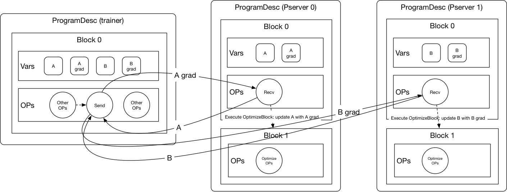

# Send and Recv OP

With PaddlePaddle Fluid, the node to node communication is done
through the send and recv OP. The send and recv OP will be
automatically added to
the
[`ProgramDesc`](https://github.com/PaddlePaddle/Paddle/blob/develop/doc/design/program.md#blockdesc-and-programdesc) by
the
[distributed transpiler](https://github.com/PaddlePaddle/Paddle/blob/develop/doc/design/dist_refactor/distributed_architecture.md#distributed-transpiler) when
a local training `ProgramDesc` is transpiled to the distributed
training `ProgramDesc`.

## Send OP

The send OP sends its input tensors to one or multiple recv OPs and
then fetches its output tensors from the recv OPs.

|Input|Description|
|------|------|
|X|Input tensor to be sent|

|Output|Description|
|------|------|
|Out|Output tensor to be received from the recv OP|

|Attribute|Description|
|------|------|
|endpoints|Endpoints to send the variables to|
|epmap|Endpoints in the order of input variables, used for sharding|

## Recv OP

The recv OP receives its input tensors, runs the optimization block, and
serves the tensors requested by the send OP.

|Input|Description|
|------|------|
|RX|Input tensor to be received|

|Attribute|Description|
|------|------|
|endpoint|IP address to listen on|
|OptimizeBlock|The block to run after receiving the tensors from the send OP|
|ParamList|gradient to parameter name mapping to find which parameters to optimize|
|GradList|parameter name to gradient name mapping to find which gradient to use|
|Fanin|Number of send OPs connected to this recv OP|

## Example

The graph above shows one iteration of the optimization process:

1. When the execution reaches the send OP, it will send `A grad` and
`B grad` using gRPC to the recv OPs on Pserver 0 and Pserver 1
respectively.

1. After receiving the tensor, the recv OP will execute the
optimization block. The optimization block on Pserver 0 will update
`A` using `A grad`. Same for Pserver 1.

1. The send OP will wait for the completion of the optimization
   block. Upon completion, it will fetch the updated `A` and `B` from
   the Pservers.
