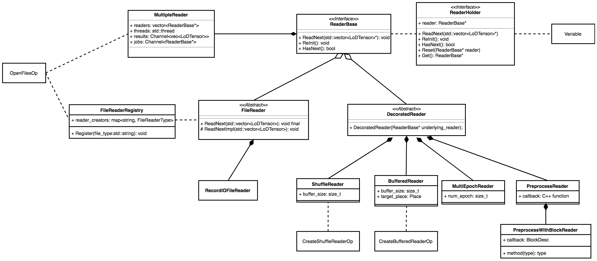
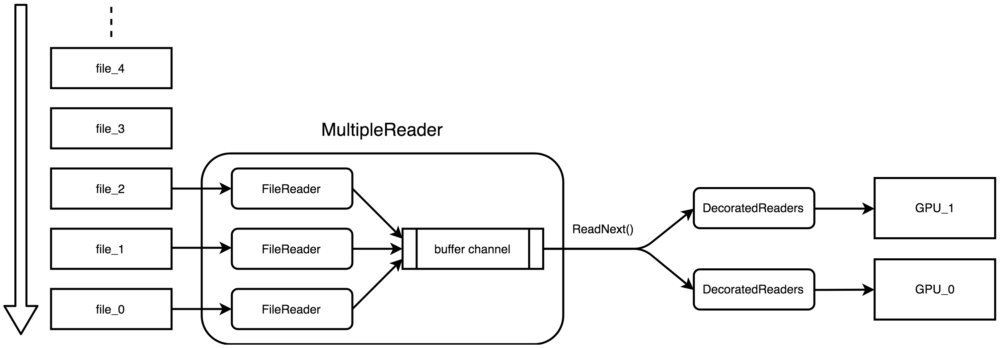

# C++ Data Feeding

While using Paddle V2 API for training, data feeding completely depends on the Python code. To get rid of the Python environment and achieve the goal of "wrapping the whole training by a while loop op" in Paddle Fluid, a C++ data feeding mechanism is required.

In this document, we show the fundamental design of a C++ data feeding process, which includes data reading, shuffling and batching.

## Overview



## Reader

In order to handle the above-mentioned problem, a new concept called 'Reader' is introduced. `Reader` is a series of inherited classes which can be held by our `Variable` and they are used to read or process file data.


### ReaderBase

`ReaderBase` is the abstract base class for all readers. It defines the interface for all readers.

```cpp
class ReaderBase {
 public:
  // Reads the next batch of data. (A 'batch' can be only one instance)
  // If the next batch doesn't exist, it throws an exception
  virtual void ReadNext(std::vector<LoDTensor>* out) = 0;
  
  // Checks whether the next instance exists.
  virtual bool HasNext() = 0;
  
  // Reinitializes the reader and read the file from the beginning.
  virtual void ReInit() = 0;

  virtual ~ReaderBase();
};
```

### FileReader

`FileReader` is derived from the `ReaderBase`. It is still an abstract class and will further be derived by Readers of respective specific format.

```cpp
class FileReader : public ReaderBase {
 public:
  explicit FileReader(const std::vector<DDim>& dims);

  void ReadNext(std::vector<LoDTensor>* out) override;

 protected:
  virtual void ReadNextImpl(std::vector<LoDTensor>* out) = 0;

 private:
  std::vector<DDim> dims_;
};
```

A file reader binds with a single file and reads one data instance at a time. Each type of file reader shall implement its own `ReadNextImpl()`, `HasNext()` and `ReInit()`.

The `ReadNextImpl()` is invoked by `ReadNext()`. Besides invoking `ReadNextImpl()`, `ReadNext()` is also responsible for checking the output, making sure that each shape of `LoDTensor` in `*out` is consistent with the one in `dims_`.  

### DecoratedReader

A decorated reader takes another reader(both file reader and decorated reader are OK) as its 'underlying reader'. It gets data from its underlying reader, does some processing on them(shuffling,  batching or something else), then yields processed data. The output data of a decorated reader can be a single instance or a batch. `ShuffleReader` and `BatchReader` are both decorated readers.

```cpp
class DecoratedReader : public ReaderBase {
 public:
  explicit DecoratedReader(ReaderBase* reader) : ReaderBase(), reader_(reader) {
    PADDLE_ENFORCE_NOT_NULL(reader_);
  }

  void ReInit() override { reader_->ReInit(); }

  bool HasNext() const override { return reader_->HasNext(); }

 protected:
  ReaderBase* reader_;
};
```

Both the `FileReader` and `DecoratedReader` share exactly the same interface as defined in `ReaderBase`. So they can be decorated for multiple times: We can **shuffle** a reader's outputs and then **batch** the shuffled outputs. The interface consistency also allows related ops use readers without knowing their underlying type.

### MultipleReader

All `FileReader` binds with a single file and are single-threaded. However, sometimes we need to read data from more than one file. In this case, it's not enough to only have `FileReader` and `DecoratedReader`.

So `MultipleReader` is introduced. It is also derived from `ReaderBase`. A `MultipleReader` holds several prefetching `FileReaders` and these readers run concurrently. Another pivotal part of a `MultipleReader` is a buffer channel. The channel collects data yield by all prefetching readers and makes subsequent OPs or decorated readers be able to fetch data without concerning about multiple readers scheduling.



This graph shows how a `MultipleReader` works with three prefetching file readers and two GPUs. There is a queue of files which are going to be read. Each time when a prefetching file reader is free(complete reading from one file), it fetches a new file from the queue. Each prefetching file reader runs in a separated prefetch thread and dumps their outputs to the same channel.

To the subsequent two decorated readers, the `MultipleReader` is **a single reader**. They don't need to concern about how prefetch readers are scheduled. They only need to invoke `MultipleReader::ReadNext()` to get the next data from the buffer channel. 

### ReaderHolder

Different readers belong to different class types. This leads to a problem: How can we drop them into `Variable`s and fetch them out by a unified method? For example, if a Variable holds a `BatchReader`, we can not get it by the following code:

```cpp
var->Get<ReaderBase>("batch_reader");
```

We would have to write:

```cpp
var->Get<BatchReader>("batch_reader");
```

This requires that in order to get a reader from a variable, every time, we must know the reader's type exactly. This is nearly impossible.

To solve this problem, we introduce `ReaderHolder` as a wrapper. It acts as an empty decorator of `ReaderBase`, which hides reader's type. With `ReaderHolder` we are able to fetch all types of readers by `var->Get<ReaderHolder>("...")` and regard the obtained object as a reader.

## Related Operators

To create and invoke readers, some new ops are introduced:

### Operators That Create Readers

Each reader has its creation op. File readers' creation ops have no input and yield the created file reader as its output. Decorated readers' creation ops take the underlying readers as inputs and then yield new decorated readers.

However, direct usage of file readers' creation ops is not recommended because a file reader can only read one file via a single thread. Using `OpenFilesOp` is a better choice.

### OpenFilesOp

The `OpenFilesOp` is the creation op of `MultipleReader`. It takes no input but requires a list of file names as one of its attributes. The newly created `MultipleReader` then creates its own prefetching readers according to given file names.

To make sure that created prefetching readers match file formats, we need a name prefix rule to append file format tags to file names, as well as a file reader registry mechanism to map file format tags to their corresponding file readers' constructors.

### HasNextOp

`HasNextOp` is used to check whether the next data batch exists via the reader's `HasNext()` interface.

### ResetOp

`ResetOp` is used to reset a reader via its `ReInit()` interface.

### ReadOp

A reader is only a Variable. It cannot trigger the reading process by itself. So we add the `ReadOp` to execute it. A `ReadOp` takes a reader Variable as its input. Each time it runs, it invokes the reader‘s `ReadNext()` function and gets a new batch of data(or only one instance of data, if we use file reader directly). The output data of a reader are in the form of `std::vector<LoDTenosr>`, so the `ReadOp` also needs to split the vector and move LoDTensors to their respective output Variables.

## Program with Readers

A `Program` holds readers as its persistable variables. These variables are created by `CreateReaderOp` or `OpenFilesOp`. These ops shall run only once. So they shall be settled in the `startup_program`. `HasNextOp`, `ResetOp` and `ReadOp` are required by training loop, so they shall be in the `main_program`.

The ops of a `startup_program` with readers would be like this:

```
multiple_reader = open_files_op(...)
batch_reader = create_batch_reader_op(multiple_reader)
double_buffer_reader = create_double_buffer_op(batch_reader)
... (other initializers)
```

The forwarding ops of the corresponding `main_program` would be like this:

```
not_completed = true
pass_count = 0
while_op(not_completed) {
    has_next = has_next_op(double_buffer_reader)
    if_else_op(has_next) {
        batch_data = read_op(double_buffer_reader)
        ... (subsequent training ops)
    } else {
        reset_op(double_buffer_reader)
        increase_op(pass_count)
        not_completed = less_than_op(pass_count, reqiured_pass_num)
    }
}
```

A few important considerations for these programs are as follows:

1. `not_completed`, `pass_count` and other variables shown above are all Fluid Variables.

2. The multiple\_reader is the batch\_reader's underlying reader, and the batch\_reader is the double\_buffer\_reader's underlying reader. `read_op`, `has_next_op` and other reader related ops will only invoke the top-most reader. In this case, it's the double\_buffer\_reader.

3. All readers exist in both `startup_program` and `main_program`. And they are persistable.

### Simplify Configuration by MultiPassReader

The Program configuration mentioned above is complicated. Users need to be very familiar to concepts of Program and Block to prevent making mistakes in their code. To make the usage of C++ readers more friendly to new users, we introduce `MultiPassReader`.

`MultiPassReader` is a decorated reader. A multi-pass reader is used to continuously yield data for several training passes. It takes the number of passes to run as one of its attributes('pass_num') and maintains a counter to record how many passes it has completed. Each time its underlying reader reaches the EOF, the multi-pass reader checks whether it has completed the training of given number of pass. If not, the underlying reader will be re-initialized and starts a new pass automatically. Before completing the whole training, the return of MultiPassReader's `HasNext()` will always be `true`.

With `MultiPassReader`, the startup program would be like this:

```
multiple_reader = open_files_op(...)
batch_reader = create_batch_reader_op(multiple_reader)
multi_pass_reader = create_multi_pass_reader_op(batch_reader)
double_buffer_reader = create_double_buffer_op(multi_pass_reader)
... (other initializers)
```

The forwarding part of the corresponding `main_program` would be like this:

```
not_completed = true
while_op(not_completed) {
    batch_data = read_op(double_buffer_reader)
    ... (subsequent training ops)
    not_completed = has_next_op(double_buffer_reader)
}
```
