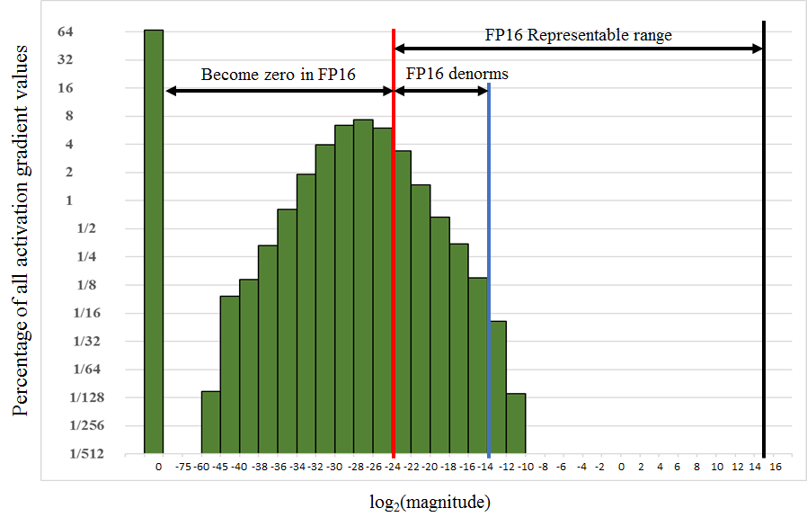

# Mixed Precision Training

## The Motivation
Currently, the cost of memory and time in neural network training hurts. Typically, the more data you have, the larger model size you use, the accuracy will be improved signiffcantly, but also increase the training time and memory cost. Given the numbers of weights/gradients/activations only have a small range, and float16 can reduce half of memory occupied and even addtional hard-ware supportted in Volta GPU. There are several methodology can take the advantage of float16 without lossing accuracy. 

In practice, mixed-precision are implemented in reduce precision tensor math with Float32 accumulation and use Float16 for storage. 
In theory, there will be three benifits compared with Float32 training we used. First, TensorCore(introduced in Volta Arch GPU) have 8x higher throughput than FP32, even can reach 125Fflops/s. Second,  the reality GPU2GPU, HOST2GPU will limited the training, Float16 halve the memory bandwith traffic than Float32. Third, obviously it can reduce the memory cost in gradients/activations, which allow user try larger minibatchs.

Successfully mixed precision traning has been used to train a variety of well-known models, and some research pioneer models. [mixed precision training](https://arxiv.org/pdf/1710.03740.pdf) reports mixed precision training have a 2x-6x speedup and reduce memory cost in half in some models with no accuracy loss.

## How to
Half-precision floating point format consists of 1 sign bit, 5 bits of exponent, and 10 fractional bits. Supported exponent values fall into the [-24, 15] range, which means the format supports non-zero value magnitudes in the [2-24, 65,504] range. Since this is narrower than the [2-149, ~3.4×1038] range supported by single-precision format. Training some models need to take a extra attention to ensure the weights/gradients/activations can be represented by float16.

There are three obstancles when use Float16 to training. 

- arithmetic precision.

Float16 only can representing limited numbers, accumulation into single precision is critical. For example, 0.00001 add to 2 will have no effect, the small number will be skipped.

By and large nueral works will have three kinds of arithmetic operations -- vector-dot productions, reductions, point-wise operations. And the strategies varies.

  1. Vector-dot productions
  To maintain model accuracy, some networks require that FP16 vector dot-product accumulates the partial products into an FP32 value, which is converted to FP16 before writing to memory.
  The NVIDIA Volta GPU architecture introduces Tensor Core instructions, which multiply half precision matrices, accumulating the result into either single- or half-precision output, accumulated values are converted to half precision before writing to memory. The cuDNN and CUBLAS libraries provide a variety of functions that rely on Tensor Cores for arithmetic, and the WMMA library provide a group of TensorCore math apis. 

  2. Reductions
  Large reductions (sums across elements of a vector) should be carried out in FP32. Such reductions mostly come up in batch-normalization layers when accumulating statistics and softmax layers. Both of the layer types in our implementations still read and write FP16 tensors from memory, performing the arithmetic in FP32. This did not slow down the training process since these layers are memory-bandwidth limited and not sensitive to arithmetic speed.

  3. Point-wise operations
  Point-wise operations, such as non-linearities and element-wise matrix products, are memory bandwidth limited. Since arithmetic precision does not impact the speed of these operations, either FP16 or FP32 math can be used.

- Gradient underflow.

During the training of nueral network, not all of the numbers will heep in the range of float16. There are four types of tensors encountered when training DNNs: activations, activation gradients, weights, and weight gradients. In our experience activations, weights, and weight gradients fall within the range of value magnitudes representable in half precision. However, for some networks small-magnitude activation gradients fall below half-precision range. As an example, consider the histogram of activation gradients encountered when training the Multibox SSD detection network in Figure 2, which shows the percentage of values on a log2 scale. Values smaller than 2-24 become zeros in half-precision format.


A very efficient way to ensure that gradients fall into the range representable by half precision is to multiply the training loss with the scale factor. This adds just a single multiplication and by the chain rule it ensures that all the gradients are scaled up (or shifted up) at no additional cost. Loss scaling ensures that relevant gradient values lost to zeros are recovered. Weight gradients need to be scaled down by the same factor S before the weight update.

One more issue need to be solved that the factor is not static number in some models. Nvidia has published a algorithm to choose a dynamic scale factor during training, please refer to training guide.

- Parameter overflow.

When it comes to parameters, there will be weight update at each iteration of training. Weight gradient always have a significantly smaller value than corresponding weights, especially after multiplication with the learning rate (or an adaptively computed factor for optimizers like Adam or Adagrad).  This magnitude difference can result in no update taking place if one of the addends is too small to make a difference in half-precision representation (for example, due to a large exponent difference the smaller addend becomes zero after being shifted to align the binary point).

To solve this issue, a master copy of parameters is maintained, each iteration do the weights update on the master copy, and forward/backward caculation based on the Float16 parameter.

## Our Framework Support
To support the mixed precision training automatically, user need to:

  1. Maintain a master copy of weights in FP32

  For each iteration:

  2. Make an FP16 copy of the weights

  3. Forward propagation (FP16 weights and activations)

  4. Multiply the resulting loss with the scaling factor S

  5. Backward propagation (FP16 weights, activations, and their gradients)

  6. Multiply the weight gradient with 1/S

  7. Complete the weight update (including gradient clipping, etc.)

The MixedOptimizer will create a master copy of parameters and do the type cast automatically.

Example code 

```python
  >>> import paddle.fluid as fluid

  # 1. set datatype to float16
  >>> data = fluid.layers.data(name="data", shape=[32, 32], dtype="float16") # set the type to float16
  >>> labels = fluid.layers.data(name="label", shape=[1], dtype="float16") # set the type to float16
  >>> fc = fluid.layers.fc(input=data, size=1000, act="tanh")
  >>> out = layers.assign(hidden, fc)
  >>> loss = layers.mean(out)

  # 2. use float16 optimizer
  >>> adam = fluid.optimizer.MixedOptimizer(fluid.optimizer.Adam())
  >>> adam.minimize(loss)

```

## Reference
[Mixed precision training ICLR2017](https://arxiv.org/pdf/1710.03740.pdf)

[Nvidia mixed-precision-training-deep-neural-networks](https://devblogs.nvidia.com/mixed-precision-training-deep-neural-networks/)

[Nvidia mixed precision training guide](https://docs.nvidia.com/deeplearning/sdk/mixed-precision-training/index.html)
