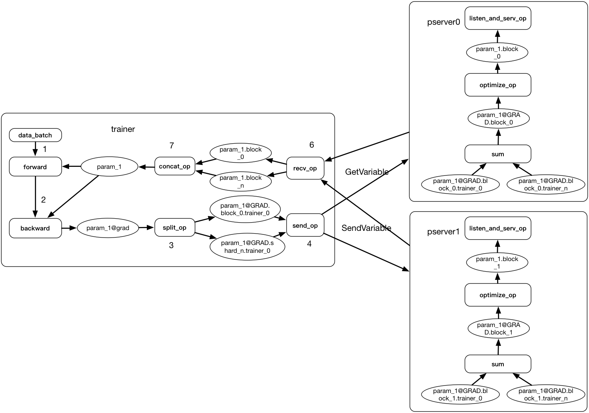
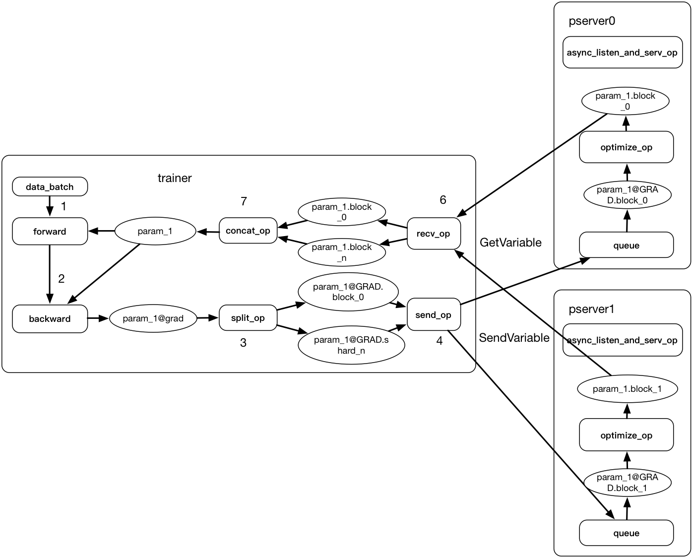

## Distributed training overview doc

Currently Paddle Fluid use parameter server architecture to support distributed training.

For synchronous and asynchronous training, the differences are mostly in the logic of parameter server. Now we have already support synchronous training.

### Synchronous training

The training process of synchronous training is:

1. Pserver
	1. set `barrier_condition_` to 0 and waits for trainers to send gradient.
1. Trainer
	1. Trainer read minibatch of data, run forward-backward with local parameter copy and get the gradients for parameters.
	1. Trainer use split op to split all the gradient into blocks. The split method is determined at compile time.
	1. Trainer use send_op to send all the split gradients to corresponding parameter server.
	1. After trainer send all the gradients, it will send a `BATCH_BARRIER_MESSAGE` to all pservers.
	1. Trainer call GetVariable to pserver and wait for `barrier_condition_` on pserver to be 1.
1. Pserver
   1. Pserver will count the number of `BATCH_BARRIER_MESSAGE`.
	1. When the count of `BATCH_BARRIER_MESSAGE` is equal to the number of Trainer. Pserver thinks it received all gradient from all trainers.
	1. Pserver will run the optimization block to optimize the parameters.
	1. After optimization, pserver set `barrier_condition_` to 1.
	1. Pserver wait for `FETCH_BARRIER_MESSAGE`.
1. Trainer.
	1. The trainer uses GetVariable to get all the parameters from pserver.
	1. Trainer sends a `FETCH_BARRIER_MESSAGE` to each pserver.
1. Pserver.
	1. when the number of `FETCH_BARRIER_MESSAGE` reach the number of all trainers. Pserver think all the parameters have been got. it will go back to 1. to set `barrier_condition_` to 0.

### Asynchronous training
In the above process. There are two barriers for all trainers to synchronize with each other. In asynchronous training, these two barriers are not needed. The trainer can just send gradients to pserver and then get parameters back.

The training process of asynchronous training can be:

1. Pserver:
	1. Each parameter has a queue to receive its gradient from trainers.
	1. Each parameter has a thread to read data from the queue and run optimize block, using the gradient to optimize the parameter.
	1. Using an independent thread to handle RPC call `GetVariable` for trainers to get parameters back.(Maybe here we should use a thread pool to speed up fetching the parameters.)

1. Trainer:
	1. Trainer read a batch of data. Run forward and backward with local parameter copy and get the gradients for parameters.
	1. Trainer split all gradients to blocks and then send these gradient blocks to pservers(pserver will put them into the queue).
	2. Trainer gets all parameters back from pserver.

### Note:
There are also some conditions that need to consider. For exmaple:

1. If trainer needs to wait for the pserver to apply it's gradient and then get back the parameters back.
1. If we need a lock between parameter update and parameter fetch.
1. If one parameter must be on one server, or it can also be split and send to multiple parameter servers.

The above architecture of asynchronous training can support different mode, we can have a detailed test in the future for these problems.
