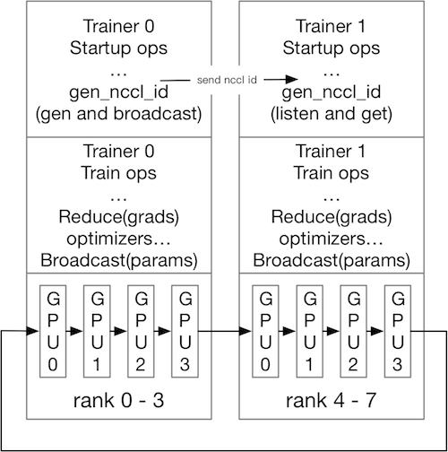

# Distributed Training with NCCL2

We design a pattern that can enable training with `ParallelExecutor` and
using [NCCL2](https://developer.nvidia.com/nccl) as it's collective
communication library.

In `ParallelExecutor` we can use `AllReduce` or `Reduce` and `Broadcast`
to do multi GPU training. And if we initialize NCCL2 communicators as
ranks in a distributed environment, we can simply run the `ParallelExecutor`
as a distributed program! The only thing that may be different than in
the single node version is that we need to broadcast the NCCL unique ID
to all the nodes, and initialize communicators using that ID, so NCCL2
will know each other as ranks.

To achieve this feature, we introduce a new operator: `gen_nccl_id` op,
so we are ***not*** "bind to" running NCCL2 with MPI, we can run it in
what ever platform you like.

It have two running modes:

1. Generate and broadcast mode, which should be used on trainer 0;
1. Listen and fetch mode, which should be used on trainers other than 0.

In both two modes, this op can save the NCCL ID into current scope as a
persistable variable, Then we can insert this op at the end of
"startup program" of fluid, so that all workers can get the same ID to
initialize NCCL communicator objects.

The above figure indicates the general process when training with NCCL2
distributed. Each trainer have the number of communicators equal to the
number of GPUs, but the ranks should match the global ranks number: here
we have total 8 GPUs, so `nranks==8`, for each trainer, the ranks should
be from 0 ~ 3 on trainer 0 and 4 ~ 7 on trainer 1.
