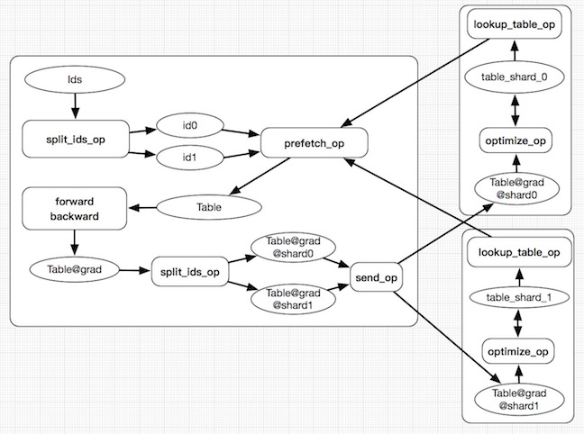

# Design Doc: Distributed Lookup Table Operator

A distribute lookup table operator in PaddlePaddle where the table could be out
of the memory of a computer.

## Background

A lookup table operator is well-used in deep learning for learning the
representation, or the
[*embedding*](http://www.cs.toronto.edu/~fritz/absps/ieee-lre.pdf), of
symbols.

### The Forward Algorithm

The forward algorithm of the lookup table is a multiplication of the
input vector x and the lookup table matrix W:

$$y = x * W$$

When x is a sparse vector of symbols, the above multiplication
simplifies into looking up rows in W that correspond to symbols in x,
denoted by W(x).  Please be aware that W could be huge and out of the
memory, so we'd need a distributed storage service, which supports the
lookup of rows.

The following figure illustrates the multiplication of x with two
non-zero elements, or say two symbols, and a lookup table W:


### The Backward Algorithm

The backward algorithm computes W'(x) using W(x).  W'(x) has the same
the scale of size as W(x) and is much smaller than W.

To optimize W given W', we can do simple SGD update:

$$W = f(W') = \lambda * W'$$

or some more sophisticated algorithms that rely on both W' and W:

$$W = f(W, W')$$

The following figure illustrates the backward pass of the lookup
operator: 

## Distributed Lookup Table
### Problem 1: The lookup table may be very large.

 In the condition like the search engine and recommendation system, the number of feature Id may be very large, say 100,000,000,000, then for a float value lookup table of size 8, the total size of the table is:

 ```
 100,000,000,000 * 8 * 4(Bytes) = 2980.23 GB
 ```

### Solution: Distributed storage

1. Paddle use [SelectedRows](https://github.com/PaddlePaddle/Paddle/blob/develop/doc/fluid/design/modules/selected_rows.md) as the storage format for the lookup table, the lookup table parameter will be split to multi-machine according to the hash of the feature ID, and data will also be split and send to the same machine to prefetch the parameter.

1. For common parameters, the trainer will get the whole parameter for training, but for the big lookup table, the trainer can not store the whole parameter. Because the input data feature is very sparse, every time we only need a few parameters for training, so we use `prefetch_op` to only prefetch the parameter needed to trainer.

### Problem 2. The Id in the lookup table is not sure before training.

 The feature Id is calculated by the hash function because the feature data source is so large, we can not get all the Id before training. So we can not initialize the table before training.

### Solution: Id auto growth

At the beginning of training, paddle only malloc the memory for the lookup table at parameter server side, the Id and it's value will not be initialized. During training, when a parameter server received an Id, if it is already in the lookup table, it will return the existing parameter, if the Id does not exist, paddle will add it into the lookup table and initialize the value for it.

### Problem 3: parameter load and save

For common parameters, paddle use trainer to save and load them. But for distributed lookup table, trainer cannot do this because it's large size.

### Solution: Parameter server side save and load

Paddle support parameter server side save and load for distribute lookup table. Each machine of parameter servers will only save and load part of the whole table.

## Architecture
The whole architecture of the distribute lookup table is as below:

### Training steps:
1. Read a batch of data, the data is feature ids.
1. The input ids will be split by `split_ids_op` with the same hash function of the lookup table.
1. The `prefetch_op` use the split result to prefetch parameters back from the lookup table.
1. Run forward-backward to get the gradient of the lookup table.
1. `split_ids_op` split the gradient and then use `send_op` to the parameter server.
1. parameter server update the table with the received gradient.


