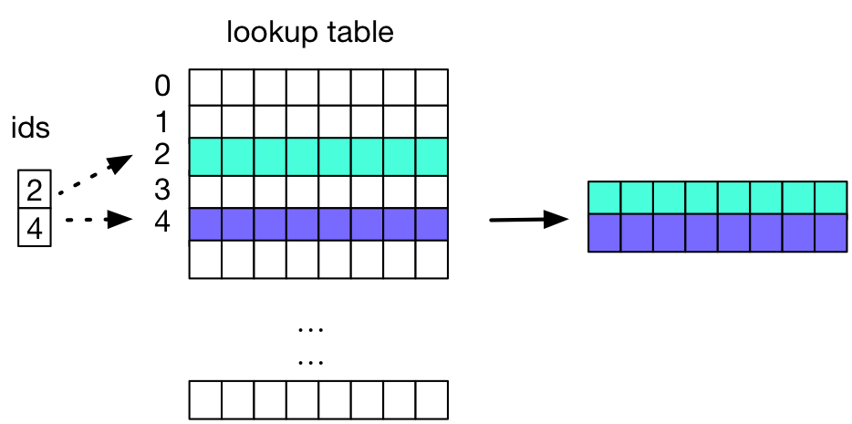
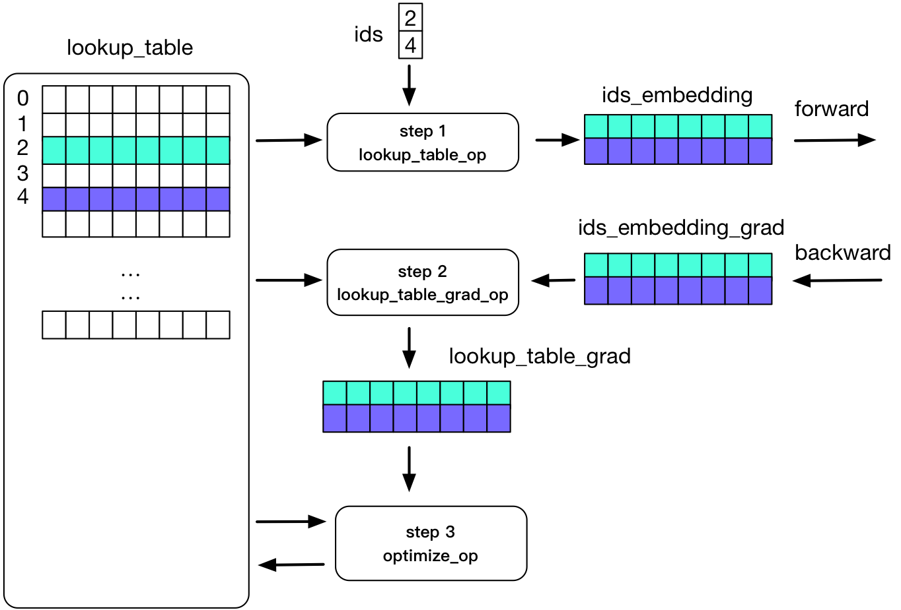

# Design Doc: Distributed Lookup Table Operator

A lookup table operator in PaddlePaddle where the table could be out
of the memory of a computer.

## Background

A lookup table operator is well-used in deep learning for learning the
representation, or the
[*embedding*](http://www.cs.toronto.edu/~fritz/absps/ieee-lre.pdf), of
symbols.

### The Forward Algorithm

The forward algorithm of the lookup table is a multiplication of the
input vector x and the lookup table matrix W:

$$y = x * W$$

When x is a sparse vector of symbols, the above multiplication
simplifies into looking up rows in W that correspond to symbols in x,
denoted by W(x).  Please be aware that W could be huge and out of the
memory, so we'd need a distributed storage service, which supports the
lookup of rows.

The following figure illustrates the multiplication of x with two
non-zero elements, or say, two symbols, and a lookup table W:

### The Backward Algorithm

The backward algorithm computes W'(x) using W(x).  W'(x) has the same
scale of size as W(x) and is much smaller than W.

To optimize W given W', we can do simple SGD update:

$$W = f(W') = \lambda * W'$$

or some more sophisticated algorithms that rely on both W' and W:

$$W = f(W, W')$$

The following figure illustrates the backward pass of the lookup
operator: 

## Distributed Storage Service

The forward algorithm requires a distributed storage service for W.
The backward algorithm prefers that the storage system can apply the
optimization algorithm on W.  The following two sections describe two
solutions -- the former doesn't require that the storage service can
do optimization, the latter does.

### Storage Service Doesn't Optimize

In this design, we use highly-optimized distributed storage, e.g.,
memcached, as the storage service, and we run the optimization
algorithm on parameter servers of PaddlePaddle.  The following figure
illustrates the training process.

<!--
Note: please update the following URL when update this digraph.
 P1;
  T1 -> P2;
  T2 -> P1;
  T2 -> P2;
  T3 -> P1;
  T3 -> P2;
  P1 -> KV [color=gray, weight=0.1];
  KV -> P1 [color=gray, weight=0.1];
  P2 -> KV [color=gray, weight=0.1];
  KV -> P2 [color=gray, weight=0.1];
  KV -> T1 [color=gray, weight=0.1];
  KV -> T2 [color=gray, weight=0.1];
  KV -> T3 [color=gray, weight=0.1];
}
)
'/>
-->

Each trainer runs the forward and backward passes using their local
data:

1. In the forward pass, when a trainer runs the forward algorithm of a
   lookup operator, it retrieves W(x) from the storage service.
1. The trainer computes W'(x) in the backward pass using W(x).

During the global update process:

1. Each trainer uploads its W'(x) to parameter servers.
1. The parameter server runs the optimization algorithm, e.g., the
   Adam optimization algorithm, which requires that
   1. The parameter server retrieves W(x) from memcached, and
   1. The parameter server pushes $\Delta W(x)=f(W(x), lambda \sum_j
      W'(x))$ to memcached, where $f$ denotes the optimization
      algorithm.

### Storage Service Does Optimize

This design is very similar to the above one, except that the
optimization algorithm $f$ runs on the storage service.

- Pro: parameter servers do not retrieve W(x) from the storage
  service, thus saves half network communication.
- Con: the storage service needs to be able to run the optimization
  algorithm.

## Conclusion

Let us do the "storage service does not optimize" solution first, as a
baseline at least, because it is easier to use a well-optimized
distributed storage service like memcached.  We can do the "storage
service does optimize" solution later or at the same time, which, if
implemented carefully, should have better performance than the former.
