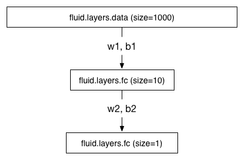
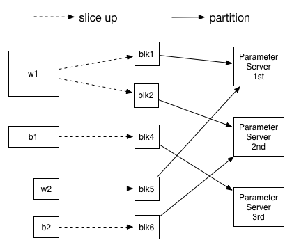

# Fluid 分布式训练模型参数切分策略详解
本篇文章将说明, 在使用 PaddlePaddle Fluid 进行基于 Parameter Server 的分布式训练时, 模型参数的切分方案设计, 并且举了一个如何应用这种切分方案的简单例子;

## 模型参数切分策略设计
### 切分原因

在模型设计时, 我们通常不会限制模型各层使用的参数大小, 假设我们现在有3台参数服务器, 并且要训练如下的网络:



fluid.input 层非常宽, 导致 w1, b1 参数维度非常的大, 达到了 10 * 1000, 而 fluid.fc 层非常窄, 导致 w2, b2 参数维度特别小, 只有 1 * 10. 

如果我们只是简单的将这些参数分配到参数服务器上, 会导致每个参数服务器拿到的参数大小并不均匀, 负载较轻的参数服务器等待负载较重的参数服务器;
所以针对这种参数大小不均匀的情况, 在Distribute Transpiler中, 我们会对模型的参数和对应的梯度进行切分, 参数和梯度在切分后变为一个或多个参数块.

### 切分方式

在切分参数时, 如果切分的粒度过细会导致参数服务器的计算效率不高, 但如果切分的粒度过大又无法做到参数的均匀分配;
所以为了在切分时控制粒度, 针对每个参数或梯度, 我们都会计算两个值, 最大切分数量和期望切分数量:

* 最大切分数量

为了避免切分粒度过细, 我们拟定了一个最小的参数块大小: 8192; 
我们会对 参数大小 / 最小参数块大小 的结果向上取整, 得到这个参数的最大切分数量;
所以在上面的例子中, 我们会得到的最大切分数量是 2;

* 期望切分数量

为了做到参数完全平均分配到每一个参数服务器上, 我们将参数服务器的总数作为期望切分数量;
所以在上面的例子中, 我们会得到的期望切分数量是: 3;

在计算完上述的两个值后, 我们会取两值中的较小值作为最后的切分数量, 确保在保证最小粒度的情况下, 参数被尽可能的平均分配了;
在上面的例子中, 我们最后会将参数切分为2份;

### 分配方式

在将参数和梯度切分为多个参数块后, 我们还需要对将参数块均匀地分配到参数服务器上;

我们现在支持两种简单而有效的参数块分配方式: [Round Robin](https://en.wikipedia.org/wiki/Round-robin_scheduling) 和 [Hash](https://en.wikipedia.org/wiki/Hash_function);

在 Round Robin 模式中, 我们会 one-by-one 的将参数块分配到 Server 上;

在 Hash 模式中, 我们会对参数块名称进行 Hash 操作然后对参数服务器总数取模, 得到具体的参数服务器id;

### 整体切分流程

至此, 我们对参数还有梯度的切分策略就结束了, 针对上面的例子, 我们会得到如下图所示的切分结果:




## 模型参数切分用例
### 分布式实现

PaddlePaddle Fluid 分布式训练的具体实现方式可以参考 [Fluid Cluster Train](../../howto/cluster/fluid_cluster_train_cn.md)

### 参数详解
我们主要的参数策略实现在了 [Distribute Transpiler](https://github.com/PaddlePaddle/Paddle/blob/develop/python/paddle/fluid/transpiler/distribute_transpiler.py) 中, 我们可以在```transpile```方法中指定```slice_var_up=True```来开启模型参数切分, 并且可以使用```split_method=RoundRobin```来指定模型参数的分配方式, 示例代码如下:

```python
transpiler.transpile(
	trainer_id=trainer_id,
	slice_var_up=True,
	split_method=RoundRobin,
	pservers=pservers,
	trainers=trainers)
```
