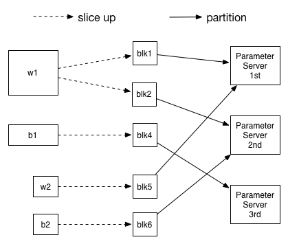

# Fluid distributed parameter segmentation strategy
In this article, we'll explain the design of parameters segmentaion when we do pserver-based distributed training with PaddlePaddle Fluid, we will give a case of how this segmentation scheme could be used in python code;

## Parameter Split Strategy Design
### Reason for slicing parameter up

When we design the neural model, we usually do NOT limit the size of the parameters, but when we design the following network:


The fluid.input layer may be very wide, causing the w1, b1 parameter dimensions may be very large, and the fluid.fc layer may be very narrow, resulting in w2, b2 parameter dimensions is particularly small. If we simply assign the parameters to each parameter server, the parameters may NOT be evenly distributed, and the lightly load parameter server will wait for the parameter server with heavy load. Therefore, we provided the function to slice parameter up.

### Parameter slice method

The parameters will become parameter blocks after slicing. When slice parameters, if the size of parameter block is too small, it will cause the parameter server's inefficient computation. However, if the parameter block is not uniform enough, we cannot achieve the above-mentioned effects. So we will first set a minimum parameter block size: 8192, and calculate the required number of partitions as follows:

```
# parameter_size: parameter size
# MIN_PARAMETER_BLOCK_SIZE: Minimum parameter block size, 8192
# parameter_server_count: total number of parameter servers
Math.min(parameter_size / MIN_PARAMETER_BLOCK_SIZE, parameter_server_count)
```

After slicing the parameters into multiple parameter blocks, we also need to evenly distribute them to the parameter server.

### Parameter partition method
We now support two simple and effective [Partition](https://github.com/PaddlePaddle/Paddle/blob/develop/python/paddle/fluid/transpiler/ps_dispatcher.py) methods to partition parameter blocks: [Round Robin](https://en.wikipedia.org/wiki/Round-robin_scheduling) and [Hash](https://en.wikipedia.org/wiki/Hash_function);

In Round Robin mode, we will one-by-one assign parameters to Server;

In Hash mode, we will perform Hash operation on the parameter block name and then modulo the overall parameter server number to get the specific parameter server Id:

```python
Server_id = hash(block_str) % total
```

### Overall Segmentation Process
After parameter allocation, our parameter slice and partition strategy is over:


## Parameter Segmentation Use Case
### Distributed Implementation

PaddlePaddle Fluid Distributed training can refer to [here](../../howto/cluster/fluid_cluster_train_en.md)

### Arguments details
We have implemented the main parameter strategy in [Distribute Transpiler](https://github.com/PaddlePaddle/Paddle/blob/develop/python/paddle/fluid/transpiler/distribute_transpiler.py). We can use ``` In the transpile ``` method, ```slice_var_up=True``` is specified to enable model parameter slice, and ```split_method=RoundRobin``` can be used to specify the partition of model parameters. The sample code is as follows:


```python
transpiler.transpile(
    trainer_id=trainer_id,
    slice_var_up=True,
    split_method=RoundRobin,
    pservers=pserver,
    trainers=trainers)
```
