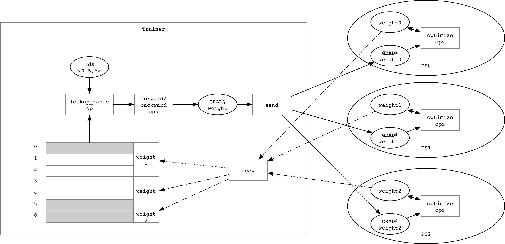
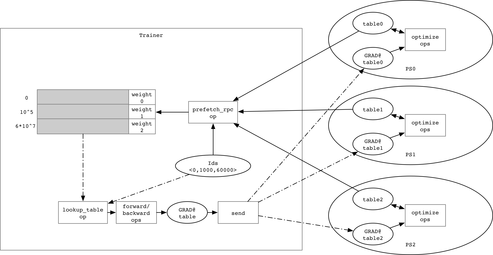
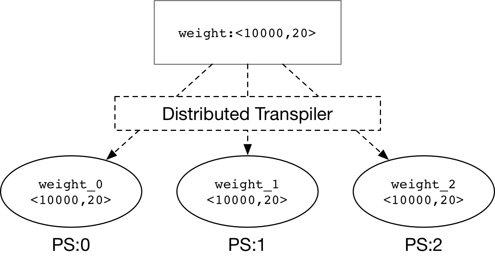

# Design Doc: Lookup Remote Table while Distributed training

## Abstract

We propose an approach to pre-fetch the parameters from a Parameter Server while distributed training so that Fluid can train a model with the very large parameter that cannot be stored in one trainer's memory.

## Background

For an embedding layer, the trainable parameter may be very large, and it is likely that it may not be able to be stored in one trainer's memory. In Fluid distributed training,
the [Distributed Transpiler](./parameter_server.md#distributed-transpiler) would split every parameter into some small parameters that stored on the Parameter Server. Hence, we can pre-fetch the parameter from the specified Parameter Server using the input `Ids`.

## Design

Prior to reading this design, it would be useful for the reader to make themselves familiar with Fluid [Distributed Training Architecture](./distributed_architecture.md) and 
[Parameter Server](./parameter_server.md).

The execution of `lookup local table` is as follows:

For some cases, the parameter(`weight`) may be very large, such as 10 billion features, the entire
data could not be stored in one trainer's memory, so we need to partition this parameter and
pre-fetch it at the beginning of each mini-batch, and we call it `lookup remote table`:

The processing flow of `lookup remote table` is as follows:

1. partitioned parameter

    

    - **Distributed Transpiler** would split the large parameters
      (`weight`) into some partitioned parameters (`weight_0`, `weight_1`, `weight_2`) as shown in the figure above.
    - We can use `round-robin` to distribute the partitioned parameter.

1. pre-fetching parameter at the beginning of each mini-batch

    - `prefetch_rpc` operator would prefetch the parameter from different Parameter
    Servers using the input `Ids`. We use [SelectedRows](../../../design/selected_rows.md)
    as the received variable type.
    - `merge_selected_rows` operator would merge the received parameters into one
    `SelectedRows` variable.

## TODO

- `prefetch_rpc` operator to send rows index and receive SelectedRows variables.
- `lookup_table` need to support `SelectedRows` variable type as input `Weight`.
- Async Update, To avoid slow-node, Async update is important for distributed training,
  we need a design doc and implement it in future.
