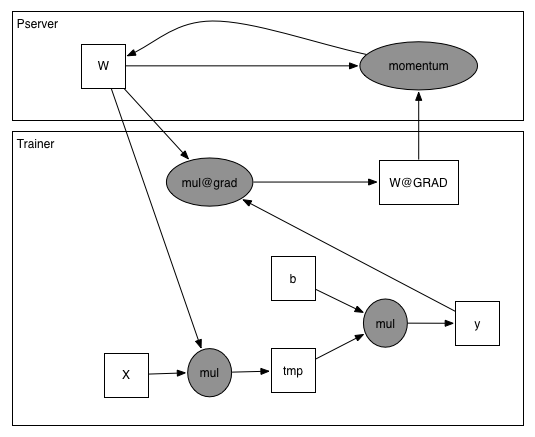

# Operator & Variable Placment Design

## 1. 背景
在开始介绍我们的 Variable Place Design 之前, 我们先看一下, Paddle之前都是如何构造一个分布式的NN训练网络的

### 1.1 构造 Forward Pass
参考 uci_housing 的例子, 我们构造了一个非常简单的 Forward Pass:

```python
import paddle.fluid as fluid
def paddle_forward_pass():
    x = fluid.layers.data(name = "x", shape=[13])
    y = fluid.layers.fc(input=x, size=1)
    return y

y = paddle_forward_pass()
print fluid.default_main_program()
```

通过上述代码, 我们得到了如下的 ProgramDesc: 

```bash
#  message ProgramDesc {
#    block[0] = Block {                      
#      vars = [x, w, b, y]
#      ops = [                            
#        read() -> x                          
#        mul(x, w) -> tmp
#        add(tmp, b) -> y
#      ]                 
#    }                                                                      
#  }
```

### 1.2 构造 Backward Pass

在实践中, 我们把复杂的通过 Forward Pass 构造 Backward Pass 的过程用 append_backward 封装起来:

```python
params_and_grads = append_backward(y)
```

通过构造 Backward Pass, 我们可以得到如下的 ProgramDesc:

```bash
#  This was we got now:
#  message ProgramDesc {                     
#    block[0] = Block {   
#      vars = [x, w, b, y, w@GRAD, b@GRAD]
#      ops = [                                
#        read() -> x     
#        mul(x, w) -> tmp
#        add(tmp, b) -> y
#        grad(x, y) -> w@GRAD                                               
#        grad(x, y) -> b@GRAD
#      ]
#    }                                    
#  }
```

其实就是往后添加了一些新的Operators

### 1.3 添加 Optimizer, 完成整个训练程序

我们添加了一个 Optimizer, 将 Forward Pass 和 Backward Pass 串起来, 得到一个完整的训练程序, 这段代码也被封装到了 ```append_opt_op``` 方法里

```python
append_opt_op(params_and_grads)
```

现在, 我们得到了如下的 ProgramDesc:

```bash
#  This was we got now:
#  message ProgramDesc {  
#    block[0] = Block {                   
#      vars = [x, w, b, y, w@GRAD, b@GRAD, lr]
#      ops = [           
#        read() -> x     
#        mul(x, w) -> tmp
#        add(tmp, b) -> y                                                   
#        grad(x, y) -> w@GRAD
#        grad(x, y) -> b@GRAD
#        opt(b@GRAD, w@GRAD, lr) -> w, x  
#      ]
#    }
#  }
```

还是简单的添加一个opt_op即可;

## 2. 痛点
到**目前为止**, 一切都还是自然而简单的, 并不复杂, 但是, 当我们引入 Distribute Transpiler 时, 突然发现我们面临了一个**大问题**, 非常非常多的, 繁琐而没有头绪的步骤开始接踵而至, 我们要做的包括:

1. 把opt op移入到pserver program里去;
2. 根据pserver数量对是Grad类型的Variable进行切分, 并且加上split_op;
3. 对切分过后的Variable加上send_op;
4. 对是Param类型的Variable进行切分, 并且加上concat_op;
5. 对切分过后的Variable加上recv_op;
6. 另外我们还要为pserver program加上listen\_and\_serv\_op;
7. 最后, 我们还要考虑到所有被opt\_op依赖的lr\_decay\_op, 还有lr\_decay\_op所引入的所有sub\_blocks...
8. What's more, 以上的任意一步, 只要逻辑发生改变, 我们就得对Transpiler进行大动...

很明显, 这不是一个我们想接受的好方案, 任意的牵扯到transpiler的改动都会为分布式执行带来不稳定的因素;

思考一下深层次的原因, Dist-Transpiler 其实做了三件事: 

1. 修改当前的 Program, 直到能运行在分布式环境下;
2. 把当前的 Program 拆成两个或多个 Program;
2. 针对这些 Program, 再做出一些修改, 用以适配pserver的模式;

下面我们来讨论后两件: 

### 2.1 Program 拆分
对于拆分这件事来说, 其实 Distribute Transpiler 没有说清楚, 他到底是在做 ```Placement``` (把 op 或 variable 放到某一个具体的运行实例上), 还是在做 ```Replication``` (把 op 或 variable 复制多份, 放到多个运行实例上), 目前的现状是, 他两个事情都做了:

1. 对于 opt_op, 他做了 ```Placement```, 将 opt_op 放到了 pserver program 中; 
2. 对于 backward\_op 和 forward\_op, 他做了 ```Replication```, 每一个 trainer program 都有这些 op; 
3. 对于 var, 他既有 ```Placement```, 又有 ```Replication```;

问题在于, 他没告诉用户, 他在什么时候, 会对什么部分, 做```Replication```还是```Placement```, 抑或是, 两者都有;

### 2.2 Program 修改
对于修改来说, 现在 Distribute Transpiler 做的事情, 主要是插入新的 op, 和新的 block, 同样的, 插入新的 op 或 block 也没有具体的规则;

他没告诉用户, 他在什么时候, 会对什么部分, 执行这些插入动作, 插入的具体是什么;

## 3. 解决方案
为了简化上面的步骤, 我们引入一个概念: 

1. 执行时的 PlaceGroup, 在现在的场景下, 就是具体执行的 Executor 进程组, 形式应该是: instance\_role/ip:port/device\_type:device\_ids, 比如: pserver/127.0.0.1:7164/gpu:[1,2,3];
2. Var 和 Op 中加入 PlaceGroup 信息, 指明这个 Var 或 Op 可以运行于哪些或哪个具体的Executor;

### 3.1 PlaceGroup 详细设计
##### 3.1.1 和 place.h 兼容
place.h 中的 Place 设计可以总结如下:

```
#  message Place {
#     optional PlaceType type;
#     optional int device_id;
#  }
```

PlaceGroup 可以作为 OpAttr 或 VarAttr 被序列化到 ProgramDesc 中, 在兼容 Place的设计的同时, PlaceGroup 的详细设计如下:

```
#  enum ExecutorRole {
#    trainer,
#    pserver,
#    master
#  }
#  
#  message Node {
#    optional string ip,
#    optional int port
#  }
#  
#  enum PlaceType {
#    CUDA, CUDAPinned, CPU
#  }
#
#  message Place {
#     optional PlaceType type;
#     optional int device_id;
#  }
#
#  message PlaceGroup {
#    repeated ExecutorRole roles;
#    repeated Node nodes;
#    repeated Place places;
#  }
#
```

一个代表 ```pserver/127.0.0.1:7164/gpu:[1,2]``` 这个 PlaceGroup 的实际例子如下:

```
#  message PlaceGroup {  
#    roles[0] = ExecutorRole.pserver,
#
#    nodes[0] = Node {  
#      ip = 127.0.0.1,
#      port = 7164
#    },
#
#    places[0] = Place {
#      type = PlaceType.CUDA,
#      device_id = 1
#    },
#
#    places[1] = Place {
#      type = PlaceType.CUDA,
#      device_id = 2
#    }                
#  }
```

加入这个概念后, Distribute Transpiler做的上述步骤以被简化为一件事: 为 Program 内部的 Op 和 Var 填充他们的 PlaceGroup 信息;

### 3.2 对 Op 分配 PlaceGroup
针对上面的 uci_housing 的例子, Distribute Transpiler 需要为如下 ProgramDesc 中的 Op 分配 PlaceGroup:

```bash
#  message ProgramDesc {  
#    block[0] = Block {                   
#      vars = [x, w, b, y, w@GRAD, b@GRAD, lr]
#      ops = [           
#        read() -> x     
#        mul(x, w) -> tmp
#        add(tmp, b) -> y                                                   
#        grad(x, y) -> w@GRAD
#        grad(x, y) -> b@GRAD
#        opt(b@GRAD, w@GRAD, lr) -> w, x  
#      ]
#    }
#  }
```

现在假设我们有2个 trainer (192.168.10.1, 192.168.10.2), 1个pserver (127.0.0.1:7164); 现在要获取 192.168.10.1 这个 trainer 被 transpile 后的 program_desc;

我们依旧可以按照之前的 Distribute Transpiler 的方法来分配, opt_op 和相关的 Vars 被分配到某个具体的 pserver, 其他的 op 都留在 trainer, 于是我们得到如下的结果:

```
#  message ProgramDesc {  
#    block[0] = Block {                   
#      vars = [x, w, b, y, w@GRAD, b@GRAD, lr]
#      ops = [           
#        read: { 
#          output: x, 
#          attr: {
#            place: PlaceGroup {  
#              roles[0] = ExecutorRole.trainer,
#              nodes[0] = Node {  
#                ip = 192.168.10.1,
#                port = 7164
#              },
#            }
#          }
#        },
#
#        mul: { 
#          input: x, w
#          output: tmp, 
#          attr: {
#            place: PlaceGroup {  
#              roles[0] = ExecutorRole.trainer,
#              nodes[0] = Node {  
#                ip = 192.168.10.1,
#                port = 7164
#              },
#            }
#          }
#        },
#
#        add: { 
#          input: tmp, b
#          output: y, 
#          attr: {
#            place: PlaceGroup {  
#              roles[0] = ExecutorRole.trainer,
#              nodes[0] = Node {  
#                ip = 192.168.10.1,
#                port = 7164
#              },
#            }
#          }
#        },
#                                                 
#        grad: { 
#          input: x, y
#          output: w@GRAD, 
#          attr: {
#            place: PlaceGroup {  
#              roles[0] = ExecutorRole.trainer,
#              nodes[0] = Node {  
#                ip = 192.168.10.1,
#                port = 7164
#              },
#            }
#          }
#        },
#                                                 
#        grad: { 
#          input: x, y
#          output: b@GRAD, 
#          attr: {
#            place: PlaceGroup {  
#              roles[0] = ExecutorRole.trainer,
#              nodes[0] = Node {  
#                ip = 192.168.0.1,
#                port = 7164
#              },
#            }
#          }
#        },
#
#        opt: { 
#          input: b@GRAD, w@GRAD, lr, w, b
#          output: w, b
#          attr: {
#            place: PlaceGroup {  
#              roles[0] = ExecutorRole.pserver,
#              nodes[0] = Node {  
#                ip = 127.0.0.1,
#                port = 7164
#              },
#            }
#          }
#        }
#      ]
#    }
#  }
```

可以看到, 只需要一个 Program, 每个 Executor 就知道自己该执行这个 Program 中的哪个部分, 现在我们来看下 Executor 的具体执行方法;

### 3.3 Executor 执行方法

#### 3.3.1 Program 解析
Executor 拿到 Program 后, 会先判断, 这个 Program 中有哪些 Op 属于自己, 哪些 Op 不属于自己, Executor 只会执行属于自己的部分;

[//]: # (**注意到, 大部分 PlaceGroup 中, 我们没有指明具体的 node (即 trainer ip 和 port), 只是指明了role (即 trainer 这个角色), 这个设计会让 2 个 trainer 都认为自己可以执行这些 op, 相当于把这些 op 复制了多份放到多个 trainer 上;**)

假设当前的 Executor 是 pserver, 那么我们会执行的 ProgramDesc 是:

```
#  message ProgramDesc {  
#    block[0] = Block {                   
#      vars = [x, w, b, y, w@GRAD, b@GRAD, lr]
#      ops = [           
#        opt: { 
#          input: w@GRAD, lr, w
#          output: w
#          attr: {
#            place: PlaceGroup {  
#              roles[0] = ExecutorRole.pserver,
#              nodes[0] = Node {  
#                ip = 127.0.0.1,
#                port = 7164
#              },
#          }
#        },
#
#        opt: { 
#          input: b@GRAD, lr, b
#          output: b
#          attr: {
#            place: PlaceGroup {  
#              roles[0] = ExecutorRole.pserver,
#              nodes[0] = Node {  
#                ip = 127.0.0.1,
#                port = 7164
#              },
#          }
#        }
#      ]
#    }
#  }
```

pserver仅会执行 opt_op, 剩下的 op 都是属于别人的, 他不会执行, ParallelExecutor的优化过程也不会包括那些属于别人的 op.

到目前为止, Dist-Transpiler已经有了明确的约束, 即, 他要通过 PlaceGroup 来说清楚, 哪个 Executor 执行哪些 Op, 从而解决多机的 Op 分配问题;

但是我们还是需要插入 send\_op 和 recv\_op 来同步我们的 Var, 但这个步骤其实可以通过给 Var 加入 PlaceGroup 信息来省去;

### 3.4 为 Var 分配 PlaceGroup
和 Op 一样, 针对上面的 Program Desc, Distribute Transpiler 需要为如下 ProgramDesc 中的 Var 分配 PlaceGroup:

```bash
#  message ProgramDesc {  
#    block[0] = Block {                   
#      vars = [x, w, b, y, w@GRAD, b@GRAD, lr]
#      ops = [           
#        read() -> x     
#        mul(x, w) -> tmp
#        add(tmp, b) -> y                                                   
#        grad(x, y) -> w@GRAD
#        grad(x, y) -> b@GRAD
#        opt(b@GRAD, w@GRAD, lr) -> w, x  
#      ]
#    }
#  }
```

#### 3.4.1 分配样例
分配后的结果为:

```
#  message ProgramDesc {  
#    block[0] = Block {                   
#      vars = [
#        x: {
#          attr: {
#            place: PlaceGroup {  
#              roles[0] = ExecutorRole.trainer,
#              nodes[0] = Node {  
#                ip = 192.168.10.1,
#                port = 7164
#              },
#            }
#          }
#        }, 
#
#        w: {
#          attr: {
#            place: PlaceGroup {  
#              roles[0] = ExecutorRole.pserver,
#              nodes[0] = Node {  
#                ip = 127.0.0.1,
#                port = 7164
#              },
#            }
#          }
#        }, 
#
#        b: {
#          attr: {
#            place: PlaceGroup {  
#              roles[0] = ExecutorRole.pserver,
#              nodes[0] = Node {  
#                ip = 127.0.0.1,
#                port = 7164
#              },
#            }
#          }
#        }, 
# 
#        y: {
#          attr: {
#            place: PlaceGroup {  
#              roles[0] = ExecutorRole.trainer,
#              nodes[0] = Node {  
#                ip = 192.168.10.1,
#                port = 7164
#              },
#            }
#          }
#        }, 
# 
#        w@GRAD: {
#          attr: {
#            place: PlaceGroup {  
#              roles[0] = ExecutorRole.trainer,
#              nodes[0] = Node {  
#                ip = 127.0.0.1,
#                port = 7164
#              },
#            }
#          }
#        }, 
# 
#        b@GRAD: {
#          attr: {
#            place: PlaceGroup {  
#              roles[0] = ExecutorRole.trainer,
#              nodes[0] = Node {  
#                ip = 127.0.0.1,
#                port = 7164
#              },
#            }
#          }
#        }, 
# 
#        lr: {
#          attr: {
#            place: PlaceGroup {  
#              roles[0] = ExecutorRole.pserver,
#              nodes[0] = Node {  
#                ip = 127.0.0.1,
#                port = 7164
#              },
#            }
#          }
#        }, 
#      ]
```

即: 

#### 3.4.2 根据 PlaceGroup 获取 Var
这时我们会发现, 像 w 这样的 var, 我们放置在了 Pserver, 像 w@GRAD 这样的 var, 我们放置在了 Trainer, 于是对于 mul 这个 Op 来说, Input Var 的位置发生了变化:




所以 mul 在执行之前, 需要根据 transpile 后 w 的 PlaceGroup 信息, 即:

```
#        w: {
#          attr: {
#            place: PlaceGroup {  
#              roles[0] = ExecutorRole.pserver,
#              nodes[0] = Node {  
#                ip = 127.0.0.1,
#                port = 7164
#              },
#            }
#          }
#        }, 
```

这一段, 了解到 w 是放置在 pserver 的, 所以在执行 mul 之前, 需要在 OperatorBase 的 Run 方法中等待 w 变量, 直到 w 变量可用, 再执行 mul 的 RunImpl 方法;

### 3.5 去掉 serv_op
于是, 我们不再需要 listen\_and\_serv\_op 去监听变量了, 因为其实 Program 并没有发生变化, 只是各部分的执行位置发生了改变, 所以我们不需要一个实现了 Server 功能的 serv_op 去执行指定的 block, 我们只需要按照 Program 指定好的顺序, 执行整个 Program 即可;

根据这个思想, 用户的使用方式也可以发生简化, 以 fit_a_line 为例:

```
def train(use_cuda, save_dirname, is_local):
    x = fluid.layers.data(name='x', shape=[13], dtype='float32')                 
    y_predict = fluid.layers.fc(input=x, size=1, act=None)                 
    y = fluid.layers.data(name='y', shape=[1], dtype='float32')            
    cost = fluid.layers.square_error_cost(input=y_predict, label=y)                    
    avg_cost = fluid.layers.mean(cost)        
                                                                          
    #  sgd_optimizer = fluid.optimizer.Momentum(learning_rate=0.01, momentum=0.9)
    sgd_optimizer = fluid.optimizer.Momentum(learning_rate=fluid.layers.piecewise_decay(
                boundaries=[3,6,9], values=[0.1, 0.2, 0.3, 0.4]), momentum=0.9)
    sgd_optimizer.minimize(avg_cost)           
                                                
    BATCH_SIZE = 20                                                        
                                                       
    train_reader = paddle.batch(                                 
        paddle.reader.shuffle(                                  
            paddle.dataset.uci_housing.train(), buf_size=500),
        batch_size=BATCH_SIZE)                                                   
                                                                           
    place = fluid.CUDAPlace(0) if use_cuda else fluid.CPUPlace()           
    exe = fluid.Executor(place)                                                        
                                                                                             
    def train_loop(main_program, startup_program):
        feeder = fluid.DataFeeder(place=place, feed_list=[x, y])
        exe.run(startup_program)

        PASS_NUM = 100
        for pass_id in range(PASS_NUM):
            for data in train_reader():
                avg_loss_value, = exe.run(main_program,
                                          feed=feeder.feed(data),
                                          fetch_list=[avg_cost])
                print(avg_loss_value)
                
    port = os.getenv("PADDLE_INIT_PORT", "6174")
    pserver_ips = os.getenv("PADDLE_INIT_PSERVERS")
    trainer_ips = os.getenv("PADDLE_INIT_TRAINERS")    
    current_endpoint = os.getenv("POD_IP") + ":" + port          
    training_role = os.getenv("TRAINING_ROLE", "TRAINER")       
    t = fluid.DistributeTranspiler() 
    t.transpile(pservers=pserver_ips, trainers=trainer_ips)

    prog = t.get_program(current_endpoint, training_role)
    startup_prog = t.get_startup_program(current_endpoint, training_role, pserver_prog)
    train_loop(prog, startup_prog)
```

### 3.6 Distribute Transpiler 整体流程叙述:
引入上述 PlaceGroup 概念之后, transpile 整体流程简化如下:
 
(特定优化部分)

1. 根据 trainer\_num, 修改原有 Program, 增加 merge_var 的部分 op 和 var;
2. 根据 pserver\_num, 切分参数和梯度, 并增加对应的 op 和 var;

(通用部分)

2. 对所有的 Op 和 Var, 做 Placement (即添加 PlaceGroup 信息到 Attr 中);
3. Executor 根据具体的 Placement 信息, 执行整个Program;

