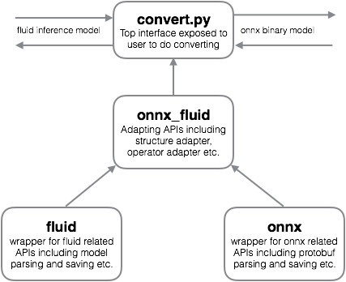

# Background

[ONNX (Open Neural Network Exchange)](https://github.com/onnx/onnx) bridges different deep learning frameworks by providing an open source graph format for models. The models trained in other frameworks can be converted into the ONNX format to execute inference by utilizing the built-in operators in ONNX - this is called a **frontend**. With the inverse conversion (called a **backend**), different frameworks can share any models supported by ONNX in principle. Now most mainstream frameworks have joined the ONNX community, e.g. Caffe2, PyTorch, and MXNet etc. And there is a momentum driving more and more vendors to begin supporting ONNX or even choose ONNX as the only machine learning runtime in their devices.

Therefore, it is necessary to enable the conversion between PaddlePaddle and ONNX. This design doc is aimed at implementing a convertor, mainly for converting between **Fluid** models and ONNX (it is very likely that we may support older v2 models in the future). A complete convertor should be bidirectional - with a frontend AND a backend, but considering the importance, the we will start with the frontend i.e. Fluid models to ONNX models.


# How it works

ONNX has a [working list of operators](https://github.com/onnx/onnx/blob/master/docs/Operators.md) which is versioned.

When prioritizing implementation of a frontend over a backend, choice of coverage of Fluid -> ONNX operators comes down to choices of models to be supported (see section `Supported models`). Eventually, this will allow us to reach a really-wide coverage of all operators.

Here are a few major considerations when it comes to converting models:

- **Op-level conversion**: How to map the inputs, attributes, and outputs of each Paddle operator to those of the ONNX operator. In several cases, these require transformations. For each direction (frontend vs. backend), a different conversion mapping is needed.
- **Parameters (weights) initialization**: Setting initial parameters on different nodes.
- **Tensor data type mapping** (Note: Some ONNX data types are not supported in Fluid)
- **Network representation adaption**: Fluid `ProgramDesc` include nested blocks. Since ONNX is free of nesting, the `ProgramDesc` ops need to be traversed to only include ops from the global scope in the root block. The variables used as inputs and outputs should also be in this scope.
- **Model validation**: There are two kinds of validations that are necessary:
   1. We need to ensure that the inference outputs of the ops in run inside a model are the same as those when running the ONNX converted ops through an alternative ONNX backend.
   2. Checking to see if the generated nodes on the graph are validated by the internal ONNX checkers.
- **Versioning**: ONNX versions its op listing over versions. In fact, it has versioning on 3 different levels: ops, graphs, and ONNX models. This requires that we are conscious about versioning the convertor and updating tests and op convertor logic for each release. It also implies that we release pre-trained ONNX models upon each version release.

One thing that makes this conversion more feasible in Fluid's case is the use of a static IR - the `ProgramDesc` - as opposed to a dynamic graph, as created in the cases of frameworks like PyTorch.


# Project structure

<p align="center">

</p>

The project contains four important parts:

* **fluid**: The directory that contains wrappers for fluid related APIs. Fluid has provided some low-level APIs to parse or generate the inference model. However, directly using these low-level APIs makes the code tediously long. This module wraps low-level APIs to provide simplified interfaces.

* **onnx**: This is a Python package provided by ONNX containing helpers for creating nodes, graphs, and eventually binary protobuf models with initializer parameters.

* **onnx_fluid**: Contains two-way mapping (Fluid -> ONNX ops and ONNX -> Fluid ops). Called from `convert.py`, the program uses this mapping along with modifier functions to construct ONNX nodes with the help of ONNX's `make_node` helper. It also contains mapping between datatypes and tensor deprecation / amplification logic.

* **convert.py**: The interface exposed to users. This will traverse the global program blocks/variables and construct the write-able model.


# Usage
The converter should be designed to very easy-to-use. Bidirectional conversion between a Fluid inference model and an ONNX binary model will be supported. Model validation will also provided to verify the correctness of converted model.

* Convert Fluid inference model to ONNX binary model

    ```
    python convert.py --fluid_model <fluid inference model> --onnx_model <ONNX model> validate True
    ```

* Validate the converted model

    ```
    python validate.py --fluid_model <fluid inference model> --onnx_model <ONNX model>
    ```

The conversion and model validation will be completed consecutively, finally output a readable model structure description. And for the converse conversion, users only need to exchange the input and output.


# Challenges and mitigation

## Cycles

Cycles are unsupported in ONNX. In Paddle, the `while` op is the most prominent example of a cycle.

*Resolution*: We won't support models with `while`s which can't be substituted until ONNX adds support for such ops.

## Sequences

Sequence processing operators like `sequence_expand`, `sequence_reshape`, `sequence_concat`, and `sequence_pool` are not supported by ONNX as well, because they do not support non-padded datatypes like LoDTensors.

*Resolution*: Since the runtimes using our ONNX exported graphs won't be using LoDTensors in the first place, such sequence operators should be mapped to ONNX ops that will do the necessary transposing ops with the knowledge of the padding and shape of the Tensors.

## Ops that can't easily be mapped

There are ops that just aren't possible to map today:

**Control flow operators**

Paddle supports control flow ops like `If/Else` and `Switch` (if we ignore the CSP operations like `select` for now). ONNX has `If` support in the experimental phase.

*Resolution*: Map Paddle's `If/Else` to ONNX's `If`, but ignore other control flow operators until ONNX brings support for them.


**Non-existent in Fluid**

There are several ONNX operators that are not available in Fluid today, e.g. `InstanceNormalization`, `RandomUniform`, `Unsqueeze`, etc.

*Resolution*: For the initial phase, we can choose to not support ops that our models don't care for and are subsequently not available in Fluid. However, for ops that we think might be necessary for Fluid users also, we must implement them on our side and support the ONNX conversion to them. This list is TBD.


**Concurrency**

ONNX does not have any considerations for concurrency right now.

*Resolution*: There are two ways to approach this:

a. We choose to not support concurrent models.
b. We only support `go_op`s (basically threads) shallowly. This could mean that we enqueue `go_op` ops prior to gradient calculations OR even prior to the entire graph, and that's it - since `go_op`s do not have support for backprop anyways. One of the core target use cases of `go_op`: batch reading - can be handled through this approach.


**Overloaded in Fluid**

There are ops in ONNX whose job can't be accomplished by a single corresponding Paddle operator (e.g. ), but a collection of operators.

*Resolution*: Chain multiple Paddle operators.


## Lack of LoDTensors

As stated above, ONNX only supports simple Tensor values.

*Resolution*: Deprecate to plain old numpy-able tensors.


## Reconstruction from deprecated ONNX ops

For higher-level Fluid ops, such as a few offered by the `nn` layer that do not have direct corresponding mappings but can be converted to ONNX by chaining a series of ops without cycles, it would be useful to map them back to the higher-level Fluid ops once converted back from the deprecated ONNX graphs.

*Resolution*: Graphs that have the deprecation from Paddle -> ONNX. When converting back from ONNX, if we encounter the identical graphs by doing a forward search, we can replace the subgraphs with the matching ONNX op.


# Supported models

As mentioned above, potential risks may come from the conversion of sequence-related models, including the LodTensor, ```if/else``` and ```while``` operator. So a good choice is to focus on some important feedforward models first, then implement some simple recurrent models.

- Feedforward models: common models selected in PaddleBook, e.g. VGG, ResNet and some other models proposed by application teams.
- Recurrent models: language model, stacked LSTMs etc.
