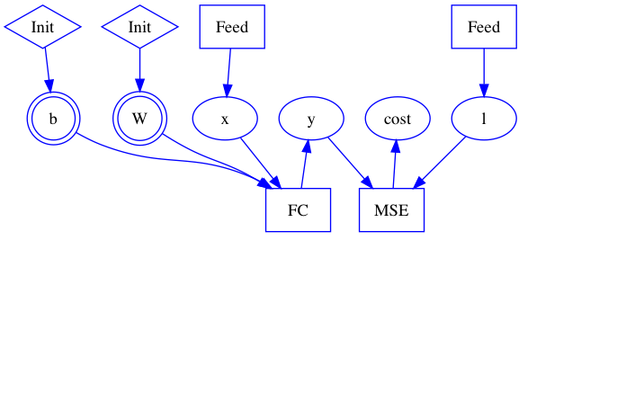
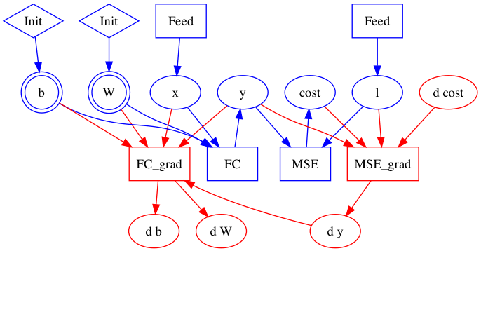
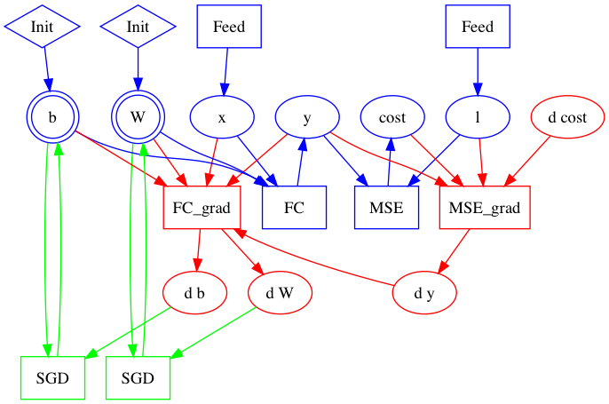

# Design Doc: Computations as a Graph

A primary goal of the refactorization of PaddlePaddle is a more flexible representation of deep learning computation, in particular, a graph of operators and variables, instead of sequences of layers as before.

This document explains that the construction of a graph as three steps:

- construct the forward part
- construct the backward part
- construct the optimization part

## The Construction of a Graph

Let us take the problem of image classification as a simple example.  The application program that trains the model looks like:

```python
x = layer.data("images")
l = layer.data("label")
y = layer.fc(x)
cost = layer.mse(y, l)
optimize(cost)
train(cost, reader=mnist.train())
```

### Forward Part

The first four lines of above program build the forward part of the graph.



In particular, the first line `x = layer.data("images")` creates variable x and a Feed operator that copies a column from the minibatch to x.  `y = layer.fc(x)` creates not only the FC operator and output variable y, but also two parameters, W and b, and the initialization operators.

Initialization operators are kind of "run-once" operators -- the `Run` method increments a class data member counter so to run at most once.  By doing so, a parameter wouldn't be initialized repeatedly, say, in every minibatch.

In this example, all operators are created as `OpDesc` protobuf messages, and all variables are `VarDesc`.  These protobuf messages are saved in a `BlockDesc` protobuf message.

### Backward Part

The fifth line `optimize(cost)` calls two functions, `ConstructBackwardGraph` and `ConstructOptimizationGraph`.

`ConstructBackwardGraph` traverses the forward graph in the `BlockDesc` protobuf message and builds the backward part.



According to the chain rule of gradient computation, `ConstructBackwardGraph` would

1. create a gradient operator G for each operator F,
1. make all inputs, outputs, and outputs' gradient of F as inputs of G,
1. create gradients for all inputs of F, except for those who don't have gradients, like x and l, and
1. make all these gradients as outputs of G.

### Optimization Part

For each parameter, like W and b created by `layer.fc`, marked as double circles in above graphs, `ConstructOptimizationGraph` creates an optimization operator to apply its gradient.  Here results in the complete graph:



## Block and Graph

The word block and graph are interchangable in the desgin of PaddlePaddle.  A [Block](https://github.com/PaddlePaddle/Paddle/pull/3708) is a metaphore of the code and local variables in a pair of curly braces in programming languages, where operators are like statements or instructions.  A graph of operators and variables is a representation of the block.

A Block keeps operators in an array `BlockDesc::ops`

```protobuf
message BlockDesc {
  repeated OpDesc ops = 1;
  repeated VarDesc vars = 2;
}
```

in the order that they appear in user programs, like the Python program at the beginning of this article.  We can imagine that in `ops`,  we have some forward operators, followed by some gradient operators, and then some optimization operators.
