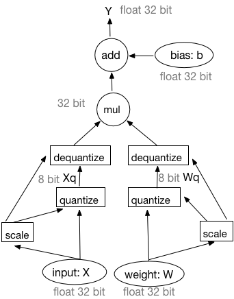

Fixed-point quantization is to use lower bit, for example, 2 bit, 3 bit or 8 bit fixed-point to represent weights and activations, which usually are singe float point with 32 bit. The fixed-point representation has advantages in reducing memory bandwidth, lowering power consumption and computational resources as well as the model storage requirements.  It is especially import for the inference in embedded device deployment.

According some experiments, the apporach to quantize the model trained in float point directly works sufficiently on the large model, like the over-parameterized VGG model. But the accuracy drops a lot for the small model. In order to improve the tradeoff be-tween accuracy and latency, many quantized training apporaches are proposed.

This document is to design a quantized training framework on Fluid. The first part will introduce how to quantize, The second part will describe the quantized training framework. The last part will describe how to the quantization range.

### How to quantize

There are many ways to quantizate the float value to fixed-point value. For example:

$$ r = min(max(x, a), b)$$
$$ s = \frac{b - a}{n - 1} $$
$$ q = \left \lfloor \frac{r - a}{s} \right \rceil $$

where, $x$ is the float value to be quantized, $[a, b]$ is the quantization range, $a$ is the minimum value and $b$ is the maximal value. $\left \lfloor \right \rceil$  denotes rounding to the nearest integer. If the quantization level is $k$, $n$ is $2^k$, for example, $k$ is 8 and $n$ is 256. $q$ is the quantized integer. 

The quantization we apllied is parameterized by the number of quantization levels and maximum absolute value:

$$ M  = max(abs(x))  $$
$$ q = \left \lfloor \frac{x}{M} * (n - 1) \right \rceil $$

where, $x$ is the float value to be quantized, $M$ is maximum absolute value. $\left \lfloor \right \rceil$ denotes rounding to the nearest integer.  For 8 bit quantization, $n=2^{8}=256$. $q$ is the quantized integer. 

Wether the *min-max* quantization or *max-abs* quantization, they also can be represent:

$q = scale * r + b$

We call *min-max*, *max-abs* as the quantization arguments, also call them quantization scale or quantization range.

How to calculate the quantization range (or maximum absolute value) for inference will be described in the last part.

### Training Framework

The training framework is as following figure. 

 
 

Fig 1. Forward and backward in training.

#### Forward pass

The forward pass is simulated quantization, see the figure a.

- At first, both input and weight will be quantized to 8 bit. 
- Then, do the multiplication (or convolution) operation with integers.
- Then, dequantize the multiplication (or convolution) results to 32 bit float point.
- At last, do bias-addition in float type of 32 bit. Here, the bias is not quantized.

For general matrix to matrix multiplication (GEMM), quantize for $X$ and $W$:

$$ X_q = \left \lfloor \frac{X}{X_m} * (n - 1) \right \rceil  $$
$$ W_q = \left \lfloor \frac{W}{W_m} * (n - 1) \right \rceil $$

Do GEMM:

$$ Y = X_q * W_q $$

Dequantize $Y$:

$$
\begin{align}
Y_{dq} &=\frac{Y}{(n - 1) * (n - 1)} * X_m * W_m \\\
       &=\frac{X_q * W_q}{(n - 1) * (n - 1)} * X_m * W_m \\
       &=(\frac{X_q}{n - 1} * X_m) * (\frac{W_q}{n - 1} * W_m) 
\end{align}
$$

From these formulas, dequantization also can be moved before GEMM, do dequantization for $Xq$ and $Wq$ at first, then do GEMM. The forward workflow in training is equivalent to following framework.

 
 

Fig 2. Equitvalent forward in training.

We use this equivalent workflow in the training. In our desigin, there is a quantization transipler to insert the quantization operator and the de-quantization operator in the Fluid `ProgramDesc`.

#### Backward pass

See the figure b. The backward pass still remains unchanged, all inputs and outputs of backward operator are float point with 32 bit.

So the quantization transipler should not change the backward pass. 

### How to calculate quantization scale

There are two strategies to calculate quantization scale, we call them dynamic and static strategy. The dynamic strategy is to calculate the quantization scale value each iteration. The static strategy is to fix the quantization scale for different inputs.

For weights, we apply the dynamic strategy for weights in the training, that is to say, the quantization scale will recalculate during each iteration until the traning is finished.

For activations, the quantization scales are estimated during training, then use them in inference. There are several different ways to estimat:

1. Calculate the mean of maximum absolute during a window.
2. Calculate the max of maximum absolute during a window.
3. Calculate the running mean of maximum absolute during a window, as follows:

    $$ Vt = (1 - k) * V +  k * V_{t-1}  $$
    
    where, $V$ is the maximum absolute value of current batch, $Vt$ is the running mean value. $k$ is a factor, such as 0.9.
