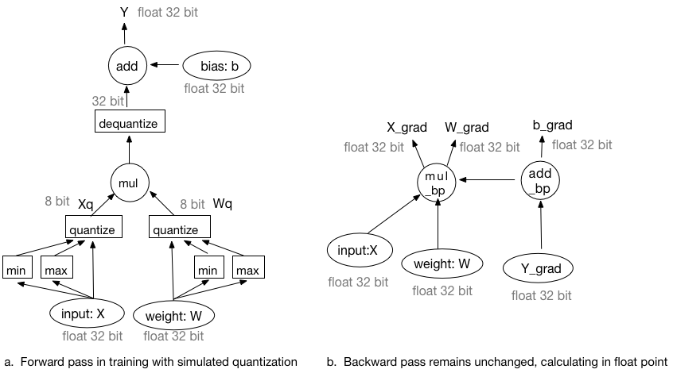

Fixed-point quantization is to use lower bit, for example, 2 bit, 3 bit or 8 bit fixed-point to represent weights and activations, which usually are singe float point with 32 bit. The fixed-point representation has advantages in reducing memory bandwidth, lowering power consumption and computational resources as well as the model storage requirements.  It is especially import for the inference in embedded device deployment.

According some experiments, the apporach to quantize the model trained in float point directly works sufficiently on the large model, like the over-parameterized VGG model. But the accuracy drops a lot for the small model. In order to improve the tradeoff be-tween accuracy and latency, many quantized training apporaches are proposed.

This document is to design a quantized training framework on Fluid. The first part will introduce how to quantize, The second part will describe the quantized training framework. The last part will describe how to the quantization range.

### How to quantize

Quantization is parameterized by the number of quantization levels and range:

$$ r  = min(max(x, a), b)$$
$$ s = \frac{b - a}{n - 1} $$
$$ q = round(\frac{r - a}{s}) $$

where, $x$ is the float value to be quantized, $[a, b]$ is the quantization range, $a$ is the minimum value and $b$ is the maximal value. `round` denotes rounding to the nearest integer.  For 8 bit quantization, $n=2^{8}=256$. $q$ is the quantized integer.

How to determine the quantization range will be described in the last part.

### Training Framework

The training framework is as following figure. The forward pass is simulated quantization. 

 

#### Forward pass

See the figure a.

- At first, both input and weight will be quantized to 8 bit. 
- Then, do the multiplication (or convolution) operation with integers.
- Then, dequantize the multiplication (or convolution) results to 32 bit float point.
- At last, do bias-addition in float type of 32 bit. Here, the bias is not quantized.

#### Backward pass

See the figure b. The backpropagation still remains unchanged, all inputs and outputs of backward operator are float point with 32 bit.

### How to determine minimum and maximal range

- 
