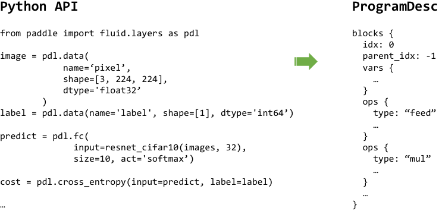

========
Overview
========

PaddlePaddle is designed is to give you the ability to write deep learning programs that look and run very similar to software programs written for all other purposes. It makes this possible through a straightforward Python API that allows you to write both simple and very custom & complex neural networks without needing to write custom operators or worry about any implementation details.

Unlike some other deep learning frameworks, code you write with the PaddlePaddle API :doc:`is compiled into <../design/motivation/fluid_compiler>` an arbitrary **Intermediate Representation (IR)** that is similar to an `abstract syntax tree <https://en.wikipedia.org/wiki/Abstract_syntax_tree>`_ (instead of becoming a series of layers, or graph of predefined operators). Think about this IR as the series of instructions that your code compiles to, as understood by your computer, before they are handed over to your computer to run.

.. tip::
    In PaddlePaddle's case, the IR is serialized to the `protobuf <https://developers.google.com/protocol-buffers/>`_ format, and passed onto :doc:`a C++ "executor" <../design/concepts/program>` to train or infer with.

.. note::
	It would be pretty annoying if your programming language limited what instructions you could code. But sometimes they do, and that limitation makes us choose programming languages that allow us to better express ourselves over those that constrain us. In the future of deep learning research and design, we are are increasingly going to need to move away from tight constraints to be able to discover newer, more powerful architectures, and that's what PaddlePaddle allows to design.

PaddlePaddle's IR
-----------------

PaddlePaddle's IR is called a `ProgramDesc`, but you don't need to know too much about how it is works to build and train powerful deep learning programs. But just for your curiosity, here is the IR representation of a sample PaddlePaddle program:

.. note::
    PaddlePaddle's IR allows us to turn your programs into things that execute your code in parallel and do other optimizations. It also allows us to run the actual mathematical operations in the most efficient language using the most optimum hardware libraries, so that you can write your code in a simple high-level language like, in this case, Python.

.. tip::
    This IR should not be confused with a *model* used for inference. However, in PaddlePaddle's case, these **IR + parameter values** associated with the inputs and outputs of operators are, in fact, the model.

Technical design docs
---------------------

- :doc:`PaddlePaddle Design Doc <../design/motivation/api>`
- :doc:`Design Doc: PaddlePaddle Fluid <../design/motivation/fluid>`
- :doc:`PaddlePaddle Fluid: Towards a Compiled Programming Language <../design/motivation/fluid_compiler>`
- :doc:`PaddlePaddle Programs <../design/concepts/program>`
