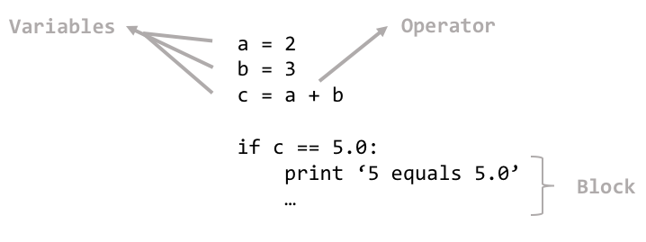

=================
Running a program
=================

While programs using the PaddlePaddle API are written in Python, their intermediate representations (IRs) are actually handed off and executed by C++ code optimized to make the most of the hardware resources available.

This execution flow runs all the operators generated by your Python code in a sequence, for each batch (or epoch) of data that you feed in.

.. note::
    Two interesting things to note here:

    - To keep things consistent and understandable, PaddlePaddle adds several backward propagation operators at the end of the program, corresponding to the gradient calculation logic for each of the differentiable operators.
    - Aspects of the network that are not plain "feedforward", such as `Recurrent Neural Networks (RNNs) <https://en.wikipedia.org/wiki/Recurrent_neural_network>`_, are run in a custom subsections of the network called "blocks" (yes, the same idea as the regular programming idea of blocks), and they have their own mechanism and order of running the sub-operators they depend on.

In the case of a training run, the sequence, in order, is something similar to the following:

1. Operators that take in any attributes that you wish to `feed` to the network.
2. Operators that read your input data.
3. A pass through the **forward** operators.
4. A pass through the **backward propagation / gradient calculation** operators.
5. Operators that return any variables you sought to `fetch` back from the program, to print or perhaps analyze them.

It's as straightforward as that.

Overview of PaddlePaddle's IR
-----------------------------

PaddlePaddle's IRs, `ProgramDesc`\s, are more of a serialized (using protobuf) general software program, than anything else. Just like programs written in your favorite programming language, they contain variables, a sequence of operators (since every statement contains some sort of operation), and blocks (yes, the things under `if`\s, `while`\s, `function`\s, and other control flow syntax).

.. tip::
	Blocks also allow PaddlePaddle to support control flow like `if/else`, `while`, `switch`, and in the cases of concurrency, `select`.

.. note::
	In the case of operators, there are 3 kinds of arguments. Configurations passed into the operators in your Python code become *attributes*, while data flowing into and out of the operator become its *inputs* and *outputs*.

Technical design docs
---------------------
- :doc:`Design Doc: PaddlePaddle Programs <../design/concepts/program>`
- :doc:`Executor Design Doc  <../design/concepts/executor>`
- :doc:`Design Doc: Block and Scope  <../design/concepts/block>`
- :doc:`Design of Scope in Paddle <../design/concepts/scope>`
- :doc:`C++ Data Feeding <../design/concepts/cpp_data_feeding>`
