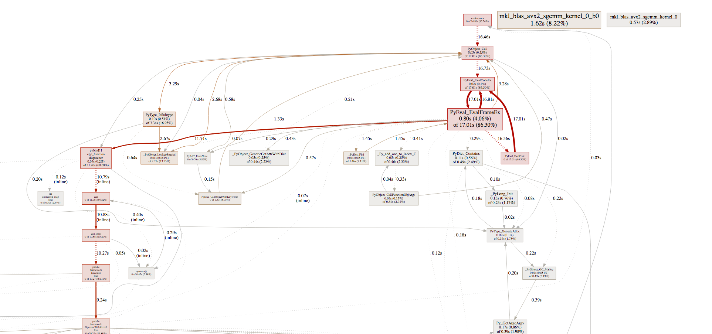
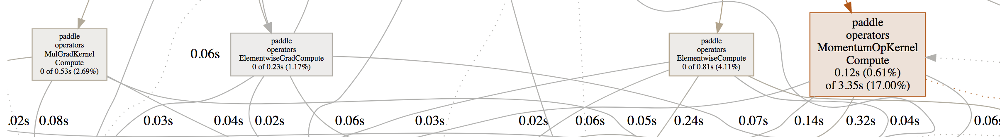

# Tune CPU performance

This tutorial introduces techniques we use to profile and tune the
CPU performance of PaddlePaddle.  We will use Python packages
`cProfile` and `yep`, and Google's `perftools`.

Profiling is the process that reveals performance bottlenecks,
which could be very different from what's in the developers' mind.
Performance tuning is done to fix these bottlenecks. Performance optimization
repeats the steps of profiling and tuning alternatively.

PaddlePaddle users program AI applications by calling the Python API, which calls
into `libpaddle.so.` written in C++.  In this tutorial, we focus on
the profiling and tuning of

1. the Python code and
1. the mixture of Python and C++ code.

## Profiling the Python Code

### Generate the Performance Profiling File

We can use Python standard
package, [`cProfile`](https://docs.python.org/2/library/profile.html),
to generate Python profiling file.  For example:

```bash
python -m cProfile -o profile.out main.py
```

where `main.py` is the program we are going to profile, `-o` specifies
the output file.  Without `-o`, `cProfile` would outputs to standard
output.

### Look into the Profiling File

`cProfile` generates `profile.out` after `main.py` completes. We can
use [`cprofilev`](https://github.com/ymichael/cprofilev) to look into
the details:

```bash
cprofilev -a 0.0.0.0 -p 3214 -f profile.out main.py
```

where `-a` specifies the HTTP IP, `-p` specifies the port, `-f`
specifies the profiling file, and `main.py` is the source file.

Open the Web browser and points to the local IP and the specifies
port, we will see the output like the following:

```
   ncalls  tottime  percall  cumtime  percall filename:lineno(function)
        1    0.284    0.284   29.514   29.514 main.py:1(<module>)
     4696    0.128    0.000   15.748    0.003 /home/yuyang/perf_test/.env/lib/python2.7/site-packages/paddle/fluid/executor.py:20(run)
     4696   12.040    0.003   12.040    0.003 {built-in method run}
        1    0.144    0.144    6.534    6.534 /home/yuyang/perf_test/.env/lib/python2.7/site-packages/paddle/v2/__init__.py:14(<module>)
```

where each line corresponds to Python function, and the meaning of
each column is as follows:

<table>
<thead>
<tr>
<th>column</th>
<th>meaning </th>
</tr>
</thead>
<tbody>
<tr>
<td> ncalls</td>
<td> the number of calls into a function</td>
</tr>
<tr>
<td>tottime</td>
<td> the total execution time of the function, not including the execution time of other functions called by the function</td>
</tr>
<tr>
<td> percall </td>
<td> tottime divided by ncalls</td>
</tr>
<tr>
<td> cumtime</td>
<td> the total execution time of the function, including the execution time of other functions being called</td>
</tr>
<tr>
<td> percall</td>
<td> cumtime divided by ncalls</td>
</tr>
<tr>
<td> filename:lineno(function) </td>
<td> where the function is define </td>
</tr>
</tbody>
</table>

### Identify Performance Bottlenecks

Usually, `tottime` and the related `percall` time is what we want to
focus on. We can sort above profiling file by tottime:

```text
     4696   12.040    0.003   12.040    0.003 {built-in method run}
   300005    0.874    0.000    1.681    0.000 /home/yuyang/perf_test/.env/lib/python2.7/site-packages/paddle/v2/dataset/mnist.py:38(reader)
   107991    0.676    0.000    1.519    0.000 /home/yuyang/perf_test/.env/lib/python2.7/site-packages/paddle/fluid/framework.py:219(__init__)
     4697    0.626    0.000    2.291    0.000 /home/yuyang/perf_test/.env/lib/python2.7/site-packages/paddle/fluid/framework.py:428(sync_with_cpp)
        1    0.618    0.618    0.618    0.618 /home/yuyang/perf_test/.env/lib/python2.7/site-packages/paddle/fluid/__init__.py:1(<module>)
```

We can see that the most time-consuming function is the `built-in
method run`, which is a C++ function in `libpaddle.so`.  We will
explain how to profile C++ code in the next section.  At this
moment, let's look into the third function `sync_with_cpp`, which is a
Python function.  We can click it to understand more about it:

```
Called By:

   Ordered by: internal time
   List reduced from 4497 to 2 due to restriction <'sync_with_cpp'>

Function                                                                                                 was called by...
                                                                                                             ncalls  tottime  cumtime
/home/yuyang/perf_test/.env/lib/python2.7/site-packages/paddle/fluid/framework.py:428(sync_with_cpp)  <-    4697    0.626    2.291  /home/yuyang/perf_test/.env/lib/python2.7/site-packages/paddle/fluid/framework.py:562(sync_with_cpp)
/home/yuyang/perf_test/.env/lib/python2.7/site-packages/paddle/fluid/framework.py:562(sync_with_cpp)  <-    4696    0.019    2.316  /home/yuyang/perf_test/.env/lib/python2.7/site-packages/paddle/fluid/framework.py:487(clone)
                                                                                                                  1    0.000    0.001  /home/yuyang/perf_test/.env/lib/python2.7/site-packages/paddle/fluid/framework.py:534(append_backward)


Called:

   Ordered by: internal time
   List reduced from 4497 to 2 due to restriction <'sync_with_cpp'>
```

The lists of the callers of `sync_with_cpp` might help us understand
how to improve the function definition.

## Profiling Python and C++ Code

### Generate the Profiling File

To profile a mixture of Python and C++ code, we can use a Python
package, `yep`, that can work with Google's `perftools`, which is a
commonly-used profiler for C/C++ code.

In Ubuntu systems, we can install `yep` and `perftools` by running the
following commands:

```bash
apt update
apt install libgoogle-perftools-dev
pip install yep
```

Then we can run the following command

```bash
python -m yep -v main.py
```

to generate the profiling file.  The default filename is
`main.py.prof`.

Please be aware of the `-v` command line option, which prints the
analysis results after generating the profiling file.  By examining the
 the print result, we'd know that if we stripped debug
information from `libpaddle.so` at build time.  The following hints
help make sure that the analysis results are readable:

1. Use GCC command line option `-g` when building `libpaddle.so` so to
   include the debug information.  The standard building system of
   PaddlePaddle is CMake, so you might want to set
   `CMAKE_BUILD_TYPE=RelWithDebInfo`.

1. Use GCC command line option `-O2` or `-O3` to generate optimized
   binary code. It doesn't make sense to profile `libpaddle.so`
   without optimization, because it would anyway run slowly.

1. Profiling the single-threaded binary file before the
   multi-threading version, because the latter often generates tangled
   profiling analysis result.  You might want to set environment
   variable `OMP_NUM_THREADS=1` to prevents OpenMP from automatically
   starting multiple threads.

### Examining the Profiling File

The tool we used to examine the profiling file generated by
`perftools` is [`pprof`](https://github.com/google/pprof), which
provides a Web-based GUI like `cprofilev`.

We can rely on the standard Go toolchain to retrieve the source code
of `pprof` and build it:

```bash
go get github.com/google/pprof
```

Then we can use it to profile `main.py.prof` generated in the previous
section:

```bash
pprof -http=0.0.0.0:3213 `which python`  ./main.py.prof
```

Where `-http` specifies the IP and port of the HTTP service.
Directing our Web browser to the service, we would see something like
the following:



### Identifying the Performance Bottlenecks

Similar to how we work with `cprofilev`, we'd focus on `tottime` and
`cumtime`.



We can see that the execution time of multiplication and the computing
of the gradient of multiplication takes 2% to 4% of the total running
time, and `MomentumOp` takes about 17%. Obviously, we'd want to
optimize `MomentumOp`.

`pprof` would mark performance critical parts of the program in
red. It's a good idea to follow the hints.
