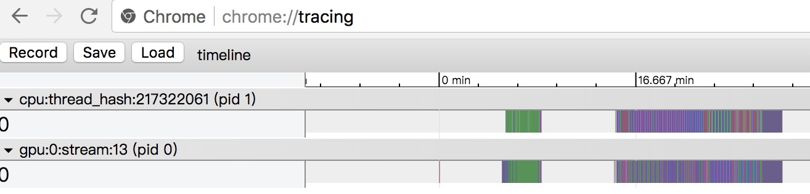

# how to use timeline tool to do profile

1. Add `with profiler.profiler(...)` to the main training loop. After run, the code will generate a profile record file `/tmp/profile`. **Warning**: Please do not run too many batches when use profiler to record timeline information, for the profile record will grow with the batch number.

	```python
	with profiler.profiler('All', 'total', '/tmp/profile') as prof:
	    for pass_id in range(pass_num):
	        for batch_id, data in enumerate(train_reader()):
	            exe.run(fluid.default_main_program(),
	                    feed=feeder.feed(data),
	                    fetch_list=[],
	                    use_program_cache=True)
	            ...
	```

1. Run `python paddle/tools/timeline.py` to process `/tmp/profile`, it will generate another
file `/tmp/timeline` by default. You can change the path by cmd parameter, please take a look at
[timeline.py](https://github.com/PaddlePaddle/Paddle/blob/develop/tools/timeline.py) for details.

1. Open chrome and visit <chrome://tracing/>, use `load` button to load the generated `timeline` file.

	

1. The resulting timeline should be like:


	
