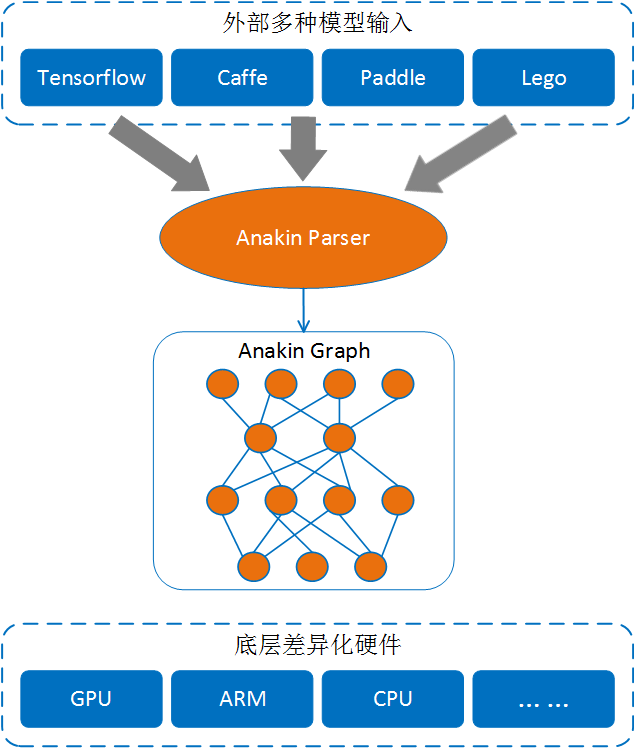

# Anakin 使用教程 ##

本教程将会简略的介绍Anakin的工作原理，一些基本的Anakin API，以及如何调用这些API。
  
## 内容 ###

- [Anakin的工作原理](#principle)
- [Anakin APIs](#api)
- [示例代码](#example)

## <span id = 'principle'> Anakin的工作原理</span> ###



用Anakin来进行前向计算主要分为三个步骤：

- 将外部模型通过[Anakin Parser](Converter_ch.md)解析为Anakin模型  
  在使用Anakin之前，用户必须将所有其他模型转换成Anakin模型，我们提供了转换脚本，用户可通过[Anakin Parser](Converter_ch.md)进行模型转换。
- 生成Anakin计算图
  加载Anakin模型生成原始计算图，然后需要对原始计算图进行优化。你只需要调用相应的API优化即可。
- 执行计算图  
  Anakin会选择不同硬件平台执行计算图。


## <span id ='api'>Anakin APIs </span> ###
### Tensor ####

`Tensor`提供基础的数据操作和管理，为ops提供统一的数据接口。`Tensor`包含以下几个属性：   

- Buffer  
   数据存储区
- Shape  
   数据的维度信息
- Event  
   用于异步计算的同步

 `Tensor` 类包含三个`Shape`对象， 分别是`_shape`, `_valid_shape`和 `offset`。 `_shape`为`tensor`真正空间信息，`_valid_shape`表示当前`tensor`使用的空间信息， `_offset`表示当前`tensor`数据指针相对于真正数据空间的信息。 `Tensor`不同维度与分别与数学中的向量、矩阵等相对应如下表所示。


Dimentions | Math entity |
 :----: | :----:
1 | vector
2 | matrix
3 | 3-tensor
n | n-tensor

#### 声明tensor对象

`Tensor`接受三个模板参数:


```c++
 template<typename TargetType, DataType datatype, typename LayOutType = NCHW>
 class Tensor .../* Inherit other class */{
  //some implements
  ...
 };
```

TargetType是平台类型，如X86，GPU等等，在Anakin内部有相应的标识与之对应；datatype是普通的数据类型，在Anakin内部也有相应的标志与之对应；[LayOutType](#layout)是数据分布类型，如batch x channel x height x width [NxCxHxW], 在Anakin内部用一个struct来标识。 Anakin中数据类型与基本数据类型的对应如下:

1. <span id='target'>TargetType</sapn>

 Anakin TargetType | platform
  :----: | :----:|
  NV | NVIDIA GPU
  ARM | ARM
  AMD | AMD GPU
  X86 | X86
  NVHX86 | NVIDIA GPU with Pinned Memory

2. <sapn id='datatype'>DataType</span>

Anakin DataType | C++ | Description 
:---: | :---: | :---: |
AK_HALF | short | fp16
AK_FLOAT | float | fp32
AK_DOUBLE | double | fp64
AK_INT8 | char | int8
AK_INT16 | short | int16
AK_INT32 | int | int32
AK_INT64 | long | int64
AK_UINT8 | unsigned char | uint8
AK_UINT16 | unsigned short | uint8
AK_UINT32 | unsigned int | uint32
AK_STRING | std::string | /
AK_BOOL | bool | /
AK_SHAPE | / | Anakin Shape 
AK_TENSOR | / | Anakin Tensor 


3. <span id = 'layout'>LayOutType </span>

Anakin LayOutType ( Tensor LayOut ) | Tensor Dimention | Tensor Support | Op Support
:---: | :---: | :---: | :---: |
W | 1-D | YES | NO
HW | 2-D | YES | NO
WH | 2-D | YES | NO
NW | 2-D | YES | YES
NHW | 3-D | YES |YES
NCHW ( default ) | 4-D | YES | YES
NHWC | 4-D | YES | NO
NCHW_C4 | 5-D | YES | YES


理论上，Anakin支持申明1维以上的tensor，但是对于Anakin中的Op来说，只支持NW、NHW、NCHW、NCHW_C4这四种LayOut，其中NCHW是默认的LayOutType，NCHW_C4是专门针对于int8这种数据类型的。


例子

> 下面的代码将展示如何使用tensor， 我们建议先看看这些示例。

> 要想获得更多关于tensor的信息， 请参考 *soure_path/core/tensor.h*

> 1. 使用shape对象初始化tensor
``` c++  
  //create a null tensor. A null tensor holds for nothing.
  //tensor's buffer  is resident at CPU and its datatype is AK_FLOAT.
  //tensor's Layout is NCHW(default)
   Tensor<X86, AK_FLOAT> mytensor;

   //1. using shape object to create a tensor.
   Shape shape1(NUM); //1-D shape. NUM is the number of dimention.
   Tensor<X86, AK_FLOAT, W> mytensor1(shape1); //1-D tensor.

  // A 4-D shape
   Shape shape2(N, C, H, W); // batch x channel x height x width
```

>`注意：Shape的维度必须和tensor的`[LayoutType](#layout)`相同，比如Shape(N,C,H,W), 那么Tensor的 LayoutType必须是NCHW，否则会出错。如下列代码所示`  


```c++
   // A 4-D tensor.
   Tensor<X86, AK_FLOAT> mytensor2(shape2);  //right

   //A 4-D tensor which is resident at GPU and its datatype is AK_INT8
   Tensor<NV, AK_INT8> mytensor3(shape2);   //right
   
   Tensor<X86, AK_FLOAT, NHW> mytensor4(shape2); //wrong!! shape's dimetion must be equal to tensor's Layout.
   Tensor<NV, AK_FLOAT, NCHW_C4> mytensor5(shape2); //wrong!!!!

```

> 2. 使用现有的数据和shape初始化tensor

```c++

   /**
   *  A construtor of Tensor.
   *  data_ptr is a pointer to any data type of data
   *  TargetType is type of a platform [Anakin TargetType]
   *  id : device id
   *  shape: a Anakin shape
   */
   Tensor(Dtype* data_ptr, TargetType_t target, int id, Shape shape);

   //using existing data feed to a tensor
   Tensor<X86, AK_FLOAT> mytensor(data_ptr, TargetType, device_id, shape); //shape must has dimention (N, C, H, W).

```

> 3. 使用tensor初始化tensor

```c++
   Tensor<NV, AK_FLOAT> tensor(exist_tensor);
```


> 提示： 你可以用` typedef Tensor<X86, AK_FLOAT> Tensor4d_X86 `方便定义tensor


#### 填充tensor数据区


填充数据区得看你申明tensor的方式， 下面展示了如何填充tensor的数据区。

```c++
首先来看看tensor的四种声明方式：

1. Tensor<X86, AK_FLOAT> mytensor;
2. Tensor<X86, AK_FLOAT, W> mytensor1(shape1);
3. Tensor<X86, AK_FLOAT> mytensor(data_ptr, TargetType, device_id, shape);
4. Tensor<NV, AK_FLOAT> tensor(exist_tensor);


相关的声明方式的数据填充方法如下：

1：声明一个空的tensor，此时没有为其分配内存，所以，我们需要手动的为其分配内存。
            
            //parama shape
            mytensor.re_alloc(Shape shape); 

            //Get writable pointer to mytensor.
            //parama index (int): where you start to write.
            //Dtype is your data type such int, float or double.
            Dtype *p = mytensor.mutable_data(index/*=0*/);
            //write data to mytensor
            for(int i = 0; i < mytensor.size(); i++){
              p[i] = 1.0f;
            }
            //do something ...

2: 这种声明方式会自动分配内存 

          //Get writable pointer to mytensor.
          //parama index (int): where you start to write.
          //Dtype is your data type such int, float or double.
          Dtype *p = mytensor1.mutable_data(index/*=0*/);
          //write data to mytensor
          for(int i = 0; i < mytensor.size(); i++){
            p[i] = 1.0f;
          }
          //do something ...

 
3：在该种声明方式中，我们仍不需要手动为其分配内存。但在构造函数内部是否为其分配内存，得依情况而定。如果data_ptr和申明的
tensor都在都一个目标平台上，那么该tensor就会与data_ptr共享内存空间，相反，如果他们不在同一个平台上（如data_ptr在X86上，而
tensor在GPU上），那么此时tensor就会开辟一个新的内存空间，并将data_ptr所指向的数据拷贝到tensor的buffer中。

          //Get writable pointer to mytensor.
          //parama index (int): where you start to write.
          //Dtype is your data type such int, float or double.
          Dtype *p = mytensor.mutable_data(index/*=0*/);
          //write data to mytensor
          for(int i = 0; i < mytensor.size(); i++){
            p[i] = 1.0f;
          }
          //do something ...

4：该种方式仍不需要手动分配内存

          //Get writable pointer to mytensor.
          //parama index (int): where you start to write.
          //Dtype is your data type such int, float or double.
          Dtype *p = mytensor.mutable_data(index/*=0*/);
          //write data to mytensor
          for(int i = 0; i < mytensor.size(); i++){
            p[i] = 1.0f;
          }
          //do something ...


另外，你还可以获取一个tensor的可读指针，示例如下：
        //Get read-only pointer to mytensor.
        //parama index (int): where you start to read.
        //Dtype is your data type such int, float or double.
         Dtype *p = mytensor.data(index/*=0*/);
        //do something ...
```

如果想更详细的了解tensor，请查阅*soure_path/saber/core/tensor.h*

#### 获取tensor的shape

```c++
//some declarations
// ...
Shape shape = mytensor.shape();

//Get a first dimetion size of tesor, if it has.
int d1 = shape[0];

//Get a second dimention size of tensor, if it has.
int d2 = shape[1];

...

//Get a n-th dimention size of tensor, if it has.
int dn = shape[n-1];


//Get a tensor's dimention
int dims = mytensor.dims();

//Get the size of tensor.
//size = d1 x d2 x ... x dn.
int size = mytensor.size();

//Get the size of tensor at interval [Di, Dj)
// form i-th dimention to j-th dimention, but not including the j-th dimention.
// which means di x (di+1) x ... x (dj -1)
int size = mytensor.count(start, end);
```

#### 设置tensor的shape

我们可以用tensor的成员函数set_shape来设置tensor的shape。 下面是set_shape的定义


```c++
/**
 * \brief set a tensor's shape
 * \param valid_shape [a Shape object]
 * \param shape [a Shape object]
 * \param offset [a Shape object]
 * \return the status of this operation, that means whether it success * or not.
 */
SaberStatus set_shape(Shape valid_shape, Shape shape = Shape::zero(TensorAPI::layout_dims::value), Shape offset = Shape::minusone(TensorAPI::layout_dims::value)); 
```

这个成员函数只设置tensor的shape。这些shape对象(valid_shape, shape, offset)的[LayOutType](#layout)必须和当前的tensor的相应三个shape对象的LayOutType相同，如果不同就会出错，返回SaberInvalidValue。 如果相同，那么将成功设置tensor的shape。

```c++

// some declarations
// ...
//valid_shape, shape , offset are Shape object;
//All these Shape object's LayOutType must be equal to mytensor's.
mytensor.set_shape(valid_shape, shape, offset);

```

#### 重置 tensor的shape

```c++
//some declarations
Shape shape, valid_shape, offset;

//do some initializations
... 
mytensor.reshape(valid_shape, shape, offset);
```

注意： Reshape操作仍然需要shape的[LayOutType](#layout) 与tensor的相同


### Graph ###

`Graph`类负责加载Anakin模型生成计算图、对图进行优化、存储模型等操作。

#### 图的声明

与`Tensor`一样，graph也接受三个模板参数。

```c++

template<typename TargetType, DataType Dtype, Precision Ptype>
class Graph ... /* inherit other class*/{
  
  //some implements
  ...

};
```

前面已经介绍过[TargetType](#target)和[DataType](#datatype)是Anakin内部自定义数据类型。[TargetType](#target)表示平台类型 (如NV、X86), [DataType](#datatype)是Anakin基本数据类型与C++/C中的基本数据类型相对应。 [Precision](#precision)为op所支持的精度类型, 稍后我们在介绍它。


```c++

//Create a empty graph object.
Graph graph = Graph<NV, AK_FLOAT, Precision::FP32> tmp();

//Create a pointer to a empty graph.
Graph *graph = new Graph<NV, AK_FLOAT, Precision::FP32>();

//Create a pointer to a empty graph.
auto graph = new Graph<NV, AK_FLOAT, Precision::FP32>();

```

#### 加载 Anakin 模型

```c++
//some declarations
...
auto graph = new Graph<NV, AK_FLOAT, Precision::FP32>();
std::string model_path = "the/path/to/where/your/models/are";
const char *model_path1 = "the/path/to/where/your/models/are";

//Loading Anakin model to generate a compute graph.
auto status = graph->load(model_path);

//Or this way.
auto status = graph->load(model_path1);
//Check whether load operation success.
if(!status){
  std::cout << "error" << endl;
  //do something...
}

```

#### 优化计算图

```c++
//some declarations
...
//Load graph.
...
//According to the ops of loaded graph, optimize compute graph.
graph->Optimize();

```

> 注意： 第一次加载原始图，必须要优化。

#### 保存模型

你可以在任何时候保存模型， 特别的， 你可以保存一个优化的模型，这样，下次再加载模型时，就不必进行优化操作。


```c++
//some declarations
...
//Load graph.
...
// save a model
//save_model_path: the path to where your model is.
auto status = graph->save(save_model_path);

//Checking
if(!status){
  cout << "error" << endl;
  //do somethin...
}
```

#### 重新设置计算图里的tensor的shape

```c++
//some declarations
...
//Load graph.
...
vector<int> shape{10, 256, 256, 10};
//input_name : std::string.
//Reshape a tensor named input_name.
graph->Reshape(input_name, shape);//Note: shape is a vector, not a Shape object.
```

#### 设置 batch size

`Graph` 支持重新设置batch size的大小。

```c++
//some declarations
...
//Load graph.
...
//input_name : std::string.
//Reset a tensor named input_name.
int new_batch_size = 4;
graph->ResetBatchSize(input_name, new_batch_size);
```

###  Net ###


`Net` 是计算图的执行器。你可以通过Net对象获得输入和输出
#### Creating a graph executor

`Net`接受四个模板参数。  


```c++
template<typename TargetType, DataType Dtype, Precision PType OpRunType RunType = OpRunType::ASYNC>
class Net{
  //some implements
  ...

};
```
由于有些Op可能支持多种精度，我们可以通过Precision来指定。OpRunType表示同步或异步类型，异步是默认类型。OpRunType::SYNC表示同步，在GPU上只有单个流；OpRunType::ASYNC表示异步，在GPU上有多个流并以异步方式执行。实际上，Precision和OpRunType都是enum class, 详细设计请参考*source_root/framework/core/types.h*.


1. <span id = 'precision'> Precision </span>

Precision | Op support
:---: | :---:
Precision::INT4 | NO
Precision::INT8 | NO
Precision::FP16 | NO
Precision::FP32 | YES
Precision::FP64 | NO

现在Op的精度只支持FP32， 但在将来我们会支持剩下的Precision.


2. OpRunType

OpRunType | Sync/Aync |Description
:---: | :---: | :---:
OpRunType::SYNC | Synchronization | single-stream on GPU
OpRunType::ASYNC | Asynchronization | multi-stream on GPU

用graph对象创建一个执行器。
```c++
//some declarations
...
//Create a pointer to a graph.
auto graph = new Graph<NV, AK_FLOAT, Precision::FP32>();
//do something...
...

//create a executor
Net<NV, AK_FLOAT, Precision::FP32> executor(*graph);

```

#### 获取输入输出tensor


获取输入输出tensor，并填充输入tensor的buffer。如果想要获取输入和输出tensor，那么必须指定输入的名字，如"input_0", "input_1", "input_2", ..., 必须传入如上字符串才能够获得输入tensor。另外，如果想知道input_i对应哪个输入，你需要去dash board查看，如何使用dash board请看[Anakin Parser](Converter_ch.md)。请看如下示例代码

```c++
//some declaratinos
...

//create a executor
//TargetType is NV [NVIDIA GPU]
Net<NV, AK_FLOAT, Precision::FP32> executor(*graph);

//Get the first input tensor.
//The following tensors(tensor_in0, tensor_in2 ...) are resident at GPU.
//Note: Member function get_in returns an pointer to tensor.
Tensor<NV, AK_FLOAT>* tensor_in0 = executor.get_in("input_0");

//If you have multiple input tensors
//You just type this code below.
Tensor<NV, AK_FLOAT>* tensor_in1 = executor.get_in("input_1");
...
auto tensor_inn = executor.get_in("input_n");
```

当得到输入tensor之后，就可以填充它的数据区了。

```c++
//This tensor is resident at GPU.
auto tensor_d_in = executor.get_in("input_0");

//If we want to feed above tensor, we must feed the tensor which is resident at host. And then copy the host tensor to the device's one.

//using Tensor4d = Tensor<Ttype, Dtype>;
Tensor4d<X86, AK_FLOAT> tensor_h_in; //host tensor;
//Tensor<X86, AK_FLOAT> tensor_h_in; 

//Allocate memory for host tensor.
tensor_h_in.re_alloc(tensor_d_in->valid_shape());
//Get a writable pointer to tensor.
float *h_data = tensor_h_in.mutable_data();

//Feed your tensor.
/** example
for(int i = 0; i < tensor_h_in.size(); i++){
  h_data[i] = 1.0f;
}
*/
//Copy host tensor's data to device tensor.
tensor_d_in->copy_from(tensor_h_in);

// And then
```


类似的，我们可以利用成员函数get_out来获得输出tensor。但与获得输入tensor不同的是， 我们需要指定输入tensor结点的名字，这个可以从dash board中看到，请从[Anakin Parser](Converter_ch.md)中查看dash board的使用方法。假如有个输出结点叫pred_out, 那么我们可以通过如下代码获得相应的输出tensor：
```c++
//Note: this tensor are resident at GPU.
Tensor<NV, AK_FLOAT>* tensor_out_d = executor.get_out("pred_out");

```


#### Executing graph


当一切准备就绪后，我们就可以执行真正的计算了！
```c++
executor.prediction();
```
 
## <span id='example'> 示例代码 </span> ##

下面的例子展示了如何调用Anakin。

在这儿之前， 请确保你已经有了Anakin模型。如果还没有，那么请使用[Anakin Parser](Converter_ch.md)转换你的模型。

### Single-thread

单线程例子在 *source_root/test/framework/net/net_exec_test.cpp`*

```c++

std::string model_path = "your_Anakin_models/xxxxx.anakin.bin";
// Create an empty graph object.
auto graph = new Graph<NV, AK_FLOAT, Precision::FP32>();
// Load Anakin model.
auto status = graph->load(model_path);
if(!status ) {
    LOG(FATAL) << " [ERROR] " << status.info();
}
// Reshape
graph->Reshape("input_0", {10, 384, 960, 10});
// You must optimize graph for the first time.
graph->Optimize();
// Create a executer.
Net<NV, AK_FLOAT, Precision::FP32> net_executer(*graph);

//Get your input tensors through some specific string such as "input_0", "input_1", and 
//so on. 
//And then, feed the input tensor.
//If you don't know Which input do these specific string ("input_0", "input_1") correspond with, you can launch dash board to find out.
auto d_tensor_in_p = net_executer.get_in("input_0");
Tensor4d<X86, AK_FLOAT> h_tensor_in;
auto valid_shape_in = d_tensor_in_p->valid_shape();
for (int i=0; i<valid_shape_in.size(); i++) {
    LOG(INFO) << "detect input dims[" << i << "]" << valid_shape_in[i]; //see tensor's dimentions
}
h_tensor_in.re_alloc(valid_shape_in);
float* h_data = h_tensor_in.mutable_data();
for (int i=0; i<h_tensor_in.size(); i++) {
    h_data[i] = 1.0f;
}
d_tensor_in_p->copy_from(h_tensor_in);

//Do inference.
net_executer.prediction();

//Get result tensor through the name of output node.
//And also, you need to see the dash board again to find out how many output nodes are and remember their name.

//For example, you've got a output node named obj_pre_out
//Then, you can get an output tensor.
auto d_tensor_out_0_p = net_executer.get_out("obj_pred_out"); //get_out returns a pointer to output tensor.
auto d_tensor_out_1_p = net_executer.get_out("lc_pred_out"); //get_out returns a pointer to output tensor.
//......
// do something else ...
//...
//save model.
//You might not optimize the graph when you load the saved model again.
std::string save_model_path = model_path + std::string(".saved");
auto status = graph->save(save_model_path);
if (!status ) {
    LOG(FATAL) << " [ERROR] " << status.info();
}

```
