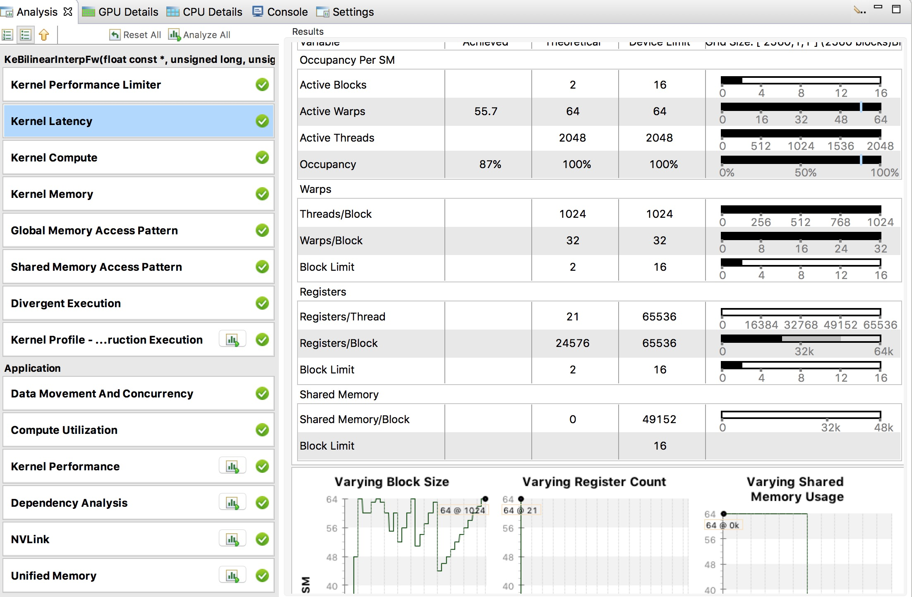
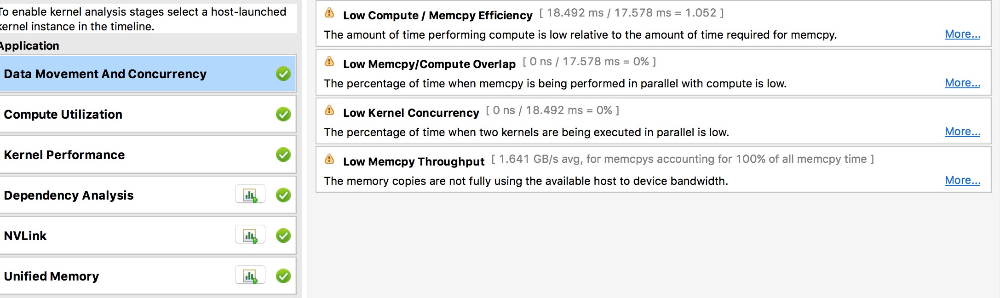

============
GPU性能调优
============

..  contents::

此教程将向您分步介绍如何使用内置的定时工具、 **nvprof** 或 **nvvp** 来运行性能分析和调优。

- 什么是性能分析？
- 为什么需要性能分析？
- 如何进行性能分析？
- 性能分析工具介绍
- 详细教程
- 性能分析小技巧

什么是性能分析？
================
在软件工程的范畴里，性能分析（Profiling）是一个动态程序分析的术语，它可以指测量一个程序的空间（内存）复杂度或时间复杂度，
也可以说是某些特定指令的使用情况，或者是函数调用的频率和耗时等。通常情况下，分析得到的信息用于协助进行程序的优化。

简单来说，性能分析工具是用于给应用程序的性能做定量分析的。如果想很好的理解程序的行为，那程序分析工具是必不可少的利器。简单的性能分析，可以告诉您某个操作到底花了多长时间？而更深入的分析，甚至能解释为什么某个操作花了很长时间？

为什么需要性能分析？
============================
训练好一个深层神经网络通常要耗费非常长的时间，所以性能也就逐步变成了深度学习领域最重要的指标。
而优化性能的首要任务，是需要了解哪些步骤拖慢了整体。
如果某一块根本就不怎么耗时，那也就不需要急着优化性能啦！

如何进行性能分析？
========================
为了达到性能最优，您可以采用下面五个步骤：

- 对代码进行性能分析
- 找到运行慢的部分
- 找到运行慢的原因
- 修改成更快的版本
- 再次对代码进行性能分析

Usually, processor has two key performance limits include float point throughput and
memory throughput. For GPU,  it also need more parallelism to fulfill its potential.
This is why they can be so fast.

通常情况下，处理器有两个关键性能限制：一个是浮点计算量，另一个是内存操作量。
GPU则还需要高并行性，才能发挥其全部能力。这正是它们速度快的原因。

性能分析工具介绍
======================
就通常的GPU性能分析来说，市面上已经有NVIDIA或第三方提供的众多工具。

**nvprof** 是Nvidia性能分析工具， **nvvp** 则是带GUI的Nvidia可视化性能分析工具。
在这个教程中，我们主要会介绍nvprof和nvvp。

:code:`test_GpuProfiler` from :code:`paddle/legacy/math/tests` directory will be used to evaluate
above profilers.

:code:`paddle/legacy/math/test` 目录中的 :code:`test_GpuProfiler` 就是用于展示上述分析工具的用法。

.. literalinclude:: ../../../../paddle/legacy/math/tests/test_GpuProfiler.cpp
   :language: c++
   :lines: 137-151
   :linenos:

上述的代码片段包含了两种方法，您可以任意使用一个或两个来对感兴趣的代码段做性能分析。

1. :code:`REGISTER_TIMER_INFO` 是一个内置的定时器封装，可以用来计算CPU函数或cuda内核的时间消耗。

2. :code:`REGISTER_GPU_PROFILER` is a general purpose wrapper object of :code:`cudaProfilerStart` and :code:`cudaProfilerStop` to avoid
program crashes when CPU version of PaddlePaddle invokes them.

3. :code:`REGISTER_GPU_PROFILER` 是一个封装对象，封装了 :code:`cudaProfilerStart` 和 :code:`cudaProfileStop` 两个操作；同时其内部实现可以避免纯CPU版本PaddlePaddle在执行本语句时发生崩溃。

您会在接下来的部分中获得更多的细节介绍。

详细教程
============

内置定时器
------------

如果想要启用PaddlePaddle的内置定时器，您首先需要在相关代码段中加入 :code:`REGISTER_TIMER_INFO`。
接下来就可以使用 :code:`printStatus` 或者 :code:`printAllStatus` 函数来将信息输出到界面中。
下面举个简单的例子：

1. 加入 :code:`REGISTER_TIMER_INFO` 和 :code:`printAllStatus` 函数（如高亮部分）。

    .. literalinclude:: ../../../../paddle/legacy/math/tests/test_GpuProfiler.cpp
        :language: c++
        :lines: 137-151
        :emphasize-lines: 8-12,14
        :linenos:

2. cmake配置中将 **WITH_TIMER** 打开，重新编译PaddlePaddle。

    .. code-block:: bash

        cmake .. -DWITH_TIMER=ON
        make

3. 执行您的代码，并观察结果(如高亮部分）。

    .. code-block:: bash
        :emphasize-lines: 1,12-15

        > ./paddle/legacy/math/tests/test_GpuProfiler
        I1117 11:13:42.313065 2522362816 Util.cpp:155] commandline: ./paddle/legacy/math/tests/test_GpuProfiler
        I1117 11:13:42.845065 2522362816 Util.cpp:130] Calling runInitFunctions
        I1117 11:13:42.845208 2522362816 Util.cpp:143] Call runInitFunctions done.
        [==========] Running 1 test from 1 test case.
        [----------] Global test environment set-up.
        [----------] 1 test from Profiler
        [ RUN      ] Profiler.BilinearFwdBwd
        I1117 11:13:42.845310 2522362816 test_GpuProfiler.cpp:114] Enable GPU Profiler Stat: [testBilinearFwdBwd] "numSamples = 10, channels = 16, im
        gSizeX = 64, imgSizeY = 64"
        I1117 11:13:42.850154 2522362816 ThreadLocal.cpp:37] thread use undeterministic rand seed:20659751
        I1117 11:13:42.981501 2522362816 Stat.cpp:130] ======= StatSet: [GlobalStatInfo] status ======
        I1117 11:13:42.981539 2522362816 Stat.cpp:133] Stat=testBilinearFwdBwd     total=136.141    avg=136.141    max=136.141    min=136.141   count=1
        I1117 11:13:42.981572 2522362816 Stat.cpp:141] ======= BarrierStatSet status ======
        I1117 11:13:42.981575 2522362816 Stat.cpp:154] --------------------------------------------------
        [       OK ] Profiler.BilinearFwdBwd (136 ms)
        [----------] 1 test from Profiler (136 ms total)

        [----------] Global test environment tear-down
        [==========] 1 test from 1 test case ran. (136 ms total)
        [  PASSED  ] 1 test.

nvprof 工具
----------------

要使用命令行分析工具 **nvprof**，您按如下步骤操作即可：

1. 将 :code:`REGISTER_GPU_PROFILER` 函数加到代码中（参考强调部分）。

    .. literalinclude:: ../../../../paddle/legacy/math/tests/test_GpuProfiler.cpp
        :language: c++
        :lines: 137-151
        :emphasize-lines: 6-7
        :linenos:

2. cmake中将 **WITH_PROFILER** 配置打开，重新编译PaddlePaddle。

    .. code-block:: bash

        cmake .. -DWITH_PROFILER=ON
        make

3. 使用 **nvprof** 来分析执行文件。

    .. code-block:: bash

        nvprof  ./paddle/legacy/math/tests/test_GpuProfiler

然后，您就能获得如下的分析结果：

.. code-block:: bash

    ==78544== Profiling application: ./paddle/legacy/math/tests/test_GpuProfiler
    ==78544== Profiling result:
    Time(%)     Time     Calls       Avg       Min       Max  Name
    27.60%  9.6305ms         5  1.9261ms  3.4560us  6.4035ms  [CUDA memcpy HtoD]
    26.07%  9.0957ms         1  9.0957ms  9.0957ms  9.0957ms  KeBilinearInterpBw
    23.78%  8.2977ms         1  8.2977ms  8.2977ms  8.2977ms  KeBilinearInterpFw
    22.55%  7.8661ms         2  3.9330ms  1.5798ms  6.2863ms  [CUDA memcpy DtoH]

    ==78544== API calls:
    Time(%)     Time     Calls       Avg       Min       Max  Name
    46.85%  682.28ms         8  85.285ms  12.639us  682.03ms  cudaStreamCreateWithFlags
    39.83%  580.00ms         4  145.00ms     302ns  550.27ms  cudaFree
    9.82%   143.03ms         9  15.892ms  8.7090us  142.78ms  cudaStreamCreate
    1.23%   17.983ms         7  2.5690ms  23.210us  6.4563ms  cudaMemcpy
    1.23%   17.849ms         2  8.9247ms  8.4726ms  9.3768ms  cudaStreamSynchronize
    0.66%   9.5969ms         7  1.3710ms  288.43us  2.4279ms  cudaHostAlloc
    0.13%   1.9530ms        11  177.54us  7.6810us  591.06us  cudaMalloc
    0.07%   1.0424ms         8  130.30us  1.6970us  453.72us  cudaGetDevice
    0.04%   527.90us        40  13.197us     525ns  253.99us  cudaEventCreateWithFlags
    0.03%   435.73us       348  1.2520us     124ns  42.704us  cuDeviceGetAttribute
    0.03%   419.36us         1  419.36us  419.36us  419.36us  cudaGetDeviceCount
    0.02%   260.75us         2  130.38us  129.32us  131.43us  cudaGetDeviceProperties
    0.02%   222.32us         2  111.16us  106.94us  115.39us  cudaLaunch
    0.01%   214.06us         4  53.514us  28.586us  77.655us  cuDeviceGetName
    0.01%   115.45us         4  28.861us  9.8250us  44.526us  cuDeviceTotalMem
    0.01%   83.988us         4  20.997us     578ns  77.760us  cudaSetDevice
    0.00%   38.918us         1  38.918us  38.918us  38.918us  cudaEventCreate
    0.00%   34.573us        31  1.1150us     279ns  12.784us  cudaDeviceGetAttribute
    0.00%   17.767us         1  17.767us  17.767us  17.767us  cudaProfilerStart
    0.00%   15.228us         2  7.6140us  3.5460us  11.682us  cudaConfigureCall
    0.00%   14.536us         2  7.2680us  1.1490us  13.387us  cudaGetLastError
    0.00%   8.6080us        26     331ns     173ns     783ns  cudaSetupArgument
    0.00%   5.5470us         6     924ns     215ns  2.6780us  cuDeviceGet
    0.00%   5.4090us         6     901ns     328ns  3.3320us  cuDeviceGetCount
    0.00%   4.1770us         3  1.3920us  1.0630us  1.8300us  cuDriverGetVersion
    0.00%   3.4650us         3  1.1550us  1.0810us  1.2680us  cuInit
    0.00%      830ns         1     830ns     830ns     830ns  cudaRuntimeGetVersion

nvvp 工具
--------------

如果想使用可视化的分析器 **nvvp**，您可以导入 :code:`nvprof -o ...` 的输出，或者从工具的界面里运行您的应用。

**备注: nvvp 也支持CPU的性能分析** (需在nvvp界面中选上才能开启）

..  image:: nvvp1.png
    :align: center
    :scale: 33%

从内核函数的角度， **nvvp** 可以精确说明一个长耗时操作的具体原因。
同时，如下图所示， **nvvp** 的内核block使用情况、寄存器使用情况和共享内存使用情况能让我们对GPU的整体使用有更好的理解。

而从应用的角度， **nvvp** 可以帮您提供一些定位性能瓶颈的建议。
例如，下图中就展示了一些关于内存数据迁徙和计算资源利用率的建议，为您做性能调优提供了方向。

..  image:: nvvp4.png
    :align: center
    :scale: 33%

性能分析小技巧
==================

- 开始阶段，从 **nvprof** 和 **nvvp** 的输出信息入手是个不错的选择。
- 接下来可以考虑下时间线的分析。
- 如果真想挖掘内核深处的某个秘密，您最好先确认：这一块的耗时比例真的太高，值得深入分析。
- 可能的情况下，试着让输出的分析数据和理论值对应。

    1) 例如，如果我知道内核花了10ms来移动1GB数据，那我会期望分析工具统计到速度是100GB/s。
    2) 若有不一致之处，很有可能实际应用就是没有按照您的预期情况运行。
- 了解您的硬件：如果您的GPU理论可以达到6 TFLOPs（6万亿次浮点运算每秒），而当前已经有5.5 TFLOPs了，那估计这里的潜力就没啥好挖的了……

性能分析是性能优化的关键一步。有的时候简简单单的改变就能在性能上产生明显的优化效果！
当然，具体情况因人而异。

参考资料
===========
Jeremy Appleyard, `GPU Profiling for Deep Learning <http://www.robots.ox.ac.uk/~seminars/seminars/Extra/2015_10_08_JeremyAppleyard.pdf>`_, 2015
