# 图像分类

本教程源代码目录在[book/image_classification](https://github.com/PaddlePaddle/book/tree/develop/03.image_classification)， 初次使用请参考PaddlePaddle[安装教程](https://github.com/PaddlePaddle/book/blob/develop/README.cn.md#运行这本书)，更多内容请参考本教程的[视频课堂](http://bit.baidu.com/course/detail/id/168.html)。

## 背景介绍

图像相比文字能够提供更加生动、容易理解及更具艺术感的信息，是人们转递与交换信息的重要来源。在本教程中，我们专注于图像识别领域的一个重要问题，即图像分类。

图像分类是根据图像的语义信息将不同类别图像区分开来，是计算机视觉中重要的基本问题，也是图像检测、图像分割、物体跟踪、行为分析等其他高层视觉任务的基础。图像分类在很多领域有广泛应用，包括安防领域的人脸识别和智能视频分析等，交通领域的交通场景识别，互联网领域基于内容的图像检索和相册自动归类，医学领域的图像识别等。


一般来说，图像分类通过手工特征或特征学习方法对整个图像进行全部描述，然后使用分类器判别物体类别，因此如何提取图像的特征至关重要。在深度学习算法之前使用较多的是基于词袋(Bag of Words)模型的物体分类方法。词袋方法从自然语言处理中引入，即一句话可以用一个装了词的袋子表示其特征，袋子中的词为句子中的单词、短语或字。对于图像而言，词袋方法需要构建字典。最简单的词袋模型框架可以设计为**底层特征抽取**、**特征编码**、**分类器设计**三个过程。

而基于深度学习的图像分类方法，可以通过有监督或无监督的方式**学习**层次化的特征描述，从而取代了手工设计或选择图像特征的工作。深度学习模型中的卷积神经网络(Convolution Neural Network, CNN)近年来在图像领域取得了惊人的成绩，CNN直接利用图像像素信息作为输入，最大程度上保留了输入图像的所有信息，通过卷积操作进行特征的提取和高层抽象，模型输出直接是图像识别的结果。这种基于"输入-输出"直接端到端的学习方法取得了非常好的效果，得到了广泛的应用。

本教程主要介绍图像分类的深度学习模型，以及如何使用PaddlePaddle训练CNN模型。

## 效果展示

图像分类包括通用图像分类、细粒度图像分类等。图1展示了通用图像分类效果，即模型可以正确识别图像上的主要物体。

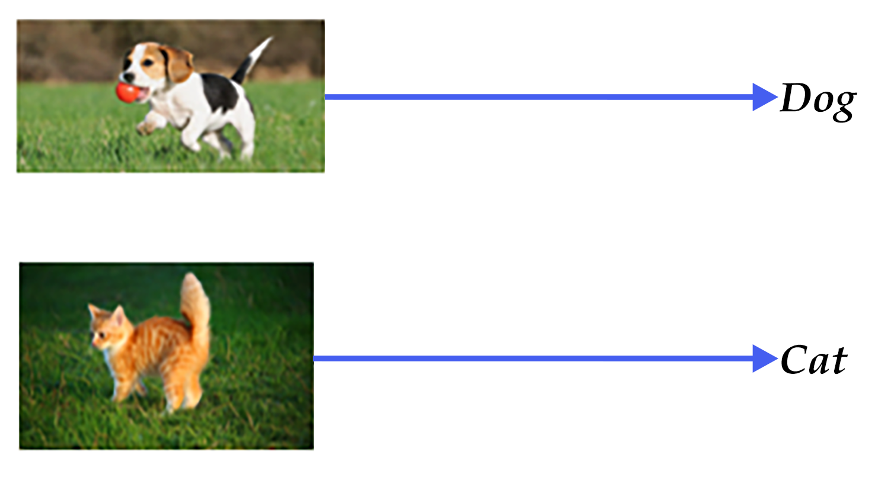
<p align="center">
图1. 通用图像分类展示
</p>


图2展示了细粒度图像分类-花卉识别的效果，要求模型可以正确识别花的类别。

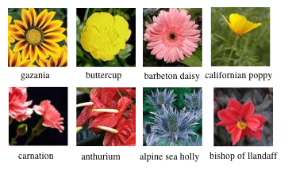
<p align="center">
图2. 细粒度图像分类展示
</p>


一个好的模型既要对不同类别识别正确，同时也应该能够对不同视角、光照、背景、变形或部分遮挡的图像正确识别(这里我们统一称作图像扰动)。图3展示了一些图像的扰动，较好的模型会像聪明的人类一样能够正确识别。


<p align="center">
图3. 扰动图片展示[22]
</p>

## 模型概览

图像识别领域大量的研究成果都是建立在[PASCAL VOC](http://host.robots.ox.ac.uk/pascal/VOC/)、[ImageNet](http://image-net.org/)等公开的数据集上，很多图像识别算法通常在这些数据集上进行测试和比较。PASCAL VOC是2005年发起的一个视觉挑战赛，ImageNet是2010年发起的大规模视觉识别竞赛(ILSVRC)的数据集，在本章中我们基于这些竞赛的一些论文介绍图像分类模型。

在2012年之前的传统图像分类方法可以用背景描述中提到的三步完成，但通常完整建立图像识别模型一般包括底层特征学习、特征编码、空间约束、分类器设计、模型融合等几个阶段。
1). **底层特征提取**: 通常从图像中按照固定步长、尺度提取大量局部特征描述。常用的局部特征包括SIFT(Scale-Invariant Feature Transform, 尺度不变特征转换) \[[1](#参考文献)\]、HOG(Histogram of Oriented Gradient, 方向梯度直方图) \[[2](#参考文献)\]、LBP(Local Bianray Pattern, 局部二值模式) \[[3](#参考文献)\] 等，一般也采用多种特征描述子，防止丢失过多的有用信息。
2). **特征编码**: 底层特征中包含了大量冗余与噪声，为了提高特征表达的鲁棒性，需要使用一种特征变换算法对底层特征进行编码，称作特征编码。常用的特征编码包括向量量化编码 \[[4](#参考文献)\]、稀疏编码 \[[5](#参考文献)\]、局部线性约束编码 \[[6](#参考文献)\]、Fisher向量编码 \[[7](#参考文献)\] 等。
3). **空间特征约束**: 特征编码之后一般会经过空间特征约束，也称作**特征汇聚**。特征汇聚是指在一个空间范围内，对每一维特征取最大值或者平均值，可以获得一定特征不变形的特征表达。金字塔特征匹配是一种常用的特征聚会方法，这种方法提出将图像均匀分块，在分块内做特征汇聚。
4). **通过分类器分类**: 经过前面步骤之后一张图像可以用一个固定维度的向量进行描述，接下来就是经过分类器对图像进行分类。通常使用的分类器包括SVM(Support Vector Machine, 支持向量机)、随机森林等。而使用核方法的SVM是最为广泛的分类器，在传统图像分类任务上性能很好。

这种方法在PASCAL VOC竞赛中的图像分类算法中被广泛使用 \[[18](#参考文献)\]。[NEC实验室](http://www.nec-labs.com/)在ILSVRC2010中采用SIFT和LBP特征，两个非线性编码器以及SVM分类器获得图像分类的冠军 \[[8](#参考文献)\]。

Alex Krizhevsky在2012年ILSVRC提出的CNN模型 \[[9](#参考文献)\] 取得了历史性的突破，效果大幅度超越传统方法，获得了ILSVRC2012冠军，该模型被称作AlexNet。这也是首次将深度学习用于大规模图像分类中。从AlexNet之后，涌现了一系列CNN模型，不断地在ImageNet上刷新成绩，如图4展示。随着模型变得越来越深以及精妙的结构设计，Top-5的错误率也越来越低，降到了3.5%附近。而在同样的ImageNet数据集上，人眼的辨识错误率大概在5.1%，也就是目前的深度学习模型的识别能力已经超过了人眼。

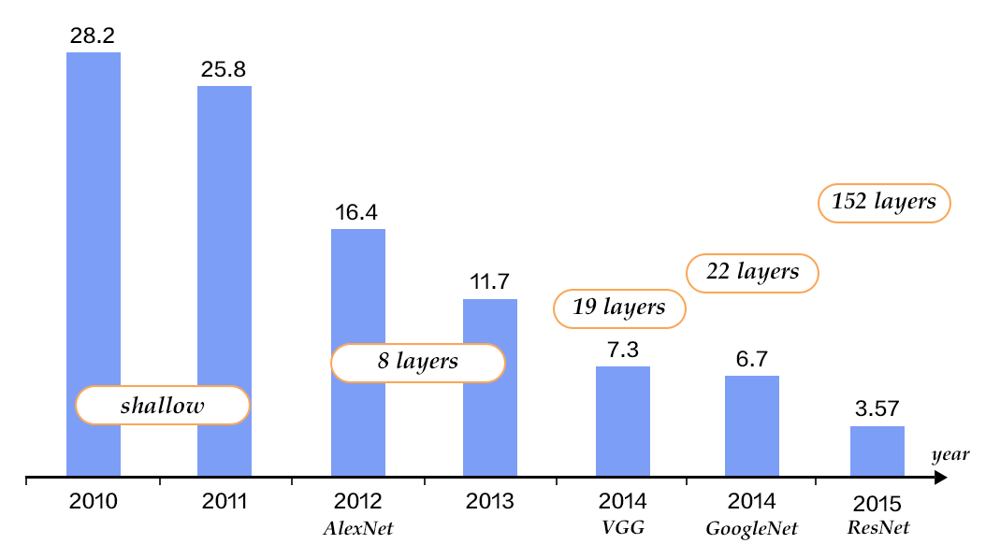
<p align="center">
图4. ILSVRC图像分类Top-5错误率
</p>

### CNN

传统CNN包含卷积层、全连接层等组件，并采用softmax多类别分类器和多类交叉熵损失函数，一个典型的卷积神经网络如图5所示，我们先介绍用来构造CNN的常见组件。

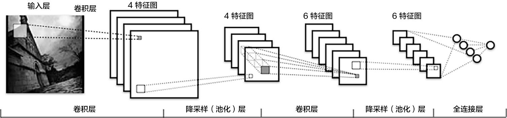
<p align="center">
图5. CNN网络示例[20]
</p>

- 卷积层(convolution layer): 执行卷积操作提取底层到高层的特征，发掘出图片局部关联性质和空间不变性质。
- 池化层(pooling layer): 执行降采样操作。通过取卷积输出特征图中局部区块的最大值(max-pooling)或者均值(avg-pooling)。降采样也是图像处理中常见的一种操作，可以过滤掉一些不重要的高频信息。
- 全连接层(fully-connected layer，或者fc layer): 输入层到隐藏层的神经元是全部连接的。
- 非线性变化: 卷积层、全连接层后面一般都会接非线性变化层，例如Sigmoid、Tanh、ReLu等来增强网络的表达能力，在CNN里最常使用的为ReLu激活函数。
- Dropout \[[10](#参考文献)\] : 在模型训练阶段随机让一些隐层节点权重不工作，提高网络的泛化能力，一定程度上防止过拟合。

另外，在训练过程中由于每层参数不断更新，会导致下一次输入分布发生变化，这样导致训练过程需要精心设计超参数。如2015年Sergey Ioffe和Christian Szegedy提出了Batch Normalization (BN)算法 \[[14](#参考文献)\] 中，每个batch对网络中的每一层特征都做归一化，使得每层分布相对稳定。BN算法不仅起到一定的正则作用，而且弱化了一些超参数的设计。经过实验证明，BN算法加速了模型收敛过程，在后来较深的模型中被广泛使用。

接下来我们主要介绍VGG，GoogleNet和ResNet网络结构。

### VGG

牛津大学VGG(Visual Geometry Group)组在2014年ILSVRC提出的模型被称作VGG模型 \[[11](#参考文献)\] 。该模型相比以往模型进一步加宽和加深了网络结构，它的核心是五组卷积操作，每两组之间做Max-Pooling空间降维。同一组内采用多次连续的3X3卷积，卷积核的数目由较浅组的64增多到最深组的512，同一组内的卷积核数目是一样的。卷积之后接两层全连接层，之后是分类层。由于每组内卷积层的不同，有11、13、16、19层这几种模型，下图展示一个16层的网络结构。VGG模型结构相对简洁，提出之后也有很多文章基于此模型进行研究，如在ImageNet上首次公开超过人眼识别的模型\[[19](#参考文献)\]就是借鉴VGG模型的结构。

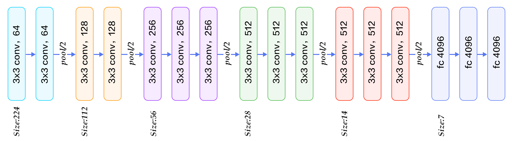
<p align="center">
图6. 基于ImageNet的VGG16模型
</p>

### GoogleNet

GoogleNet \[[12](#参考文献)\] 在2014年ILSVRC的获得了冠军，在介绍该模型之前我们先来了解NIN(Network in Network)模型 \[[13](#参考文献)\] 和Inception模块，因为GoogleNet模型由多组Inception模块组成，模型设计借鉴了NIN的一些思想。

NIN模型主要有两个特点：1) 引入了多层感知卷积网络(Multi-Layer Perceptron Convolution, MLPconv)代替一层线性卷积网络。MLPconv是一个微小的多层卷积网络，即在线性卷积后面增加若干层1x1的卷积，这样可以提取出高度非线性特征。2) 传统的CNN最后几层一般都是全连接层，参数较多。而NIN模型设计最后一层卷积层包含类别维度大小的特征图，然后采用全局均值池化(Avg-Pooling)替代全连接层，得到类别维度大小的向量，再进行分类。这种替代全连接层的方式有利于减少参数。

Inception模块如下图7所示，图(a)是最简单的设计，输出是3个卷积层和一个池化层的特征拼接。这种设计的缺点是池化层不会改变特征通道数，拼接后会导致特征的通道数较大，经过几层这样的模块堆积后，通道数会越来越大，导致参数和计算量也随之增大。为了改善这个缺点，图(b)引入3个1x1卷积层进行降维，所谓的降维就是减少通道数，同时如NIN模型中提到的1x1卷积也可以修正线性特征。

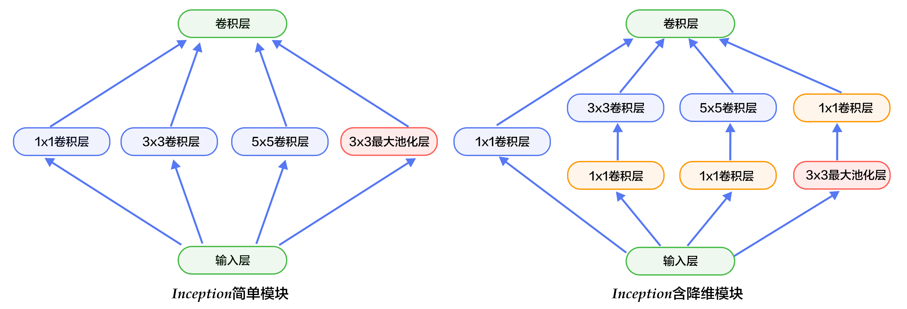
<p align="center">
图7. Inception模块
</p>

GoogleNet由多组Inception模块堆积而成。另外，在网络最后也没有采用传统的多层全连接层，而是像NIN网络一样采用了均值池化层；但与NIN不同的是，池化层后面接了一层到类别数映射的全连接层。除了这两个特点之外，由于网络中间层特征也很有判别性，GoogleNet在中间层添加了两个辅助分类器，在后向传播中增强梯度并且增强正则化，而整个网络的损失函数是这个三个分类器的损失加权求和。

GoogleNet整体网络结构如图8所示，总共22层网络：开始由3层普通的卷积组成；接下来由三组子网络组成，第一组子网络包含2个Inception模块，第二组包含5个Inception模块，第三组包含2个Inception模块；然后接均值池化层、全连接层。

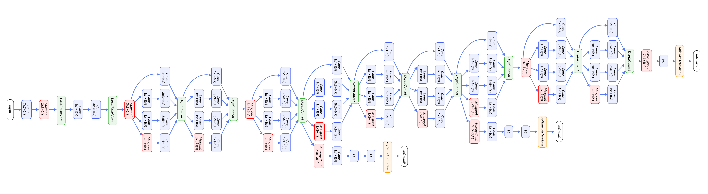
<p align="center">
图8. GoogleNet[12]
</p>


上面介绍的是GoogleNet第一版模型(称作GoogleNet-v1)。GoogleNet-v2 \[[14](#参考文献)\] 引入BN层；GoogleNet-v3 \[[16](#参考文献)\] 对一些卷积层做了分解，进一步提高网络非线性能力和加深网络；GoogleNet-v4 \[[17](#参考文献)\] 引入下面要讲的ResNet设计思路。从v1到v4每一版的改进都会带来准确度的提升，介于篇幅，这里不再详细介绍v2到v4的结构。


### ResNet

ResNet(Residual Network) \[[15](#参考文献)\] 是2015年ImageNet图像分类、图像物体定位和图像物体检测比赛的冠军。针对训练卷积神经网络时加深网络导致准确度下降的问题，ResNet提出了采用残差学习。在已有设计思路(BN, 小卷积核，全卷积网络)的基础上，引入了残差模块。每个残差模块包含两条路径，其中一条路径是输入特征的直连通路，另一条路径对该特征做两到三次卷积操作得到该特征的残差，最后再将两条路径上的特征相加。

残差模块如图9所示，左边是基本模块连接方式，由两个输出通道数相同的3x3卷积组成。右边是瓶颈模块(Bottleneck)连接方式，之所以称为瓶颈，是因为上面的1x1卷积用来降维(图示例即256->64)，下面的1x1卷积用来升维(图示例即64->256)，这样中间3x3卷积的输入和输出通道数都较小(图示例即64->64)。

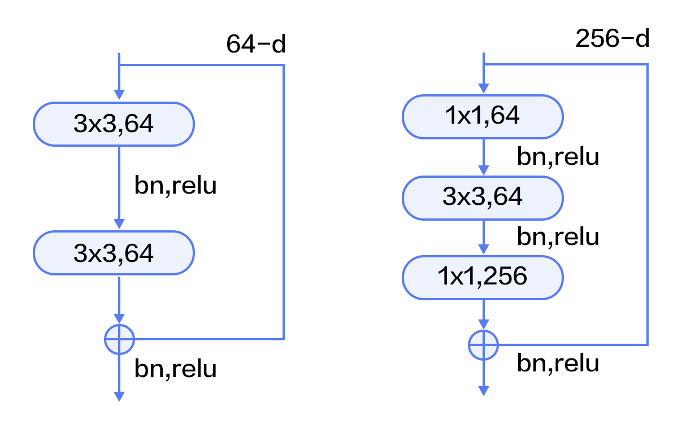
<p align="center">
图9. 残差模块
</p>

图10展示了50、101、152层网络连接示意图，使用的是瓶颈模块。这三个模型的区别在于每组中残差模块的重复次数不同(见图右上角)。ResNet训练收敛较快，成功的训练了上百乃至近千层的卷积神经网络。

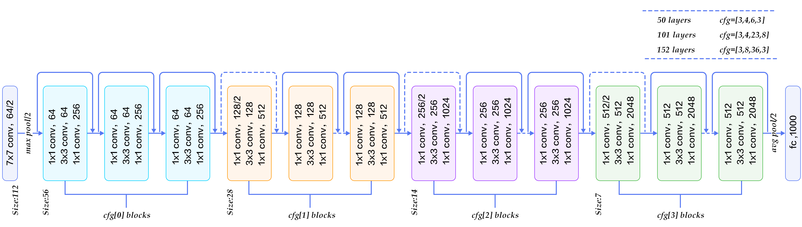
<p align="center">
图10. 基于ImageNet的ResNet模型
</p>


## 数据准备

通用图像分类公开的标准数据集常用的有[CIFAR](https://www.cs.toronto.edu/~kriz/cifar.html)、[ImageNet](http://image-net.org/)、[COCO](http://mscoco.org/)等，常用的细粒度图像分类数据集包括[CUB-200-2011](http://www.vision.caltech.edu/visipedia/CUB-200-2011.html)、[Stanford Dog](http://vision.stanford.edu/aditya86/ImageNetDogs/)、[Oxford-flowers](http://www.robots.ox.ac.uk/~vgg/data/flowers/)等。其中ImageNet数据集规模相对较大，如[模型概览](#模型概览)一章所讲，大量研究成果基于ImageNet。ImageNet数据从2010年来稍有变化，常用的是ImageNet-2012数据集，该数据集包含1000个类别：训练集包含1,281,167张图片，每个类别数据732至1300张不等，验证集包含50,000张图片，平均每个类别50张图片。

由于ImageNet数据集较大，下载和训练较慢，为了方便大家学习，我们使用[CIFAR10](<https://www.cs.toronto.edu/~kriz/cifar.html>)数据集。CIFAR10数据集包含60,000张32x32的彩色图片，10个类别，每个类包含6,000张。其中50,000张图片作为训练集，10000张作为测试集。图11从每个类别中随机抽取了10张图片，展示了所有的类别。


<p align="center">
图11. CIFAR10数据集[21]
</p>

Paddle API提供了自动加载cifar数据集模块 `paddle.dataset.cifar`。

通过输入`python train.py`，就可以开始训练模型了，以下小节将详细介绍`train.py`的相关内容。

### 模型结构

#### Paddle 初始化

让我们从导入 Paddle Fluid API 和辅助模块开始。

```python
import paddle
import paddle.fluid as fluid
import numpy
import sys
```

本教程中我们提供了VGG和ResNet两个模型的配置。

#### VGG

首先介绍VGG模型结构，由于CIFAR10图片大小和数量相比ImageNet数据小很多，因此这里的模型针对CIFAR10数据做了一定的适配。卷积部分引入了BN和Dropout操作。
VGG核心模块的输入是数据层，`vgg_bn_drop` 定义了16层VGG结构，每层卷积后面引入BN层和Dropout层，详细的定义如下：

```python
def vgg_bn_drop(input):
def conv_block(ipt, num_filter, groups, dropouts):
return fluid.nets.img_conv_group(
input=ipt,
pool_size=2,
pool_stride=2,
conv_num_filter=[num_filter] * groups,
conv_filter_size=3,
conv_act='relu',
conv_with_batchnorm=True,
conv_batchnorm_drop_rate=dropouts,
pool_type='max')

conv1 = conv_block(input, 64, 2, [0.3, 0])
conv2 = conv_block(conv1, 128, 2, [0.4, 0])
conv3 = conv_block(conv2, 256, 3, [0.4, 0.4, 0])
conv4 = conv_block(conv3, 512, 3, [0.4, 0.4, 0])
conv5 = conv_block(conv4, 512, 3, [0.4, 0.4, 0])

drop = fluid.layers.dropout(x=conv5, dropout_prob=0.5)
fc1 = fluid.layers.fc(input=drop, size=512, act=None)
bn = fluid.layers.batch_norm(input=fc1, act='relu')
drop2 = fluid.layers.dropout(x=bn, dropout_prob=0.5)
fc2 = fluid.layers.fc(input=drop2, size=512, act=None)
predict = fluid.layers.fc(input=fc2, size=10, act='softmax')
return predict
```

1. 首先定义了一组卷积网络，即conv_block。卷积核大小为3x3，池化窗口大小为2x2，窗口滑动大小为2，groups决定每组VGG模块是几次连续的卷积操作，dropouts指定Dropout操作的概率。所使用的`img_conv_group`是在`paddle.networks`中预定义的模块，由若干组 Conv->BN->ReLu->Dropout 和 一组 Pooling 组成。

2. 五组卷积操作，即 5个conv_block。 第一、二组采用两次连续的卷积操作。第三、四、五组采用三次连续的卷积操作。每组最后一个卷积后面Dropout概率为0，即不使用Dropout操作。

3. 最后接两层512维的全连接。

4. 通过上面VGG网络提取高层特征，然后经过全连接层映射到类别维度大小的向量，再通过Softmax归一化得到每个类别的概率，也可称作分类器。

### ResNet

ResNet模型的第1、3、4步和VGG模型相同，这里不再介绍。主要介绍第2步即CIFAR10数据集上ResNet核心模块。

先介绍`resnet_cifar10`中的一些基本函数，再介绍网络连接过程。

- `conv_bn_layer` : 带BN的卷积层。
- `shortcut` : 残差模块的"直连"路径，"直连"实际分两种形式：残差模块输入和输出特征通道数不等时，采用1x1卷积的升维操作；残差模块输入和输出通道相等时，采用直连操作。
- `basicblock` : 一个基础残差模块，即图9左边所示，由两组3x3卷积组成的路径和一条"直连"路径组成。
- `bottleneck` : 一个瓶颈残差模块，即图9右边所示，由上下1x1卷积和中间3x3卷积组成的路径和一条"直连"路径组成。
- `layer_warp` : 一组残差模块，由若干个残差模块堆积而成。每组中第一个残差模块滑动窗口大小与其他可以不同，以用来减少特征图在垂直和水平方向的大小。

```python
def conv_bn_layer(input,
ch_out,
filter_size,
stride,
padding,
act='relu',
bias_attr=False):
tmp = fluid.layers.conv2d(
input=input,
filter_size=filter_size,
num_filters=ch_out,
stride=stride,
padding=padding,
act=None,
bias_attr=bias_attr)
return fluid.layers.batch_norm(input=tmp, act=act)


def shortcut(input, ch_in, ch_out, stride):
if ch_in != ch_out:
return conv_bn_layer(input, ch_out, 1, stride, 0, None)
else:
return input


def basicblock(input, ch_in, ch_out, stride):
tmp = conv_bn_layer(input, ch_out, 3, stride, 1)
tmp = conv_bn_layer(tmp, ch_out, 3, 1, 1, act=None, bias_attr=True)
short = shortcut(input, ch_in, ch_out, stride)
return fluid.layers.elementwise_add(x=tmp, y=short, act='relu')


def layer_warp(block_func, input, ch_in, ch_out, count, stride):
tmp = block_func(input, ch_in, ch_out, stride)
for i in range(1, count):
tmp = block_func(tmp, ch_out, ch_out, 1)
return tmp
```

`resnet_cifar10` 的连接结构主要有以下几个过程。

1. 底层输入连接一层 `conv_bn_layer`，即带BN的卷积层。
2. 然后连接3组残差模块即下面配置3组 `layer_warp` ，每组采用图 10 左边残差模块组成。
3. 最后对网络做均值池化并返回该层。

注意：除过第一层卷积层和最后一层全连接层之外，要求三组 `layer_warp` 总的含参层数能够被6整除，即 `resnet_cifar10` 的 depth 要满足 `$(depth - 2) % 6 == 0$` 。

```python
def resnet_cifar10(ipt, depth=32):
# depth should be one of 20, 32, 44, 56, 110, 1202
assert (depth - 2) % 6 == 0
n = (depth - 2) / 6
nStages = {16, 64, 128}
conv1 = conv_bn_layer(ipt, ch_out=16, filter_size=3, stride=1, padding=1)
res1 = layer_warp(basicblock, conv1, 16, 16, n, 1)
res2 = layer_warp(basicblock, res1, 16, 32, n, 2)
res3 = layer_warp(basicblock, res2, 32, 64, n, 2)
pool = fluid.layers.pool2d(
input=res3, pool_size=8, pool_type='avg', pool_stride=1)
predict = fluid.layers.fc(input=pool, size=10, act='softmax')
return predict
```

## Infererence Program 配置

网络输入定义为 `data_layer` (数据层)，在图像分类中即为图像像素信息。CIFRAR10是RGB 3通道32x32大小的彩色图，因此输入数据大小为3072(3x32x32)。

```python
def inference_program():
# The image is 32 * 32 with RGB representation.
data_shape = [3, 32, 32]
images = fluid.layers.data(name='pixel', shape=data_shape, dtype='float32')

predict = resnet_cifar10(images, 32)
# predict = vgg_bn_drop(images) # un-comment to use vgg net
return predict
```

## Train Program 配置

然后我们需要设置训练程序 `train_program`。它首先从推理程序中进行预测。
在训练期间，它将从预测中计算 `avg_cost`。
在有监督训练中需要输入图像对应的类别信息，同样通过`fluid.layers.data`来定义。训练中采用多类交叉熵作为损失函数，并作为网络的输出，预测阶段定义网络的输出为分类器得到的概率信息。

**注意:** 训练程序应该返回一个数组，第一个返回参数必须是 `avg_cost`。训练器使用它来计算梯度。

```python
def train_program():
predict = inference_program()

label = fluid.layers.data(name='label', shape=[1], dtype='int64')
cost = fluid.layers.cross_entropy(input=predict, label=label)
avg_cost = fluid.layers.mean(cost)
accuracy = fluid.layers.accuracy(input=predict, label=label)
return [avg_cost, accuracy]
```

## Optimizer Function 配置

在下面的 `Adam optimizer`，`learning_rate` 是训练的速度，与网络的训练收敛速度有关系。

```python
def optimizer_program():
return fluid.optimizer.Adam(learning_rate=0.001)
```

## 训练模型

### Trainer 配置

现在，我们需要配置 `Trainer`。`Trainer` 需要接受训练程序 `train_program`, `place` 和优化器 `optimizer_func`。

```python
use_cuda = False
place = fluid.CUDAPlace(0) if use_cuda else fluid.CPUPlace()
trainer = fluid.Trainer(
train_func=train_program,
optimizer_func=optimizer_program,
place=place)
```

### Data Feeders 配置

`cifar.train10()` 每次产生一条样本，在完成shuffle和batch之后，作为训练的输入。

```python
# Each batch will yield 128 images
BATCH_SIZE = 128

# Reader for training
train_reader = paddle.batch(
paddle.reader.shuffle(paddle.dataset.cifar.train10(), buf_size=50000),
batch_size=BATCH_SIZE)

# Reader for testing. A separated data set for testing.
test_reader = paddle.batch(
paddle.dataset.cifar.test10(), batch_size=BATCH_SIZE)
```

### Event Handler

可以使用`event_handler`回调函数来观察训练过程，或进行测试等, 该回调函数是`trainer.train`函数里设定。

`event_handler_plot`可以用来利用回调数据来打点画图:

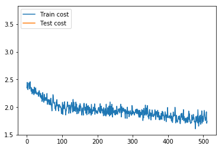

```python
params_dirname = "image_classification_resnet.inference.model"

from paddle.v2.plot import Ploter

train_title = "Train cost"
test_title = "Test cost"
cost_ploter = Ploter(train_title, test_title)

step = 0
def event_handler_plot(event):
global step
if isinstance(event, fluid.EndStepEvent):
if step % 1 == 0:
cost_ploter.append(train_title, step, event.metrics[0])
cost_ploter.plot()
step += 1
if isinstance(event, fluid.EndEpochEvent):
avg_cost, accuracy = trainer.test(
reader=test_reader,
feed_order=['pixel', 'label'])
cost_ploter.append(test_title, step, avg_cost)

# save parameters
if params_dirname is not None:
trainer.save_params(params_dirname)
```

`event_handler` 用来在训练过程中输出文本日志

```python
params_dirname = "image_classification_resnet.inference.model"

# event handler to track training and testing process
def event_handler(event):
if isinstance(event, fluid.EndStepEvent):
if event.step % 100 == 0:
print("\nPass %d, Batch %d, Cost %f, Acc %f" %
(event.step, event.epoch, event.metrics[0],
event.metrics[1]))
else:
sys.stdout.write('.')
sys.stdout.flush()

if isinstance(event, fluid.EndEpochEvent):
# Test against with the test dataset to get accuracy.
avg_cost, accuracy = trainer.test(
reader=test_reader, feed_order=['pixel', 'label'])

print('\nTest with Pass {0}, Loss {1:2.2}, Acc {2:2.2}'.format(event.epoch, avg_cost, accuracy))

# save parameters
if params_dirname is not None:
trainer.save_params(params_dirname)
```

### 训练

通过`trainer.train`函数训练:

**注意:** CPU，每个 Epoch 将花费大约15～20分钟。这部分可能需要一段时间。请随意修改代码，在GPU上运行测试，以提高培训速度。

```python
trainer.train(
reader=train_reader,
num_epochs=2,
event_handler=event_handler,
feed_order=['pixel', 'label'])
```

一轮训练log示例如下所示，经过1个pass， 训练集上平均 Accuracy 为0.59 ，测试集上平均  Accuracy 为0.6 。

```text
Pass 0, Batch 0, Cost 3.869598, Acc 0.164062
...................................................................................................
Pass 100, Batch 0, Cost 1.481038, Acc 0.460938
...................................................................................................
Pass 200, Batch 0, Cost 1.340323, Acc 0.523438
...................................................................................................
Pass 300, Batch 0, Cost 1.223424, Acc 0.593750
..........................................................................................
Test with Pass 0, Loss 1.1, Acc 0.6
```

图12是训练的分类错误率曲线图，运行到第200个pass后基本收敛，最终得到测试集上分类错误率为8.54%。

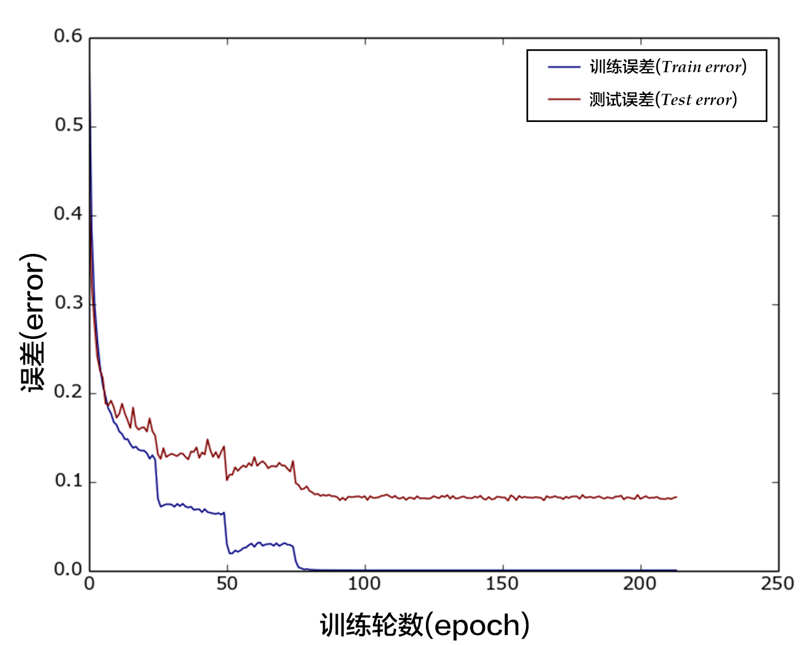
<p align="center">
图12. CIFAR10数据集上VGG模型的分类错误率
</p>

## 应用模型

可以使用训练好的模型对图片进行分类，下面程序展示了如何使用 `fluid.Inferencer` 接口进行推断，可以打开注释，更改加载的模型。

### 生成预测输入数据

`dog.png` is an example image of a dog. Turn it into an numpy array to match the data feeder format.

```python
# Prepare testing data.
from PIL import Image
import numpy as np
import os

def load_image(file):
im = Image.open(file)
im = im.resize((32, 32), Image.ANTIALIAS)

im = np.array(im).astype(np.float32)
# The storage order of the loaded image is W(width),
# H(height), C(channel). PaddlePaddle requires
# the CHW order, so transpose them.
im = im.transpose((2, 0, 1))  # CHW
im = im / 255.0

# Add one dimension to mimic the list format.
im = numpy.expand_dims(im, axis=0)
return im

cur_dir = os.getcwd()
img = load_image(cur_dir + '/image/dog.png')
```

### Inferencer 配置和预测

`Inferencer` 需要一个 `infer_func` 和 `param_path` 来设置网络和经过训练的参数。
我们可以简单地插入前面定义的推理程序。
现在我们准备做预测。

```python
inferencer = fluid.Inferencer(
infer_func=inference_program, param_path=params_dirname, place=place)

# inference
results = inferencer.infer({'pixel': img})
print("infer results: ", results)
```

## 总结

传统图像分类方法由多个阶段构成，框架较为复杂，而端到端的CNN模型结构可一步到位，而且大幅度提升了分类准确率。本文我们首先介绍VGG、GoogleNet、ResNet三个经典的模型；然后基于CIFAR10数据集，介绍如何使用PaddlePaddle配置和训练CNN模型，尤其是VGG和ResNet模型；最后介绍如何使用PaddlePaddle的API接口对图片进行预测和特征提取。对于其他数据集比如ImageNet，配置和训练流程是同样的，大家可以自行进行实验。


## 参考文献

[1] D. G. Lowe, [Distinctive image features from scale-invariant keypoints](http://www.cs.ubc.ca/~lowe/papers/ijcv04.pdf). IJCV, 60(2):91-110, 2004.

[2] N. Dalal, B. Triggs, [Histograms of Oriented Gradients for Human Detection](http://vision.stanford.edu/teaching/cs231b_spring1213/papers/CVPR05_DalalTriggs.pdf), Proc. IEEE Conf. Computer Vision and Pattern Recognition, 2005.

[3] Ahonen, T., Hadid, A., and Pietikinen, M. (2006). [Face description with local binary patterns: Application to face recognition](http://ieeexplore.ieee.org/document/1717463/). PAMI, 28.

[4] J. Sivic, A. Zisserman, [Video Google: A Text Retrieval Approach to Object Matching in Videos](http://www.robots.ox.ac.uk/~vgg/publications/papers/sivic03.pdf), Proc. Ninth Int'l Conf. Computer Vision, pp. 1470-1478, 2003.

[5] B. Olshausen, D. Field, [Sparse Coding with an Overcomplete Basis Set: A Strategy Employed by V1?](http://redwood.psych.cornell.edu/papers/olshausen_field_1997.pdf), Vision Research, vol. 37, pp. 3311-3325, 1997.

[6] Wang, J., Yang, J., Yu, K., Lv, F., Huang, T., and Gong, Y. (2010). [Locality-constrained Linear Coding for image classification](http://ieeexplore.ieee.org/abstract/document/5540018/). In CVPR.

[7] Perronnin, F., Sánchez, J., & Mensink, T. (2010). [Improving the fisher kernel for large-scale image classification](http://dl.acm.org/citation.cfm?id=1888101). In ECCV (4).

[8] Lin, Y., Lv, F., Cao, L., Zhu, S., Yang, M., Cour, T., Yu, K., and Huang, T. (2011). [Large-scale image clas- sification: Fast feature extraction and SVM training](http://ieeexplore.ieee.org/document/5995477/). In CVPR.

[9] Krizhevsky, A., Sutskever, I., and Hinton, G. (2012). [ImageNet classification with deep convolutional neu- ral networks](http://www.cs.toronto.edu/~kriz/imagenet_classification_with_deep_convolutional.pdf). In NIPS.

[10] G.E. Hinton, N. Srivastava, A. Krizhevsky, I. Sutskever, and R.R. Salakhutdinov. [Improving neural networks by preventing co-adaptation of feature detectors](https://arxiv.org/abs/1207.0580). arXiv preprint arXiv:1207.0580, 2012.

[11] K. Chatfield, K. Simonyan, A. Vedaldi, A. Zisserman. [Return of the Devil in the Details: Delving Deep into Convolutional Nets](https://arxiv.org/abs/1405.3531). BMVC, 2014。

[12] Szegedy, C., Liu, W., Jia, Y., Sermanet, P., Reed, S., Anguelov, D., Erhan, D., Vanhoucke, V., Rabinovich, A., [Going deeper with convolutions](https://arxiv.org/abs/1409.4842). In: CVPR. (2015)

[13] Lin, M., Chen, Q., and Yan, S. [Network in network](https://arxiv.org/abs/1312.4400). In Proc. ICLR, 2014.

[14] S. Ioffe and C. Szegedy. [Batch normalization: Accelerating deep network training by reducing internal covariate shift](https://arxiv.org/abs/1502.03167). In ICML, 2015.

[15] K. He, X. Zhang, S. Ren, J. Sun. [Deep Residual Learning for Image Recognition](https://arxiv.org/abs/1512.03385). CVPR 2016.

[16] Szegedy, C., Vanhoucke, V., Ioffe, S., Shlens, J., Wojna, Z. [Rethinking the incep-tion architecture for computer vision](https://arxiv.org/abs/1512.00567). In: CVPR. (2016).

[17] Szegedy, C., Ioffe, S., Vanhoucke, V. [Inception-v4, inception-resnet and the impact of residual connections on learning](https://arxiv.org/abs/1602.07261). arXiv:1602.07261 (2016).

[18] Everingham, M., Eslami, S. M. A., Van Gool, L., Williams, C. K. I., Winn, J. and Zisserman, A. [The Pascal Visual Object Classes Challenge: A Retrospective]((http://link.springer.com/article/10.1007/s11263-014-0733-5)). International Journal of Computer Vision, 111(1), 98-136, 2015.

[19] He, K., Zhang, X., Ren, S., and Sun, J. [Delving Deep into Rectifiers: Surpassing Human-Level Performance on ImageNet Classification](https://arxiv.org/abs/1502.01852). ArXiv e-prints, February 2015.

[20] http://deeplearning.net/tutorial/lenet.html

[21] https://www.cs.toronto.edu/~kriz/cifar.html

[22] http://cs231n.github.io/classification/

<br/>
<a rel="license" href="http://creativecommons.org/licenses/by-sa/4.0/"></a><br /><span xmlns:dct="http://purl.org/dc/terms/" href="http://purl.org/dc/dcmitype/Text" property="dct:title" rel="dct:type">本教程</span> 由 <a xmlns:cc="http://creativecommons.org/ns#" href="http://book.paddlepaddle.org" property="cc:attributionName" rel="cc:attributionURL">PaddlePaddle</a> 创作，采用 <a rel="license" href="http://creativecommons.org/licenses/by-sa/4.0/">知识共享 署名-相同方式共享 4.0 国际 许可协议</a>进行许可。
