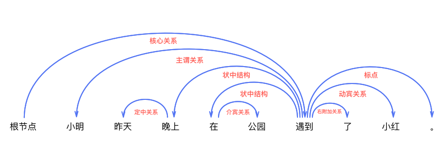
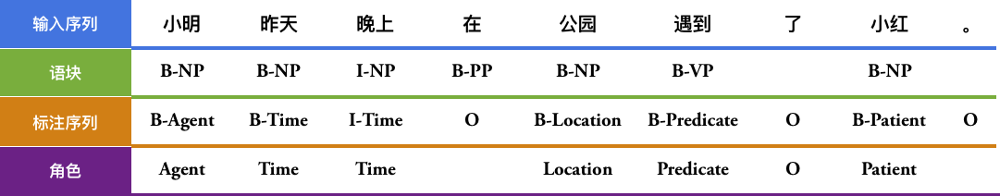
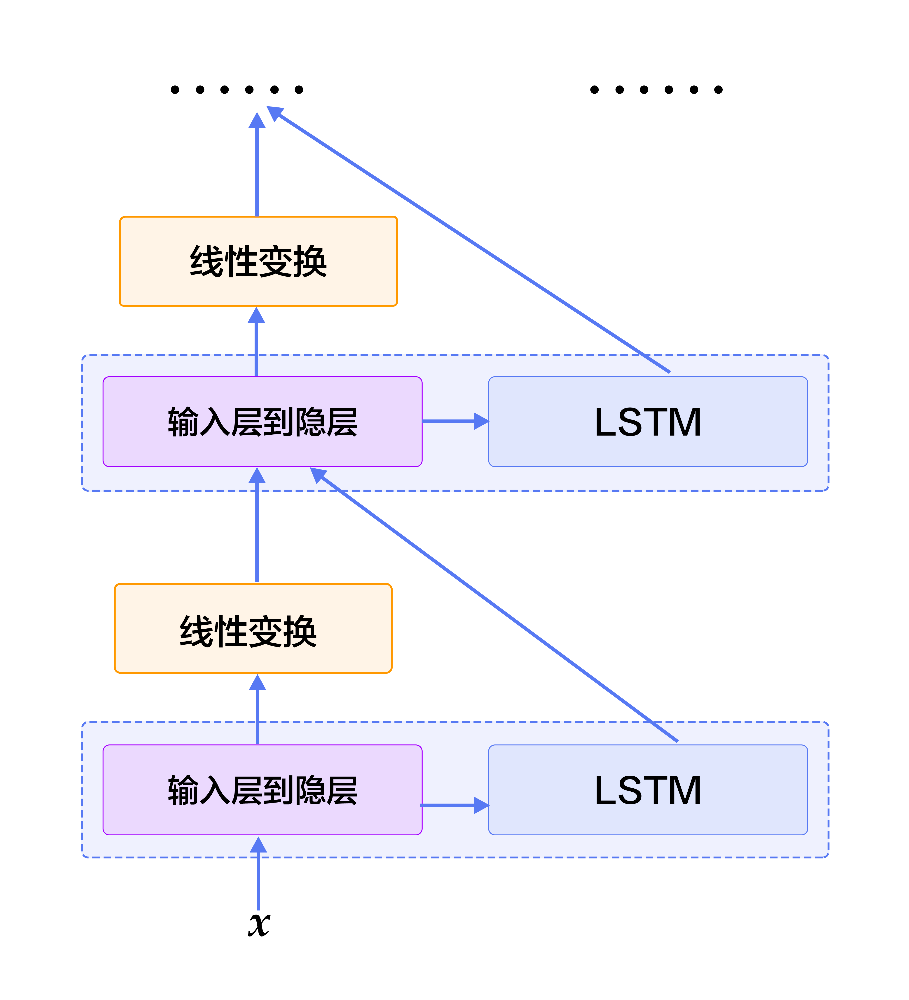
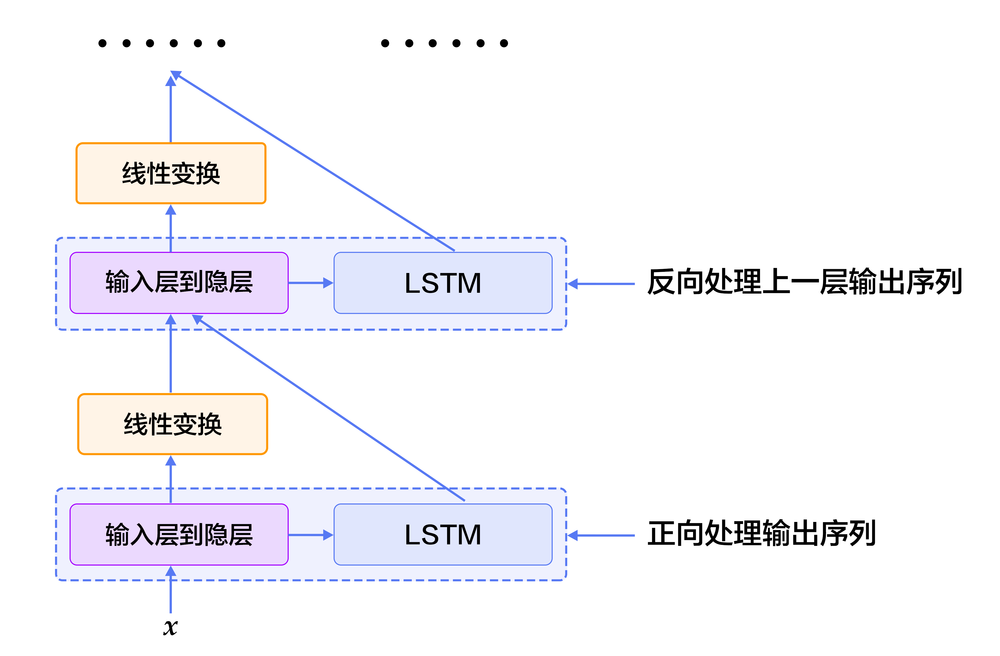
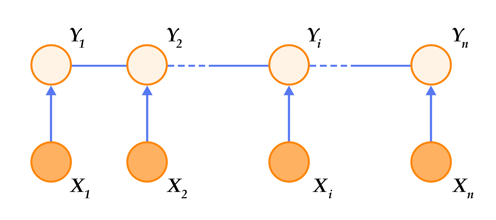

# 语义角色标注

本教程源代码目录在[book/label_semantic_roles](https://github.com/PaddlePaddle/book/tree/develop/07.label_semantic_roles)， 初次使用请参考PaddlePaddle[安装教程](https://github.com/PaddlePaddle/book/blob/develop/README.cn.md#运行这本书)，更多内容请参考本教程的[视频课堂](http://bit.baidu.com/course/detail/id/178.html)。

## 背景介绍

自然语言分析技术大致分为三个层面：词法分析、句法分析和语义分析。语义角色标注是实现浅层语义分析的一种方式。在一个句子中，谓词是对主语的陈述或说明，指出“做什么”、“是什么”或“怎么样，代表了一个事件的核心，跟谓词搭配的名词称为论元。语义角色是指论元在动词所指事件中担任的角色。主要有：施事者（Agent）、受事者（Patient）、客体（Theme）、经验者（Experiencer）、受益者（Beneficiary）、工具（Instrument）、处所（Location）、目标（Goal）和来源（Source）等。

请看下面的例子，“遇到” 是谓词（Predicate，通常简写为“Pred”），“小明”是施事者（Agent），“小红”是受事者（Patient），“昨天” 是事件发生的时间（Time），“公园”是事情发生的地点（Location）。

$$\mbox{[小明]}_{\mbox{Agent}}\mbox{[昨天]}_{\mbox{Time}}\mbox{[晚上]}_{\mbox{Time}}\mbox{在[公园]}_{\mbox{Location}}\mbox{[遇到]}_{\mbox{Predicate}}\mbox{了[小红]}_{\mbox{Patient}}\mbox{。}$$

语义角色标注（Semantic Role Labeling，SRL）以句子的谓词为中心，不对句子所包含的语义信息进行深入分析，只分析句子中各成分与谓词之间的关系，即句子的谓词（Predicate）- 论元（Argument）结构，并用语义角色来描述这些结构关系，是许多自然语言理解任务（如信息抽取，篇章分析，深度问答等）的一个重要中间步骤。在研究中一般都假定谓词是给定的，所要做的就是找出给定谓词的各个论元和它们的语义角色。

传统的SRL系统大多建立在句法分析基础之上，通常包括5个流程：

1. 构建一棵句法分析树，例如，图1是对上面例子进行依存句法分析得到的一棵句法树。
2. 从句法树上识别出给定谓词的候选论元。
3. 候选论元剪除；一个句子中的候选论元可能很多，候选论元剪除就是从大量的候选项中剪除那些最不可能成为论元的候选项。
4. 论元识别：这个过程是从上一步剪除之后的候选中判断哪些是真正的论元，通常当做一个二分类问题来解决。
5. 对第4步的结果，通过多分类得到论元的语义角色标签。可以看到，句法分析是基础，并且后续步骤常常会构造的一些人工特征，这些特征往往也来自句法分析。


<div  align="center">
图1. 依存句法分析句法树示例
</div>

然而，完全句法分析需要确定句子所包含的全部句法信息，并确定句子各成分之间的关系，是一个非常困难的任务，目前技术下的句法分析准确率并不高，句法分析的细微错误都会导致SRL的错误。为了降低问题的复杂度，同时获得一定的句法结构信息，“浅层句法分析”的思想应运而生。浅层句法分析也称为部分句法分析（partial parsing）或语块划分（chunking）。和完全句法分析得到一颗完整的句法树不同，浅层句法分析只需要识别句子中某些结构相对简单的独立成分，例如：动词短语，这些被识别出来的结构称为语块。为了回避 “无法获得准确率较高的句法树” 所带来的困难，一些研究\[[1](#参考文献)\]也提出了基于语块（chunk）的SRL方法。基于语块的SRL方法将SRL作为一个序列标注问题来解决。序列标注任务一般都会采用BIO表示方式来定义序列标注的标签集，我们先来介绍这种表示方法。在BIO表示法中，B代表语块的开始，I代表语块的中间，O代表语块结束。通过B、I、O 三种标记将不同的语块赋予不同的标签，例如：对于一个角色为A的论元，将它所包含的第一个语块赋予标签B-A，将它所包含的其它语块赋予标签I-A，不属于任何论元的语块赋予标签O。

我们继续以上面的这句话为例，图1展示了BIO表示方法。


<div  align="center">
图2. BIO标注方法示例
</div>

从上面的例子可以看到，根据序列标注结果可以直接得到论元的语义角色标注结果，是一个相对简单的过程。这种简单性体现在：（1）依赖浅层句法分析，降低了句法分析的要求和难度；（2）没有了候选论元剪除这一步骤；（3）论元的识别和论元标注是同时实现的。这种一体化处理论元识别和论元标注的方法，简化了流程，降低了错误累积的风险，往往能够取得更好的结果。

与基于语块的SRL方法类似，在本教程中我们也将SRL看作一个序列标注问题，不同的是，我们只依赖输入文本序列，不依赖任何额外的语法解析结果或是复杂的人造特征，利用深度神经网络构建一个端到端学习的SRL系统。我们以[CoNLL-2004 and CoNLL-2005 Shared Tasks](http://www.cs.upc.edu/~srlconll/)任务中SRL任务的公开数据集为例，实践下面的任务：给定一句话和这句话里的一个谓词，通过序列标注的方式，从句子中找到谓词对应的论元，同时标注它们的语义角色。

## 模型概览

循环神经网络（Recurrent Neural Network）是一种对序列建模的重要模型，在自然语言处理任务中有着广泛地应用。不同于前馈神经网络（Feed-forward Neural Network），RNN能够处理输入之间前后关联的问题。LSTM是RNN的一种重要变种，常用来学习长序列中蕴含的长程依赖关系，我们在[情感分析](https://github.com/PaddlePaddle/book/tree/develop/05.understand_sentiment)一篇中已经介绍过，这一篇中我们依然利用LSTM来解决SRL问题。

### 栈式循环神经网络（Stacked Recurrent Neural Network）

深层网络有助于形成层次化特征，网络上层在下层已经学习到的初级特征基础上，形成更复杂的高级特征。尽管LSTM沿时间轴展开后等价于一个非常“深”的前馈网络，但由于LSTM各个时间步参数共享，`$t-1$`时刻状态到`$t$`时刻的映射，始终只经过了一次非线性映射，也就是说单层LSTM对状态转移的建模是 “浅” 的。堆叠多个LSTM单元，令前一个LSTM`$t$`时刻的输出，成为下一个LSTM单元`$t$`时刻的输入，帮助我们构建起一个深层网络，我们把它称为第一个版本的栈式循环神经网络。深层网络提高了模型拟合复杂模式的能力，能够更好地建模跨不同时间步的模式\[[2](#参考文献)\]。

然而，训练一个深层LSTM网络并非易事。纵向堆叠多个LSTM单元可能遇到梯度在纵向深度上传播受阻的问题。通常，堆叠4层LSTM单元可以正常训练，当层数达到4~8层时，会出现性能衰减，这时必须考虑一些新的结构以保证梯度纵向顺畅传播，这是训练深层LSTM网络必须解决的问题。我们可以借鉴LSTM解决 “梯度消失梯度爆炸” 问题的智慧之一：在记忆单元（Memory Cell）这条信息传播的路线上没有非线性映射，当梯度反向传播时既不会衰减、也不会爆炸。因此，深层LSTM模型也可以在纵向上添加一条保证梯度顺畅传播的路径。

一个LSTM单元完成的运算可以被分为三部分：（1）输入到隐层的映射（input-to-hidden） ：每个时间步输入信息`$x$`会首先经过一个矩阵映射，再作为遗忘门，输入门，记忆单元，输出门的输入，注意，这一次映射没有引入非线性激活；（2）隐层到隐层的映射（hidden-to-hidden）：这一步是LSTM计算的主体，包括遗忘门，输入门，记忆单元更新，输出门的计算；（3）隐层到输出的映射（hidden-to-output）：通常是简单的对隐层向量进行激活。我们在第一个版本的栈式网络的基础上，加入一条新的路径：除上一层LSTM输出之外，将前层LSTM的输入到隐层的映射作为的一个新的输入，同时加入一个线性映射去学习一个新的变换。

图3是最终得到的栈式循环神经网络结构示意图。


<p align="center">
图3. 基于LSTM的栈式循环神经网络结构示意图
</p>

### 双向循环神经网络（Bidirectional Recurrent Neural Network）

在LSTM中，`$t$`时刻的隐藏层向量编码了到`$t$`时刻为止所有输入的信息，但`$t$`时刻的LSTM可以看到历史，却无法看到未来。在绝大多数自然语言处理任务中，我们几乎总是能拿到整个句子。这种情况下，如果能够像获取历史信息一样，得到未来的信息，对序列学习任务会有很大的帮助。

为了克服这一缺陷，我们可以设计一种双向循环网络单元，它的思想简单且直接：对上一节的栈式循环神经网络进行一个小小的修改，堆叠多个LSTM单元，让每一层LSTM单元分别以：正向、反向、正向 …… 的顺序学习上一层的输出序列。于是，从第2层开始，`$t$`时刻我们的LSTM单元便总是可以看到历史和未来的信息。图4是基于LSTM的双向循环神经网络结构示意图。


<p align="center">
图4. 基于LSTM的双向循环神经网络结构示意图
</p>

需要说明的是，这种双向RNN结构和Bengio等人在机器翻译任务中使用的双向RNN结构\[[3](#参考文献), [4](#参考文献)\] 并不相同，我们会在后续[机器翻译](https://github.com/PaddlePaddle/book/blob/develop/08.machine_translation/README.cn.md)任务中，介绍另一种双向循环神经网络。

### 条件随机场 (Conditional Random Field)

使用神经网络模型解决问题的思路通常是：前层网络学习输入的特征表示，网络的最后一层在特征基础上完成最终的任务。在SRL任务中，深层LSTM网络学习输入的特征表示，条件随机场（Conditional Random Filed， CRF）在特征的基础上完成序列标注，处于整个网络的末端。

CRF是一种概率化结构模型，可以看作是一个概率无向图模型，结点表示随机变量，边表示随机变量之间的概率依赖关系。简单来讲，CRF学习条件概率`$P(X|Y)$`，其中 `$X = (x_1, x_2, ... , x_n)$` 是输入序列，`$Y = (y_1, y_2, ... , y_n)$` 是标记序列；解码过程是给定 `$X$`序列求解令`$P(Y|X)$`最大的`$Y$`序列，即`$Y^* = \mbox{arg max}_{Y} P(Y | X)$`。

序列标注任务只需要考虑输入和输出都是一个线性序列，并且由于我们只是将输入序列作为条件，不做任何条件独立假设，因此输入序列的元素之间并不存在图结构。综上，在序列标注任务中使用的是如图5所示的定义在链式图上的CRF，称之为线性链条件随机场（Linear Chain Conditional Random Field）。


<p align="center">
图5. 序列标注任务中使用的线性链条件随机场
</p>

根据线性链条件随机场上的因子分解定理\[[5](#参考文献)\]，在给定观测序列`$X$`时，一个特定标记序列`$Y$`的概率可以定义为：

$$p(Y | X) = \frac{1}{Z(X)} \text{exp}\left(\sum_{i=1}^{n}\left(\sum_{j}\lambda_{j}t_{j} (y_{i - 1}, y_{i}, X, i) + \sum_{k} \mu_k s_k (y_i, X, i)\right)\right)$$

其中`$Z(X)$`是归一化因子，`$t_j$` 是定义在边上的特征函数，依赖于当前和前一个位置，称为转移特征，表示对于输入序列`$X$`及其标注序列在 `$i$`及`$i - 1$`位置上标记的转移概率。`$s_k$`是定义在结点上的特征函数，称为状态特征，依赖于当前位置，表示对于观察序列`$X$`及其`$i$`位置的标记概率。`$\lambda_j$` 和 `$\mu_k$` 分别是转移特征函数和状态特征函数对应的权值。实际上，`$t$`和`$s$`可以用相同的数学形式表示，再对转移特征和状态特在各个位置`$i$`求和有：`$f_{k}(Y, X) = \sum_{i=1}^{n}f_k({y_{i - 1}, y_i, X, i})$`，把`$f$`统称为特征函数，于是`$P(Y|X)$`可表示为：

$$p(Y|X, W) = \frac{1}{Z(X)}\text{exp}\sum_{k}\omega_{k}f_{k}(Y, X)$$

`$\omega$`是特征函数对应的权值，是CRF模型要学习的参数。训练时，对于给定的输入序列和对应的标记序列集合`$D = \left[(X_1,  Y_1), (X_2 , Y_2) , ... , (X_N, Y_N)\right]$` ，通过正则化的极大似然估计，求解如下优化目标：

$$\DeclareMathOperator*{\argmax}{arg\,max} L(\lambda, D) = - \text{log}\left(\prod_{m=1}^{N}p(Y_m|X_m, W)\right) + C \frac{1}{2}\lVert W\rVert^{2}$$

这个优化目标可以通过反向传播算法和整个神经网络一起求解。解码时，对于给定的输入序列`$X$`，通过解码算法（通常有：维特比算法、Beam Search）求令出条件概率`$\bar{P}(Y|X)$`最大的输出序列 `$\bar{Y}$`。

### 深度双向LSTM（DB-LSTM）SRL模型

在SRL任务中，输入是 “谓词” 和 “一句话”，目标是从这句话中找到谓词的论元，并标注论元的语义角色。如果一个句子含有`$n$`个谓词，这个句子会被处理`$n$`次。一个最为直接的模型是下面这样：

1. 构造输入；
- 输入1是谓词，输入2是句子
- 将输入1扩展成和输入2一样长的序列，用one-hot方式表示；
2. one-hot方式的谓词序列和句子序列通过词表，转换为实向量表示的词向量序列；
3. 将步骤2中的2个词向量序列作为双向LSTM的输入，学习输入序列的特征表示；
4. CRF以步骤3中模型学习到的特征为输入，以标记序列为监督信号，实现序列标注；

大家可以尝试上面这种方法。这里，我们提出一些改进，引入两个简单但对提高系统性能非常有效的特征：

- 谓词上下文：上面的方法中，只用到了谓词的词向量表达谓词相关的所有信息，这种方法始终是非常弱的，特别是如果谓词在句子中出现多次，有可能引起一定的歧义。从经验出发，谓词前后若干个词的一个小片段，能够提供更丰富的信息，帮助消解歧义。于是，我们把这样的经验也添加到模型中，为每个谓词同时抽取一个“谓词上下文” 片段，也就是从这个谓词前后各取`$n$`个词构成的一个窗口片段；
- 谓词上下文区域标记：为句子中的每一个词引入一个0-1二值变量，表示它们是否在“谓词上下文”片段中；

修改后的模型如下（图6是一个深度为4的模型结构示意图）：

1. 构造输入
- 输入1是句子序列，输入2是谓词序列，输入3是谓词上下文，从句子中抽取这个谓词前后各`$n$`个词，构成谓词上下文，用one-hot方式表示，输入4是谓词上下文区域标记，标记了句子中每一个词是否在谓词上下文中；
- 将输入2~3均扩展为和输入1一样长的序列；
2. 输入1~4均通过词表取词向量转换为实向量表示的词向量序列；其中输入1、3共享同一个词表，输入2和4各自独有词表；
3. 第2步的4个词向量序列作为双向LSTM模型的输入；LSTM模型学习输入序列的特征表示，得到新的特性表示序列；
4. CRF以第3步中LSTM学习到的特征为输入，以标记序列为监督信号，完成序列标注；


<div  align="center">
图6. SRL任务上的深层双向LSTM模型
</div>


## 数据介绍

在此教程中，我们选用[CoNLL 2005](http://www.cs.upc.edu/~srlconll/)SRL任务开放出的数据集作为示例。需要特别说明的是，CoNLL 2005 SRL任务的训练数集和开发集在比赛之后并非免费进行公开，目前，能够获取到的只有测试集，包括Wall Street Journal的23节和Brown语料集中的3节。在本教程中，我们以测试集中的WSJ数据为训练集来讲解模型。但是，由于测试集中样本的数量远远不够，如果希望训练一个可用的神经网络SRL系统，请考虑付费获取全量数据。

原始数据中同时包括了词性标注、命名实体识别、语法解析树等多种信息。本教程中，我们使用test.wsj文件夹中的数据进行训练和测试，并只会用到words文件夹（文本序列）和props文件夹（标注结果）下的数据。本教程使用的数据目录如下：

```text
conll05st-release/
└── test.wsj
├── props  # 标注结果
└── words  # 输入文本序列
```

标注信息源自Penn TreeBank\[[7](#参考文献)\]和PropBank\[[8](#参考文献)\]的标注结果。PropBank标注结果的标签和我们在文章一开始示例中使用的标注结果标签不同，但原理是相同的，关于标注结果标签含义的说明，请参考论文\[[9](#参考文献)\]。

原始数据需要进行数据预处理才能被PaddlePaddle处理，预处理包括下面几个步骤:

1. 将文本序列和标记序列其合并到一条记录中；
2. 一个句子如果含有`$n$`个谓词，这个句子会被处理`$n$`次，变成`$n$`条独立的训练样本，每个样本一个不同的谓词；
3. 抽取谓词上下文和构造谓词上下文区域标记；
4. 构造以BIO法表示的标记；
5. 依据词典获取词对应的整数索引。


```python
# import paddle.v2.dataset.conll05 as conll05
# conll05.corpus_reader函数完成上面第1步和第2步.
# conll05.reader_creator函数完成上面第3步到第5步.
# conll05.test函数可以获取处理之后的每条样本来供PaddlePaddle训练.
```

预处理完成之后一条训练样本包含9个特征，分别是：句子序列、谓词、谓词上下文（占 5 列）、谓词上下区域标志、标注序列。下表是一条训练样本的示例。

| 句子序列 | 谓词 | 谓词上下文（窗口 = 5） | 谓词上下文区域标记 | 标注序列 |
|---|---|---|---|---|
| A | set | n't been set . × | 0 | B-A1 |
| record | set | n't been set . × | 0 | I-A1 |
| date | set | n't been set . × | 0 | I-A1 |
| has | set | n't been set . × | 0 | O |
| n't | set | n't been set . × | 1 | B-AM-NEG |
| been | set | n't been set . × | 1 | O |
| set | set | n't been set . × | 1 | B-V |
| . | set | n't been set . × | 1 | O |


除数据之外，我们同时提供了以下资源：

| 文件名称 | 说明 |
|---|---|
| word_dict | 输入句子的词典，共计44068个词 |
| label_dict | 标记的词典，共计106个标记 |
| predicate_dict | 谓词的词典，共计3162个词 |
| emb | 一个训练好的词表，32维 |

我们在英文维基百科上训练语言模型得到了一份词向量用来初始化SRL模型。在SRL模型训练过程中，词向量不再被更新。关于语言模型和词向量可以参考[词向量](https://github.com/PaddlePaddle/book/blob/develop/04.word2vec/README.cn.md) 这篇教程。我们训练语言模型的语料共有995,000,000个token，词典大小控制为4900,000词。CoNLL 2005训练语料中有5%的词不在这4900,000个词中，我们将它们全部看作未登录词，用`<unk>`表示。

获取词典，打印词典大小：

```python
import math, os
import numpy as np
import paddle
import paddle.v2.dataset.conll05 as conll05
import paddle.fluid as fluid
import time

with_gpu = os.getenv('WITH_GPU', '0') != '0'

word_dict, verb_dict, label_dict = conll05.get_dict()
word_dict_len = len(word_dict)
label_dict_len = len(label_dict)
pred_dict_len = len(verb_dict)

print word_dict_len
print label_dict_len
print pred_dict_len
```

## 模型配置说明

- 定义输入数据维度及模型超参数。

```python
mark_dict_len = 2   # 谓上下文区域标志的维度，是一个0-1 2值特征，因此维度为2
word_dim = 32       # 词向量维度
mark_dim = 5        # 谓词上下文区域通过词表被映射为一个实向量，这个是相邻的维度
hidden_dim = 512    # LSTM隐层向量的维度 ： 512 / 4
depth = 8           # 栈式LSTM的深度
mix_hidden_lr = 1e-3

IS_SPARSE = True
PASS_NUM = 10
BATCH_SIZE = 10

embedding_name = 'emb'
```

这里需要特别说明的是hidden_dim = 512指定了LSTM隐层向量的维度为128维，关于这一点请参考PaddlePaddle官方文档中[lstmemory](http://www.paddlepaddle.org/doc/ui/api/trainer_config_helpers/layers.html#lstmemory)的说明。

- 如上文提到，我们用基于英文维基百科训练好的词向量来初始化序列输入、谓词上下文总共6个特征的embedding层参数，在训练中不更新。

```python
# 这里加载PaddlePaddle上版保存的二进制模型
def load_parameter(file_name, h, w):
with open(file_name, 'rb') as f:
f.read(16)  # skip header.
return np.fromfile(f, dtype=np.float32).reshape(h, w)
```

- 8个LSTM单元以“正向/反向”的顺序对所有输入序列进行学习。

```python
def db_lstm(word, predicate, ctx_n2, ctx_n1, ctx_0, ctx_p1, ctx_p2, mark,
**ignored):
# 8 features
predicate_embedding = fluid.layers.embedding(
input=predicate,
size=[pred_dict_len, word_dim],
dtype='float32',
is_sparse=IS_SPARSE,
param_attr='vemb')

mark_embedding = fluid.layers.embedding(
input=mark,
size=[mark_dict_len, mark_dim],
dtype='float32',
is_sparse=IS_SPARSE)

word_input = [word, ctx_n2, ctx_n1, ctx_0, ctx_p1, ctx_p2]
# Since word vector lookup table is pre-trained, we won't update it this time.
# trainable being False prevents updating the lookup table during training.
emb_layers = [
fluid.layers.embedding(
size=[word_dict_len, word_dim],
input=x,
param_attr=fluid.ParamAttr(
name=embedding_name, trainable=False)) for x in word_input
]
emb_layers.append(predicate_embedding)
emb_layers.append(mark_embedding)

# 8 LSTM units are trained through alternating left-to-right / right-to-left order
# denoted by the variable `reverse`.
hidden_0_layers = [
fluid.layers.fc(input=emb, size=hidden_dim, act='tanh')
for emb in emb_layers
]

hidden_0 = fluid.layers.sums(input=hidden_0_layers)

lstm_0 = fluid.layers.dynamic_lstm(
input=hidden_0,
size=hidden_dim,
candidate_activation='relu',
gate_activation='sigmoid',
cell_activation='sigmoid')

# stack L-LSTM and R-LSTM with direct edges
input_tmp = [hidden_0, lstm_0]

# In PaddlePaddle, state features and transition features of a CRF are implemented
# by a fully connected layer and a CRF layer seperately. The fully connected layer
# with linear activation learns the state features, here we use fluid.layers.sums
# (fluid.layers.fc can be uesed as well), and the CRF layer in PaddlePaddle:
# fluid.layers.linear_chain_crf only
# learns the transition features, which is a cost layer and is the last layer of the network.
# fluid.layers.linear_chain_crf outputs the log probability of true tag sequence
# as the cost by given the input sequence and it requires the true tag sequence
# as target in the learning process.

for i in range(1, depth):
mix_hidden = fluid.layers.sums(input=[
fluid.layers.fc(input=input_tmp[0], size=hidden_dim, act='tanh'),
fluid.layers.fc(input=input_tmp[1], size=hidden_dim, act='tanh')
])

lstm = fluid.layers.dynamic_lstm(
input=mix_hidden,
size=hidden_dim,
candidate_activation='relu',
gate_activation='sigmoid',
cell_activation='sigmoid',
is_reverse=((i % 2) == 1))

input_tmp = [mix_hidden, lstm]

# 取最后一个栈式LSTM的输出和这个LSTM单元的输入到隐层映射，
# 经过一个全连接层映射到标记字典的维度，来学习 CRF 的状态特征
feature_out = fluid.layers.sums(input=[
fluid.layers.fc(input=input_tmp[0], size=label_dict_len, act='tanh'),
fluid.layers.fc(input=input_tmp[1], size=label_dict_len, act='tanh')
])

return feature_out
```

## 训练模型

- 我们根据网络拓扑结构和模型参数来构造出trainer用来训练，在构造时还需指定优化方法，这里使用最基本的SGD方法(momentum设置为0)，同时设定了学习率、正则等。

- 数据介绍部分提到CoNLL 2005训练集付费，这里我们使用测试集训练供大家学习。conll05.test()每次产生一条样本，包含9个特征，shuffle和组完batch后作为训练的输入。

- 通过feeding来指定每一个数据和data_layer的对应关系。 例如 下面feeding表示: conll05.test()产生数据的第0列对应word_data层的特征。

- 可以使用event_handler回调函数来观察训练过程，或进行测试等。这里我们打印了训练过程的cost，该回调函数是trainer.train函数里设定。

- 通过trainer.train函数训练

```python
def train(use_cuda, save_dirname=None, is_local=True):
# define network topology

# 句子序列
word = fluid.layers.data(
name='word_data', shape=[1], dtype='int64', lod_level=1)

# 谓词
predicate = fluid.layers.data(
name='verb_data', shape=[1], dtype='int64', lod_level=1)

# 谓词上下文5个特征
ctx_n2 = fluid.layers.data(
name='ctx_n2_data', shape=[1], dtype='int64', lod_level=1)
ctx_n1 = fluid.layers.data(
name='ctx_n1_data', shape=[1], dtype='int64', lod_level=1)
ctx_0 = fluid.layers.data(
name='ctx_0_data', shape=[1], dtype='int64', lod_level=1)
ctx_p1 = fluid.layers.data(
name='ctx_p1_data', shape=[1], dtype='int64', lod_level=1)
ctx_p2 = fluid.layers.data(
name='ctx_p2_data', shape=[1], dtype='int64', lod_level=1)

# 谓词上下区域标志
mark = fluid.layers.data(
name='mark_data', shape=[1], dtype='int64', lod_level=1)

# define network topology
feature_out = db_lstm(**locals())

# 标注序列
target = fluid.layers.data(
name='target', shape=[1], dtype='int64', lod_level=1)

# 学习 CRF 的转移特征
crf_cost = fluid.layers.linear_chain_crf(
input=feature_out,
label=target,
param_attr=fluid.ParamAttr(
name='crfw', learning_rate=mix_hidden_lr))

avg_cost = fluid.layers.mean(crf_cost)

sgd_optimizer = fluid.optimizer.SGD(
learning_rate=fluid.layers.exponential_decay(
learning_rate=0.01,
decay_steps=100000,
decay_rate=0.5,
staircase=True))

sgd_optimizer.minimize(avg_cost)

# The CRF decoding layer is used for evaluation and inference.
# It shares weights with CRF layer.  The sharing of parameters among multiple layers
# is specified by using the same parameter name in these layers. If true tag sequence
# is provided in training process, `fluid.layers.crf_decoding` calculates labelling error
# for each input token and sums the error over the entire sequence.
# Otherwise, `fluid.layers.crf_decoding`  generates the labelling tags.
crf_decode = fluid.layers.crf_decoding(
input=feature_out, param_attr=fluid.ParamAttr(name='crfw'))

train_data = paddle.batch(
paddle.reader.shuffle(
paddle.dataset.conll05.test(), buf_size=8192),
batch_size=BATCH_SIZE)

place = fluid.CUDAPlace(0) if use_cuda else fluid.CPUPlace()


feeder = fluid.DataFeeder(
feed_list=[
word, ctx_n2, ctx_n1, ctx_0, ctx_p1, ctx_p2, predicate, mark, target
],
place=place)
exe = fluid.Executor(place)

def train_loop(main_program):
exe.run(fluid.default_startup_program())
embedding_param = fluid.global_scope().find_var(
embedding_name).get_tensor()
embedding_param.set(
load_parameter(conll05.get_embedding(), word_dict_len, word_dim),
place)

start_time = time.time()
batch_id = 0
for pass_id in xrange(PASS_NUM):
for data in train_data():
cost = exe.run(main_program,
feed=feeder.feed(data),
fetch_list=[avg_cost])
cost = cost[0]

if batch_id % 10 == 0:
print("avg_cost:" + str(cost))
if batch_id != 0:
print("second per batch: " + str((time.time(
) - start_time) / batch_id))
# Set the threshold low to speed up the CI test
if float(cost) < 60.0:
if save_dirname is not None:
fluid.io.save_inference_model(save_dirname, [
'word_data', 'verb_data', 'ctx_n2_data',
'ctx_n1_data', 'ctx_0_data', 'ctx_p1_data',
'ctx_p2_data', 'mark_data'
], [feature_out], exe)
return

batch_id = batch_id + 1

train_loop(fluid.default_main_program())
```


## 应用模型

训练完成之后，需要依据某个我们关心的性能指标选择最优的模型进行预测，可以简单的选择测试集上标记错误最少的那个模型。以下我们给出一个使用训练后的模型进行预测的示例。

```python
def infer(use_cuda, save_dirname=None):
if save_dirname is None:
return

place = fluid.CUDAPlace(0) if use_cuda else fluid.CPUPlace()
exe = fluid.Executor(place)

inference_scope = fluid.core.Scope()
with fluid.scope_guard(inference_scope):
# Use fluid.io.load_inference_model to obtain the inference program desc,
# the feed_target_names (the names of variables that will be fed
# data using feed operators), and the fetch_targets (variables that
# we want to obtain data from using fetch operators).
[inference_program, feed_target_names,
fetch_targets] = fluid.io.load_inference_model(save_dirname, exe)

# Setup inputs by creating LoDTensors to represent sequences of words.
# Here each word is the basic element of these LoDTensors and the shape of
# each word (base_shape) should be [1] since it is simply an index to
# look up for the corresponding word vector.
# Suppose the length_based level of detail (lod) info is set to [[3, 4, 2]],
# which has only one lod level. Then the created LoDTensors will have only
# one higher level structure (sequence of words, or sentence) than the basic
# element (word). Hence the LoDTensor will hold data for three sentences of
# length 3, 4 and 2, respectively.
# Note that lod info should be a list of lists.
lod = [[3, 4, 2]]
base_shape = [1]
# The range of random integers is [low, high]
word = fluid.create_random_int_lodtensor(
lod, base_shape, place, low=0, high=word_dict_len - 1)
pred = fluid.create_random_int_lodtensor(
lod, base_shape, place, low=0, high=pred_dict_len - 1)
ctx_n2 = fluid.create_random_int_lodtensor(
lod, base_shape, place, low=0, high=word_dict_len - 1)
ctx_n1 = fluid.create_random_int_lodtensor(
lod, base_shape, place, low=0, high=word_dict_len - 1)
ctx_0 = fluid.create_random_int_lodtensor(
lod, base_shape, place, low=0, high=word_dict_len - 1)
ctx_p1 = fluid.create_random_int_lodtensor(
lod, base_shape, place, low=0, high=word_dict_len - 1)
ctx_p2 = fluid.create_random_int_lodtensor(
lod, base_shape, place, low=0, high=word_dict_len - 1)
mark = fluid.create_random_int_lodtensor(
lod, base_shape, place, low=0, high=mark_dict_len - 1)

# Construct feed as a dictionary of {feed_target_name: feed_target_data}
# and results will contain a list of data corresponding to fetch_targets.
assert feed_target_names[0] == 'word_data'
assert feed_target_names[1] == 'verb_data'
assert feed_target_names[2] == 'ctx_n2_data'
assert feed_target_names[3] == 'ctx_n1_data'
assert feed_target_names[4] == 'ctx_0_data'
assert feed_target_names[5] == 'ctx_p1_data'
assert feed_target_names[6] == 'ctx_p2_data'
assert feed_target_names[7] == 'mark_data'

results = exe.run(inference_program,
feed={
feed_target_names[0]: word,
feed_target_names[1]: pred,
feed_target_names[2]: ctx_n2,
feed_target_names[3]: ctx_n1,
feed_target_names[4]: ctx_0,
feed_target_names[5]: ctx_p1,
feed_target_names[6]: ctx_p2,
feed_target_names[7]: mark
},
fetch_list=fetch_targets,
return_numpy=False)
print(results[0].lod())
np_data = np.array(results[0])
print("Inference Shape: ", np_data.shape)
```

整个程序的入口如下：

```python
def main(use_cuda, is_local=True):
if use_cuda and not fluid.core.is_compiled_with_cuda():
return

# Directory for saving the trained model
save_dirname = "label_semantic_roles.inference.model"

train(use_cuda, save_dirname, is_local)
infer(use_cuda, save_dirname)


main(use_cuda=False)
```

## 总结

语义角色标注是许多自然语言理解任务的重要中间步骤。这篇教程中我们以语义角色标注任务为例，介绍如何利用PaddlePaddle进行序列标注任务。教程中所介绍的模型来自我们发表的论文\[[10](#参考文献)\]。由于 CoNLL 2005 SRL任务的训练数据目前并非完全开放，教程中只使用测试数据作为示例。在这个过程中，我们希望减少对其它自然语言处理工具的依赖，利用神经网络数据驱动、端到端学习的能力，得到一个和传统方法可比、甚至更好的模型。在论文中我们证实了这种可能性。关于模型更多的信息和讨论可以在论文中找到。

## 参考文献
1. Sun W, Sui Z, Wang M, et al. [Chinese semantic role labeling with shallow parsing](http://www.aclweb.org/anthology/D09-1#page=1513)[C]//Proceedings of the 2009 Conference on Empirical Methods in Natural Language Processing: Volume 3-Volume 3. Association for Computational Linguistics, 2009: 1475-1483.
2. Pascanu R, Gulcehre C, Cho K, et al. [How to construct deep recurrent neural networks](https://arxiv.org/abs/1312.6026)[J]. arXiv preprint arXiv:1312.6026, 2013.
3. Cho K, Van Merriënboer B, Gulcehre C, et al. [Learning phrase representations using RNN encoder-decoder for statistical machine translation](https://arxiv.org/abs/1406.1078)[J]. arXiv preprint arXiv:1406.1078, 2014.
4. Bahdanau D, Cho K, Bengio Y. [Neural machine translation by jointly learning to align and translate](https://arxiv.org/abs/1409.0473)[J]. arXiv preprint arXiv:1409.0473, 2014.
5. Lafferty J, McCallum A, Pereira F. [Conditional random fields: Probabilistic models for segmenting and labeling sequence data](http://www.jmlr.org/papers/volume15/doppa14a/source/biblio.bib.old)[C]//Proceedings of the eighteenth international conference on machine learning, ICML. 2001, 1: 282-289.
6. 李航. 统计学习方法[J]. 清华大学出版社, 北京, 2012.
7. Marcus M P, Marcinkiewicz M A, Santorini B. [Building a large annotated corpus of English: The Penn Treebank](http://repository.upenn.edu/cgi/viewcontent.cgi?article=1246&context=cis_reports)[J]. Computational linguistics, 1993, 19(2): 313-330.
8. Palmer M, Gildea D, Kingsbury P. [The proposition bank: An annotated corpus of semantic roles](http://www.mitpressjournals.org/doi/pdfplus/10.1162/0891201053630264)[J]. Computational linguistics, 2005, 31(1): 71-106.
9. Carreras X, Màrquez L. [Introduction to the CoNLL-2005 shared task: Semantic role labeling](http://www.cs.upc.edu/~srlconll/st05/papers/intro.pdf)[C]//Proceedings of the Ninth Conference on Computational Natural Language Learning. Association for Computational Linguistics, 2005: 152-164.
10. Zhou J, Xu W. [End-to-end learning of semantic role labeling using recurrent neural networks](http://www.aclweb.org/anthology/P/P15/P15-1109.pdf)[C]//Proceedings of the Annual Meeting of the Association for Computational Linguistics. 2015.

<br/>
<a rel="license" href="http://creativecommons.org/licenses/by-sa/4.0/"></a><br /><span xmlns:dct="http://purl.org/dc/terms/" href="http://purl.org/dc/dcmitype/Text" property="dct:title" rel="dct:type">本教程</span> 由 <a xmlns:cc="http://creativecommons.org/ns#" href="http://book.paddlepaddle.org" property="cc:attributionName" rel="cc:attributionURL">PaddlePaddle</a> 创作，采用 <a rel="license" href="http://creativecommons.org/licenses/by-sa/4.0/">知识共享 署名-相同方式共享 4.0 国际 许可协议</a>进行许可。
