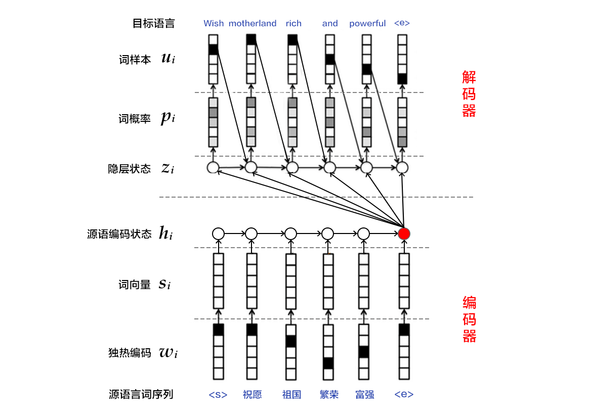

# 机器翻译

本教程源代码目录在[book/machine_translation](https://github.com/PaddlePaddle/book/tree/develop/08.machine_translation)， 初次使用请参考PaddlePaddle[安装教程](https://github.com/PaddlePaddle/book/blob/develop/README.cn.md#运行这本书)。

## 背景介绍

机器翻译（machine translation, MT）是用计算机来实现不同语言之间翻译的技术。被翻译的语言通常称为源语言（source language），翻译成的结果语言称为目标语言（target language）。机器翻译即实现从源语言到目标语言转换的过程，是自然语言处理的重要研究领域之一。

早期机器翻译系统多为基于规则的翻译系统，需要由语言学家编写两种语言之间的转换规则，再将这些规则录入计算机。该方法对语言学家的要求非常高，而且我们几乎无法总结一门语言会用到的所有规则，更何况两种甚至更多的语言。因此，传统机器翻译方法面临的主要挑战是无法得到一个完备的规则集合\[[1](#参考文献)\]。

为解决以上问题，统计机器翻译（Statistical Machine Translation, SMT）技术应运而生。在统计机器翻译技术中，转化规则是由机器自动从大规模的语料中学习得到的，而非我们人主动提供规则。因此，它克服了基于规则的翻译系统所面临的知识获取瓶颈的问题，但仍然存在许多挑战：1）人为设计许多特征（feature），但永远无法覆盖所有的语言现象；2）难以利用全局的特征；3）依赖于许多预处理环节，如词语对齐、分词或符号化（tokenization）、规则抽取、句法分析等，而每个环节的错误会逐步累积，对翻译的影响也越来越大。

近年来，深度学习技术的发展为解决上述挑战提供了新的思路。将深度学习应用于机器翻译任务的方法大致分为两类：1）仍以统计机器翻译系统为框架，只是利用神经网络来改进其中的关键模块，如语言模型、调序模型等（见图1的左半部分）；2）不再以统计机器翻译系统为框架，而是直接用神经网络将源语言映射到目标语言，即端到端的神经网络机器翻译（End-to-End Neural Machine Translation, End-to-End NMT）（见图1的右半部分），简称为NMT模型。
<div align="center">
<br/>
图1. 基于神经网络的机器翻译系统
</div>

本教程主要介绍NMT模型，以及如何用PaddlePaddle来训练一个NMT模型。

## 效果展示

以中英翻译（中文翻译到英文）的模型为例，当模型训练完毕时，如果输入如下已分词的中文句子：
```text
这些 是 希望 的 曙光 和 解脱 的 迹象 .
```
如果设定显示翻译结果的条数（即[柱搜索算法](#柱搜索算法)的宽度）为3，生成的英语句子如下：
```text
0 -5.36816   These are signs of hope and relief . <e>
1 -6.23177   These are the light of hope and relief . <e>
2 -7.7914  These are the light of hope and the relief of hope . <e>
```

- 左起第一列是生成句子的序号；左起第二列是该条句子的得分（从大到小），分值越高越好；左起第三列是生成的英语句子。

- 另外有两个特殊标志：`<e>`表示句子的结尾，`<unk>`表示未登录词（unknown word），即未在训练字典中出现的词。

## 模型概览

本节依次介绍双向循环神经网络（Bi-directional Recurrent Neural Network），NMT模型中典型的编码器-解码器（Encoder-Decoder）框架以及柱搜索（beam search）算法。

### 双向循环神经网络

我们已经在[语义角色标注](https://github.com/PaddlePaddle/book/blob/develop/07.label_semantic_roles/README.cn.md)一章中介绍了一种双向循环神经网络，这里介绍Bengio团队在论文\[[2](#参考文献),[4](#参考文献)\]中提出的另一种结构。该结构的目的是输入一个序列，得到其在每个时刻的特征表示，即输出的每个时刻都用定长向量表示到该时刻的上下文语义信息。

具体来说，该双向循环神经网络分别在时间维以顺序和逆序——即前向（forward）和后向（backward）——依次处理输入序列，并将每个时间步RNN的输出拼接成为最终的输出层。这样每个时间步的输出节点，都包含了输入序列中当前时刻完整的过去和未来的上下文信息。下图展示的是一个按时间步展开的双向循环神经网络。该网络包含一个前向和一个后向RNN，其中有六个权重矩阵：输入到前向隐层和后向隐层的权重矩阵（`$W_1, W_3$`），隐层到隐层自己的权重矩阵（`$W_2,W_5$`），前向隐层和后向隐层到输出层的权重矩阵（`$W_4, W_6$`）。注意，该网络的前向隐层和后向隐层之间没有连接。


<div align="center">
<br/>
图2. 按时间步展开的双向循环神经网络
</div>

### 编码器-解码器框架

编码器-解码器（Encoder-Decoder）\[[2](#参考文献)\]框架用于解决由一个任意长度的源序列到另一个任意长度的目标序列的变换问题。即编码阶段将整个源序列编码成一个向量，解码阶段通过最大化预测序列概率，从中解码出整个目标序列。编码和解码的过程通常都使用RNN实现。

<div align="center">
<br/>
图3. 编码器-解码器框架
</div>

<a name="编码器"></a>
#### 编码器

编码阶段分为三步：

1. one-hot vector表示：将源语言句子`$x=\left \{ x_1,x_2,...,x_T \right \}$`的每个词`$x_i$`表示成一个列向量`$w_i\epsilon \left \{ 0,1 \right \}^{\left | V \right |},i=1,2,...,T$`。这个向量`$w_i$`的维度与词汇表大小`$\left | V \right |$` 相同，并且只有一个维度上有值1（该位置对应该词在词汇表中的位置），其余全是0。

2. 映射到低维语义空间的词向量：one-hot vector表示存在两个问题，1）生成的向量维度往往很大，容易造成维数灾难；2）难以刻画词与词之间的关系（如语义相似性，也就是无法很好地表达语义）。因此，需再one-hot vector映射到低维的语义空间，由一个固定维度的稠密向量（称为词向量）表示。记映射矩阵为`$C\epsilon R^{K\times \left | V \right |}$`，用`$s_i=Cw_i$`表示第`$i$`个词的词向量，`$K$`为向量维度。

3. 用RNN编码源语言词序列：这一过程的计算公式为`$h_i=\varnothing _\theta \left ( h_{i-1}, s_i \right )$`，其中`$h_0$`是一个全零的向量，`$\varnothing _\theta$`是一个非线性激活函数，最后得到的`$\mathbf{h}=\left \{ h_1,..., h_T \right \}$`就是RNN依次读入源语言`$T$`个词的状态编码序列。整句话的向量表示可以采用`$\mathbf{h}$`在最后一个时间步`$T$`的状态编码，或使用时间维上的池化（pooling）结果。

第3步也可以使用双向循环神经网络实现更复杂的句编码表示，具体可以用双向GRU实现。前向GRU按照词序列`$(x_1,x_2,...,x_T)$`的顺序依次编码源语言端词，并得到一系列隐层状态`$(\overrightarrow{h_1},\overrightarrow{h_2},...,\overrightarrow{h_T})$`。类似的，后向GRU按照`$(x_T,x_{T-1},...,x_1)$`的顺序依次编码源语言端词，得到`$(\overleftarrow{h_1},\overleftarrow{h_2},...,\overleftarrow{h_T})$`。最后对于词`$x_i$`，通过拼接两个GRU的结果得到它的隐层状态，即`$h_i=\left [ \overrightarrow{h_i^T},\overleftarrow{h_i^T} \right ]^{T}$`。
<div align="center">
<br/>
图4. 使用双向GRU的编码器
</div>

#### 解码器

机器翻译任务的训练过程中，解码阶段的目标是最大化下一个正确的目标语言词的概率。思路是：
1. 每一个时刻，根据源语言句子的编码信息（又叫上下文向量，context vector）`$c$`、真实目标语言序列的第`$i$`个词`$u_i$`和`$i$`时刻RNN的隐层状态`$z_i$`，计算出下一个隐层状态`$z_{i+1}$`。计算公式如下：
$$z_{i+1}=\phi_{\theta '} \left ( c,u_i,z_i \right )$$
其中`$\phi _{\theta '}$`是一个非线性激活函数；`$c=q\mathbf{h}$`是源语言句子的上下文向量，在不使用注意力机制时，如果[编码器](#编码器)的输出是源语言句子编码后的最后一个元素，则可以定义`$c=h_T$`；`$u_i$`是目标语言序列的第`$i$`个单词，`$u_0$`是目标语言序列的开始标记`<s>`，表示解码开始；`$z_i$`是`$i$`时刻解码RNN的隐层状态，`$z_0$`是一个全零的向量。

2. 将`$z_{i+1}$`通过`softmax`归一化，得到目标语言序列的第`$i+1$`个单词的概率分布`$p_{i+1}$`。概率分布公式如下：
$$p\left ( u_{i+1}|u_{&lt;i+1},\mathbf{x} \right )=softmax(W_sz_{i+1}+b_z)$$
其中`$W_sz_{i+1}+b_z$`是对每个可能的输出单词进行打分，再用softmax归一化就可以得到第`$i+1$`个词的概率`$p_{i+1}$`。

3. 根据`$p_{i+1}$`和`$u_{i+1}$`计算代价。

4. 重复步骤1~3，直到目标语言序列中的所有词处理完毕。

机器翻译任务的生成过程，通俗来讲就是根据预先训练的模型来翻译源语言句子。生成过程中的解码阶段和上述训练过程的有所差异，具体介绍请见[柱搜索算法](#柱搜索算法)。

<a name="柱搜索算法"></a>
### 柱搜索算法

柱搜索（[beam search](http://en.wikipedia.org/wiki/Beam_search)）是一种启发式图搜索算法，用于在图或树中搜索有限集合中的最优扩展节点，通常用在解空间非常大的系统（如机器翻译、语音识别）中，原因是内存无法装下图或树中所有展开的解。如在机器翻译任务中希望翻译“`<s>你好<e>`”，就算目标语言字典中只有3个词（`<s>`, `<e>`, `hello`），也可能生成无限句话（`hello`循环出现的次数不定），为了找到其中较好的翻译结果，我们可采用柱搜索算法。

柱搜索算法使用广度优先策略建立搜索树，在树的每一层，按照启发代价（heuristic cost）（本教程中，为生成词的log概率之和）对节点进行排序，然后仅留下预先确定的个数（文献中通常称为beam width、beam size、柱宽度等）的节点。只有这些节点会在下一层继续扩展，其他节点就被剪掉了，也就是说保留了质量较高的节点，剪枝了质量较差的节点。因此，搜索所占用的空间和时间大幅减少，但缺点是无法保证一定获得最优解。

使用柱搜索算法的解码阶段，目标是最大化生成序列的概率。思路是：
1. 每一个时刻，根据源语言句子的编码信息`$c$`、生成的第`$i$`个目标语言序列单词`$u_i$`和`$i$`时刻RNN的隐层状态`$z_i$`，计算出下一个隐层状态`$z_{i+1}$`。

2. 将`$z_{i+1}$`通过`softmax`归一化，得到目标语言序列的第`$i+1$`个单词的概率分布`$p_{i+1}$`。

3. 根据`$p_{i+1}$`采样出单词`$u_{i+1}$`。

4. 重复步骤1~3，直到获得句子结束标记`<e>`或超过句子的最大生成长度为止。

注意：`$z_{i+1}$`和`$p_{i+1}$`的计算公式同[解码器](#解码器)中的一样。且由于生成时的每一步都是通过贪心法实现的，因此并不能保证得到全局最优解。

## 数据介绍

本教程使用[WMT-14](http://www-lium.univ-lemans.fr/~schwenk/cslm_joint_paper/)数据集中的[bitexts(after selection)](http://www-lium.univ-lemans.fr/~schwenk/cslm_joint_paper/data/bitexts.tgz)作为训练集，[dev+test data](http://www-lium.univ-lemans.fr/~schwenk/cslm_joint_paper/data/dev+test.tgz)作为测试集和生成集。

### 数据预处理

我们的预处理流程包括两步：

- 将每个源语言到目标语言的平行语料库文件合并为一个文件：

- 合并每个`XXX.src`和`XXX.trg`文件为`XXX`。

- `XXX`中的第`$i$`行内容为`XXX.src`中的第`$i$`行和`XXX.trg`中的第`$i$`行连接，用'\t'分隔。

- 创建训练数据的“源字典”和“目标字典”。每个字典都有**DICTSIZE**个单词，包括：语料中词频最高的（DICTSIZE - 3）个单词，和3个特殊符号`<s>`（序列的开始）、`<e>`（序列的结束）和`<unk>`（未登录词）。

### 示例数据

因为完整的数据集数据量较大，为了验证训练流程，PaddlePaddle接口paddle.dataset.wmt14中默认提供了一个经过预处理的[较小规模的数据集](http://paddlepaddle.bj.bcebos.com/demo/wmt_shrinked_data/wmt14.tgz)。

该数据集有193319条训练数据，6003条测试数据，词典长度为30000。因为数据规模限制，使用该数据集训练出来的模型效果无法保证。

## 模型配置说明

下面我们开始根据输入数据的形式配置模型。首先引入所需的库函数以及定义全局变量。

```python
from __future__ import print_function
import contextlib

import numpy as np
import paddle
import paddle.fluid as fluid
import paddle.fluid.framework as framework
import paddle.fluid.layers as pd
from paddle.fluid.executor import Executor
from functools import partial
import os

dict_size = 30000
source_dict_dim = target_dict_dim = dict_size
hidden_dim = 32
word_dim = 16
batch_size = 2
max_length = 8
topk_size = 50
beam_size = 2

decoder_size = hidden_dim
```

然后如下实现编码器框架：

   ```python
   def encoder(is_sparse):
    src_word_id = pd.data(
        name="src_word_id", shape=[1], dtype='int64', lod_level=1)
    src_embedding = pd.embedding(
        input=src_word_id,
        size=[dict_size, word_dim],
        dtype='float32',
        is_sparse=is_sparse,
        param_attr=fluid.ParamAttr(name='vemb'))

    fc1 = pd.fc(input=src_embedding, size=hidden_dim * 4, act='tanh')
    lstm_hidden0, lstm_0 = pd.dynamic_lstm(input=fc1, size=hidden_dim * 4)
    encoder_out = pd.sequence_last_step(input=lstm_hidden0)
    return encoder_out
   ```

再实现训练模式下的解码器：

```python
   def train_decoder(context, is_sparse):
    trg_language_word = pd.data(
        name="target_language_word", shape=[1], dtype='int64', lod_level=1)
    trg_embedding = pd.embedding(
        input=trg_language_word,
        size=[dict_size, word_dim],
        dtype='float32',
        is_sparse=is_sparse,
        param_attr=fluid.ParamAttr(name='vemb'))

    rnn = pd.DynamicRNN()
    with rnn.block():
        current_word = rnn.step_input(trg_embedding)
        pre_state = rnn.memory(init=context)
        current_state = pd.fc(input=[current_word, pre_state],
                              size=decoder_size,
                              act='tanh')

        current_score = pd.fc(input=current_state,
                              size=target_dict_dim,
                              act='softmax')
        rnn.update_memory(pre_state, current_state)
        rnn.output(current_score)

    return rnn()
```

实现推测模式下的解码器：

```python
def decode(context, is_sparse):
    init_state = context
    array_len = pd.fill_constant(shape=[1], dtype='int64', value=max_length)
    counter = pd.zeros(shape=[1], dtype='int64', force_cpu=True)

    # fill the first element with init_state
    state_array = pd.create_array('float32')
    pd.array_write(init_state, array=state_array, i=counter)

    # ids, scores as memory
    ids_array = pd.create_array('int64')
    scores_array = pd.create_array('float32')

    init_ids = pd.data(name="init_ids", shape=[1], dtype="int64", lod_level=2)
    init_scores = pd.data(
        name="init_scores", shape=[1], dtype="float32", lod_level=2)

    pd.array_write(init_ids, array=ids_array, i=counter)
    pd.array_write(init_scores, array=scores_array, i=counter)

    cond = pd.less_than(x=counter, y=array_len)

    while_op = pd.While(cond=cond)
    with while_op.block():
        pre_ids = pd.array_read(array=ids_array, i=counter)
        pre_state = pd.array_read(array=state_array, i=counter)
        pre_score = pd.array_read(array=scores_array, i=counter)

        # expand the lod of pre_state to be the same with pre_score
        pre_state_expanded = pd.sequence_expand(pre_state, pre_score)

        pre_ids_emb = pd.embedding(
            input=pre_ids,
            size=[dict_size, word_dim],
            dtype='float32',
            is_sparse=is_sparse)

        # use rnn unit to update rnn
        current_state = pd.fc(input=[pre_state_expanded, pre_ids_emb],
                              size=decoder_size,
                              act='tanh')
        current_state_with_lod = pd.lod_reset(x=current_state, y=pre_score)
        # use score to do beam search
        current_score = pd.fc(input=current_state_with_lod,
                              size=target_dict_dim,
                              act='softmax')
        topk_scores, topk_indices = pd.topk(current_score, k=beam_size)
        # calculate accumulated scores after topk to reduce computation cost
        accu_scores = pd.elementwise_add(
            x=pd.log(topk_scores), y=pd.reshape(pre_score, shape=[-1]), axis=0)
        selected_ids, selected_scores = pd.beam_search(
            pre_ids,
            pre_score,
            topk_indices,
            accu_scores,
            beam_size,
            end_id=10,
            level=0)

        pd.increment(x=counter, value=1, in_place=True)

        # update the memories
        pd.array_write(current_state, array=state_array, i=counter)
        pd.array_write(selected_ids, array=ids_array, i=counter)
        pd.array_write(selected_scores, array=scores_array, i=counter)

        # update the break condition: up to the max length or all candidates of
        # source sentences have ended.
        length_cond = pd.less_than(x=counter, y=array_len)
        finish_cond = pd.logical_not(pd.is_empty(x=selected_ids))
        pd.logical_and(x=length_cond, y=finish_cond, out=cond)

    translation_ids, translation_scores = pd.beam_search_decode(
        ids=ids_array, scores=scores_array, beam_size=beam_size, end_id=10)

    return translation_ids, translation_scores
```

进而，我们定义一个`train_program`来使用`inference_program`计算出的结果，在标记数据的帮助下来计算误差。我们还定义了一个`optimizer_func`来定义优化器。

```python
def train_program(is_sparse):
    context = encoder(is_sparse)
    rnn_out = train_decoder(context, is_sparse)
    label = pd.data(
        name="target_language_next_word", shape=[1], dtype='int64', lod_level=1)
    cost = pd.cross_entropy(input=rnn_out, label=label)
    avg_cost = pd.mean(cost)
    return avg_cost


def optimizer_func():
    return fluid.optimizer.Adagrad(
        learning_rate=1e-4,
        regularization=fluid.regularizer.L2DecayRegularizer(
            regularization_coeff=0.1))
```

## 训练模型

### 定义训练环境
定义您的训练环境，可以指定训练是发生在CPU还是GPU上。

```python
use_cuda = False
place = fluid.CUDAPlace(0) if use_cuda else fluid.CPUPlace()
```

### 定义数据提供器
下一步是为训练和测试定义数据提供器。提供器读入一个大小为 `BATCH_SIZE`的数据。`paddle.dataset.wmt.train` 每次会在乱序化后提供一个大小为`BATCH_SIZE`的数据，乱序化的大小为缓存大小`buf_size`。

```python
train_reader = paddle.batch(
        paddle.reader.shuffle(
            paddle.dataset.wmt14.train(dict_size), buf_size=1000),
        batch_size=batch_size)
```

### 构造训练器(trainer)
训练器需要一个训练程序和一个训练优化函数。

```python
is_sparse = False
trainer = fluid.Trainer(
        train_func=partial(train_program, is_sparse),
        place=place,
        optimizer_func=optimizer_func)
```

### 提供数据

`feed_order`用来定义每条产生的数据和`paddle.layer.data`之间的映射关系。比如，`wmt14.train`产生的第一列的数据对应的是`src_word_id`这个特征。

```python
feed_order = [
        'src_word_id', 'target_language_word', 'target_language_next_word'
    ]
```

### 事件处理器
回调函数`event_handler`在一个之前定义好的事件发生后会被调用。例如，我们可以在每步训练结束后查看误差。

```python
def event_handler(event):
    if isinstance(event, fluid.EndStepEvent):
        if event.step % 10 == 0:
            print('pass_id=' + str(event.epoch) + ' batch=' + str(event.step))

        if event.step == 20:
            trainer.stop()
```

### 开始训练
最后，我们传入训练循环数（`num_epoch`）和一些别的参数，调用 `trainer.train` 来开始训练。

```python
EPOCH_NUM = 1

trainer.train(
        reader=train_reader,
        num_epochs=EPOCH_NUM,
        event_handler=event_handler,
        feed_order=feed_order)
```

## 应用模型

### 定义解码部分

使用上面定义的 `encoder` 和 `decoder` 函数来推测翻译后的对应id和分数.

```python
context = encoder(is_sparse)
translation_ids, translation_scores = decode(context, is_sparse)
```

### 定义数据

我们先初始化id和分数来生成tensors来作为输入数据。在这个预测例子中，我们用`wmt14.test`数据中的第一个记录来做推测，最后我们用"源字典"和"目标字典"来列印对应的句子结果。

```python
init_ids_data = np.array([1 for _ in range(batch_size)], dtype='int64')
init_scores_data = np.array(
    [1. for _ in range(batch_size)], dtype='float32')
init_ids_data = init_ids_data.reshape((batch_size, 1))
init_scores_data = init_scores_data.reshape((batch_size, 1))
init_lod = [1] * batch_size
init_lod = [init_lod, init_lod]

init_ids = fluid.create_lod_tensor(init_ids_data, init_lod, place)
init_scores = fluid.create_lod_tensor(init_scores_data, init_lod, place)

test_data = paddle.batch(
    paddle.reader.shuffle(
        paddle.dataset.wmt14.test(dict_size), buf_size=1000),
    batch_size=batch_size)

feed_order = ['src_word_id']
feed_list = [
    framework.default_main_program().global_block().var(var_name)
    for var_name in feed_order
]
feeder = fluid.DataFeeder(feed_list, place)

src_dict, trg_dict = paddle.dataset.wmt14.get_dict(dict_size)
```

### 测试
现在我们可以进行预测了。我们要在`feed_order`提供对应参数，放在`executor`上运行以取得id和分数结果

```python
exe = Executor(place)
exe.run(framework.default_startup_program())

for data in test_data():
    feed_data = map(lambda x: [x[0]], data)
    feed_dict = feeder.feed(feed_data)
    feed_dict['init_ids'] = init_ids
    feed_dict['init_scores'] = init_scores

    results = exe.run(
        framework.default_main_program(),
        feed=feed_dict,
        fetch_list=[translation_ids, translation_scores],
        return_numpy=False)

    result_ids = np.array(results[0])
    result_scores = np.array(results[1])

    print("Original sentence:")
    print(" ".join([src_dict[w] for w in feed_data[0][0][1:-1]]))
    print("Translated score and sentence:")
    for i in xrange(beam_size):
        start_pos = result_ids_lod[1][i] + 1
        end_pos = result_ids_lod[1][i+1]
        print("%d\t%.4f\t%s\n" % (i+1, result_scores[end_pos-1],
                " ".join([trg_dict[w] for w in result_ids[start_pos:end_pos]])))

    break
```

## 总结

端到端的神经网络机器翻译是近几年兴起的一种全新的机器翻译方法。本章中，我们介绍了NMT中典型的“编码器-解码器”框架。由于NMT是一个典型的Seq2Seq（Sequence to Sequence，序列到序列）学习问题，因此，Seq2Seq中的query改写（query rewriting）、摘要、单轮对话等问题都可以用本教程的模型来解决。

## 参考文献

1. Koehn P. [Statistical machine translation](https://books.google.com.hk/books?id=4v_Cx1wIMLkC&printsec=frontcover&hl=zh-CN&source=gbs_ge_summary_r&cad=0#v=onepage&q&f=false)[M]. Cambridge University Press, 2009.
2. Cho K, Van Merriënboer B, Gulcehre C, et al. [Learning phrase representations using RNN encoder-decoder for statistical machine translation](http://www.aclweb.org/anthology/D/D14/D14-1179.pdf)[C]//Proceedings of the 2014 Conference on Empirical Methods in Natural Language Processing (EMNLP), 2014: 1724-1734.
3. Chung J, Gulcehre C, Cho K H, et al. [Empirical evaluation of gated recurrent neural networks on sequence modeling](https://arxiv.org/abs/1412.3555)[J]. arXiv preprint arXiv:1412.3555, 2014.
4.  Bahdanau D, Cho K, Bengio Y. [Neural machine translation by jointly learning to align and translate](https://arxiv.org/abs/1409.0473)[C]//Proceedings of ICLR 2015, 2015.
5. Papineni K, Roukos S, Ward T, et al. [BLEU: a method for automatic evaluation of machine translation](http://dl.acm.org/citation.cfm?id=1073135)[C]//Proceedings of the 40th annual meeting on association for computational linguistics. Association for Computational Linguistics, 2002: 311-318.

<br/>
<a rel="license" href="http://creativecommons.org/licenses/by-sa/4.0/"></a><br /><span xmlns:dct="http://purl.org/dc/terms/" href="http://purl.org/dc/dcmitype/Text" property="dct:title" rel="dct:type">本教程</span> 由 <a xmlns:cc="http://creativecommons.org/ns#" href="http://book.paddlepaddle.org" property="cc:attributionName" rel="cc:attributionURL">PaddlePaddle</a> 创作，采用 <a rel="license" href="http://creativecommons.org/licenses/by-sa/4.0/">知识共享 署名-相同方式共享 4.0 国际 许可协议</a>进行许可。
