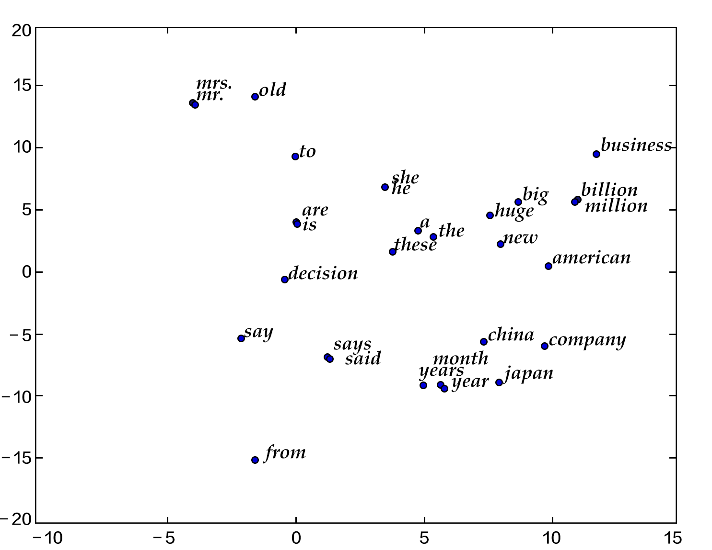
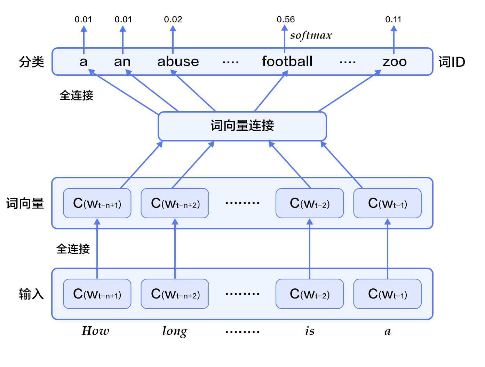
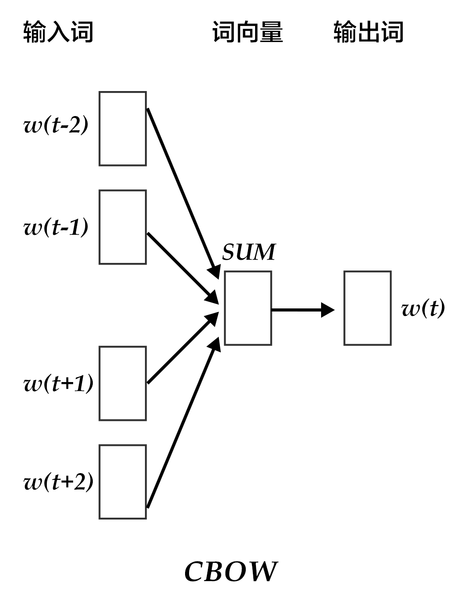
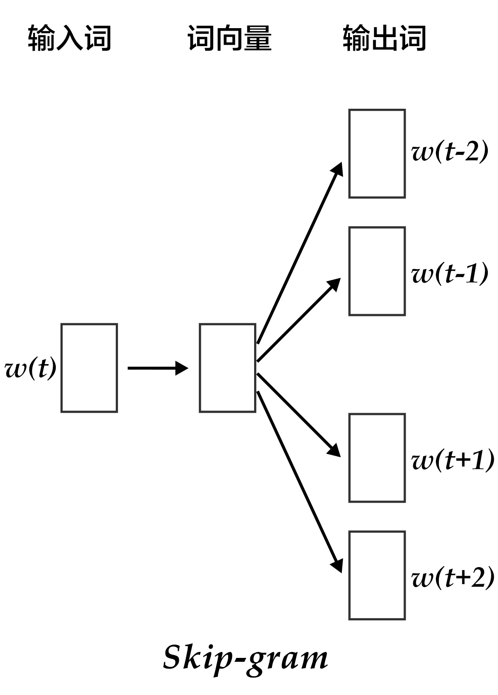
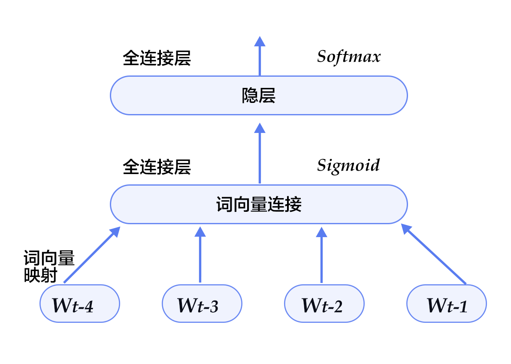

# 词向量

本教程源代码目录在[book/word2vec](https://github.com/PaddlePaddle/book/tree/develop/04.word2vec)， 初次使用请参考PaddlePaddle[安装教程](https://github.com/PaddlePaddle/book/blob/develop/README.cn.md#运行这本书)，更多内容请参考本教程的[视频课堂](http://bit.baidu.com/course/detail/id/175.html)。

## 背景介绍

本章我们介绍词的向量表征，也称为word embedding。词向量是自然语言处理中常见的一个操作，是搜索引擎、广告系统、推荐系统等互联网服务背后常见的基础技术。

在这些互联网服务里，我们经常要比较两个词或者两段文本之间的相关性。为了做这样的比较，我们往往先要把词表示成计算机适合处理的方式。最自然的方式恐怕莫过于向量空间模型(vector space model)。
在这种方式里，每个词被表示成一个实数向量（one-hot vector），其长度为字典大小，每个维度对应一个字典里的每个词，除了这个词对应维度上的值是1，其他元素都是0。

One-hot vector虽然自然，但是用处有限。比如，在互联网广告系统里，如果用户输入的query是“母亲节”，而有一个广告的关键词是“康乃馨”。虽然按照常理，我们知道这两个词之间是有联系的——母亲节通常应该送给母亲一束康乃馨；但是这两个词对应的one-hot vectors之间的距离度量，无论是欧氏距离还是余弦相似度(cosine similarity)，由于其向量正交，都认为这两个词毫无相关性。 得出这种与我们相悖的结论的根本原因是：每个词本身的信息量都太小。所以，仅仅给定两个词，不足以让我们准确判别它们是否相关。要想精确计算相关性，我们还需要更多的信息——从大量数据里通过机器学习方法归纳出来的知识。

在机器学习领域里，各种“知识”被各种模型表示，词向量模型(word embedding model)就是其中的一类。通过词向量模型可将一个 one-hot vector映射到一个维度更低的实数向量（embedding vector），如`$embedding(Mother's\ Day) = [0.3, 4.2, -1.5, ...], embedding(Carnation) = [0.2, 5.6, -2.3, ...]$`。在这个映射到的实数向量表示中，希望两个语义（或用法）上相似的词对应的词向量“更像”，这样如“母亲节”和“康乃馨”的对应词向量的余弦相似度就不再为零了。

词向量模型可以是概率模型、共生矩阵(co-occurrence matrix)模型或神经元网络模型。在用神经网络求词向量之前，传统做法是统计一个词语的共生矩阵`$X$`。`$X$`是一个`$|V| \times |V|$` 大小的矩阵，`$X_{ij}$`表示在所有语料中，词汇表`V`(vocabulary)中第i个词和第j个词同时出现的词数，`$|V|$`为词汇表的大小。对`$X$`做矩阵分解（如奇异值分解，Singular Value Decomposition \[[5](#参考文献)\]），得到的`$U$`即视为所有词的词向量：

$$X = USV^T$$

但这样的传统做法有很多问题：<br/>
1) 由于很多词没有出现，导致矩阵极其稀疏，因此需要对词频做额外处理来达到好的矩阵分解效果；<br/>
2) 矩阵非常大，维度太高(通常达到`$10^6*10^6$`的数量级)；<br/>
3) 需要手动去掉停用词（如although, a,...），不然这些频繁出现的词也会影响矩阵分解的效果。


基于神经网络的模型不需要计算存储一个在全语料上统计的大表，而是通过学习语义信息得到词向量，因此能很好地解决以上问题。在本章里，我们将展示基于神经网络训练词向量的细节，以及如何用PaddlePaddle训练一个词向量模型。


## 效果展示

本章中，当词向量训练好后，我们可以用数据可视化算法t-SNE\[[4](#参考文献)\]画出词语特征在二维上的投影（如下图所示）。从图中可以看出，语义相关的词语（如a, the, these; big, huge）在投影上距离很近，语意无关的词（如say, business; decision, japan）在投影上的距离很远。


<p align="center">
图1. 词向量的二维投影
</p>

另一方面，我们知道两个向量的余弦值在`$[-1,1]$`的区间内：两个完全相同的向量余弦值为1, 两个相互垂直的向量之间余弦值为0，两个方向完全相反的向量余弦值为-1，即相关性和余弦值大小成正比。因此我们还可以计算两个词向量的余弦相似度:

```
similarity: 0.899180685161
please input two words: big huge

please input two words: from company
similarity: -0.0997506977351
```

以上结果可以通过运行`calculate_dis.py`, 加载字典里的单词和对应训练特征结果得到，我们将在[应用模型](#应用模型)中详细描述用法。


## 模型概览

在这里我们介绍三个训练词向量的模型：N-gram模型，CBOW模型和Skip-gram模型，它们的中心思想都是通过上下文得到一个词出现的概率。对于N-gram模型，我们会先介绍语言模型的概念，并在之后的[训练模型](#训练模型)中，带大家用PaddlePaddle实现它。而后两个模型，是近年来最有名的神经元词向量模型，由 Tomas Mikolov 在Google 研发\[[3](#参考文献)\]，虽然它们很浅很简单，但训练效果很好。

### 语言模型

在介绍词向量模型之前，我们先来引入一个概念：语言模型。
语言模型旨在为语句的联合概率函数`$P(w_1, ..., w_T)$`建模, 其中`$w_i$`表示句子中的第i个词。语言模型的目标是，希望模型对有意义的句子赋予大概率，对没意义的句子赋予小概率。
这样的模型可以应用于很多领域，如机器翻译、语音识别、信息检索、词性标注、手写识别等，它们都希望能得到一个连续序列的概率。 以信息检索为例，当你在搜索“how long is a football bame”时（bame是一个医学名词），搜索引擎会提示你是否希望搜索"how long is a football game", 这是因为根据语言模型计算出“how long is a football bame”的概率很低，而与bame近似的，可能引起错误的词中，game会使该句生成的概率最大。

对语言模型的目标概率`$P(w_1, ..., w_T)$`，如果假设文本中每个词都是相互独立的，则整句话的联合概率可以表示为其中所有词语条件概率的乘积，即：

$$P(w_1, ..., w_T) = \prod_{t=1}^TP(w_t)$$

然而我们知道语句中的每个词出现的概率都与其前面的词紧密相关, 所以实际上通常用条件概率表示语言模型：

$$P(w_1, ..., w_T) = \prod_{t=1}^TP(w_t | w_1, ... , w_{t-1})$$


### N-gram neural model

在计算语言学中，n-gram是一种重要的文本表示方法，表示一个文本中连续的n个项。基于具体的应用场景，每一项可以是一个字母、单词或者音节。 n-gram模型也是统计语言模型中的一种重要方法，用n-gram训练语言模型时，一般用每个n-gram的历史n-1个词语组成的内容来预测第n个词。

Yoshua Bengio等科学家就于2003年在著名论文 Neural Probabilistic Language Models \[[1](#参考文献)\] 中介绍如何学习一个神经元网络表示的词向量模型。文中的神经概率语言模型（Neural Network Language Model，NNLM）通过一个线性映射和一个非线性隐层连接，同时学习了语言模型和词向量，即通过学习大量语料得到词语的向量表达，通过这些向量得到整个句子的概率。用这种方法学习语言模型可以克服维度灾难（curse of dimensionality）,即训练和测试数据不同导致的模型不准。注意：由于“神经概率语言模型”说法较为泛泛，我们在这里不用其NNLM的本名，考虑到其具体做法，本文中称该模型为N-gram neural model。

我们在上文中已经讲到用条件概率建模语言模型，即一句话中第`$t$`个词的概率和该句话的前`$t-1$`个词相关。可实际上越远的词语其实对该词的影响越小，那么如果考虑一个n-gram, 每个词都只受其前面`n-1`个词的影响，则有：

$$P(w_1, ..., w_T) = \prod_{t=n}^TP(w_t|w_{t-1}, w_{t-2}, ..., w_{t-n+1})$$

给定一些真实语料，这些语料中都是有意义的句子，N-gram模型的优化目标则是最大化目标函数:

$$\frac{1}{T}\sum_t f(w_t, w_{t-1}, ..., w_{t-n+1};\theta) + R(\theta)$$

其中`$f(w_t, w_{t-1}, ..., w_{t-n+1})$`表示根据历史n-1个词得到当前词`$w_t$`的条件概率，`$R(\theta)$`表示参数正则项。


<p align="center">
图2. N-gram神经网络模型
</p>

图2展示了N-gram神经网络模型，从下往上看，该模型分为以下几个部分：
- 对于每个样本，模型输入`$w_{t-n+1},...w_{t-1}$`, 输出句子第t个词为字典中`|V|`个词的概率。

每个输入词`$w_{t-n+1},...w_{t-1}$`首先通过映射矩阵映射到词向量`$C(w_{t-n+1}),...C(w_{t-1})$`。

- 然后所有词语的词向量连接成一个大向量，并经过一个非线性映射得到历史词语的隐层表示：

$$g=Utanh(\theta^Tx + b_1) + Wx + b_2$$

其中，`$x$`为所有词语的词向量连接成的大向量，表示文本历史特征；`$\theta$`、`$U$`、`$b_1$`、`$b_2$`和`$W$`分别为词向量层到隐层连接的参数。`$g$`表示未经归一化的所有输出单词概率，`$g_i$`表示未经归一化的字典中第`$i$`个单词的输出概率。

- 根据softmax的定义，通过归一化`$g_i$`, 生成目标词`$w_t$`的概率为：

$$P(w_t | w_1, ..., w_{t-n+1}) = \frac{e^{g_{w_t}}}{\sum_i^{|V|} e^{g_i}}$$

- 整个网络的损失值(cost)为多类分类交叉熵，用公式表示为

$$J(\theta) = -\sum_{i=1}^N\sum_{c=1}^{|V|}y_k^{i}log(softmax(g_k^i))$$

其中`$y_k^i$`表示第`$i$`个样本第`$k$`类的真实标签(0或1)，`$softmax(g_k^i)$`表示第i个样本第k类softmax输出的概率。


### Continuous Bag-of-Words model(CBOW)

CBOW模型通过一个词的上下文（各N个词）预测当前词。当N=2时，模型如下图所示：


<p align="center">
图3. CBOW模型
</p>

具体来说，不考虑上下文的词语输入顺序，CBOW是用上下文词语的词向量的均值来预测当前词。即：

$$context = \frac{x_{t-1} + x_{t-2} + x_{t+1} + x_{t+2}}{4}$$

其中`$x_t$`为第`$t$`个词的词向量，分类分数（score）向量 `$z=U*context$`，最终的分类`$y$`采用softmax，损失函数采用多类分类交叉熵。

### Skip-gram model

CBOW的好处是对上下文词语的分布在词向量上进行了平滑，去掉了噪声，因此在小数据集上很有效。而Skip-gram的方法中，用一个词预测其上下文，得到了当前词上下文的很多样本，因此可用于更大的数据集。


<p align="center">
图4. Skip-gram模型
</p>

如上图所示，Skip-gram模型的具体做法是，将一个词的词向量映射到`$2n$`个词的词向量（`$2n$`表示当前输入词的前后各`$n$`个词），然后分别通过softmax得到这`$2n$`个词的分类损失值之和。


## 数据准备

### 数据介绍

本教程使用Penn Treebank （PTB）（经Tomas Mikolov预处理过的版本）数据集。PTB数据集较小，训练速度快，应用于Mikolov的公开语言模型训练工具\[[2](#参考文献)\]中。其统计情况如下：

<p align="center">
<table>
<tr>
<td>训练数据</td>
<td>验证数据</td>
<td>测试数据</td>
</tr>
<tr>
<td>ptb.train.txt</td>
<td>ptb.valid.txt</td>
<td>ptb.test.txt</td>
</tr>
<tr>
<td>42068句</td>
<td>3370句</td>
<td>3761句</td>
</tr>
</table>
</p>


### 数据预处理

本章训练的是5-gram模型，表示在PaddlePaddle训练时，每条数据的前4个词用来预测第5个词。PaddlePaddle提供了对应PTB数据集的python包`paddle.dataset.imikolov`，自动做数据的下载与预处理，方便大家使用。

预处理会把数据集中的每一句话前后加上开始符号`<s>`以及结束符号`<e>`。然后依据窗口大小（本教程中为5），从头到尾每次向右滑动窗口并生成一条数据。

如"I have a dream that one day" 一句提供了5条数据：

```text
<s> I have a dream
I have a dream that
have a dream that one
a dream that one day
dream that one day <e>
```

最后，每个输入会按其单词次在字典里的位置，转化成整数的索引序列，作为PaddlePaddle的输入。

## 编程实现

本配置的模型结构如下图所示：


<p align="center">
图5. 模型配置中的N-gram神经网络模型
</p>

首先，加载所需要的包：

```python
import paddle
import paddle.fluid as fluid
import numpy
from functools import partial
import math
import os
import sys
```

然后，定义参数：
```python
EMBED_SIZE = 32  # word vector dimension
HIDDEN_SIZE = 256  # hidden layer dimension
N = 5  # train 5-gram
BATCH_SIZE = 32  # batch size

# can use CPU or GPU
use_cuda = os.getenv('WITH_GPU', '0') != '0'

word_dict = paddle.dataset.imikolov.build_dict()
dict_size = len(word_dict)
```

不同于之前的PaddlePaddle v2版本，在新的Fluid版本里，我们不必再手动计算词向量。PaddlePaddle提供了一个内置的方法`fluid.layers.embedding`，我们就可以直接用它来构造 N-gram 神经网络。

- 我们来定义我们的 N-gram 神经网络结构。这个结构在训练和预测中都会使用到。因为词向量比较稀疏，我们传入参数 `is_sparse == True`, 可以加速稀疏矩阵的更新。

```python
def inference_program(is_sparse):
first_word = fluid.layers.data(name='firstw', shape=[1], dtype='int64')
second_word = fluid.layers.data(name='secondw', shape=[1], dtype='int64')
third_word = fluid.layers.data(name='thirdw', shape=[1], dtype='int64')
fourth_word = fluid.layers.data(name='fourthw', shape=[1], dtype='int64')

embed_first = fluid.layers.embedding(
input=first_word,
size=[dict_size, EMBED_SIZE],
dtype='float32',
is_sparse=is_sparse,
param_attr='shared_w')
embed_second = fluid.layers.embedding(
input=second_word,
size=[dict_size, EMBED_SIZE],
dtype='float32',
is_sparse=is_sparse,
param_attr='shared_w')
embed_third = fluid.layers.embedding(
input=third_word,
size=[dict_size, EMBED_SIZE],
dtype='float32',
is_sparse=is_sparse,
param_attr='shared_w')
embed_fourth = fluid.layers.embedding(
input=fourth_word,
size=[dict_size, EMBED_SIZE],
dtype='float32',
is_sparse=is_sparse,
param_attr='shared_w')

concat_embed = fluid.layers.concat(
input=[embed_first, embed_second, embed_third, embed_fourth], axis=1)
hidden1 = fluid.layers.fc(input=concat_embed,
size=HIDDEN_SIZE,
act='sigmoid')
predict_word = fluid.layers.fc(input=hidden1, size=dict_size, act='softmax')
return predict_word
```

- 基于以上的神经网络结构，我们可以如下定义我们的`训练`方法

```python
def train_program(is_sparse):
# The declaration of 'next_word' must be after the invoking of inference_program,
# or the data input order of train program would be [next_word, firstw, secondw,
# thirdw, fourthw], which is not correct.
predict_word = inference_program(is_sparse)
next_word = fluid.layers.data(name='nextw', shape=[1], dtype='int64')
cost = fluid.layers.cross_entropy(input=predict_word, label=next_word)
avg_cost = fluid.layers.mean(cost)
return avg_cost
```

- 现在我们可以开始训练啦。如今的版本较之以前就简单了许多。我们有现成的训练和测试集：`paddle.dataset.imikolov.train()`和`paddle.dataset.imikolov.test()`。两者都会返回一个读取器。在PaddlePaddle中，读取器是一个Python的函数，每次调用，会读取下一条数据。它是一个Python的generator。

`paddle.batch` 会读入一个读取器，然后输出一个批次化了的读取器。`event_handler`亦可以一并传入`trainer.train`来时不时的输出每个步骤，批次的训练情况。

```python
def optimizer_func():
# Note here we need to choose more sophisticated optimizers
# such as AdaGrad with a decay rate. The normal SGD converges
# very slowly.
# optimizer=fluid.optimizer.SGD(learning_rate=0.001),
return fluid.optimizer.AdagradOptimizer(
learning_rate=3e-3,
regularization=fluid.regularizer.L2DecayRegularizer(8e-4))


def train(use_cuda, train_program, params_dirname):
train_reader = paddle.batch(
paddle.dataset.imikolov.train(word_dict, N), BATCH_SIZE)
test_reader = paddle.batch(
paddle.dataset.imikolov.test(word_dict, N), BATCH_SIZE)

place = fluid.CUDAPlace(0) if use_cuda else fluid.CPUPlace()

def event_handler(event):
if isinstance(event, fluid.EndStepEvent):
# We output cost every 10 steps.
if event.step % 10 == 0:
outs = trainer.test(
reader=test_reader,
feed_order=['firstw', 'secondw', 'thirdw', 'fourthw', 'nextw'])
avg_cost = outs[0]

print "Step %d: Average Cost %f" % (event.step, avg_cost)

# If average cost is lower than 5.8, we consider the model good enough to stop.
# Note 5.8 is a relatively high value. In order to get a better model, one should
# aim for avg_cost lower than 3.5. But the training could take longer time.
if avg_cost < 5.8:
trainer.save_params(params_dirname)
trainer.stop()

if math.isnan(avg_cost):
sys.exit("got NaN loss, training failed.")

trainer = fluid.Trainer(
train_func=train_program,
optimizer_func=optimizer_func,
place=place)

trainer.train(
reader=train_reader,
num_epochs=1,
event_handler=event_handler,
feed_order=['firstw', 'secondw', 'thirdw', 'fourthw', 'nextw'])
```

- `trainer.train`将会开始训练。从`event_handler`返回的监控情况如下：

```python
Step 0: Average Cost 7.337213
Step 10: Average Cost 6.136128
Step 20: Average Cost 5.766995
...
```

## 模型应用
在模型训练后，我们可以用它做一些预测。

### 预测下一个词
我们可以用我们训练过的模型，在得知之前的 N-gram 后，预测下一个词。

```python
def infer(use_cuda, inference_program, params_dirname=None):
place = fluid.CUDAPlace(0) if use_cuda else fluid.CPUPlace()
inferencer = fluid.Inferencer(
infer_func=inference_program, param_path=params_dirname, place=place)

# Setup inputs by creating 4 LoDTensors representing 4 words. Here each word
# is simply an index to look up for the corresponding word vector and hence
# the shape of word (base_shape) should be [1]. The length-based level of
# detail (lod) info of each LoDtensor should be [[1]] meaning there is only
# one lod_level and there is only one sequence of one word on this level.
# Note that lod info should be a list of lists.

data1 = [[211]]  # 'among'
data2 = [[6]]    # 'a'
data3 = [[96]]   # 'group'
data4 = [[4]]    # 'of'
lod = [[1]]

first_word  = fluid.create_lod_tensor(data1, lod, place)
second_word = fluid.create_lod_tensor(data2, lod, place)
third_word  = fluid.create_lod_tensor(data3, lod, place)
fourth_word = fluid.create_lod_tensor(data4, lod, place)

result = inferencer.infer(
{
'firstw': first_word,
'secondw': second_word,
'thirdw': third_word,
'fourthw': fourth_word
},
return_numpy=False)

print(numpy.array(result[0]))
most_possible_word_index = numpy.argmax(result[0])
print(most_possible_word_index)
print([
key for key, value in word_dict.iteritems()
if value == most_possible_word_index
][0])
```

在经历3分钟的短暂训练后，我们得到如下的预测。我们的模型预测 `among a group of` 的下一个词是`a`。这比较符合文法规律。如果我们训练时间更长，比如几个小时，那么我们会得到的下一个预测是 `workers`。


```python
[[0.00106646 0.0007907  0.00072041 ... 0.00049024 0.00041355 0.00084464]]
6
a
```

整个程序的入口很简单：

```python
def main(use_cuda, is_sparse):
if use_cuda and not fluid.core.is_compiled_with_cuda():
return

params_dirname = "word2vec.inference.model"

train(
use_cuda=use_cuda,
train_program=partial(train_program, is_sparse),
params_dirname=params_dirname)

infer(
use_cuda=use_cuda,
inference_program=partial(inference_program, is_sparse),
params_dirname=params_dirname)


main(use_cuda=use_cuda, is_sparse=True)
```


## 总结
本章中，我们介绍了词向量、语言模型和词向量的关系、以及如何通过训练神经网络模型获得词向量。在信息检索中，我们可以根据向量间的余弦夹角，来判断query和文档关键词这二者间的相关性。在句法分析和语义分析中，训练好的词向量可以用来初始化模型，以得到更好的效果。在文档分类中，有了词向量之后，可以用聚类的方法将文档中同义词进行分组，也可以用 N-gram 来预测下一个词。希望大家在本章后能够自行运用词向量进行相关领域的研究。


## 参考文献
1. Bengio Y, Ducharme R, Vincent P, et al. [A neural probabilistic language model](http://www.jmlr.org/papers/volume3/bengio03a/bengio03a.pdf)[J]. journal of machine learning research, 2003, 3(Feb): 1137-1155.
2. Mikolov T, Kombrink S, Deoras A, et al. [Rnnlm-recurrent neural network language modeling toolkit](http://www.fit.vutbr.cz/~imikolov/rnnlm/rnnlm-demo.pdf)[C]//Proc. of the 2011 ASRU Workshop. 2011: 196-201.
3. Mikolov T, Chen K, Corrado G, et al. [Efficient estimation of word representations in vector space](https://arxiv.org/pdf/1301.3781.pdf)[J]. arXiv preprint arXiv:1301.3781, 2013.
4. Maaten L, Hinton G. [Visualizing data using t-SNE](https://lvdmaaten.github.io/publications/papers/JMLR_2008.pdf)[J]. Journal of Machine Learning Research, 2008, 9(Nov): 2579-2605.
5. https://en.wikipedia.org/wiki/Singular_value_decomposition

<br/>
<a rel="license" href="http://creativecommons.org/licenses/by-sa/4.0/"></a><br /><span xmlns:dct="http://purl.org/dc/terms/" href="http://purl.org/dc/dcmitype/Text" property="dct:title" rel="dct:type">本教程</span> 由 <a xmlns:cc="http://creativecommons.org/ns#" href="http://book.paddlepaddle.org" property="cc:attributionName" rel="cc:attributionURL">PaddlePaddle</a> 创作，采用 <a rel="license" href="http://creativecommons.org/licenses/by-sa/4.0/">知识共享 署名-相同方式共享 4.0 国际 许可协议</a>进行许可。
