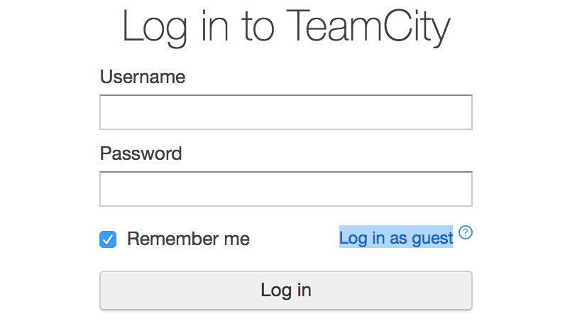

.. _how_to_install:

安装说明
^^^^^^^^

您可以使用我们提供的安装包，或使用源代码，安装PaddlePaddle。

.. _install_linux:

在Linux安装PaddlePaddle
--------

推荐您使用 `pip <https://pypi.org/project/pip/>`_
安装，它是Linux系统下最简单的安装方式。

注意事项：

- PaddlePaddle Python API 依赖Python 2.7版本。

执行下面的命令即可在当前机器上安装PaddlePaddle的运行时环境，并自动下载安装依赖软件。

  .. code-block:: bash

     pip install paddlepaddle

当前的默认版本为0.13.0，cpu_avx_openblas，您可以通过指定版本号来安装其它版本，例如：

  .. code-block:: bash

      pip install paddlepaddle==0.12.0

如果需要安装支持GPU的版本（cuda9.0_cudnn7_avx_openblas），需要执行：

  .. code-block:: bash

     pip install paddlepaddle-gpu

当前的默认版本是0.13.0，PaddlePaddle针对不同需求提供了更多版本的安装包，部分列表如下：

=================================   ========================================
版本号                               版本说明
=================================   ========================================
paddlepaddle-gpu==0.13.0            使用CUDA 9.0和cuDNN 7编译的0.13.0版本
paddlepaddle-gpu==0.12.0            使用CUDA 8.0和cuDNN 5编译的0.12.0版本
paddlepaddle-gpu==0.11.0.post87     使用CUDA 8.0和cuDNN 7编译的0.11.0版本
paddlepaddle-gpu==0.11.0.post8      使用CUDA 8.0和cuDNN 5编译的0.11.0版本
paddlepaddle-gpu==0.11.0            使用CUDA 7.5和cuDNN 5编译的0.11.0版本
=================================   ========================================

您可以在 `Release History <https://pypi.org/project/paddlepaddle-gpu/#history>`_
中找到paddlepaddle-gpu的各个发行版本。

如果需要获取并安装最新的（开发分支）PaddlePaddle，可以从我们的CI系统中下载最新的whl
安装包和c-api开发包并安装，您可以从下面的表格中找到需要的版本：

如果在点击下面链接时出现如下登陆界面，点击“Log in as guest”即可开始下载：

..  csv-table:: 各个版本最新的whl包
    :header: "版本说明", "cp27-cp27mu", "cp27-cp27m"
    :widths: 1, 3, 3

    "cpu_avx_mkl", "`paddlepaddle-latest-cp27-cp27mu-linux_x86_64.whl <https://guest:@paddleci.ngrok.io/repository/download/Manylinux1_CpuAvxCp27cp27mu/.lastSuccessful/paddlepaddle-latest-cp27-cp27mu-linux_x86_64.whl>`__", "`paddlepaddle-latest-cp27-cp27m-linux_x86_64.whl <https://guest:@paddleci.ngrok.io/repository/download/Manylinux1_CpuAvxCp27cp27mu/.lastSuccessful/paddlepaddle-latest-cp27-cp27m-linux_x86_64.whl>`__"
    "cpu_avx_openblas", "`paddlepaddle-latest-cp27-cp27mu-linux_x86_64.whl <https://guest:@paddleci.ngrok.io/repository/download/Manylinux1_CpuAvxOpenblas/.lastSuccessful/paddlepaddle-latest-cp27-cp27mu-linux_x86_64.whl>`__", "`paddlepaddle-latest-cp27-cp27m-linux_x86_64.whl <https://guest:@paddleci.ngrok.io/repository/download/Manylinux1_CpuAvxOpenblas/.lastSuccessful/paddlepaddle-latest-cp27-cp27m-linux_x86_64.whl>`__"
    "cpu_noavx_openblas", "`paddlepaddle-latest-cp27-cp27mu-linux_x86_64.whl <https://guest:@paddleci.ngrok.io/repository/download/Manylinux1_CpuNoavxOpenblas/.lastSuccessful/paddlepaddle-latest-cp27-cp27mu-linux_x86_64.whl>`__", "`paddlepaddle-latest-cp27-cp27m-linux_x86_64.whl <https://guest:@paddleci.ngrok.io/repository/download/Manylinux1_CpuNoavxOpenblas/.lastSuccessful/paddlepaddle-latest-cp27-cp27m-linux_x86_64.whl>`_"
    "cuda8.0_cudnn5_avx_mkl", "`paddlepaddle_gpu-latest-cp27-cp27mu-linux_x86_64.whl <https://guest:@paddleci.ngrok.io/repository/download/Manylinux1_Cuda80cudnn5cp27cp27mu/.lastSuccessful/paddlepaddle_gpu-latest-cp27-cp27mu-linux_x86_64.whl>`__", "`paddlepaddle_gpu-latest-cp27-cp27m-linux_x86_64.whl <https://guest:@paddleci.ngrok.io/repository/download/Manylinux1_Cuda80cudnn5cp27cp27mu/.lastSuccessful/paddlepaddle_gpu-latest-cp27-cp27m-linux_x86_64.whl>`__"
    "cuda8.0_cudnn7_avx_mkl", "`paddlepaddle_gpu-latest-cp27-cp27mu-linux_x86_64.whl <https://guest:@paddleci.ngrok.io/repository/download/Manylinux1_Cuda8cudnn7cp27cp27mu/.lastSuccessful/paddlepaddle_gpu-latest-cp27-cp27mu-linux_x86_64.whl>`__", "`paddlepaddle_gpu-latest-cp27-cp27m-linux_x86_64.whl <https://guest:@paddleci.ngrok.io/repository/download/Manylinux1_Cuda8cudnn7cp27cp27mu/.lastSuccessful/paddlepaddle_gpu-latest-cp27-cp27m-linux_x86_64.whl>`__"
    "cuda9.0_cudnn7_avx_mkl", "`paddlepaddle_gpu-latest-cp27-cp27mu-linux_x86_64.whl <https://guest:@paddleci.ngrok.io/repository/download/Manylinux1_Cuda90cudnn7avxMkl/.lastSuccessful/paddlepaddle_gpu-latest-cp27-cp27mu-linux_x86_64.whl>`__", "`paddlepaddle_gpu-latest-cp27-cp27m-linux_x86_64.whl <https://guest:@paddleci.ngrok.io/repository/download/Manylinux1_Cuda90cudnn7avxMkl/.lastSuccessful/paddlepaddle_gpu-latest-cp27-cp27m-linux_x86_64.whl>`__"

.. _FAQ:

安装常见问题和解决方法
======================

- paddlepaddle*.whl is not a supported wheel on this platform.

出现这个问题的主要原因是，没有找到和当前系统匹配的paddlepaddle安装包。
请检查Python版本是否为2.7系列。另外最新的pip官方源中的安装包默认是manylinux1标准，
需要使用最新的pip (>9.0.0) 才可以安装。

可以使用下面的命令更新您的pip：

  .. code-block:: bash

      pip install --upgrade pip

如果仍然存在问题，可以执行：

    .. code-block:: bash

        python -c "import pip; print(pip.pep425tags.get_supported())"

获取当前系统支持的安装包格式，并检查和需安装的包是否匹配。pypi安装包
可以在 `这里 <https://pypi.python.org/pypi/paddlepaddle/0.10.5>`_ 找到。

如果系统支持的是 linux_x86_64 而安装包是 manylinux1_x86_64 ，需要升级pip版本到最新；
如果系统支持 manylinux1_x86_64 而安装包（本地）是 linux_x86_64，
可以重命名这个whl包为 manylinux1_x86_64 再安装。

.. _install_windows:

在windows安装PaddlePaddle
------------------------------

若您的系统为windows，您可以通过Docker来使用PaddlePaddle。

推荐您下载 `PaddlePaddle快速安装包 <http://paddle-windows.bj.bcebos.com/PaddlePaddle-windows.zip>`_，
该安装包能够帮助您判断、安装适合的Docker，并引导您在Docker中使用PaddlePaddle。

..
 todo: windows的安装包要放在百度云上

注意事项：

* 系统要求：windows7&8&10。

* 下载安装包后，请您右键选择“以管理员身份运行”。

* PaddlePaddle不支持在windows使用GPU。

Docker安装完成后，请您执行下面的步骤：

请您右键选择”以管理员身份运行“，来启动Docker客户端

获取Image ID

.. code-block:: bash

   docker images

启动Docker

.. code-block:: bash

   docker run -d it -t imageid /bin/bash

获取Docker Container

.. code-block:: bash

   docker ps -a

进入Container

.. code-block:: bash

   docker attach container

.. _others:

其他安装方式
-------------

.. _source:
从源码编译
==========

.. _requirements:

需要的软硬件
"""""""""""""

为了编译PaddlePaddle，我们需要

1. 一台电脑，可以装的是 Linux, Windows 或者 MacOS 操作系统
2. Docker

不需要依赖其他任何软件了。即便是 Python 和 GCC 都不需要，因为我们会把所有编译工具都安装进一个 Docker 镜像里。

.. _build_step:

编译方法
"""""""""""""

PaddlePaddle需要使用Docker环境完成编译，这样可以免去单独安装编译依赖的步骤，可选的不同编译环境Docker镜像
可以在 `这里 <https://hub.docker.com/r/paddlepaddle/paddle_manylinux_devel/tags/>`_ 找到。或者
参考下述可选步骤，从源码中构建用于编译PaddlePaddle的Docker镜像。

如果您选择不使用Docker镜像，则需要在本机安装下面章节列出的 `附录：编译依赖`_ 之后才能开始编译的步骤。

编译PaddlePaddle，需要执行：

.. code-block:: bash

   # 1. 获取源码
   git clone https://github.com/PaddlePaddle/Paddle.git
   cd Paddle
   # 2. 可选步骤：源码中构建用于编译PaddlePaddle的Docker镜像
   docker build -t paddle:dev .
   # 3. 执行下面的命令编译CPU-Only的二进制
   docker run -it -v $PWD:/paddle -e "WITH_GPU=OFF" -e "WITH_TESTING=OFF" paddlepaddle/paddle_manylinux_devel:cuda8.0_cudnn5 bash -x /paddle/paddle/scripts/paddle_build.sh build
   # 4. 或者也可以使用为上述可选步骤构建的镜像（必须先执行第2步）
   docker run -it -v $PWD:/paddle -e "WITH_GPU=OFF" -e "WITH_TESTING=OFF" paddle:dev

注：上述命令把当前目录（源码树根目录）映射为 container 里的 :code:`/paddle` 目录。如果使用自行
构建的镜像（上述第4步）会执行 :code:`Dockerfile` 描述的默认入口程序 :code:`docker_build.sh` 可以省略步骤3中
最后的执行脚本的命令。

编译完成后会在build/python/dist目录下生成输出的whl包，可以选在在当前机器安装也可以拷贝到目标机器安装：

.. code-block:: bash

   pip install build/python/dist/*.whl

如果机器中已经安装过PaddlePaddle，有两种方法：

.. code-block:: bash

   1. 先卸载之前的版本，再重新安装
   pip uninstall paddlepaddle
   pip install build/python/dist/*.whl

   2. 直接升级到更新的版本
   pip install build/python/dist/*.whl -U

.. _run_test:

执行单元测试
"""""""""""""

如果您期望在编译完成后立即执行所有的单元测试，可以按照下面的方法：

设置 :code:`RUN_TEST=ON` 和 :code:`WITH_TESTING=ON` 就会在完成编译之后，立即执行单元测试。
开启 :code:`WITH_GPU=ON` 可以指定同时执行GPU上的单元测试。

.. code-block:: bash

   docker run -it -v $PWD:/paddle -e "WITH_GPU=OFF" -e "WITH_TESTING=ON" -e "RUN_TEST=ON" paddlepaddle/paddle_manylinux_devel:cuda8.0_cudnn5 bash -x /paddle/paddle/scripts/paddle_build.sh build

如果期望执行其中一个单元测试，（比如 :code:`test_sum_op` ）：

.. code-block:: bash

   docker run -it -v $PWD:/paddle -e "WITH_GPU=OFF" -e "WITH_TESTING=ON" -e "RUN_TEST=OFF" paddlepaddle/paddle_manylinux_devel:cuda8.0_cudnn5 bash -x /paddle/paddle/scripts/paddle_build.sh build
   cd /paddle/build
   ctest -R test_sum_op -V

.. _faq_docker:

常见问题
"""""""""""""

- 什么是 Docker?

  如果您没有听说 Docker，可以把它想象为一个类似 virtualenv 的系统，但是虚拟的不仅仅是 Python 的运行环境。

- Docker 还是虚拟机？

  有人用虚拟机来类比 Docker。需要强调的是：Docker 不会虚拟任何硬件，Docker container 里运行的编译工具实际上都是在本机的 CPU 和操作系统上直接运行的，性能和把编译工具安装在本机运行一样。

- 为什么用 Docker?

  把工具和配置都安装在一个 Docker image 里可以标准化编译环境。这样如果遇到问题，其他人可以复现问题以便帮助。

  另外，对于习惯使用Windows和MacOS的开发者来说，使用Docker就不用配置交叉编译环境了。

- 可以选择不用Docker吗？

  当然可以。大家可以用把开发工具安装进入 Docker image 一样的方式，把这些工具安装到本机。这篇文档介绍基于 Docker 的开发流程，是因为这个流程比其他方法都更简便。

- 学习 Docker 有多难？

  理解 Docker 并不难，大概花十分钟看一下 `这篇文章 <https://zhuanlan.zhihu.com/p/19902938>`_。
  这可以帮您省掉花一小时安装和配置各种开发工具，以及切换机器时需要新安装的辛苦。别忘了 PaddlePaddle 更新可能导致需要新的开发工具。更别提简化问题复现带来的好处了。

- 可以用 IDE 吗？

  当然可以，因为源码就在本机上。IDE 默认调用 make 之类的程序来编译源码，我们只需要配置 IDE 来调用 Docker 命令编译源码即可。

  很多 PaddlePaddle 开发者使用 Emacs。他们在自己的 `~/.emacs` 配置文件里加两行

  .. code-block:: bash

    (global-set-key "\C-cc" 'compile)
    (setq compile-command
     "docker run --rm -it -v $(git rev-parse --show-toplevel):/paddle paddle:dev")

  就可以按 `Ctrl-C` 和 `c` 键来启动编译了。

- 可以并行编译吗？

  是的。我们的 Docker image 运行一个 `Bash 脚本 <https://github.com/PaddlePaddle/Paddle/blob/develop/paddle/paddle/scripts/paddle_build.sh>`_。这个脚本调用 :code:`make -j$(nproc)` 来启动和 CPU 核一样多的进程来并行编译。

- Docker 需要 sudo

  如果用自己的电脑开发，自然也就有管理员权限（sudo）了。如果用公用的电脑开发，需要请管理员安装和配置好 Docker。此外，PaddlePaddle 项目在努力开始支持其他不需要 sudo 的集装箱技术，比如 rkt。

- 在 Windows/MacOS 上编译很慢

  Docker 在 Windows 和 MacOS 都可以运行。不过实际上是运行在一个 Linux 虚拟机上。可能需要注意给这个虚拟机多分配一些 CPU 和内存，以保证编译高效。具体做法请参考 `这个issue <https://github.com/PaddlePaddle/Paddle/issues/627>`_。

- 磁盘不够

  本文中的例子里， :code:`docker run` 命令里都用了 :code:`--rm` 参数，这样保证运行结束之后的 containers 不会保留在磁盘上。可以用 :code:`docker ps -a` 命令看到停止后但是没有删除的 containers。 :code:`docker build` 命令有时候会产生一些中间结果，是没有名字的 images，也会占用磁盘。可以参考 `这篇文章 <https://zaiste.net/posts/removing_docker_containers/>`_ 来清理这些内容。

.. _compile_deps:

附录：编译依赖
"""""""""""""

PaddlePaddle编译需要使用到下面的依赖（包含但不限于），其他的依赖软件，会自动在编译时下载。

.. csv-table:: PaddlePaddle编译依赖
   :header: "依赖", "版本", "说明"
   :widths: 10, 15, 30

   "CMake", ">=3.2", ""
   "GCC", "4.8.2", "推荐使用CentOS的devtools2"
   "Python", "2.7.x", "依赖libpython2.7.so"
   "pip", ">=9.0", ""
   "numpy", "", ""
   "SWIG", ">=2.0", ""
   "Go", ">=1.8", "可选"

.. _build_options:

附录：编译选项
"""""""""""""

PaddlePaddle的编译选项，包括生成CPU/GPU二进制文件、链接何种BLAS库等。
用户可在调用cmake的时候设置它们，详细的cmake使用方法可以参考
`官方文档 <https://cmake.org/cmake-tutorial>`_ 。

在cmake的命令行中，通过使用 ``-D`` 命令设置该类编译选项，例如：

..  code-block:: bash

    cmake .. -DWITH_GPU=OFF

..  csv-table:: 编译选项说明
    :header: "选项", "说明", "默认值"
    :widths: 1, 7, 2

    "WITH_GPU", "是否支持GPU", "ON"
    "WITH_C_API", "是否仅编译CAPI", "OFF"
    "WITH_DOUBLE", "是否使用双精度浮点数", "OFF"
    "WITH_DSO", "是否运行时动态加载CUDA动态库，而非静态加载CUDA动态库。", "ON"
    "WITH_AVX", "是否编译含有AVX指令集的PaddlePaddle二进制文件", "ON"
    "WITH_PYTHON", "是否内嵌PYTHON解释器", "ON"
    "WITH_STYLE_CHECK", "是否编译时进行代码风格检查", "ON"
    "WITH_TESTING", "是否开启单元测试", "OFF"
    "WITH_DOC", "是否编译中英文文档", "OFF"
    "WITH_SWIG_PY", "是否编译PYTHON的SWIG接口，该接口可用于预测和定制化训练", "Auto"
    "WITH_GOLANG", "是否编译go语言的可容错parameter server", "OFF"
    "WITH_MKL", "是否使用MKL数学库，如果为否则是用OpenBLAS", "ON"

BLAS
+++++

PaddlePaddle支持 `MKL <https://software.intel.com/en-us/intel-mkl>`_ 和
`OpenBlAS <http://www.openblas.net/>`_ 两种BLAS库。默认使用MKL。如果使用MKL并且机器含有AVX2指令集，
还会下载MKL-DNN数学库，详细参考 `这里 <https://github.com/PaddlePaddle/Paddle/tree/develop/doc/design/mkldnn#cmake>`_ 。

如果关闭MKL，则会使用OpenBLAS作为BLAS库。

CUDA/cuDNN
+++++++++++

PaddlePaddle在编译时/运行时会自动找到系统中安装的CUDA和cuDNN库进行编译和执行。
使用参数 :code:`-DCUDA_ARCH_NAME=Auto` 可以指定开启自动检测SM架构，加速编译。

PaddlePaddle可以使用cuDNN v5.1之后的任何一个版本来编译运行，但尽量请保持编译和运行使用的cuDNN是同一个版本。
我们推荐使用最新版本的cuDNN。

编译选项的设置
++++++++++++++

PaddePaddle通过编译时指定路径来实现引用各种BLAS/CUDA/cuDNN库。cmake编译时，首先在系统路径（ :code:`/usr/lib:/usr/local/lib` ）中搜索这几个库，同时也会读取相关路径变量来进行搜索。 通过使用 ``-D`` 命令可以设置，例如

..  code-block:: bash

    cmake .. -DWITH_GPU=ON -DWITH_TESTING=OFF -DCUDNN_ROOT=/opt/cudnnv5

**注意：这几个编译选项的设置，只在第一次cmake的时候有效。如果之后想要重新设置，推荐清理整个编译目录（** :code:`rm -rf` ）**后，再指定。**

.. _install_docker:

使用Docker安装运行
==================

使用Docker安装和运行PaddlePaddle可以无需考虑依赖环境。
您可以在 `Docker官网 <https://docs.docker.com/get-started/>`_
获得基本的Docker安装和使用方法。

在了解Docker的基本使用方法之后，即可开始下面的步骤：

.. _docker_pull:

获取PaddlePaddle的Docker镜像
""""""""""""""""""""""""""""

执行下面的命令获取最新的PaddlePaddle Docker镜像，版本为cpu_avx_mkl：

  .. code-block:: bash

     docker pull paddlepaddle/paddle

对于国内用户，我们提供了加速访问的镜像源：

  .. code-block:: bash

     docker pull docker.paddlepaddlehub.com/paddle

下载GPU版本（cuda8.0_cudnn5_avx_mkl）的Docker镜像：

  .. code-block:: bash

     docker pull paddlepaddle/paddle:latest-gpu
     docker pull docker.paddlepaddlehub.com/paddle:latest-gpu

选择下载使用不同的BLAS库的Docker镜像：

  .. code-block:: bash

     # 默认是使用MKL的镜像
     docker pull paddlepaddle/paddle
     # 使用OpenBLAS的镜像
     docker pull paddlepaddle/paddle:latest-openblas

下载指定版本的Docker镜像，可以从 `DockerHub网站 <https://hub.docker.com/r/paddlepaddle/paddle/tags/>`_ 获取可选的tag，并执行下面的命令：

  .. code-block:: bash

     docker pull paddlepaddle/paddle:[tag]
     # 比如：
     docker pull docker.paddlepaddlehub.com/paddle:0.11.0-gpu

.. _docker_run:

在Docker中执行PaddlePaddle训练程序
"""""""""""""""""""""""""""""""""""

假设您已经在当前目录（比如在/home/work）编写了一个PaddlePaddle的程序 :code:`train.py` （可以参考
`PaddlePaddleBook <http://www.paddlepaddle.org/docs/develop/book/01.fit_a_line/index.cn.html>`_
编写），就可以使用下面的命令开始执行训练：

  .. code-block:: bash

     cd /home/work
     docker run -it -v $PWD:/work paddlepaddle/paddle /work/train.py

上述命令中， :code:`-it` 参数说明容器已交互式运行； :code:`-v $PWD:/work`
指定将当前路径（Linux中$PWD变量会展开为当前路径的绝对路径）挂载到容器内部的 :code:`/work`
目录； :code:`paddlepaddle/paddle` 指定需要使用的容器； 最后 :code:`/work/train.py`
为容器内执行的命令，即运行训练程序。

当然，您也可以进入到Docker容器中，以交互式的方式执行或调试您的代码：

  .. code-block:: bash
     docker run -it -v $PWD:/work paddlepaddle/paddle /bin/bash
     cd /work
     python train.py

**注：PaddlePaddle Docker镜像为了减小体积，默认没有安装vim，您可以在容器中执行** :code:`apt-get install -y vim` **安装后，在容器中编辑代码。**

.. _docker_run_book:

使用Docker启动PaddlePaddle Book教程
""""""""""""""""""""""""""""""""""""

使用Docker可以快速在本地启动一个包含了PaddlePaddle官方Book教程的Jupyter Notebook，可以通过网页浏览。
PaddlePaddle Book是为用户和开发者制作的一个交互式的Jupyter Notebook。
如果您想要更深入了解deep learning，PaddlePaddle Book一定是您最好的选择。
大家可以通过它阅读教程，或者制作和分享带有代码、公式、图表、文字的交互式文档。

我们提供可以直接运行PaddlePaddle Book的Docker镜像，直接运行：

  .. code-block:: bash

     docker run -p 8888:8888 paddlepaddle/book

国内用户可以使用下面的镜像源来加速访问：

  .. code-block: bash

    docker run -p 8888:8888 docker.paddlepaddlehub.com/book

然后在浏览器中输入以下网址：

  .. code-block:: text

     http://localhost:8888/

就这么简单，享受您的旅程！

.. _docker_run_gpu:

使用Docker执行GPU训练
""""""""""""""""""""""""""""

为了保证GPU驱动能够在镜像里面正常运行，我们推荐使用
`nvidia-docker <https://github.com/NVIDIA/nvidia-docker>`_ 来运行镜像。
请不要忘记提前在物理机上安装GPU最新驱动。

  .. code-block:: bash

     nvidia-docker run -it -v $PWD:/work paddlepaddle/paddle:latest-gpu /bin/bash

**注: 如果没有安装nvidia-docker，可以尝试以下的方法，将CUDA库和Linux设备挂载到Docker容器内：**

  .. code-block:: bash

     export CUDA_SO="$(\ls /usr/lib64/libcuda* | xargs -I{} echo '-v {}:{}') $(\ls /usr/lib64/libnvidia* | xargs -I{} echo '-v {}:{}')"
     export DEVICES=$(\ls /dev/nvidia* | xargs -I{} echo '--device {}:{}')
     docker run ${CUDA_SO} ${DEVICES} -it paddlepaddle/paddle:latest-gpu

**关于AVX：**

AVX是一种CPU指令集，可以加速PaddlePaddle的计算。最新的PaddlePaddle Docker镜像默认
是开启AVX编译的，所以，如果您的电脑不支持AVX，需要单独
`编译 <./build_from_source_cn.html>`_ PaddlePaddle为no-avx版本。

以下指令能检查Linux电脑是否支持AVX：

   .. code-block:: bash

      if cat /proc/cpuinfo | grep -i avx; then echo Yes; else echo No; fi

如果输出是No，就需要选择使用no-AVX的镜像
