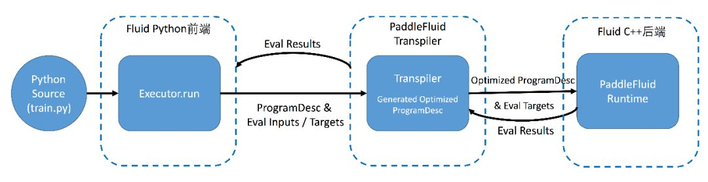
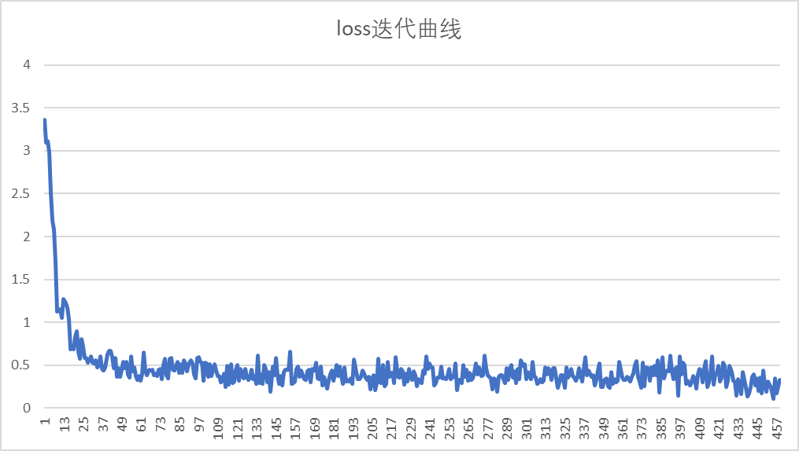

================================
PaddleFluid设计思想和基本使用概念
================================

Paddle Fluid 是用来让用户像 PyTorch 和 Tensorflow Eager Execution 一样执行程序。
在这些系统中，不再有模型这个概念，应用也不再包含一个用于描述 Operator 图或者一系列层的符号描述，
而是像通用程序那样描述训练或者预测的过程。

深度学习平台的演化
================

时至今日，深度学习已成为事实上最流行的机器学习技术。学术界多年研究加上工业界的长期实践提出了若干有效的基本建模单元：
全连接，卷积，循环神经网络等；设计各类训练技巧：初始化方法，跨层连接，各类 norm 技术等；
发明了各种新的优化算法：Adadelta，Adam 等；
各类固定的网络结构：highway, residual, attention 等纷纷涌现，不胜枚举。
学术界工业界多年的付出共同促成了深度学习方法今日的影响力。

学术研究和生产实践中积累了大量的知识，能够很好的解释神经网络中基本模块各自独的学习能力和特性。
基本模块和训练技术的组合能够搭建出千变万化的神经网络模型。
基本模块和训练技术是有限的，但他们的组合却是千变万化，这是深度学习方法的魅力所在，也是难度所在。

正是这样高度的模块化特性，研究者和工程师们都在努力避免重复造轮子以提高研究和生产的效率，
又进一步催生了深度学习平台技术的发展，深度学习框架已演变成为 AI 基础设施中重要的一部分。
从 Theano，到 DistBelief，到 TensorFlow；从 Caffe 到 Caffe2；
从 Torch 到 PyTorch；从 PaddlePaddle 到 PaddleFluid，
深度学习平台技术也经历了两代的演化，并向着第三代平台技术迈进。

站在历史发展的今天，当我们准备切换尝试使用一个新的深度学习平台作为支持自己学习和研究的工具时，
平台技术都发生了哪些演化，能够为我们的带来什么便利呢？

先让我们来看看深度学习框架解决的三大问题：

- 如何描述计算以支持未来潜在会出现的新模型？
- 如何高效利用异构设备最大化算力？
- 如何利用网络中的计算机进行分布式计算来处理千万亿级别的数据？

以上三个问题中的第一个和使用者研究者最为密切相关。
这篇文章我们通过分析 PaddleFluid的设计理念，
来了解一个深度学习框架如何抽象深度学习模型，来看看我们的使用经验如何在不同深度学习平台之间过度和迁移。

如何描述计算
=============

让我们首先来看看 PaddleFluid 如何描述机器学习模型

PaddleFluid之 :code:`Program`

如何描述计算很大程度决定了一个神经网络框架计算功能的完备性。
深度学习模型和方法历经二十多年的发展：“依次执行一组计算的前向，
再以和前向计算相反的顺序执行反向计算，中间无分支无交互”，
这样的模型结构已经无法满足研究者和千千万万框架使用者的想象力。

从 `PaddleFluid 的设计目标 <https://github.com/PaddlePaddle/Paddle/blob/develop/doc/fluid/design/motivation/fluid.md>`_ 来看，
在如何描述机器学习模型这一核心问题上，PaddleFluid 的目标是：
创造一种新的计算描述方式，不但能够描述至今为止人们已知的主流神经网络模型，并且能够支持未来会出现的任意模型。

PaddleFluid 是如何做到支持未来出现的新模型这一目标呢？PaddleFluid 的设计选择是：
对用户来说，用一段 :code:`Program` （在 PaddleFluid 内部会被转化为一种叫作 :code:`ProgramDesc` 的描述语言），
而不是用计算图来描述机器学习模型。 :code:`Program` 用符合用户使用直觉的方式，
提供一种新的描述语言能够描述任意复杂的机器学习模型。

对所有计算机专业同学学习编程语言的第一课一定是建立对“程序语言的三种执行结构：顺序执行，条件选择和循环执行”的认识。
计算机世界的所有可计算逻辑都是由这三种执行结构表示，用这三种结构描述的逻辑是可计算的。那么同样道理，
对一个神经网络框架来说，如果可以和程序语言一样提供对这三种执行结构的支持，那么将可以描述任意复杂的，
可被计算机计算的机器学习模型。PaddleFluid通过提供对这三种执行结构的支持，来做到对任意复杂模型的描述。

具体来说：

1. Fluid 的核心设计理念都可以类比到程序语言，如果已经有写程序的经验，那么使用 Fluid 构建神经网络模型的体验，将非常接近写程序；

2. 在 PaddleFluid 中，用户不会显示地感知“计算图”这样的概念，一个机器学习模型被描述为一个 Fluid :code:`Program` （Fluid 内部称之为 :code:`ProgramDesc` ）；

- 一个 Fluid :code:`Program` 由一组嵌套的 :code:`Block` 构成。 :code:`Block` 的概念可以类比到 C++ 或是 Java 中的一对大括号，或是 Python 语言中的一个缩进快；
-  :code:`Block` 中的计算由顺序执行、条件选择或者循环执行三种方式组合，构成复杂的计算逻辑。

3. Fluid :code:`Program` 中包含对计算和计算对象的描述。计算的描述称之为 Operator；计算作用的对象（或者说 Operator 的输入和输出）被统一为 Tensor。

在描述计算和计算的作用对象这一问题上，各个深度学习框架的选择是相同的，如果有一个平台的使用经验，那么将非常容易在各个平台之间进行迁移。

核心使用概念
=============

下面，我们将更详细地了解核心使用概念在PaddlePaddle的使用方法。

数据表示和计算的对象：Tensor
--------------------------

Tensor 是向量矩阵概念的扩展，是神经网络模型计算操作的基本对象。这在是今天所有主流深度学习平台的共同选择。

可以简单地将 Tensor 理解为一个 N 维向量，它可以有任意多的维度。一个 Tensor 具有两个基本特征：

1. 数据类型：每个 Tensor 的所有元素具有同样的、已知的数据类型；

2. 大小（或者说形状）：即维度的个数（rank，阶）以及各维度的长度。

Tensor 某些维度的长度在定义模型阶段可能是未知的，在实际算法执行时才能确定。例如一个 mini-batch 中包含的样本数目（batch size），或者是一个 mini-batch 中序列的最大长度。

PaddleFluid中的Tensor
""""""""""""""""""""""

PaddleFluid 中也使用 Tensor 作为神经网络中输入输出数据的统一表示。Tensor 的概念在今天主流的深度学习平台中都是完全相同，可以在各个深度学习框架之间直接无缝迁移。

在 Fluid 中也同样存在三种特殊的 Tensor：

1. 模型中的可学习参数

模型中的可学习参数生存期和整个训练任务一样长，会接受优化算法的更新。在 PaddleFluid 中同样以 :code:`Variable` 表示；
用户在绝大多数情况下都不需要自己来创建网络中的可学习参数，Fluid 为几乎常见的神经网络基本计算模块都提供了封装。
以最简单的全连接模型为例，下面的代码片段会直接为全连接层创建连接权值 WW 和偏置（ :code:`bias` ）两个可学习参数，
无需显示地调用 variable 相关接口创建可学习参数。

::

  import paddle.fluid as fluid

  y = fluid.layers.fc(input=x, size=128, bias_attr=True)

2. 输入输出Tensor

整个神经网络的输入数据也是一个特殊的 Tensor，在这个 Tensor 中，
一些维度的大小在定义模型时无法确定（通常包括：batch size；
如果 mini-batch 之间，数据可变，也会包括序列的最大长度，图片的宽度和高度等），在定义模型时需要占位；
PaddleFluid 中使用 :code:`fluid.layers.data` 来接入输入数据， :code:`fluid.layer.data` 需要提供输入 Tensor 的 形状信息，
当遇到无法确定的维度 时， 相应维度指定为 None ，如下面的代码片段所示：

::

  import paddle.fluid as fluid

  x = fluid.layers.data(name="x", shape=[2, None, 3], dtype="int64")

3. 常量 Tensor 在 PaddleFluid 中需要通过组合 Tensor 和 :code:`fluid.layers.assign` 来实现。

计算原语：Operation/Operator
----------------------------

Tensor 是今天所有主流深度学习框架的统一数据表示（输入、输出、中间计算结果、模型的可学习参数都是 Tensor）。
另一方面，对数据的操作，在主流深度学习框架中也高度统一为：Operator/Operation。
在中文中，通常我们会习惯将其称之为算子。

注：在 PaddleFluid 中使用 Operator 称呼对 Tensor 的操作。

Operation/Operator 接受多个 Tensor 作为输入，输出若干个 Tensor，表示了从输入到输出的变化。

PaddleFluid中的Operator
""""""""""""""""""""""""

PaddleFluid 支持的所有算子，可以在 `API 帮助文档 <http://www.paddlepaddle.org/docs/develop/api/en/fluid/layers.html>`_ 中查看。

为了便于用户使用，在 Python 端，Fluid 中的 Operator 被进一步封装入 :code:`paddle.fluid.layers` ，
:code:`paddle.fluid.networks` 等模块。这是因为：一些常见的对Tensor的操作可能是有更多基础操作构成，
例如：l2 norm 内部由 reduce、elementwise_add，scale 等多个 Operator 组合计算逻辑完成，
为了提高使用的便利性，框架内部对基础 Operator 进行了一些封装，包括创建 Operator 依赖可学习参数，
可学习参数的初始化细节等，减少用户重复开发的成本。

对所有深度学习框架都面临同样的封装，在绝大多数情况下，用户很少会直接与框架底层的 Operator 直接打交道，而是使用框架提供的 layers，networks 等模块，降低开发的代码量。不论是什么样的概念，他们在各框架之间的本质和作用都是相同的：对 Tensor 的变换。

总结
>>>>>>

不论叫作 Operation、Operator 还是 layers，他们在各深度学习平台中的含义和作用都是相同的：对 Tensor 的变换。是一个深度学习平台提供的基础计算能力。可以在每个平台各自的 API 帮助文档中查到。

在各个深度学习平台都已加入 ONNX 项目的今天，每个深度学习平台提供给大家的基本算子都已趋同，与此同时，每个平台也各有其特点，会提供一些独特的算子，方便某一类任务的开发。

构建模型并执行
--------------

整个训练任务运行方法如下：

Fluid中的Program和Executor
"""""""""""""""""""""""""""

1. Fluid 使用 :code:`Program` 描述神经网络模型，对用户来说，并没有计算图的概念。
用户定义的所有 Tensor 以及对 Tensor 的操作：Operator 都会被加入一段 :code:`Program` 中；

一段 Program 由嵌套的 :code:`Block` 构成，但用户无需显示地创建 :code:`Block` 或是显示地注意到 :code:`Block` 的存在；
在 Fluid 程序中， :code:`Block` 是在调用 :code:`while_op` ， :code:`if_op` ， :code:`parallel_do` 等特殊 :code:`Operator` 时，由这些 :code:`Operator` 来创建；
对用户使用来说，只需要知道自己正在向一段 Fluid Program 中添加变量（ :code:`Tensor` ）和操作（ :code:`Operator` ）即可。

2. Fluid 利用 :code:`Executor` 来执行一段 Fluid :code:`Program` 。

为进一步理解 Fluid 中 :code:`Executor` 的作用，需要先解释一下 Fluid 程序的执行流程。 下图展示单机上，Fluid 程序的执行流程：

   :scale: 50%
   :align: center

   Figure.1

   Fluid本地训练任务执行流程图

1. Fluid 设计思想和灵感非常类似于程序设计语言，和高级编译语言 C++/Java 编写程序的过程非常类似，Fluid 程序执行分为两个重要阶段：编译时和运行时；

2. 编译期，用户通过调用 Fluid 提供的算子，向一段 :code:`Program` 中添加变量（Tensor）以及对变量的操作（Operators 或者 Layers）。用户只需要描述核心的前向计算，不需要关心反向计算，分布式下，异构设备下如何计算；

3. 原始的 :code:`Program` 在平台内部转换为中间描述语言： :code:`ProgramDesc` ；

4. 编译期最重要的一个功能模块是 Transpiler。Transpiler 接受一段 :code:`ProgramDesc` ，输出一段变化后的 :code:`ProgramDesc` ，作为后端 Executor 最终需要执行的 :code:`Fluid Program` ；

最为常用的 Transipler 包括：

1. 内存优化 Transipler：通过对变量读写依赖关系分析，插入内存回收 Operator 以维持运行过程中较小的内存开销；

2. 分布式环境下的 Transpiler：接受用户定义的 local Program ，生成 Parameter Client 和 Parameter Server 执行的两段 :code:`Program` 。

3. 后端 Executor 接受 Transpiler 输出的这段 :code:`Program` ，依次执行其中的 Operator（可以类比为程序语言中的指令），在执行过程中会为 Operator 创建所需的输入输出并进行管理。

从上面的过程中可以看到，Fluid 程序的执行过程分为：编译器的定义 :code:`Program` ，和创建 :code:`Executor` 运行 :code:`Program` 。
 :code:`Executor` 执行一段 :code:`Program` 的过程是不可交互和不可中断的。

在 Fluid 中，可以创建多余一段 :code:`Program` 。默认情况，一个 PaddleFluid 程序中存在 2 段 Program：

1.  :code:`fluid.framework.default_startup_program` ：其中定义了创建模型参数，输入输出，以及模型中可学习参数的初始化等各种操作；

-  :code:`default_startup_program` 可以由框架自动生成，使用时无需显示地创建；
- 如果调用修改了参数的默认初始化方式，框架会自动的将相关的修改加入 :code:`default_startup_program` 。

2.  :code:`fluid.framework.default_main_program` ：定义了神经网络模型，前向反向计算，以及优化算法对网络中可学习参数的更新；

- 使用 Fluid 的核心就是构建起 :code:`default_main_program` 。

3. PaddleFluid 中的 :code:`Scope` 类似于 TensorFlow 中的 collection 这一概念，但在 Fluid 中 :code:`Scope` 是框架后端概念，用户无法直接操作。因此，在使用框架时无需关心。

总结
"""""

Fluid 中通过 Executor 来执行一段用户定义的 Fluid :code:`Program` 。
1. Executor 连接了 Fluid 的前端和后端；

2. Executor 接受用户定义的原始模型（一段 :code:`Program` ），通过调用系统中不同功能更的 :code:`Transpiler` 完成对原始 :code:`Program` 的变化，进行优化。

完整实例：如何完成一个机器学习模型的训练
===================================

这一节，我们以 MNIST 手写数字识别问题 —— 机器学习任务的“Hello World”问题和数据，为例，通过一个可以运行的完整实例，来学习上文介绍的概念如何在PaddleFluid 平台使用。

步骤1：定义数据
----------------

PaddleFluid 中以 :code:`fluid.layers.data` 来接收输入数据。

::

  import numpy as np

  import paddle.fluid as fluid
  import paddle.v2 as paddle

  # define the input layers for the network.
  x = fluid.layers.data(name="img", shape=[1, 28, 28], dtype="float32")
  y_ = fluid.layers.data(name="label", shape=[1], dtype="int64")

Fluid 中 Tensor 的第 0 维度固定为 batch size。在上面代码段中，图像输入 :code:`x` 的形状为：[1, 28, 28]。这三个维度的含义分别是：channel 数目，图像的高度和宽度。

实际上 Fluid 框架内部,一幅图像输入是一个 4-D Tensor，所有 Tensor 的第 0 维固定为 batch size。框架内部会自动为batch size进行填充占位。无需对batch size指定填充占位。

如果除去 batch size（第 0 维度）外，如果 Tensor 某一维度的大小只能在运行时确定，可以在该位置上直接指定 :code:`None` 进行占位。

步骤2：定义模型
--------------

通过调用 Fluid 提供的算子定义含有一个隐层的神经网络。Fluid 模型的分为模型结构和优化方法两部分。这一点与 TensorFlow 程序十分相似似，使用概念可以直接对应进行迁移。

::

  # define the network topology.
  y = fluid.layers.fc(input=x, size=10, act="softmax")
  loss = fluid.layers.cross_entropy(input=y, label=y_)
  avg_loss = fluid.layers.mean(loss)

  # define the optimization algorithm.
  optimizer = fluid.optimizer.Adam(learning_rate=1e-3)
  optimizer.minimize(avg_loss)

Fluid 使用 Program 而不是计算图描述模型，一般情况下，用户无需关心 Program 的细节，当调用以上 layers 时，会向一个全局的 Program： :code:`fluid.framework.default_main_program` 中插入变量（Tensor）和对变量的操作（上述代码段中的 layers 和 optimzier）。

步骤3：参数初始化
----------------

如上文介绍，Fluid 程序中的 Executor 是连接 Fluid 前端和后端的接口。

默认一个Fluid模型存在至少两段 Program。用于初始化网络中的可学习参数的那一段 :code:`Program` 叫作 :code:`fluid.default_startup_program()` 。

只有执行器 executor 可以执行 Fluid Program，因此，在初始化网络中的可学习参数之前，需要首先创建一个 Fluid executor。

::

  # define the executor.
  place = fluid.CPUPlace()
  exe = fluid.Executor(place)
  exe.run(fluid.default_startup_program())

在以上代码段中， :code:`place` 用于告诉 executor 一段 Fluid Program 在何种设备上执行，
常见的有 :code:`fluid.CPUPlace()` 和 :code:`fluid.CUDAPlace()` 。

步骤4：数据输入 + 执行模型训练
----------------------------

我们在步骤 2 中定义的神经网络模型最终被插入一段叫做 :code:`fluid.framework.default_main_program` 的 Fluid Program 中。

网络可学习参数初始化之后，可以通过让执行器 Executor 执行这段 :code:`fluid.framework.default_main_program` 来进行训练。

::

  train_reader = paddle.batch(
        paddle.reader.shuffle(paddle.dataset.mnist.train(), buf_size=5000),
        batch_size=BATCH_SIZE)
  feeder = fluid.DataFeeder(place=place, feed_list=[x, y_])

  for pass_id in range(100):
    for batch_id, data in enumerate(train_reader()):
        loss = exe.run(
            fluid.framework.default_main_program(),
            feed=feeder.feed(data),
            fetch_list=[avg_loss])
        print("Cur Cost : %f" % (np.array(loss[0])[0]))

从上面的代码片段中可以看到，Fluid 程序的训练过程和 TensorFlow 程序的训练过程非常接近，
都放在一个 :code:`for` 循环中，循环读取一个 mini-batch 数据，
调用执行器执行 Fluid :code:`default_main_program` ：接收 mini-batch 输入，在其上进行前向，反向和参数更新计算。

`注：上面程序使用了 Fluid 内置的 MNIST 数据，和我们提供给 TensorFlow 示例程序的 MNIST 数据完全一样。`

步骤5：观察模型效果
-----------------

以上步骤已经构成了完整的 Tensorflow 模型训练程序，每个 batch 观察一次 loss，可以直观看到模型的迭代效果：

   :scale: 40%
   :align: center

   Figure.2

   Fluid MNIST手写数字识别任务代价下降曲线

附：完整代码
------------

::

  import numpy as np

  import paddle.fluid as fluid
  import paddle.v2 as paddle

  def main():
      BATCH_SIZE = 128

      # define the input layers for the network.
      x = fluid.layers.data(name="img", shape=[1, 28, 28], dtype="float32")
      y_ = fluid.layers.data(name="label", shape=[1], dtype="int64")

      # define the network topology.
      y = fluid.layers.fc(input=x, size=10, act="softmax")
      loss = fluid.layers.cross_entropy(input=y, label=y_)
      avg_loss = fluid.layers.mean(loss)

      optimizer = fluid.optimizer.Adam(learning_rate=5e-3)
      optimizer.minimize(avg_loss)

      # define the executor.
      place = fluid.CPUPlace()
      exe = fluid.Executor(place)
      exe.run(fluid.default_startup_program())

      train_reader = paddle.batch(
          paddle.reader.shuffle(paddle.dataset.mnist.train(), buf_size=5000),
          batch_size=BATCH_SIZE)
      feeder = fluid.DataFeeder(place=place, feed_list=[x, y_])

      for pass_id in range(100):
          for batch_id, data in enumerate(train_reader()):
              loss = exe.run(
                  fluid.framework.default_main_program(),
                  feed=feeder.feed(data),
                  fetch_list=[avg_loss])
              print("Cur Cost : %f" % (np.array(loss[0])[0]))

  if __name__ == "__main__":
      main()
