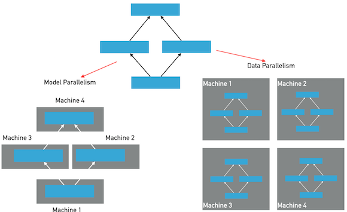

.. _cluster_howto

Fluid分布式训练使用手册
====================

分布式训练基本思想
---------------

分布式深度学习训练通常分为两种并行化方法：数据并行，模型并行，参考下图：

在模型并行方式下，模型的层和参数将被分布在多个节点上，模型在一个mini-batch的前向和反向训练中，将经过多次跨\
节点之间的通信。每个节点只保存整个模型的一部分；在数据并行方式下，每个节点保存有完整的模型的层和参数，每个节点\
独自完成前向和反向计算，然后完成梯度的聚合并同步的更新所有节点上的参数。Fluid目前版本仅提供数据并行方式，另外\
诸如模型并行的特例实现（超大稀疏模型训练）功能将在后续的文档中予以说明。

在数据并行模式的训练中，Fluid使用了两种通信模式，用于应对不同训练任务对分布式训练的要求，分别为RPC通信和Collective
通信。其中RPC通信方式使用 `gRPC <https://github.com/grpc/grpc/>`_ ，Collective通信方式使用
`NCCL2 <https://developer.nvidia.com/nccl>`_ 。

.. csv-table:: 下面是一个RPC通信和Collective通信的横向对比：
   :header: "Feature", "Coolective", "RPC"

   "Ring-Based通信", "Yes", "No"
   "异步训练", "Yes", "Yes"
   "分布式模型", "No", "Yes"
   "容错训练", "No", "Yes"
   "性能", "Faster", "Fast"

- RPC通信方式的结构：

  .. image:: src/dist_train_pserver.png

  使用RPC通信方式的数据并行分布式训练，会启动多个pserver进程和多个trainer进程，每个pserver进程\
  会保存一部分模型参数，并负责接收从trainer发送的梯度并更新这些模型参数；每个trainer进程会保存一份\
  完整的模型，并使用一部分数据进行训练，然后向pserver发送梯度，最后从pserver拉取更新后的参数。

  pserver进程可以在和trainer完全不同的计算节点上，也可以和trainer公用节点。一个分布式任务所需要的\
  pserver进程个数通常需要根据实际情况调整，已达到最佳的性能，然而通常来说pserver的进程不会比trainer\
  更多。

  在使用GPU训练时，pserver可以选择使用GPU或只使用CPU，如果pserver也使用GPU，则会增加一次从CPU拷贝\
  接收到的梯度数据到GPU的开销，在某些情况下会导致整体训练性能降低。

- NCCL2通信方式的结构：

  .. image:: src/dist_train_nccl2.png

  使用NCCL2（Collective通信方式）进行分布式训练，是不需要启动pserver进程的，每个trainer进程都保存\
  一份完整的模型参数，在完成计算梯度之后通过trainer之间的相互通信，Reduce梯度数据到所有节点的所有设备\
  然后每个节点在各自完成参数更新。

使用parameter server方式的训练
------------------------------

使用 :code:`trainer` API，程序可以自动的通过识别环境变量决定是否已分布式方式执行。

.. csv-table:: 需要在您的分布式环境中配置的环境变量包括：
   :header: "环境变量", "说明"

   "PADDLE_TRAINING_ROLE", "当前进程的角色，可以是PSERVER或TRAINER"
   "PADDLE_PSERVER_PORT", "parameter使用的端口"
   "PADDLE_PSERVER_IPS", "parameter server的IP地址列表，用逗号分开"
   "PADDLE_TRAINERS", "分布式任务中trainer节点的个数"
   "PADDLE_CURRENT_IP", "当前节点的IP"
   "PADDLE_TRAINER_ID", "trainer节点的id，从0~n-1，不能有重复"

使用更加底层的 :code:`transpiler` API可以提供自定义的分布式训练的方法，比如可以在同一台机器上，
启动多个pserver和trainer进行训练，使用底层API的方法可以参考下面的样例代码：

.. code-block:: python

   role = "PSERVER"
   trainer_id = 0
   pserver_endpoints = "127.0.0.1:6170,127.0.0.1:6171"
   current_endpoint = "127.0.0.1:6170"
   trainers = 4
   t = fluid.DistributeTranspiler()
   t.transpile(trainer_id, pservers=pserver_endpoints, trainers=trainers)
   if role == "PSERVER":
       pserver_prog = t.get_pserver_program(current_endpoint)
       pserver_startup = t.get_startup_program(current_endpoint,
                                               pserver_prog)
       exe.run(pserver_startup)
       exe.run(pserver_prog)
   elif role == "TRAINER":
       train_loop(t.get_trainer_program())

选择同步或异步训练
++++++++++++++++++

Fluid分布式任务可以支持同步训练或异步训练，在同步训练方式下，所有的trainer节点，会在每个mini-batch
同步地合并所有节点的梯度数据并发送给parameter server完成更新，在异步训练方式下，每个trainer没有相互\
同步等待的过程，可以独立的parameter server的参数。通常情况下，使用异步训练方式，可以在trainer节点\
更多的时候比同步训练方式有更高的总体吞吐量。

在调用 :code:`transpile` 函数时，默认会生成同步训练的分布式程序，通过指定 :code:`sync_mode=False`
参数即可生成异步训练的程序：

.. code-block:: python

   t.transpile(trainer_id, pservers=pserver_endpoints, trainers=trainers, sync_mode=False)

选择参数分布方法
++++++++++++++++

参数 :code:`split_method` 可以指定参数在parameter server上的分布方式。

Fluid默认使用 `RoundRobin <https://en.wikipedia.org/wiki/Round-robin_scheduling>`_
方式将参数分布在多个parameter server上。此方式在默认未关闭参数切分的情况下，参数会较平均的分布在所有的
parameter server上。如果需要使用其他，可以传入其他的方法，目前可选的方法有： :code:`RoundRobin` 和
:code:`HashName` 。也可以使用自定义的分布方式，只需要参考
`这里 <https://github.com/PaddlePaddle/Paddle/blob/develop/python/paddle/fluid/transpiler/ps_dispatcher.py#L44>`_
编写自定义的分布函数。

关闭切分参数
++++++++++++

参数 :code:`slice_var_up` 指定是否将较大（大于8192个元素）的参数切分到多个parameter server已均衡计算负载，默认为开启。

当模型中的可训练参数体积比较均匀或者使用自定义的参数分布方法是参数均匀分布在多个parameter server上，
可以选择关闭切分参数，这样可以降低切分和重组带来的计算和拷贝开销：

.. code-block:: python

   t.transpile(trainer_id, pservers=pserver_endpoints, trainers=trainers, slice_var_up=False)

使用NCCL2通信方式的训练
--------------------

注NCCL2模式目前仅支持trainer API，NCCL2方式并没有很多可选项，也没有"transpiler"，所以并没有底层API。
使用NCCL2方式同样需要配置每个节点的环境变量，此处与parameter server模式有所不同，并不需要启动独立的\
parameter server的进程，只需要启动多个trainer进程即可。

.. csv-table:: NCCL2模式环境变量说明：
   :header: "环境变量", "说明"

   "PADDLE_TRAINER_IPS", "所有Trainer节点的IP列表，用逗号分隔"
   "PADDLE_TRAINER_ID", "trainer节点的id，从0~n-1，不能有重复"
   "PADDLE_PSERVER_PORT", "一个端口，用于在NCCL2初始化时，广播NCCL ID"
   "PADDLE_CURRENT_IP", "当前节点的IP"

目前使用NCCL2进行分布式训练仅支持同步训练方式。使用NCCL2方式的分布式训练，更适合模型体积较大，并需要使用\
同步训练和GPU训练，如果硬件设备支持RDMA和GPU Direct，可以达到很高的分布式训练性能。

注意如果系统中有多个网络设备，需要手动指定NCCL2使用的设备，
假设需要使用 :code:`eth2` 为通信设备，需要设定如下环境变量：

.. code-block:: bash

   export NCCL_SOCKET_IFNAME=eth2

另外NCCL2提供了其他的开关环境变量，比如指定是否开启GPU Direct，是否使用RDMA等，详情可以参考
`ncclknobs <https://docs.nvidia.com/deeplearning/sdk/nccl-developer-guide/index.html#ncclknobs>`_ 。
