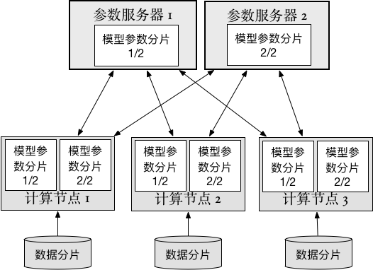

分布式训练
==========

深度学习模型的效果好坏与数据量的大小往往有直接的关系：相同的模型，在增大训练数据集后一般都能取得更好的效果。但是当数据量增大到一定程度后，单台计算机已经难以承受。这时，使用多台计算机进行分布式训练就是一个很自然的解决方案。在分布式训练中，训练数据被分割为多份，参与训练的多台机器分别读取自己的数据进行训练，并协同对整体模型的参数进行更新。

分布式训练一般有着如下图所示的架构：

- 数据分片（Data shard): 用于训练神经网络的数据，被切分成多个部分，每个部分分别给每个trainer使用。
- 计算节点（Trainer）: 每个trainer启动后读取切分好的一部分数据，开始神经网络的“前馈”和“后馈”计算，并和参数服务器通信。在完成一定量数据的训练后，上传计算得出的梯度（gradients），然后下载优化更新后的神经网络参数（parameters）。
- 参数服务器（Parameter server）:每个参数服务器只保存整个神经网络所有参数的一部分。参数服务器接收从计算节点上传的梯度，并完成参数优化更新，再将更新后的参数下发到每个计算节点。

通过计算节点和参数服务器的分布式协作，可以完成神经网络的同步随机梯度下降（SGD）方法的训练。PaddlePaddle同时支持同步随机梯度下降（SGD）和异步随机梯度下降（ASGD）。

在开始集群训练之前，需要先进行集群配置、PaddlePaddle安装等准备工作，了解如何通过这些步骤来配置分布式训练所需的基本环境：

..  toctree::
  :maxdepth: 1

  preparations_cn.md

集群训练有大量可配置的参数，例如使用的机器数量、通信端口等。了解如何通过设置启动参数的方式，对分布式训练的过程进行配置：

..  toctree::
  :maxdepth: 1

  cmd_argument_cn.md

PaddlePaddle可以兼容各种不同的集群。每种集群各有优势，使用的具体方式也有区别：

..  toctree::
  :maxdepth: 1

  multi_cluster/index_cn.rst
