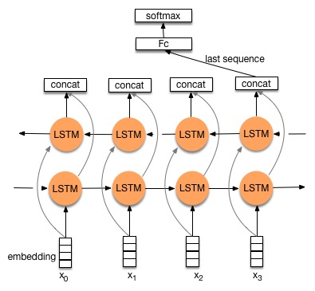

RNN 配置
=================

本教程将指导你如何在 PaddlePaddle 中配置循环神经网络（RNN）。PaddlePaddle 高度支持灵活和高效的循环神经网络配置。 在本教程中，您将了解如何：

-   准备用来学习循环神经网络的序列数据。
-   配置循环神经网络架构。
-   使用学习完成的循环神经网络模型生成序列。

我们将使用 vanilla 循环神经网络和 sequence to sequence 模型来指导你完成这些步骤。sequence to sequence 模型的代码可以在`demo / seqToseq`找到。

准备序列数据
---------------------

PaddlePaddle 不需要对序列数据进行任何预处理，例如填充。唯一需要做的是将相应类型设置为输入。例如，以下代码段定义了三个输入。 它们都是序列，它们的大小是`src_dict`，`trg_dict`和`trg_dict`：

``` sourceCode
settings.input_types = [
  integer_value_sequence(len(settings.src_dict)),
  integer_value_sequence(len(settings.trg_dict)),
  integer_value_sequence(len(settings.trg_dict))]
```

在`process`函数中，每个`yield`函数将返回三个整数列表。每个整数列表被视为一个整数序列：

``` sourceCode
yield src_ids, trg_ids, trg_ids_next
```

有关如何编写数据提供程序的更多细节描述，请参考 [PyDataProvider2](../../ui/data_provider/index.html)。完整的数据提供文件在 `demo/seqToseq/dataprovider.py`。

配置循环神经网络架构
-----------------------------------------------

### 简单门控循环神经网络(Gated Recurrent Neural Network)

循环神经网络在每个时间步骤顺序地处理序列。下面列出了 LSTM 的架构的示例。



一般来说，循环网络从 *t* = 1 到 *t* = *T* 或者反向地从 *t* = *T* 到 *t* = 1 执行以下操作。

*x*<sub>*t* + 1</sub> = *f*<sub>*x*</sub>(*x*<sub>*t*</sub>),*y*<sub>*t*</sub> = *f*<sub>*y*</sub>(*x*<sub>*t*</sub>)

其中 *f*<sub>*x*</sub>(.) 称为**单步函数**（即单时间步执行的函数，step function），而 *f*<sub>*y*</sub>(.) 称为**输出函数**。在 vanilla 循环神经网络中，单步函数和输出函数都非常简单。然而，PaddlePaddle 可以通过修改这两个函数来实现复杂的网络配置。我们将使用 sequence to sequence 模型演示如何配置复杂的循环神经网络模型。在本节中，我们将使用简单的 vanilla 循环神经网络作为使用`recurrent_group`配置简单循环神经网络的例子。 注意，如果你只需要使用简单的RNN，GRU或LSTM，那么推荐使用`grumemory`和`lstmemory`，因为它们的计算效率比`recurrent_group`更高。

对于 vanilla RNN，在每个时间步长，**单步函数**为：

*x*<sub>*t* + 1</sub> = *W*<sub>*x*</sub>*x*<sub>*t*</sub> + *W*<sub>*i*</sub>*I*<sub>*t*</sub> + *b*

其中 *x*<sub>*t*</sub> 是RNN状态，并且 *I*<sub>*t*</sub> 是输入，*W*<sub>*x*</sub> 和 *W*<sub>*i*</sub> 分别是RNN状态和输入的变换矩阵。*b* 是偏差。它的**输出函数**只需要*x*<sub>*t*</sub>作为输出。

`recurrent_group`是构建循环神经网络的最重要的工具。 它定义了**单步函数**，**输出函数**和循环神经网络的输入。注意，这个函数的`step`参数需要实现`step function`（单步函数）和`output function`（输出函数）：


``` sourceCode
def simple_rnn(input,
               size=None,
               name=None,
               reverse=False,
               rnn_bias_attr=None,
               act=None,
               rnn_layer_attr=None):
    def __rnn_step__(ipt):
       out_mem = memory(name=name, size=size)
       rnn_out = mixed_layer(input = [full_matrix_projection(ipt),
                                      full_matrix_projection(out_mem)],
                             name = name,
                             bias_attr = rnn_bias_attr,
                             act = act,
                             layer_attr = rnn_layer_attr,
                             size = size)
       return rnn_out
    return recurrent_group(name='%s_recurrent_group' % name,
                           step=__rnn_step__,
                           reverse=reverse,
                           input=input)
```

PaddlePaddle 使用“Memory”（记忆模块）实现单步函数。**Memory**是在PaddlePaddle中构造循环神经网络时最重要的概念。 Memory是在单步函数中循环使用的状态，例如*x*<sub>*t* + 1</sub> = *f*<sub>*x*</sub>(*x*<sub>*t*</sub>)。 一个Memory包含**输出**和**输入**。当前时间步处的Memory的输出作为下一时间步Memory的输入。Memory也可以具有**boot layer(引导层)**，其输出被用作Memory的初始值。 在我们的例子中，门控循环单元的输出被用作输出Memory。请注意，`rnn_out`层的名称与`out_mem`的名称相同。这意味着`rnn_out` (*x*<sub>*t* + 1</sub>)的输出被用作`out_mem`Memory的**输出**。

Memory也可以是序列。在这种情况下，在每个时间步中，我们有一个序列作为循环神经网络的状态。这在构造非常复杂的循环神经网络时是有用的。 其他高级功能包括定义多个Memory，以及使用子序列来定义分级循环神经网络架构。

我们在函数的结尾返回`rnn_out`。 这意味着 `rnn_out` 层的输出被用作门控循环神经网络的**输出**函数。

### Sequence to Sequence Model with Attention

我们将使用 sequence to sequence model with attention 作为例子演示如何配置复杂的循环神经网络模型。该模型的说明如下图所示。


在这个模型中，源序列 *S* = {*s*<sub>1</sub>, …, *s*<sub>*T*</sub>} 用双向门控循环神经网络编码。双向门控循环神经网络的隐藏状态 *H*<sub>*S*</sub> = {*H*<sub>1</sub>, …, *H*<sub>*T*</sub>} 被称为 *编码向量*。解码器是门控循环神经网络。当解读每一个*y*<sub>*t*</sub>时, 这个门控循环神经网络生成一系列权重 *W*<sub>*S*</sub><sup>*t*</sup> = {*W*<sub>1</sub><sup>*t*</sup>, …, *W*<sub>*T*</sub><sup>*t*</sup>}, 用于计算编码向量的加权和。加权和用来生成*y*<sub>*t*</sub>。

模型的编码器部分如下所示。它叫做`grumemory`来表示门控循环神经网络。如果网络架构简单，那么推荐使用循环神经网络的方法，因为它比 `recurrent_group` 更快。我们已经实现了大多数常用的循环神经网络架构，可以参考 [Layers](../../ui/api/trainer_config_helpers/layers_index.html) 了解更多细节。

我们还将编码向量投射到 `decoder_size` 维空间。这通过获得反向循环网络的第一个实例，并将其投射到 `decoder_size` 维空间完成：

``` sourceCode
# 定义源语句的数据层
src_word_id = data_layer(name='source_language_word', size=source_dict_dim)
# 计算每个词的词向量
src_embedding = embedding_layer(
    input=src_word_id,
    size=word_vector_dim,
    param_attr=ParamAttr(name='_source_language_embedding'))
# 应用前向循环神经网络
src_forward = grumemory(input=src_embedding, size=encoder_size)
# 应用反向递归神经网络（reverse=True表示反向循环神经网络）
src_backward = grumemory(input=src_embedding,
                          size=encoder_size,
                          reverse=True)
# 将循环神经网络的前向和反向部分混合在一起
encoded_vector = concat_layer(input=[src_forward, src_backward])

# 投射编码向量到 decoder_size
encoder_proj = mixed_layer(input = [full_matrix_projection(encoded_vector)],
                           size = decoder_size)

# 计算反向RNN的第一个实例
backward_first = first_seq(input=src_backward)

# 投射反向RNN的第一个实例到 decoder size
decoder_boot = mixed_layer(input=[full_matrix_projection(backward_first)], size=decoder_size, act=TanhActivation())
```

解码器使用 `recurrent_group` 来定义循环神经网络。单步函数和输出函数在 `gru_decoder_with_attention` 中定义：

``` sourceCode
group_inputs=[StaticInput(input=encoded_vector,is_seq=True),
              StaticInput(input=encoded_proj,is_seq=True)]
trg_embedding = embedding_layer(
    input=data_layer(name='target_language_word',
                     size=target_dict_dim),
    size=word_vector_dim,
    param_attr=ParamAttr(name='_target_language_embedding'))
group_inputs.append(trg_embedding)

# 对于配备有注意力机制的解码器，在训练中，
# 目标向量（groudtruth）是数据输入，
# 而源序列的编码向量可以被无边界的memory访问
# StaticInput 意味着不同时间步的输入都是相同的值，
# 否则它以一个序列输入，不同时间步的输入是不同的。
# 所有输入序列应该有相同的长度。
decoder = recurrent_group(name=decoder_group_name,
                          step=gru_decoder_with_attention,
                          input=group_inputs)
```

单步函数的实现如下所示。首先，它定义解码网络的**Memory**。然后定义 attention，门控循环单元单步函数和输出函数：

``` sourceCode
def gru_decoder_with_attention(enc_vec, enc_proj, current_word):
    # 定义解码器的Memory
    # Memory的输出定义在 gru_step 内
    # 注意 gru_step 应该与它的Memory名字相同
    decoder_mem = memory(name='gru_decoder',
                         size=decoder_size,
                         boot_layer=decoder_boot)
    # 计算 attention 加权编码向量
    context = simple_attention(encoded_sequence=enc_vec,
                               encoded_proj=enc_proj,
                               decoder_state=decoder_mem)
    # 混合当前词向量和attention加权编码向量
    decoder_inputs = mixed_layer(inputs = [full_matrix_projection(context),
                                           full_matrix_projection(current_word)],
                                 size = decoder_size * 3)
    # 定义门控循环单元循环神经网络单步函数
    gru_step = gru_step_layer(name='gru_decoder',
                              input=decoder_inputs,
                              output_mem=decoder_mem,
                              size=decoder_size)
    # 定义输出函数
    out = mixed_layer(input=[full_matrix_projection(input=gru_step)],
                      size=target_dict_dim,
                      bias_attr=True,
                      act=SoftmaxActivation())
    return out
```

生成序列
-----------------

训练模型后，我们可以使用它来生成序列。通常的做法是使用**beam search** 生成序列。以下代码片段定义 beam search 算法。注意，`beam_search` 函数假设 `step` 的输出函数返回的是下一个时刻输出词的 softmax 归一化概率向量。我们对模型进行了以下更改。

-   使用 `GeneratedInput` 来表示 trg\_embedding。 `GeneratedInput` 将上一时间步所生成的词的向量来作为当前时间步的输入。
-   使用 `beam_search` 函数。这个函数需要设置：
    -   `bos_id`: 开始标记。每个句子都以开始标记开头。
    -   `eos_id`: 结束标记。每个句子都以结束标记结尾。
    -   `beam_size`: beam search 算法中的beam大小。
    -   `max_length`: 生成序列的最大长度。
-   使用 `seqtext_printer_evaluator` 根据索引矩阵和字典打印文本。这个函数需要设置：
    -   `id_input`: 数据的整数ID，用于标识生成的文件中的相应输出。
    -   `dict_file`: 用于将词ID转换为词的字典文件。
    -   `result_file`: 生成结果文件的路径。

代码如下：

``` sourceCode
group_inputs=[StaticInput(input=encoded_vector,is_seq=True),
              StaticInput(input=encoded_proj,is_seq=True)]
# 在生成时，解码器基于编码源序列和最后生成的目标词预测下一目标词。
# 编码源序列（编码器输出）必须由只读Memory的 StaticInput 指定。
# 这里， GeneratedInputs 自动获取上一个生成的词，并在最开始初始化为起始词，如 <s>。
trg_embedding = GeneratedInput(
    size=target_dict_dim,
    embedding_name='_target_language_embedding',
    embedding_size=word_vector_dim)
group_inputs.append(trg_embedding)
beam_gen = beam_search(name=decoder_group_name,
                       step=gru_decoder_with_attention,
                       input=group_inputs,
                       bos_id=0, # Beginnning token.
                       eos_id=1, # End of sentence token.
                       beam_size=beam_size,
                       max_length=max_length)

seqtext_printer_evaluator(input=beam_gen,
                          id_input=data_layer(name="sent_id", size=1),
                          dict_file=trg_dict_path,
                          result_file=gen_trans_file)
outputs(beam_gen)
```

注意，这种生成技术只用于类似解码器的生成过程。如果你正在处理序列标记任务，请参阅 [Semantic Role Labeling Demo](../../demo/semantic_role_labeling/index.html) 了解更多详细信息。

完整的配置文件在`demo/seqToseq/seqToseq_net.py`。
