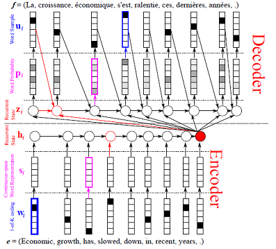

RNN配置
========

本教程将指导你如何在 PaddlePaddle
中配置循环神经网络（RNN）。PaddlePaddle
高度支持灵活和高效的循环神经网络配置。 在本教程中，您将了解如何：

-  配置循环神经网络架构。
-  使用学习完成的循环神经网络模型生成序列。

我们将使用 vanilla 循环神经网络和 sequence to sequence
模型来指导你完成这些步骤。sequence to sequence
模型的代码可以在 `book/08.machine_translation <https://github.com/PaddlePaddle/book/tree/develop/08.machine_translation>`_ 找到。
wmt14数据的提供文件在 `python/paddle/v2/dataset/wmt14.py <https://github.com/PaddlePaddle/Paddle/blob/develop/python/paddle/v2/dataset/wmt14.py>`_ 。

配置循环神经网络架构
--------------------

简单门控循环神经网络(Gated Recurrent Neural Network)
~~~~~~~~~~~~~~~~~~~~~~~~~~~~~~~~~~~~~~~~~~~~~~~~~~~~

循环神经网络在每个时间步骤顺序地处理序列。下面列出了 LSTM 的架构的示例。

.. image:: src/bi_lstm.jpg
      :align: center

一般来说，循环网络从 :math:`t=1` 到 :math:`t=T` 或者反向地从 :math:`t=T` 到 :math:`t=1` 执行以下操作。

.. math::

    x_{t+1} = f_x(x_t), y_t = f_y(x_t)

其中 :math:`f_x(.)` 称为\ **单步函数**\ （即单时间步执行的函数，step
function），而 :math:`f_y(.)` 称为\ **输出函数**\ 。在 vanilla
循环神经网络中，单步函数和输出函数都非常简单。然而，PaddlePaddle
可以通过修改这两个函数来实现复杂的网络配置。我们将使用 sequence to
sequence
模型演示如何配置复杂的循环神经网络模型。在本节中，我们将使用简单的
vanilla
循环神经网络作为使用\ ``recurrent_group``\ 配置简单循环神经网络的例子。
注意，如果你只需要使用简单的RNN，GRU或LSTM，那么推荐使用\ ``grumemory``\ 和\ ``lstmemory``\ ，因为它们的计算效率比\ ``recurrent_group``\ 更高。

对于 vanilla RNN，在每个时间步长，\ **单步函数**\ 为：

.. math::

    x_{t+1} = W_x x_t + W_i I_t + b

其中 :math:`x_t` 是RNN状态，并且 :math:`I_t` 是输入，:math:`W_x` 和
:math:`W_i` 分别是RNN状态和输入的变换矩阵。:math:`b` 是偏差。它的\ **输出函数**\ 只需要 :math:`x_t` 作为输出。

``recurrent_group``\ 是构建循环神经网络的最重要的工具。
它定义了\ **单步函数**\ ，\ **输出函数**\ 和循环神经网络的输入。注意，这个函数的\ ``step``\ 参数需要实现\ ``step function``\ （单步函数）和\ ``output function``\ （输出函数）：

.. code:: python

    def simple_rnn(input,
                   size=None,
                   name=None,
                   reverse=False,
                   rnn_bias_attr=None,
                   act=None,
                   rnn_layer_attr=None):
        def __rnn_step__(ipt):
           out_mem = paddle.layer.memory(name=name, size=size)
           rnn_out = paddle.layer.mixed(input = [paddle.layer.full_matrix_projection(input=ipt),
                                                 paddle.layer.full_matrix_projection(input=out_mem)],
                                        name = name,
                                        bias_attr = rnn_bias_attr,
                                        act = act,
                                        layer_attr = rnn_layer_attr,
                                        size = size)
           return rnn_out
        return paddle.layer.recurrent_group(name='%s_recurrent_group' % name,
                                            step=__rnn_step__,
                                            reverse=reverse,
                                            input=input)

PaddlePaddle
使用“Memory”（记忆模块）实现单步函数。\ **Memory**\ 是在PaddlePaddle中构造循环神经网络时最重要的概念。
Memory是在单步函数中循环使用的状态，例如 :math:`x_{t+1} = f_x(x_t)` 。
一个Memory包含\ **输出**\ 和\ **输入**\ 。当前时间步处的Memory的输出作为下一时间步Memory的输入。Memory也可以具有\ **boot
layer(引导层)**\ ，其输出被用作Memory的初始值。
在我们的例子中，门控循环单元的输出被用作输出Memory。请注意，\ ``rnn_out``\ 层的名称与\ ``out_mem``\ 的名称相同。这意味着\ ``rnn_out``
(*x*\ \ *t* + 1)的输出被用作\ ``out_mem``\ Memory的\ **输出**\ 。

Memory也可以是序列。在这种情况下，在每个时间步中，我们有一个序列作为循环神经网络的状态。这在构造非常复杂的循环神经网络时是有用的。
其他高级功能包括定义多个Memory，以及使用子序列来定义分级循环神经网络架构。

我们在函数的结尾返回\ ``rnn_out``\ 。 这意味着 ``rnn_out``
层的输出被用作门控循环神经网络的\ **输出**\ 函数。

Sequence to Sequence Model with Attention
~~~~~~~~~~~~~~~~~~~~~~~~~~~~~~~~~~~~~~~~~

我们将使用 sequence to sequence model with attention
作为例子演示如何配置复杂的循环神经网络模型。该模型的说明如下图所示。

在这个模型中，源序列 :math:`S = \{s_1, \dots, s_T\}` 
用双向门控循环神经网络编码。双向门控循环神经网络的隐藏状态
:math:`H_S = \{H_1, \dots, H_T\}` 被称为
*编码向量*\ 。解码器是门控循环神经网络。当解读每一个 :math:`y_t` 时,
这个门控循环神经网络生成一系列权重  :math:`W_S^t = \{W_1^t, \dots, W_T^t\}` ,
用于计算编码向量的加权和。加权和用来生成 :math:`y_t` 。

模型的编码器部分如下所示。它叫做\ ``grumemory``\ 来表示门控循环神经网络。如果网络架构简单，那么推荐使用循环神经网络的方法，因为它比
``recurrent_group``
更快。我们已经实现了大多数常用的循环神经网络架构，可以参考 :ref:`api_trainer_config_helpers_layers` 了解更多细节。

我们还将编码向量投射到 ``decoder_size``
维空间。这通过获得反向循环网络的第一个实例，并将其投射到
``decoder_size`` 维空间完成：

.. code:: python

    # 定义源语句的数据层
    src_word_id = paddle.layer.data(
        name='source_language_word',
        type=paddle.data_type.integer_value_sequence(source_dict_dim))
    # 计算每个词的词向量
    src_embedding = paddle.layer.embedding(
        input=src_word_id,
        size=word_vector_dim,
        param_attr=paddle.attr.ParamAttr(name='_source_language_embedding'))
    # 应用前向循环神经网络
    src_forward = paddle.networks.simple_gru(
        input=src_embedding, size=encoder_size)
    # 应用反向递归神经网络（reverse=True表示反向循环神经网络）
    src_backward = paddle.networks.simple_gru(
        input=src_embedding, size=encoder_size, reverse=True)
    # 将循环神经网络的前向和反向部分混合在一起
    encoded_vector = paddle.layer.concat(input=[src_forward, src_backward])

    # 投射编码向量到 decoder_size
    encoded_proj = paddle.layer.mixed(
        size=decoder_size,
        input=paddle.layer.full_matrix_projection(encoded_vector))

    # 计算反向RNN的第一个实例
    backward_first = paddle.layer.first_seq(input=src_backward)

    # 投射反向RNN的第一个实例到 decoder size
    decoder_boot = paddle.layer.mixed(
       size=decoder_size,
       act=paddle.activation.Tanh(),
       input=paddle.layer.full_matrix_projection(backward_first))

解码器使用 ``recurrent_group`` 来定义循环神经网络。单步函数和输出函数在
``gru_decoder_with_attention`` 中定义：

.. code:: python

    group_input1 = paddle.layer.StaticInput(input=encoded_vector, is_seq=True)
    group_input2 = paddle.layer.StaticInput(input=encoded_proj, is_seq=True)
    group_inputs = [group_input1, group_input2]
    trg_embedding = paddle.layer.embedding(
            input=paddle.layer.data(
                name='target_language_word',
                type=paddle.data_type.integer_value_sequence(target_dict_dim)),
            size=word_vector_dim,
            param_attr=paddle.attr.ParamAttr(name='_target_language_embedding'))
        group_inputs.append(trg_embedding)
    group_inputs.append(trg_embedding)

    # 对于配备有注意力机制的解码器，在训练中，
    # 目标向量（groudtruth）是数据输入，
    # 而源序列的编码向量可以被无边界的memory访问
    # StaticInput 意味着不同时间步的输入都是相同的值，
    # 否则它以一个序列输入，不同时间步的输入是不同的。
    # 所有输入序列应该有相同的长度。
    decoder = paddle.layer.recurrent_group(
            name=decoder_group_name,
            step=gru_decoder_with_attention,
            input=group_inputs)

单步函数的实现如下所示。首先，它定义解码网络的\ **Memory**\ 。然后定义
attention，门控循环单元单步函数和输出函数：

.. code:: python

    def gru_decoder_with_attention(enc_vec, enc_proj, current_word):
        # 定义解码器的Memory
        # Memory的输出定义在 gru_step 内
        # 注意 gru_step 应该与它的Memory名字相同
        decoder_mem = paddle.layer.memory(
            name='gru_decoder', size=decoder_size, boot_layer=decoder_boot)
        # 计算 attention 加权编码向量
        context = paddle.networks.simple_attention(
            encoded_sequence=enc_vec,
            encoded_proj=enc_proj,
            decoder_state=decoder_mem)
        # 混合当前词向量和attention加权编码向量
         decoder_inputs = paddle.layer.mixed(
            size=decoder_size * 3,
            input=[
                paddle.layer.full_matrix_projection(input=context),
                paddle.layer.full_matrix_projection(input=current_word)
            ])
        # 定义门控循环单元循环神经网络单步函数
         gru_step = paddle.layer.gru_step(
            name='gru_decoder',
            input=decoder_inputs,
            output_mem=decoder_mem,
            size=decoder_size)
        # 定义输出函数
         out = paddle.layer.mixed(
            size=target_dict_dim,
            bias_attr=True,
            act=paddle.activation.Softmax(),
            input=paddle.layer.full_matrix_projection(input=gru_step))
        return out

生成序列
--------

训练模型后，我们可以使用它来生成序列。通常的做法是使用\ **beam search**
生成序列。以下代码片段定义 beam search 算法。注意，\ ``beam_search``
函数假设 ``step`` 的输出函数返回的是下一个时刻输出词的 softmax
归一化概率向量。我们对模型进行了以下更改。

-  使用 ``GeneratedInput`` 来表示 trg\_embedding。 ``GeneratedInput``
   将上一时间步所生成的词的向量来作为当前时间步的输入。
-  使用 ``beam_search`` 函数。这个函数需要设置：

   -  ``bos_id``: 开始标记。每个句子都以开始标记开头。
   -  ``eos_id``: 结束标记。每个句子都以结束标记结尾。
   -  ``beam_size``: beam search 算法中的beam大小。
   -  ``max_length``: 生成序列的最大长度。

代码如下：

.. code:: python

    group_input1 = paddle.layer.StaticInput(input=encoded_vector, is_seq=True)
    group_input2 = paddle.layer.StaticInput(input=encoded_proj, is_seq=True)
    group_inputs = [group_input1, group_input2]
    # 在生成时，解码器基于编码源序列和最后生成的目标词预测下一目标词。
    # 编码源序列（编码器输出）必须由只读Memory的 StaticInput 指定。
    # 这里， GeneratedInputs 自动获取上一个生成的词，并在最开始初始化为起始词，如 <s>。
    trg_embedding = paddle.layer.GeneratedInput(
            size=target_dict_dim,
            embedding_name='_target_language_embedding',
            embedding_size=word_vector_dim)
    group_inputs.append(trg_embedding)
    beam_gen = paddle.layer.beam_search(
            name=decoder_group_name,
            step=gru_decoder_with_attention,
            input=group_inputs,
            bos_id=0, # Beginnning token.
            eos_id=1, # End of sentence token.
            beam_size=beam_size,
            max_length=max_length)

    return beam_gen

注意，这种生成技术只用于类似解码器的生成过程。如果你正在处理序列标记任务，请参阅 `book/06.understand_sentiment <https://github.com/PaddlePaddle/book/tree/develop/06.understand_sentiment>`_ 了解更多详细信息。

完整的配置文件在 `book/08.machine_translation/train.py <https://github.com/PaddlePaddle/book/blob/develop/08.machine_translation/train.py>`_ 。
