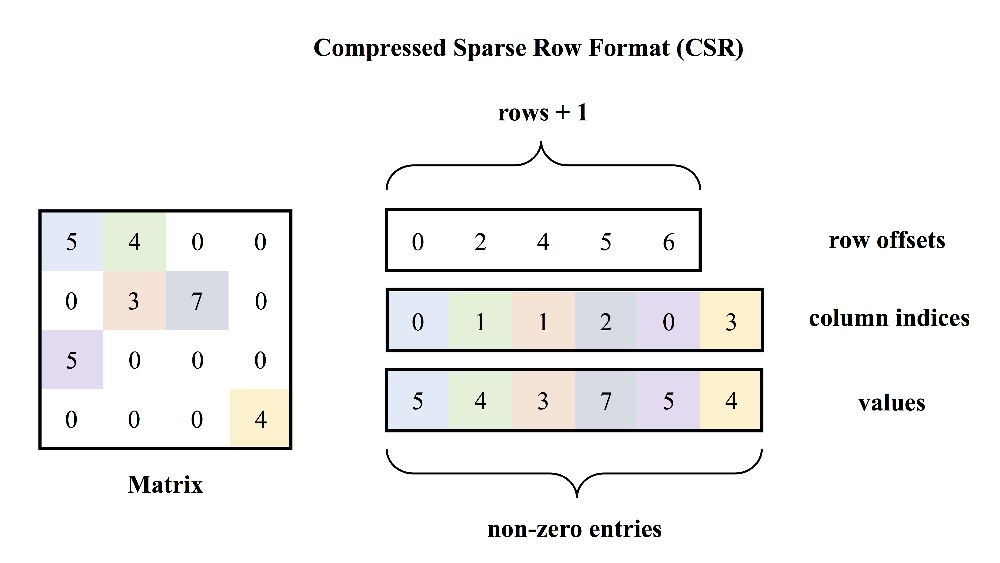

## 输入/输出数据组织

这篇文档介绍在使用 PaddlePaddle C-API 时如何组织输入数据，以及如何解析神经网络前向计算的输出数据。

### 输入/输出数据类型
在C-API中，按照基本数据类型在PaddlePaddle内部的定义和实现，输入数据可分为：
1. 一维整型数组
2. 二维浮点型矩阵
    - 稠密矩阵
    - 稀疏矩阵

  - 说明：
    1. 一维数组**仅支持整型值**；
        - 常用于自然语言处理任务，例如：表示词语在词典中的序号；
        - 分类任务中类别标签；
    1. 逻辑上高于二维的数据（例如含有多个通道的图片，视频等）在程序实现中都会转化为二维矩阵，转化方法在相应的领域都有通用解决方案，需要使用者自己了解相关的转化表示方法；
    1. 二维矩阵可以表示行向量和列向量，任何时候，如果需要浮点型数组（向量）时，都应使用C-API中的矩阵来表示，而不是C-API中的一维数组。

不论是一维整型数组还是二维浮点数矩阵，**为它们附加上序列信息，将变成序列输入。PaddlePaddle 会通过判数据是否附带有序列信息来判断一个向量/矩阵是否是一个序列**。关于什么是“序列信息”，下文会进行详细地介绍。

PaddlePaddle 支持两种序列类型：
1. 单层序列
    - 序列中的每一个元素是非序列，是进行计算的基本单位，不可再进行拆分。
    - 例如：自然语言中的句子是一个序列，序列中的元素是词语；
1. 双层序列
    - 序列中的每一个元素又是一个序列。
    - 例如：自然语言中的段落是一个双层序列；段落是有句子构成的序列；句子是由词语构成的序列。
    - 双层序列在处理长序列的任务或是构建层级模型时会发挥作用。

### 基本使用概念

- 在PaddlePaddle内部，神经网络中一个计算层的输入/输出被组织为一个 `Argument` 结构体，如果神经网络有多个输入或者多个输入，每一个输入/输入都会对应有自己的`Argument`。
- `Argument` 并不真正“存储”数据，而是将输入/输出信息有机地组织在一起。
- 在`Argument`内部由`IVector`（对应着上文提到的一维整型数组）和`Matrix`（对应着上文提到的二维浮点型矩阵）来实际存储数据；由 `sequence start position` (下文详细解释) 来记录输入/输出的序列信息。

**注意：这篇文档之后部分将会统一使用`argument`来特指PaddlePaddle中神经网络计算层一个输入/输出数据；使用`ivector`来特指PaddlePaddle中的一维整型数组；使用`matrix`来特指PaddlePaddle中的二维浮点型矩阵；使用`sequence_start_position`来特指PaddlePaddle中的序列信息。**

于是，在组织神经网络输入时，需要思考完成以下工作：
1. 为每一个输入/输出创建`argument`。
    - C-API 中操作`argument`的接口请查看[argument.h](https://github.com/PaddlePaddle/Paddle/blob/develop/paddle/capi/arguments.h)。
1. 为每一个`argument`创建`matrix`或者`ivector`来存储数据。
    - C-API 中操作`ivector`的接口请查看 [vector.h](https://github.com/PaddlePaddle/Paddle/blob/develop/paddle/capi/vector.h)。
    - C-API 中操作`matrix`的接口请查看[matrix.h](https://github.com/PaddlePaddle/Paddle/blob/develop/paddle/capi/matrix.h)。
1. 如果输入是序列数据，需要创建并填写`sequence_start_position`信息。
    - 通过调用 [`paddle_arguments_set_sequence_start_pos`](https://github.com/PaddlePaddle/Paddle/blob/develop/paddle/capi/arguments.h#L137) 来为一个`argument`添加序列信息；
    - 通过调用 [`paddle_arguments_get_sequence_start_pos`](https://github.com/PaddlePaddle/Paddle/blob/develop/paddle/capi/arguments.h#L150) 来读取一个`argument`添加序列信息；
    - 接口说明请查看 [argument.h](https://github.com/PaddlePaddle/Paddle/blob/develop/paddle/capi/arguments.h) 文件。

### 组织非序列数据
- 一维整型数组

    概念上可以将`paddle_ivector`理解为一个一维的整型数组，通常用于表示离散的类别标签，或是在自然语言处理任务中表示词语在字典中的序号。下面的代码片段创建了含有三个元素`1`、`2`、`3`的`paddle_ivector`。
    ```cpp
    int ids[] = {1, 2, 3};
     paddle_ivector ids_array =
         paddle_ivector_create(ids, sizeof(ids) / sizeof(int), false, false);
     CHECK(paddle_arguments_set_ids(in_args, 0, ids_array));
    ```
- **稠密矩阵**
    - 一个$m×n$的稠密矩阵是一个由$m$行$n$列元素排列成的矩形阵列，矩阵里的元素是浮点数。对神经网络来说，矩阵的高度$m$是一次预测接受的样本数目，宽度$n$是神经网络定义时，`paddle.layer.data`的`size`。
    - 下面的代码片段创建了一个高度为1，宽度为`layer_size`的稠密矩阵，矩阵中每个元素的值随机生成。

    ```cpp
    paddle_matrix mat =
        paddle_matrix_create(/* height = batch size */ 1,
                             /* width = dimensionality of the data layer */ layer_size,
                             /* whether to use GPU */ false);

    paddle_real* array;
    // Get the pointer pointing to the start address of the first row of the
    // created matrix.
    CHECK(paddle_matrix_get_row(mat, 0, &array));

    // Fill the matrix with a randomly generated test sample.
    srand(time(0));
    for (int i = 0; i < layer_size; ++i) {
      array[i] = rand() / ((float)RAND_MAX);
    }

    // Assign the matrix to the argument.
    CHECK(paddle_arguments_set_value(in_args, 0, mat));
    ```

- **稀疏矩阵**

  PaddlePaddle C-API 中 稀疏矩阵使用[CSR（Compressed Sparse Row Format）](https://en.wikipedia.org/wiki/Sparse_matrix#Compressed_sparse_row_(CSR,_CRS_or_Yale_format))格式存储。下图是CSR存储稀疏矩阵的示意图，在CSR表示方式中，通过（1）行偏移；（2）列号；（3）值；来决定矩阵的内容。

  <p align="center">
  </br>图1. CSR存储示意图.
  </p>

  在PaddlePaddle C-API中通过以下接口创建稀疏矩阵：
  ```cpp
  PD_API paddle_matrix paddle_matrix_create_sparse(
    uint64_t height, uint64_t width, uint64_t nnz, bool isBinary, bool useGpu);
  ```
  1. 创建稀疏矩阵时需要显示地指定矩阵的（1）高度（`height`，在神经网络中等于一次预测处理的样本数）（2）宽度（`width`，`paddle.layer.data`的`size`）以及（3）非零元个数（`nnz`）。
  1. 当上述接口第4个参数`isBinary`指定为`true`时，**只需要设置行偏移（`row_offset`）和列号(`colum indices`)，不需要提供元素值（`values`）**，这时行偏移和列号指定的元素默认其值为1。

  - 下面的代码片段创建了一个CPU上的二值稀疏矩阵：

      ```cpp
      paddle_matrix mat = paddle_matrix_create_sparse(1, layer_size, nnz, true, false);
      int colIndices[] = {9, 93, 109};  // layer_size here is greater than 109.
      int rowOffset[] = {0, sizeof(colIndices) / sizeof(int)};

      CHECK(paddle_matrix_sparse_copy_from(mat,
                                           rowOffset,
                                           sizeof(rowOffset) / sizeof(int),
                                           colIndices,
                                           sizeof(colIndices) / sizeof(int),
                                           NULL /*values array is NULL.*/,
                                           0 /*size of the value arrary is 0.*/));
      CHECK(paddle_arguments_set_value(in_args, 0, mat));
      ```
   - 下面的代码片段在创建了一个CPU上的带元素值的稀疏矩阵：
      ```cpp
      paddle_matrix mat = paddle_matrix_create_sparse(1, layer_size, nnz, false, false);
      int colIndices[] = {9, 93, 109};  // layer_size here is greater than 109.
      int rowOffset[] = {0, sizeof(colIndices) / sizeof(int)};
      float values[] = {0.5, 0.5, 0.5};

      CHECK(paddle_matrix_sparse_copy_from(mat,
                                           rowOffset,
                                           sizeof(rowOffset) / sizeof(int),
                                           colIndices,
                                           sizeof(colIndices) / sizeof(int),
                                           values,
                                           sizeof(values) / sizeof(float)));
      ```

### 组织序列数据


### Python 端数据类型说明

下表列出了Python端训练接口暴露的数据类型（`paddle.layer.data`函数`type`字段的取值）对应于调用C-API时需要创建的数据类型：


Python 端数据类型  | C-API 输入数据类型|
:-------------: | :-------------:
`paddle.data_type.integer_value` |一维整型数组，无需附加序列信息|
`paddle.data_type.dense_vector` |二维浮点型稠密矩阵，无需附加序列信息|
`paddle.data_type.sparse_binary_vector` |二维浮点型稀疏矩阵，无需提供非零元的值，默认为1，无需附加序列信息|
`paddle.data_type.sparse_vector` |二维浮点型稀疏矩阵，需提供非零元的值，无需附加序列信息|
`paddle.data_type.integer_value_sequence` |一维整型数组，需附加序列信息|
`paddle.data_type.dense_vector_sequence` |二维浮点型稠密矩阵，需附加序列信息|
`paddle.data_type.sparse_binary_vector_sequence` |二维浮点型稀疏矩阵，无需提供非零元的值，默认为1，需附加序列信息|
`paddle.data_type.sparse_vector_sequence` |二维浮点型稀疏矩阵，需提供非零元的值，需附加序列信息|
`paddle.data_type.integer_value_sub_sequence` |一维整型数组，需附加双层序列信息|
`paddle.data_type.dense_vector_sub_sequence` |二维浮点型稠密矩阵，需附加双层序列信息|
`paddle.data_type.sparse_binary_vector_sub_sequence` |二维浮点型稀疏矩阵，无需提供非零元的值，默认为1，需附加双层序列信息|
`paddle.data_type.sparse_vector_sub_sequence` |二维浮点型稀疏矩阵，需提供非零元的值，需附加双层序列信息|
