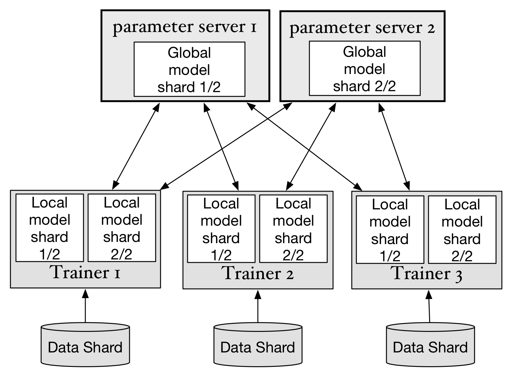

```eval_rst
.. _cluster_train:
```

# 概述
PaddlePaddle 使用如下图的方式完成分布式训练：



- data shard（数据分片）: 用于训练神经网络的数据，被切分成多个部分，每个部分分别给每个trainer使用
- trainer（计算节点）: 每个trainer启动后读取切分好的一部分数据，并开始神经网络的“前馈”和“后馈”计算，并和parameter server通信。在完成一定量数据的训练后，上传计算得出的梯度（gradients）然后下载优化更新后的神经网络参数（parameters）。
- parameter server（参数服务器）:每个参数服务器只保存整个神经网络所有参数的一部分。参数服务器接收从计算节点上传的梯度，并完成参数优化更新，在将更新后的参数下发到每个计算节点。

这样，通过trainer和parameter server的分布式协作，可以完成神经网络的SGD方法的训练。Paddle可以同时支持同步SGD(synchronize SGD)和异步SGD(asynchronize SGD)。

在使用同步SGD训练神经网络时，Paddle使用同步屏障(barrier)，使梯度的提交和参数的更新按照顺序方式执行。在异步SGD中，则并不会等待所有trainer提交梯度才更新参数，这样极大的提高了计算的并行性：parameter server之间不相互依赖，并行的接收梯度和更新参数，parameter server也不会等待trainer全部都提交梯度之后才开始下一步，trainer之间也不会相互依赖，并行的执行模型的训练。可以看出，虽然异步SGD方式会提高参数更新并行度, 但是并不能保证参数同步更新，在任意时间某一台parameter server上保存的参数可能比另一台要更新，与同步SGD相比，梯度会有噪声。

## 使用分布式计算平台或工具

PaddlePaddle可以使用多种分布式计算平台构建分布式计算任务，比如[Kubernetes](http://kubernetes.io)，[OpenMPI](https://www.open-mpi.org)，也可以使用类似[Fabric](http://www.fabfile.org)的集群管理工具编写集群任务提交和管理脚本。

关于如何在Kubernetes上启动分布式训练任务，可以参考这篇说明：[Kubernetes分布式训练](https://github.com/PaddlePaddle/Paddle/blob/develop/doc/howto/usage/k8s/k8s_distributed_cn.md)

## 环境准备

1. 我们需要在集群的所有节点上安装 PaddlePaddle。 如果要启用GPU，还需要在节点上安装对应的GPU驱动以及CUDA。PaddlePaddle的安装可以参考[这里](https://github.com/PaddlePaddle/Paddle/tree/develop/doc/getstarted/build_and_install)的多种安装方式。我们推荐使用[Docker安装方式](https://github.com/PaddlePaddle/Paddle/blob/develop/doc/getstarted/build_and_install/docker_install_cn.rst)来快速安装PaddlePaddle。

## 准备训练数据

我们将放置依赖库、配置等文件的目录视为 *工作空间（workspace）*。

这些 `train/test` 数据应该在启动集群作业之前准备好。 为了满足训练/测试数据放置在工作空间中不同目录的要求，PADDLE 根据在模型配置文件中使用的名为 `train.list/test.list` 的索引文件引用训练/测试数据，所以训练/测试数据也包含 train.list/test.list 两个列表文件。所有本地训练 demo 已经提供了脚本来帮助您创建这两个文件，并且集群作业中的所有节点将在正常情况下处理具有相同逻辑代码的文件。

通常，你可以使用本地训练中的相同模型文件进行集群训练。请记住，在模型文件的 `setting`函数中设置的 `batch_size` 表示在集群作业**每个**节点中的 batch 大小，而不是使用同步 SGD 的总 batch 大小。

以下步骤基于 demo 目录中的 [demo/recommendation](https://github.com/PaddlePaddle/Paddle/tree/develop/demo/recommendation)。

你只需完成 demo/recommendation 教程文档到 `Train` 的部分，之后你会得到训练/测试数据和模型配置文件。最后，只需使用 demo/recommendation 作为集群训练的工作空间。

最后，你的工作空间应如下所示：
```
.
|-- common_utils.py
|-- data
|   |-- config.json
|   |-- config_generator.py
|   |-- meta.bin
|   |-- meta_config.json
|   |-- meta_generator.py
|   |-- ml-1m
|   |-- ml_data.sh
|   |-- ratings.dat.test
|   |-- ratings.dat.train
|   |-- split.py
|   |-- test.list
|   `-- train.list
|-- dataprovider.py
|-- evaluate.sh
|-- prediction.py
|-- preprocess.sh
|-- requirements.txt
|-- run.sh
`-- trainer_config.py
```
虽然这些文件并非都需要集群训练，但是也没有必要删除无用的文件。

`trainer_config.py`
表示模型配置文件。

`train.list` 和 `test.list`
文件索引。它存储当前节点所有训练/测试数据的所有相对或绝对文件路径。

`dataprovider.py`
用于读取训练/测试样本。这与本地训练相同。

`data`
数据目录中的所有文件被 train.list/test.list 引用。


## 准备集群作业配置

以下选项必须在 cluster_train/conf.py 中认真设置

`HOSTS`  所有节点运行集群作业的主机名或 IP 。你还可以将用户和 ssh 端口附加到主机名上，例如 root@192.168.100.17:9090。

`ROOT_DIR` 用于放置 JOB 工作空间目录的工作空间 ROOT 目录

`PADDLE_NIC` 集群通信通道的 NIC(Network Interface Card, 网络接口卡) 接口名称，例如以太网的 eth0，infiniband 的 ib0。

`PADDLE_PORT` 集群通信通道的端口号

`PADDLE_PORTS_NUM` 用于集群通信通道的端口数。 如果集群节点数量少（少于5〜6个节点），建议将其设置为较大，如2〜8，以获得更好的网络性能。

`PADDLE_PORTS_NUM_FOR_SPARSE` 用于 sparse remote updater 集群通信信道的端口数。如果使用 sparse remote update，则可以像 `PADDLE_PORTS_NUM` 一样设置。

`LD_LIBRARY_PATH` 为集群作业设置额外的 LD_LIBRARY_PATH。你可以使用它来设置 CUDA 库的路径。

默认配置如下：

```python
HOSTS = [
        "root@192.168.100.17",
        "root@192.168.100.18",
        ]

'''
工作空间配置
'''

#工作空间根目录
ROOT_DIR = "/home/paddle"

'''
网络配置
'''
#pserver NIC
PADDLE_NIC = "eth0"
#pserver 端口
PADDLE_PORT = 7164
#pserver 端口数
PADDLE_PORTS_NUM = 2
#pserver sparse ports num
PADDLE_PORTS_NUM_FOR_SPARSE = 2

#集群作业中所有进程的环境设置
LD_LIBRARY_PATH="/usr/local/cuda/lib64:/usr/lib64"
```

### 启动集群作业
`paddle.py` 提供了自动化脚本来启动不同节点中的所有 PaddlePaddle 集群进程。默认情况下，所有命令行选项可以设置为```paddle.py``` 命令选项并且 `paddle.py` 将透明、自动地将这些选项应用到 PaddlePaddle 底层进程。

`paddle.py` 为方便作业启动提供了两个独特的命令选项。

`job_dispatch_package`  设为本地 `workspace` 目录，它将被分发到 conf.py 中设置的所有节点。  它有助于帮助频繁修改和访问工作区文件的用户减少负担，否则频繁的多节点工作空间部署可能会很麻烦。
`job_workspace`  设为已部署的工作空间目录，`paddle.py` 将跳过分发阶段直接启动所有节点的集群作业。它可以帮助减少分发延迟。

`cluster_train/run.sh` 提供了命令样例来运行 `demo/recommendation` 集群工作，只需用你定义的目录修改 `job_dispatch_package` 和 `job_workspace`，然后：
```
sh run.sh
```

集群作业将会在几秒后启动。

### 终止集群作业
`paddle.py`能获取`Ctrl + C` SIGINT 信号来自动终止它启动的所有进程。只需中断 `paddle.py` 任务来终止集群作业。如果程序崩溃你也可以手动终止。

### 检查集群训练结果
详细信息请检查 $workspace/log 里的日志，每一个节点都有相同的日志结构。

`paddle_trainer.INFO`
提供几乎所有训练的内部输出日志，与本地训练相同。这里检验运行时间模型的收敛。

`paddle_pserver2.INFO`
提供 pserver 运行日志，有助于诊断分布式错误。

`server.log`
提供 pserver 进程的 stderr 和 stdout。训练失败时可以检查错误日志。

`train.log`
提供训练过程的 stderr 和 stdout。训练失败时可以检查错误日志。

### 检查模型输出
运行完成后，模型文件将被写入节点 0 的 `output` 目录中。
工作空间中的 `nodefile` 表示当前集群作业的节点 ID。
