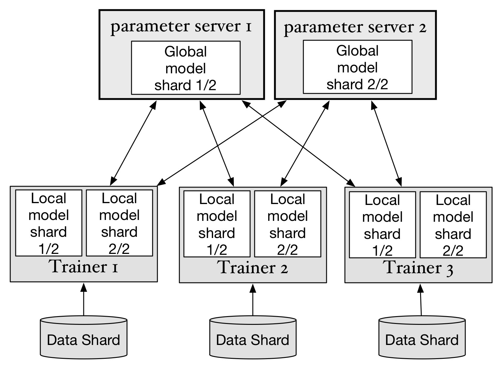

# Fluid Distributed Training

## Introduction

In this article, we'll explain how to config and run distributed training jobs with PaddlePaddle Fluid in a bare metal cluster.

## Preparations

### Get your cluster ready

Prepare your computer nodes in the cluster. Nodes in this cluster can be of any specification that runs PaddlePaddle, and with a unique IP address assigned to it. Make sure they can communicate with each other.

### Have PaddlePaddle installed

PaddlePaddle must be installed on all nodes. If you have GPU cards on your nodes, be sure to properly install drivers and CUDA libraries.

PaddlePaddle build and installation guide can be found from [here](http://www.paddlepaddle.org/docs/develop/documentation/en/getstarted/build_and_install/index_en.html).

### Update training script

#### Non-cluster training script

Let's take [Deep Learning 101](http://www.paddlepaddle.org/docs/develop/book/01.fit_a_line/index.html)'s first chapter: "fit a line" as an example.

This demo's non-cluster version with fluid API is as follows:

``` python
import paddle.v2 as paddle
import paddle.v2.fluid as fluid

x = fluid.layers.data(name='x', shape=[13], dtype='float32')
y_predict = fluid.layers.fc(input=x, size=1, act=None)
y = fluid.layers.data(name='y', shape=[1], dtype='float32')

cost = fluid.layers.square_error_cost(input=y_predict, label=y)
avg_cost = fluid.layers.mean(x=cost)

sgd_optimizer = fluid.optimizer.SGD(learning_rate=0.001)
sgd_optimizer.minimize(avg_cost)

BATCH_SIZE = 20

train_reader = paddle.batch(
    paddle.reader.shuffle(
        paddle.dataset.uci_housing.train(), buf_size=500),
    batch_size=BATCH_SIZE)

place = fluid.CPUPlace()
feeder = fluid.DataFeeder(place=place, feed_list=[x, y])
exe = fluid.Executor(place)

exe.run(fluid.default_startup_program())

PASS_NUM = 100
for pass_id in range(PASS_NUM):
    fluid.io.save_persistables(exe, "./fit_a_line.model/")
    fluid.io.load_persistables(exe, "./fit_a_line.model/")
    for data in train_reader():
        avg_loss_value, = exe.run(fluid.default_main_program(),
                                  feed=feeder.feed(data),
                                  fetch_list=[avg_cost])

        if avg_loss_value[0] < 10.0:
            exit(0)  # if avg cost less than 10.0, we think our code is good.
exit(1)
```

We created a simple fully connected neural networks training program and handed it to the fluid executor to run for 100 passes.

Now let's try to convert it to a distributed version to run in a cluster.

#### Introducing parameter server

As you see from the non-cluster version of training script, there is only one role in it: the trainer, who does the computing as well as holding parameters. In cluster training, since multi-trainers are working on the same task, they need one centralized place to hold and distribute parameters. This centralized place is called the Parameter Server in PaddlePaddle.



Parameter Server in fluid does not only hold parameters but is also assigned with a part of the program. Trainers communicate with parameter servers via send/receive OPs. For more tech detail, please refer to this [document](https://github.com/PaddlePaddle/Paddle/blob/develop/doc/design/dist_refactor/distributed_architecture.md).

Now we need to create program for both trainers and parameter servers, the question is how?

#### Slice the program

Fluid provides a tool called "Distribute Transpiler" to automatically convert the non-cluster program into cluster program.

The idea behind this tool is to find optimize OPs and gradient parameters, slice the program into 2 pieces and connect them with send/receive OP.

Optimize OPs and gradient parameters can be found from the return values of optimizer's minimize function.

To put them together:

``` python
... #define the program, cost, and create sgd optimizer

optimize_ops, params_grads = sgd_optimizer.minimize(avg_cost) #get optimize OPs and gradient parameters

t = fluid.DistributeTranspiler() # create transpiler instance
# slice the program into 2 pieces with optimizer_ops and gradient parameters list, as well as pserver_endpoints, which is a comma separated list of [IP:PORT] and number of trainers
t.transpile(optimize_ops, params_grads, pservers=pserver_endpoints, trainers=2) 

... #create executor

# in pserver, run this
exe.run(fluid.default_startup_program())
#current_endpoint here means current pserver IP:PORT you wish to run on
exe.run(t.get_pserver_program(current_endpoint, optimize_ops)) 

# in trainer, run this
... # define data reader
exe.run(fluid.default_startup_program())
for pass_id in range(100):
    for data in train_reader():
        exe.run(t.get_trainer_program())


```

### E2E demo

Please find the complete demo from [here](https://github.com/PaddlePaddle/Paddle/blob/develop/python/paddle/v2/fluid/tests/book_distribute/notest_dist_fit_a_line.py). In parameter server node run this in the command line:

``` bash
PSERVERS=192.168.1.2:6174 SERVER_ENDPOINT=192.168.1.2:6174 TRAINING_ROLE=PSERVER python notest_dist_fit_a_line.py
```

*please note we assume that your parameter server runs at 192.168.1.2:6174*

Wait until the prompt `Server listening on 192.168.1.2:6174`

Then in 2 of your trainer node run this:

``` bash
PSERVERS=192.168.1.2:6174 SERVER_ENDPOINT=192.168.1.2:6174 TRAINING_ROLE=TRAINER python notest_dist_fit_a_line.py
```

*the reason you need to run this command twice in 2 nodes is: in the script we set the trainer count to be 2. You can change this setting on line 50*

Now you have 2 trainers and 1 parameter server up and running.
