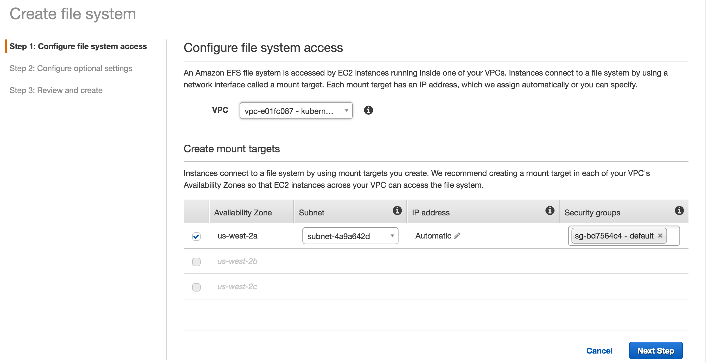
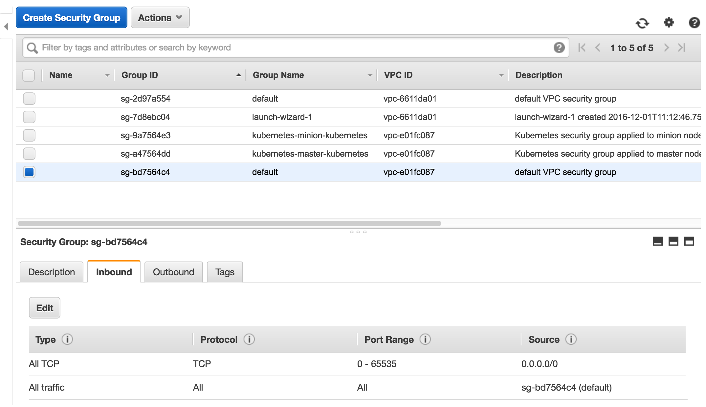
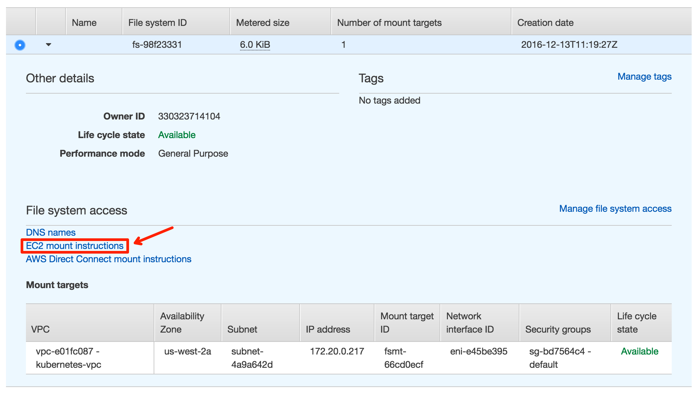

# PaddlePaddle on AWS with Kubernetes

## Create AWS Account and IAM Account

To use AWS, we need to sign up an AWS account on Amazon's Web site.
An AWS account allows us to login to the AWS Console Web interface to
create IAM users and user groups.  Usually, we create a user group with
privileges required to run PaddlePaddle, and we create users for
those who are going to run PaddlePaddle and add these users into the
group.  IAM users can identify themselves using password and tokens,
where passwords allows users to log in to the AWS Console, and tokens
make it easy for users to submit and inspect jobs from the command
line.

To sign up an AWS account, please
follow
[this guide](http://docs.aws.amazon.com/lambda/latest/dg/setting-up.html).
To create users and user groups under an AWS account, please
follow
[this guide](http://docs.aws.amazon.com/IAM/latest/UserGuide/id_users_create.html).

Please be aware that this tutorial needs the following privileges in
the user group:

- AmazonEC2FullAccess
- AmazonS3FullAccess
- AmazonRoute53FullAccess
- AmazonRoute53DomainsFullAccess
- AmazonElasticFileSystemFullAccess
- AmazonVPCFullAccess
- IAMUserSSHKeys
- IAMFullAccess
- NetworkAdministrator


By the time we write this tutorial, we noticed that Chinese AWS users
might suffer from authentication problems when running this tutorial.
Our solution is that we create a VM instance with the default Amazon
AMI and in the same zone as our cluster runs, so we can SSH to this VM
instance as a tunneling server and control our cluster and jobs from
it.


## PaddlePaddle on AWS

Here we will show you step by step on how to run PaddlePaddle training on AWS cluster.

###AWS Login

First check out [this](http://docs.aws.amazon.com/cli/latest/userguide/installing.html) for installing the AWS command line interface, if you use ec2 instance with default amazon AMI, the cli tool has already been installed on your machine.


And then configure your AWS account information:

```
aws configure

```


Fill in the required fields (You can get your AWS aceess key id and AWS secrete access key by following [this](http://docs.aws.amazon.com/AWSSimpleQueueService/latest/SQSGettingStartedGuide/AWSCredentials.html) instruction):


```
AWS Access Key ID: YOUR_ACCESS_KEY_ID
AWS Secrete Access Key: YOUR_SECRETE_ACCESS_KEY
Default region name: us-west-2
Default output format: json

```

###Kubernetes Cluster Start Up


And then execute the following command after your aws login:

```
export KUBERNETES_PROVIDER=aws; curl -sS https://get.k8s.io | bash

```

By default, this command will download and unzip the latest Kubernetes release package and execute the script inside to provision a new VPC (virtual private cloud) and a four t2.micro node cluster in us-west-2a (Oregon) under that VPC. 


You can override the variables defined in `<path/to/kubernetes-directory>/cluster/config-default.sh` as follows:

```
export KUBE_AWS_ZONE=us-west-2a 
export NUM_NODES=3
export MASTER_SIZE=m3.medium 
export NODE_SIZE=m3.large 
export AWS_S3_REGION=us-west-2a 
export AWS_S3_BUCKET=mycompany-kubernetes-artifacts 
export KUBE_AWS_INSTANCE_PREFIX=k8s 

```


This process takes about 5 to 10 minutes. 

```
[ec2-user@ip-172-31-27-229 ~]$ export KUBERNETES_PROVIDER=aws; curl -sS https://get.k8s.io | bash
'kubernetes' directory already exist. Should we skip download step and start to create cluster based on it? [Y]/n
Skipping download step.
Creating a kubernetes on aws...
... Starting cluster in us-west-2a using provider aws
... calling verify-prereqs
... calling kube-up
Starting cluster using os distro: jessie
Uploading to Amazon S3
+++ Staging server tars to S3 Storage: kubernetes-staging-9996f910edd9ec30ed3f8e3a9db7466c/devel
upload: ../../../tmp/kubernetes.KsacFg/s3/bootstrap-script to s3://kubernetes-staging-9996f910edd9ec30ed3f8e3a9db7466c/devel/bootstrap-script
Uploaded server tars:
  SERVER_BINARY_TAR_URL: https://s3.amazonaws.com/kubernetes-staging-9996f910edd9ec30ed3f8e3a9db7466c/devel/kubernetes-server-linux-amd64.tar.gz
  SALT_TAR_URL: https://s3.amazonaws.com/kubernetes-staging-9996f910edd9ec30ed3f8e3a9db7466c/devel/kubernetes-salt.tar.gz
  BOOTSTRAP_SCRIPT_URL: https://s3.amazonaws.com/kubernetes-staging-9996f910edd9ec30ed3f8e3a9db7466c/devel/bootstrap-script
INSTANCEPROFILE	arn:aws:iam::330323714104:instance-profile/kubernetes-master	2016-12-01T03:19:54Z	AIPAIQDDLSMLWJ2QDXM6I	kubernetes-master	/
ROLES	arn:aws:iam::330323714104:role/kubernetes-master	2016-12-01T03:19:52Z	/	AROAJDKKDIYHJTTEJM73M	kubernetes-master
ASSUMEROLEPOLICYDOCUMENT	2012-10-17
STATEMENT	sts:AssumeRole	Allow
PRINCIPAL	ec2.amazonaws.com
INSTANCEPROFILE	arn:aws:iam::330323714104:instance-profile/kubernetes-minion	2016-12-01T03:19:57Z	AIPAJGNG4GYTNVP3UQU4S	kubernetes-minion	/
ROLES	arn:aws:iam::330323714104:role/kubernetes-minion	2016-12-01T03:19:55Z	/	AROAIZVAWWBIVUENE5XB4	kubernetes-minion
ASSUMEROLEPOLICYDOCUMENT	2012-10-17
STATEMENT	sts:AssumeRole	Allow
PRINCIPAL	ec2.amazonaws.com
Using SSH key with (AWS) fingerprint: 70:66:c6:3d:53:3b:e5:3d:1d:7f:cd:c9:d1:87:35:81
Creating vpc.
Adding tag to vpc-e01fc087: Name=kubernetes-vpc
Adding tag to vpc-e01fc087: KubernetesCluster=kubernetes
Using VPC vpc-e01fc087
Adding tag to dopt-807151e4: Name=kubernetes-dhcp-option-set
Adding tag to dopt-807151e4: KubernetesCluster=kubernetes
Using DHCP option set dopt-807151e4
Creating subnet.
Adding tag to subnet-4a9a642d: KubernetesCluster=kubernetes
Using subnet subnet-4a9a642d
Creating Internet Gateway.
Using Internet Gateway igw-821a73e6
Associating route table.
Creating route table
Adding tag to rtb-0d96fa6a: KubernetesCluster=kubernetes
Associating route table rtb-0d96fa6a to subnet subnet-4a9a642d
Adding route to route table rtb-0d96fa6a
Using Route Table rtb-0d96fa6a
Creating master security group.
Creating security group kubernetes-master-kubernetes.
Adding tag to sg-a47564dd: KubernetesCluster=kubernetes
Creating minion security group.
Creating security group kubernetes-minion-kubernetes.
Adding tag to sg-9a7564e3: KubernetesCluster=kubernetes
Using master security group: kubernetes-master-kubernetes sg-a47564dd
Using minion security group: kubernetes-minion-kubernetes sg-9a7564e3
Creating master disk: size 20GB, type gp2
Adding tag to vol-0eba023cc1874c790: Name=kubernetes-master-pd
Adding tag to vol-0eba023cc1874c790: KubernetesCluster=kubernetes
Allocated Elastic IP for master: 35.165.155.60
Adding tag to vol-0eba023cc1874c790: kubernetes.io/master-ip=35.165.155.60
Generating certs for alternate-names: IP:35.165.155.60,IP:172.20.0.9,IP:10.0.0.1,DNS:kubernetes,DNS:kubernetes.default,DNS:kubernetes.default.svc,DNS:kubernetes.default.svc.cluster.local,DNS:kubernetes-master
Starting Master
Adding tag to i-097f358631739e01c: Name=kubernetes-master
Adding tag to i-097f358631739e01c: Role=kubernetes-master
Adding tag to i-097f358631739e01c: KubernetesCluster=kubernetes
Waiting for master to be ready
Attempt 1 to check for master nodeWaiting for instance i-097f358631739e01c to be running (currently pending)
Sleeping for 3 seconds...
Waiting for instance i-097f358631739e01c to be running (currently pending)
Sleeping for 3 seconds...
Waiting for instance i-097f358631739e01c to be running (currently pending)
Sleeping for 3 seconds...
Waiting for instance i-097f358631739e01c to be running (currently pending)
Sleeping for 3 seconds...
 [master running]
Attaching IP 35.165.155.60 to instance i-097f358631739e01c
Attaching persistent data volume (vol-0eba023cc1874c790) to master
2016-12-13T10:56:50.378Z	/dev/sdb	i-097f358631739e01c	attaching	vol-0eba023cc1874c790
cluster "aws_kubernetes" set.
user "aws_kubernetes" set.
context "aws_kubernetes" set.
switched to context "aws_kubernetes".
user "aws_kubernetes-basic-auth" set.
Wrote config for aws_kubernetes to /home/ec2-user/.kube/config
Creating minion configuration
Creating autoscaling group
 0 minions started; waiting
 0 minions started; waiting
 0 minions started; waiting
 0 minions started; waiting
 0 minions started; waiting
 3 minions started; ready
Waiting for cluster initialization.

  This will continually check to see if the API for kubernetes is reachable.
  This might loop forever if there was some uncaught error during start
  up.

...........................................................................................................................................................................Kubernetes cluster created.
Sanity checking cluster...
Attempt 1 to check Docker on node @ 35.165.35.181 ...working
Attempt 1 to check Docker on node @ 35.165.79.208 ...working
Attempt 1 to check Docker on node @ 35.163.90.67 ...working

Kubernetes cluster is running.  The master is running at:

  https://35.165.155.60

The user name and password to use is located in /home/ec2-user/.kube/config.

... calling validate-cluster
Waiting for 3 ready nodes. 0 ready nodes, 3 registered. Retrying.
Waiting for 3 ready nodes. 0 ready nodes, 3 registered. Retrying.
Found 3 node(s).
NAME                                         STATUS    AGE
ip-172-20-0-186.us-west-2.compute.internal   Ready     33s
ip-172-20-0-187.us-west-2.compute.internal   Ready     34s
ip-172-20-0-188.us-west-2.compute.internal   Ready     34s
Validate output:
NAME                 STATUS    MESSAGE              ERROR
scheduler            Healthy   ok
controller-manager   Healthy   ok
etcd-1               Healthy   {"health": "true"}
etcd-0               Healthy   {"health": "true"}
Cluster validation succeeded
Done, listing cluster services:

Kubernetes master is running at https://35.165.155.60
Elasticsearch is running at https://35.165.155.60/api/v1/proxy/namespaces/kube-system/services/elasticsearch-logging
Heapster is running at https://35.165.155.60/api/v1/proxy/namespaces/kube-system/services/heapster
Kibana is running at https://35.165.155.60/api/v1/proxy/namespaces/kube-system/services/kibana-logging
KubeDNS is running at https://35.165.155.60/api/v1/proxy/namespaces/kube-system/services/kube-dns
kubernetes-dashboard is running at https://35.165.155.60/api/v1/proxy/namespaces/kube-system/services/kubernetes-dashboard
Grafana is running at https://35.165.155.60/api/v1/proxy/namespaces/kube-system/services/monitoring-grafana
InfluxDB is running at https://35.165.155.60/api/v1/proxy/namespaces/kube-system/services/monitoring-influxdb

To further debug and diagnose cluster problems, use 'kubectl cluster-info dump'.

Kubernetes binaries at /home/ec2-user/kubernetes/cluster/
You may want to add this directory to your PATH in $HOME/.profile
Installation successful!
```


Once the cluster is up, the IP addresses of your master and node(s) will be printed, as well as information about the default services running in the cluster (monitoring, logging, dns). 

User credentials and security tokens are written in `~/.kube/config`, they will be necessary to use the CLI or the HTTP Basic Auth.


And then concate the kubernetes binaries directory into PATH:


```
export PATH=<path/to/kubernetes-directory>/platforms/linux/amd64:$PATH

```


Now you can use Kubernetes administration tool `kubectl` to operate the cluster, let's give `kubectl get nodes` a try.


###Setup PaddlePaddle Environment on AWS

Now, we've created a cluster with following network capability:

1. All Kubernetes nodes can communicate with each other.

1. All Docker containers on Kubernetes nodes can communicate with each other.

1. All Kubernetes nodes can communicate with all Docker containers on Kubernetes nodes.

1. All other traffic loads from outside of Kubernetes nodes cannot reach to the Docker containers on Kubernetes nodes except for creating the services for containers.


For sharing the training data across all the Kubernetes nodes, we use EFS (Elastic File System) in AWS. Ceph might be a better solution, but it requires high version of Linux kernel that might not be stable enough at this moment. We haven't automated the EFS setup at this moment, so please do the following steps:


1. Make sure you added AmazonElasticFileSystemFullAccess policy in your group.

1. Create the Elastic File System in AWS console, and attach the Kubernetes VPC with it.



1. Modify the Kubernetes security group under ec2/Security Groups, add additional inbound policy "All TCP TCP 0 - 65535 0.0.0.0/0" for Kubernetes default VPC security group. 



1. Follow the EC2 mount instruction to mount the disk onto all the Kubernetes nodes, we recommend to mount EFS disk onto ~/efs.



Before starting the training, you should place your user config and divided training data onto EFS. When the training start, each task will copy related files from EFS into container, and it will also write the training results back onto EFS, we will show you how to place the data later in this article.


###Core Concept of PaddlePaddle Training on AWS

Now we've already setup a 3 node distributed training cluster, and on each node we've attached the EFS volume, in this training demo, we will create three Kubernetes pod and scheduling them on 3 node. Each pod contains a PaddlePaddle container. When container gets created, it will start pserver and trainer process, load the training data from EFS volume and start the distributed training task.

####Use Kubernetes Job

We use Kubernetes job to represent one time of distributed training. After the job get finished, Kubernetes will destroy job container and release all related resources.

We can write a yaml file to describe the Kubernetes job. The file contains lots of configuration information, for example PaddlePaddle's node number, `paddle pserver` open port number, the network card info etc., these information are passed into container for processes to use as environment variables.

In one time of distributed training, user will confirm the PaddlePaddle node number first. And then upload the pre-divided training data and configuration file onth EFS volume. And then create the Kubernetes job yaml file; submit to the Kubernetes cluster to start the training job.

####Create PaddlePaddle Node

After Kubernetes master gets the request, it will parse the yaml file and create several pods (PaddlePaddle's node number)， Kubernetes will allocate these pods onto cluster's node. A pod represents a PaddlePaddle node, when pod is successfully allocated onto one physical/virtual machine, Kubernetes will startup the container in the pod, and this container will use the environment variables in yaml file and start up `paddle pserver` and `paddle trainer` processes.


####Start up Training

After container gets started, it starts up the distributed training by using scripts. We know `paddle train` process need to know other node's ip address and it's own trainer_id, since PaddlePaddle currently don't have the ability to do the service discovery, so in the start up script, each node will use job pod's name to query all to pod info from Kubernetes apiserver (apiserver's endpoint is an environment variable in container by default).

With pod information, we can assign each pod a unique trainer_id. Here we sort all the pods by pod's ip, and assign the index to each PaddlePaddle node as it's trainer_id. The workflow of starting up the script is as follows:

1. Query the api server to get pod information, and assign the trainer_id by sorting the ip.
1. Copy the training data from EFS sharing volume into container.
1. Parse the `paddle pserver` and 'paddle trainer' startup parameters from environment variables, and then start up the processes.
1. PaddlePaddle will automatically write the result onto the PaddlePaddle node with trainer_id:0, we set the output path to be the EFS volume to save the result data.


###Start PaddlePaddle Training Demo on AWS

Now we'll start a PaddlePaddle training demo on AWS, steps are as follows:

1. Build PaddlePaddle Docker image.
1. Divide the training data file and upload it onto the EFS sharing volume.
1. Create the training job yaml file, and start up the job.
1. Check the result after training.

####Build PaddlePaddle Docker Image

PaddlePaddle docker image need to provide the runtime environment for `paddle pserver` and `paddle train`, so the container use this image should have two main function:

1. Copy the training data into container.
1. Generate the startup parameter for `paddle pserver` and `paddle train` process, and startup the training.


Since official `paddledev/paddle:cpu-latest` have already included the PaddlePaddle binary, but lack of the above functionalities, so we will create the startup script based on this image, to achieve the work above. the detailed Dockerfile is as follows:

```
FROM paddledev/paddle:cpu-latest

MAINTAINER zjsxzong89@gmail.com

COPY start.sh /root/
COPY start_paddle.py /root/
CMD ["bash"," -c","/root/start.sh"]
```

At this point, we will copy our `start.sh` and `start_paddle.py` file into container, and then exec `start_paddle.py` script to start up the training, all the steps like assigning trainer_id, getting other nodes' ip are implemented in `start_paddle.py`.

`start_paddle.py` will start parsing the parameters.

```
parser = argparse.ArgumentParser(prog="start_paddle.py",
                                     description='simple tool for k8s')
    args, train_args_list = parser.parse_known_args()
    train_args = refine_unknown_args(train_args_list)
    train_args_dict = dict(zip(train_args[:-1:2], train_args[1::2]))
    podlist = getPodList()
```

And then using function `getPodList()` to query all the pod information from the job name through Kubernetes api server. When all the pods are in the running status, using `getIdMap(podlist)` to get the trainer_id.

```
    podlist = getPodList()
    # need to wait until all pods are running
    while not isPodAllRunning(podlist):
        time.sleep(10)
        podlist = getPodList()
    idMap = getIdMap(podlist)
```

In function `getIdMap(podlist)`, we use podlist to get the ip address for each pod and sort them, use the index as the trainer_id.

```
def getIdMap(podlist):
    '''
    generate tainer_id by ip
    '''
    ips = []
    for pod in podlist["items"]:
        ips.append(pod["status"]["podIP"])
    ips.sort()
    idMap = {}
    for i in range(len(ips)):
        idMap[ips[i]] = i
    return idMap
```

After getting `idMap`, we use function `startPaddle(idMap, train_args_dict)` to generate `paddle pserver` and `paddle train` start up parameters and then start up the processes.

In function `startPaddle`, the most important work is to generate `paddle pserver` and `paddle train` start up parameters. For example, `paddle train` parameter parsing, we will get parameters like `PADDLE_NIC`, `PADDLE_PORT`, `PADDLE_PORTS_NUM`, and get the `trainer_id` from `idMap`.

```
    program = 'paddle train'
    args = " --nics=" + PADDLE_NIC
    args += " --port=" + str(PADDLE_PORT)
    args += " --ports_num=" + str(PADDLE_PORTS_NUM)
    args += " --comment=" + "paddle_process_by_paddle"
    ip_string = ""
    for ip in idMap.keys():
        ip_string += (ip + ",")
    ip_string = ip_string.rstrip(",")
    args += " --pservers=" + ip_string
    args_ext = ""
    for key, value in train_args_dict.items():
        args_ext += (' --' + key + '=' + value)
    localIP = socket.gethostbyname(socket.gethostname())
    trainerId = idMap[localIP]
    args += " " + args_ext + " --trainer_id=" + \
        str(trainerId) + " --save_dir=" + JOB_PATH_OUTPUT
```

Use `docker build` to build toe Docker Image:

```
docker build -t your_repo/paddle:mypaddle .
```

And then push the built image onto docker registry.

```
docker push  your_repo/paddle:mypaddle
```

####Upload Training Data File

Here we will use PaddlePaddle's official recommendation demo as the content for this training, we put the training data file into a directory named by job name, which located in EFS sharing volume, the tree structure for the directory looks like:

```
efs
└── paddle-cluster-job
    ├── data
    │   ├── 0
    │   │
    │   ├── 1
    │   │
    │   └── 2
    ├── output
    └── recommendation
```

The `paddle-cluster-job` directory is the job name for this training, this training includes 3 PaddlePaddle node, we store the pre-divided data under `paddle-cluster-job/data` directory, directory 0, 1, 2 each represent 3 nodes' trainer_id. the training data in in recommendation directory, the training results and logs will be in the output directory.


####Create Kubernetes Job

Kubernetes use yaml file to describe job details, and then use command line tool to create the job in Kubernetes cluster.

In yaml file, we describe the Docker image we use for this training, the node number we need to startup, the volume mounting information and all the necessary parameters we need for `paddle pserver` and `paddle train` processes.

The yaml file content is as follows:

```
apiVersion: batch/v1
kind: Job
metadata:
  name: paddle-cluster-job
spec:
  parallelism: 3
  completions: 3
  template:
    metadata:
      name: paddle-cluster-job
    spec:
      volumes:
      - name: jobpath
        hostPath:
          path: /home/admin/efs
      containers:
      - name: trainer
        image: drinkcode/paddle:k8s-job
        command: ["bin/bash",  "-c", "/root/start.sh"]
        env:
        - name: JOB_NAME
          value: paddle-cluster-job
        - name: JOB_PATH
          value: /home/jobpath
        - name: JOB_NAMESPACE
          value: default
        - name: TRAIN_CONFIG_DIR
          value: recommendation
        - name: CONF_PADDLE_NIC
          value: eth0
        - name: CONF_PADDLE_PORT
          value: "7164"
        - name: CONF_PADDLE_PORTS_NUM
          value: "2"
        - name: CONF_PADDLE_PORTS_NUM_SPARSE
          value: "2"
        - name: CONF_PADDLE_GRADIENT_NUM
          value: "3"
        volumeMounts:
        - name: jobpath
          mountPath: /home/jobpath
        ports:
        - name: jobport
          hostPort: 30001
          containerPort: 30001
      restartPolicy: Never

```

In yaml file, the metadata's name is the job's name. `parallelism, completions` means this job will simultaneously start up 3 PaddlePaddle nodes, and this job will be finished when there are 3 finished pods. For the data store volume, we declare the path jobpath, it mount the /home/admin/efs on host machine into the container with path /home/jobpath. So in container, the /home/jobpath actually stores the data onto EFS sharing volume.

`env` field represents container's environment variables, we pass the PaddlePaddle parameters into containers by using the `env` field.

`JOB_PATH` represents the sharing volume path, `JOB_NAME` represents job name, `TRAIN_CONFIG_DIR` represents the training data file directory, we can these three parameters to get the file path for this training.

`CONF_PADDLE_NIC` represents `paddle pserver` process's `--nics` parameters, the NIC name.

`CONF_PADDLE_PORT` represents `paddle pserver` process's `--port` parameters, `CONF_PADDLE_PORTS_NUM` represents `--port_num` parameter.

`CONF_PADDLE_PORTS_NUM_SPARSE` represents the sparse updated port number, `--ports_num_for_sparse` parameter.

`CONF_PADDLE_GRADIENT_NUM` represents the training node number, `--num_gradient_servers` parameter.

After we create the yaml file, we can use Kubernetes command line tool to create the job onto the cluster.

```
kubectl create -f job.yaml
```

After we execute the above command, Kubernetes will create 3 pods and then pull the PaddlePaddle image, then start up the containers for training.


####Check Training Results

During the training, we can see the logs and models on EFS sharing volume, the output directory contains the training results. (Caution: node_0, node_1, node_2 directories represents PaddlePaddle node and train_id, not the Kubernetes node)

```
[root@paddle-kubernetes-node0 output]# tree -d
.
├── node_0
│   ├── server.log
│   └── train.log
├── node_1
│   ├── server.log
│   └── train.log
├── node_2
......
├── pass-00002
│   ├── done
│   ├── ___embedding_0__.w0
│   ├── ___embedding_1__.w0
......
```

We can always check the container training status through logs, for example:

```
[root@paddle-kubernetes-node0 node_0]# cat train.log
I1116 09:10:17.123121    50 Util.cpp:155] commandline:
 /usr/local/bin/../opt/paddle/bin/paddle_trainer
    --nics=eth0 --port=7164
    --ports_num=2 --comment=paddle_process_by_paddle
    --pservers=192.168.129.66,192.168.223.143,192.168.129.71
    --ports_num_for_sparse=2 --config=./trainer_config.py
    --trainer_count=4 --num_passes=10 --use_gpu=0 
    --log_period=50 --dot_period=10 --saving_period=1 
    --local=0 --trainer_id=0
    --save_dir=/home/jobpath/paddle-cluster-job/output
I1116 09:10:17.123440    50 Util.cpp:130] Calling runInitFunctions
I1116 09:10:17.123764    50 Util.cpp:143] Call runInitFunctions done.
[WARNING 2016-11-16 09:10:17,227 default_decorators.py:40] please use keyword arguments in paddle config.
[INFO 2016-11-16 09:10:17,239 networks.py:1282] The input order is [movie_id, title, genres, user_id, gender, age, occupation, rating]
[INFO 2016-11-16 09:10:17,239 networks.py:1289] The output order is [__regression_cost_0__]
I1116 09:10:17.392917    50 Trainer.cpp:170] trainer mode: Normal
I1116 09:10:17.613910    50 PyDataProvider2.cpp:257] loading dataprovider dataprovider::process
I1116 09:10:17.680917    50 PyDataProvider2.cpp:257] loading dataprovider dataprovider::process
I1116 09:10:17.681543    50 GradientMachine.cpp:134] Initing parameters..
I1116 09:10:18.012390    50 GradientMachine.cpp:141] Init parameters done.
I1116 09:10:18.018641    50 ParameterClient2.cpp:122] pserver 0 192.168.129.66:7164
I1116 09:10:18.018950    50 ParameterClient2.cpp:122] pserver 1 192.168.129.66:7165
I1116 09:10:18.019069    50 ParameterClient2.cpp:122] pserver 2 192.168.223.143:7164
I1116 09:10:18.019492    50 ParameterClient2.cpp:122] pserver 3 192.168.223.143:7165
I1116 09:10:18.019716    50 ParameterClient2.cpp:122] pserver 4 192.168.129.71:7164
I1116 09:10:18.019836    50 ParameterClient2.cpp:122] pserver 5 192.168.129.71:7165
```

It'll take around 8 hours to run this PaddlePaddle recommendation training demo on three 2 core 8 GB EC2 machine (m3.large), and the results will be 10 trained models.


###Kubernetes Cluster Tear Down


If you want to tear down the whole Kubernetes cluster, make sure to *delete* the EFS volume first (otherwise, you will get stucked on following steps), and then use the following command:


```
export KUBERNETES_PROVIDER=aws; <path/to/kubernetes-directory>/cluster/kube-down.sh
```

This process takes about 2 to 5 minutes.

```
ec2-user@ip-172-31-27-229 ~]$ export KUBERNETES_PROVIDER=aws; ./kubernetes/cluster/kube-down.sh
Bringing down cluster using provider: aws
Deleting instances in VPC: vpc-e01fc087
Deleting auto-scaling group: kubernetes-minion-group-us-west-2a
Deleting auto-scaling launch configuration: kubernetes-minion-group-us-west-2a
Deleting auto-scaling group: kubernetes-minion-group-us-west-2a
Deleting auto-scaling group: kubernetes-minion-group-us-west-2a
Waiting for instances to be deleted
Waiting for instance i-04e973f1d6d56d580 to be terminated (currently shutting-down)
Sleeping for 3 seconds...
Waiting for instance i-04e973f1d6d56d580 to be terminated (currently shutting-down)
Sleeping for 3 seconds...
Waiting for instance i-04e973f1d6d56d580 to be terminated (currently shutting-down)
Sleeping for 3 seconds...
Waiting for instance i-04e973f1d6d56d580 to be terminated (currently shutting-down)
Sleeping for 3 seconds...
Waiting for instance i-04e973f1d6d56d580 to be terminated (currently shutting-down)
Sleeping for 3 seconds...
Waiting for instance i-04e973f1d6d56d580 to be terminated (currently shutting-down)
Sleeping for 3 seconds...
Waiting for instance i-04e973f1d6d56d580 to be terminated (currently shutting-down)
Sleeping for 3 seconds...
Waiting for instance i-04e973f1d6d56d580 to be terminated (currently shutting-down)
Sleeping for 3 seconds...
Waiting for instance i-04e973f1d6d56d580 to be terminated (currently shutting-down)
Sleeping for 3 seconds...
All instances deleted
Releasing Elastic IP: 35.165.155.60
Deleting volume vol-0eba023cc1874c790
Cleaning up resources in VPC: vpc-e01fc087
Cleaning up security group: sg-9a7564e3
Cleaning up security group: sg-a47564dd
Deleting security group: sg-9a7564e3
Deleting security group: sg-a47564dd
Deleting VPC: vpc-e01fc087
Done
```


## For Experts with Kubernetes and AWS

Sometimes we might need to create or manage the cluster on AWS manually with limited privileges, so here we will explain more on what’s going on with the Kubernetes setup script.

### Some Presumptions

* Instances run on Debian, the official IAM, and the filesystem is aufs instead of ext4.
* Kubernetes node use instance storage, no EBS get mounted.  Master use a persistent volume for etcd.
* Nodes are running in an Auto Scaling Group on AWS, auto-scaling itself is disabled, but if some node get terminated, it will launch another node instead.
* For networking, we use ip-per-pod model here, each pod get assigned a /24 CIDR. And the whole vpc is a /16 CIDR, No overlay network at this moment, we will use Calico solution later on.
* When you create a service with Type=LoadBalancer, Kubernetes will create and ELB, and create a security group for the ELB.
* Kube-proxy sets up two IAM roles, one for master called kubernetes-master, one for nodes called kubernetes-node.
* All AWS resources are tagged with a tag named "KubernetesCluster", with a value that is the unique cluster-id.


###Script Detailed Steps

* Create an s3 bucket for binaries and scripts.
* Create two iam roles: kubernetes-master, kubernetes-node.
* Create an AWS SSH key named kubernetes-YOUR_RSA_FINGERPRINT.
* Create a vpc with 172.20.0.0/16 CIDR, and enables dns-support and dns-hostnames options in vpc settings.
* Create Internet gateway, route table, a subnet with CIDR of 172.20.0.0/24, and associate the subnet to the route table.
* Create and configure security group for master and nodes.
* Create an EBS for master, it will be attached after the master node get up.
* Launch the master with fixed ip address 172.20.0.9, and the node is initialized with Salt script, all the components get started as docker containers.
* Create an auto-scaling group, it has the min and max size, it can be changed by using aws api or console, it will auto launch the kubernetes node and configure itself, connect to master, assign an internal CIDR, and the master configures the route table with the assigned CIDR.
