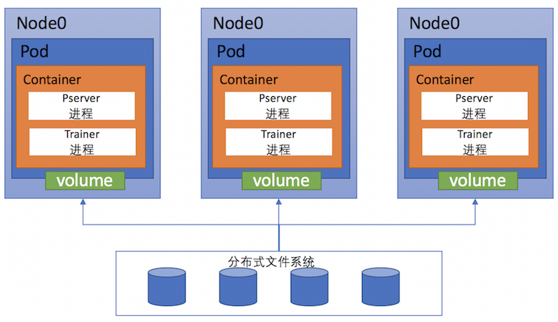

# Kubernetes分布式训练

前一篇文章介绍了如何在Kubernetes集群上启动一个单机PaddlePaddle训练作业 (Job)。在这篇文章里，我们介绍如何在Kubernetes集群上进行分布式PaddlePaddle训练作业。关于PaddlePaddle的分布式训练，文章 [Cluster Training](http://www.paddlepaddle.org/docs/develop/documentation/zh/howto/usage/cluster/cluster_train_cn.html)介绍了一种通过SSH远程分发任务，进行分布式训练的方法，与此不同的是，本文将介绍在Kubernetes容器管理平台上快速构建PaddlePaddle容器集群，进行分布式训练的方案。

## 整体方案

在训练之前，用户将配置与训练数据切分好放在分布式文件系统预先分配好的目录中(不同的分布式文件系统，需要使用其制定的方式挂载后并导入数据)，训练时，程序从此目录拷贝文件到容器内进行训练，将结果保存到此目录里。整体的结构图如下：



上图描述了一个3节点的分布式训练场景，在每个Pod上都通过volume方式挂载分布式文件系统的一个目录用于保存训练数据和输出结果。Kubernetes为这次训练创建了3个pod并且调度到了3个node上运行，每个pod包含一个PaddlePaddle容器。在容器创建后，会启动pserver与trainer进程，读取volume中的数据进行这次分布式训练。

根据前文的描述，要在已有的Kubernetes集群上进行PaddlePaddle的分布式训练，按照下面步骤即可：

1. [制作PaddlePaddle镜像](#制作镜像)
1. [将训练文件与切分好的数据上传到共享存储](#上传训练文件)
1. [编写本次训练的YAML文件，创建一个Kubernetes job](#创建Job)
1. [训练结束后查看输出结果](#查看输出)

下面就根据这几个步骤分别介绍。

### 制作镜像

PaddlePaddle镜像需要提供`paddle pserver`与`paddle train`进程的运行环境，用这个镜像创建的容器需要有以下两个功能：

- 拷贝训练文件到容器内
- 生成`paddle pserver`与`paddle train`进程的启动参数，并且启动训练

因为官方镜像 `paddlepaddle/paddle:latest` 内已经包含PaddlePaddle的执行程序但是还没上述功能，所以我们可以在这个基础上，添加启动脚本，制作新镜像来完成以上的工作。参考镜像的[*Dockerfile*](https://github.com/PaddlePaddle/Paddle/blob/develop/doc/howto/usage/cluster/src/k8s_train/Dockerfile)。

```bash
$ cd doc/howto/usage/k8s/src/k8s_train
$ docker build -t [YOUR_REPO]/paddle:mypaddle .
```

然后将构建成功的镜像上传到镜像仓库。

```bash
docker push  [YOUR_REPO]/paddle:mypaddle
```

注意上述命令中`[YOUR_REPO]`表示读者所使用的Docker镜像仓库地址，读者需要替换成自己使用的仓库地址。下文使用`[YOUR_REPO]/paddle:mypaddle`这个地址来表示此步骤所构建出的镜像。

### 准备训练数据

这里我们通过在Kubernetes集群上启动一个Job来下载并切割数据，也可以通过修改[k8s_train](./src/k8s_train/README.md)的内容来定制image.

在启动Job之前，需要根据不同的分布式存储来绑定一个[persistentVolumeClaim](https://kubernetes.io/docs/user-guide/persistent-volumes/),生成的数据将会存储在这个volume下.

```yaml
apiVersion: batch/v1
kind: Job
metadata:
  name: paddle-data
spec:
  template:
    metadata:
      name: pi
    spec:
      hostNetwork: true
      containers:
      - name: paddle-data
        image: paddlepaddle/paddle-tutorial:k8s_data
        imagePullPolicy: Always
        volumeMounts:
        - mountPath: "/mnt"
          name: nfs
        env:
        - name: OUT_DIR
          value: /home/work/mfs/paddle-cluster-job
        - name: SPLIT_COUNT
          value: "3"
      volumes:
        - name: nfs
          persistentVolumeClaim:
            claimName: mfs
      restartPolicy: Never
```

完成后volume中的文件内容大致如下：
```base
[root@paddle-kubernetes-node0 nfsdir]$ tree -d
.
`-- paddle-cluster-job
    |-- 0
    |   `-- data
    |-- 1
    |   `-- data
    |-- 2
    |   `-- data
    |-- output
    |-- quick_start
```

目录中paddle-cluster-job是本次训练对应的job name，本次训练要求有3个PaddlePaddle节点，在paddle-cluster-job/data目录中存放切分好的数据，文件夹0，1，2分别代表3个节点的trainer_id。recommendation文件夹内存放训练文件，output文件夹存放训练结果与日志。

### 创建Job

Kubernetes可以通过YAML文件来创建相关对象，然后可以使用命令行工具创建job。

Job YAML文件描述了这次训练使用的Docker镜像，需要启动的节点个数以及 `paddle pserver`与 `paddle train`进程启动的必要参数，也描述了容器需要使用的存储卷挂载的情况。YAML文件中各个字段的具体含义，可以查看[Kubernetes Job API](http://kubernetes.io/docs/api-reference/batch/v1/definitions/#_v1_job)。例如，本次训练的YAML文件可以写成：

```yaml
apiVersion: batch/v1
kind: Job
metadata:
  name: paddle-cluster-job
spec:
  parallelism: 3
  completions: 3
  template:
    metadata:
      name: paddle-cluster-job
    spec:
      volumes:
      - name: jobpath
        hostPath:
          path: /home/work/mfs
      containers:
      - name: trainer
        image: [YOUR_REPO]/paddle:mypaddle
        command: ["bin/bash",  "-c", "/root/start.sh"]
        env:
        - name: JOB_NAME
          value: paddle-cluster-job
        - name: JOB_PATH
          value: /home/jobpath
        - name: JOB_NAMESPACE
          value: default
        - name: TRAIN_CONFIG_DIR
          value: recommendation
        - name: CONF_PADDLE_NIC
          value: eth0
        - name: CONF_PADDLE_PORT
          value: "7164"
        - name: CONF_PADDLE_PORTS_NUM
          value: "2"
        - name: CONF_PADDLE_PORTS_NUM_SPARSE
          value: "2"
        - name: CONF_PADDLE_GRADIENT_NUM
          value: "3"
        volumeMounts:
        - name: jobpath
          mountPath: /home/jobpath
      restartPolicy: Never
```

文件中，`metadata`下的`name`表示这个job的名字。`parallelism，completions`字段表示这个job会同时开启3个PaddlePaddle节点，成功训练且退出的pod数目为3时，这个job才算成功结束。然后申明一个存储卷`jobpath`，代表宿主机目录`/home/work/mfs`，在对容器的描述`containers`字段中，将此目录挂载为容器的`/home/jobpath`目录，这样容器的`/home/jobpath`目录就成为了共享存储，放在这个目录里的文件其实是保存到了MFS上。

`env`字段表示容器的环境变量，我们将`paddle`运行的一些参数通过这种方式传递到容器内：


- JOB_PATH：共享存储挂在的路径
- JOB_NAME：Job的名字
- TRAIN_CONFIG_DIR：本次训练文件所在目录，与JOB_PATH,JOB_NAME组合可以找到本次训练需要的文件路径
- CONF_PADDLE_NIC：`paddle pserver`进程需要的`--nics`参数，即网卡名
- CONF_PADDLE_PORT：`paddle paserver`的`--port`参数
- CONF_PADDLE_PORTS_NUM：稠密更新的端口数量，即`--ports_num`参数
- CONF_PADDLE_PORTS_NUM_SPARSE：稀疏更新的端口数量，即`--ports_num_for_sparse`参数
- CONF_PADDLE_GRADIENT_NUM：训练节点数量，即`--num_gradient_servers参数`

这些参数的具体描述，读者可以查看[这里](http://www.paddlepaddle.org/docs/develop/documentation/zh/howto/usage/cmd_parameter/detail_introduction_cn.html)。

编写完YAML文件后，可以使用Kubernetes的命令行工具创建job。

```bash
kubectl create -f job.yaml
```

创建成功后，Kubernetes就会创建3个pod作为PaddlePaddle节点然后拉取镜像，启动容器开始训练。


### 查看输出

在训练过程中，可以在共享存储上查看输出的日志和模型，例如output目录下就存放了输出结果。注意node_0，node_1，node_2这几个目录表示PaddlePaddle节点与trainer_id，并不是Kubernetes中的node概念。

```bash
[root@paddle-kubernetes-node0 output]# tree -d
.
├── node_0
│   ├── server.log
│   └── train.log
├── node_1
│   ├── server.log
│   └── train.log
├── node_2
......
├── pass-00002
│   ├── done
│   ├── ___embedding_0__.w0
│   ├── ___embedding_1__.w0
......
```

我们可以通过日志查看容器训练的情况，例如：

```bash
[root@paddle-kubernetes-node0 node_0]# cat train.log
I1116 09:10:17.123121    50 Util.cpp:155] commandline:
 /usr/local/bin/../opt/paddle/bin/paddle_trainer
    --nics=eth0 --port=7164
    --ports_num=2 --comment=paddle_process_by_paddle
    --pservers=192.168.129.66,192.168.223.143,192.168.129.71
    --ports_num_for_sparse=2 --config=./trainer_config.py
    --trainer_count=4 --num_passes=10 --use_gpu=0
    --log_period=50 --dot_period=10 --saving_period=1
    --local=0 --trainer_id=0
    --save_dir=/home/jobpath/paddle-cluster-job/output
I1116 09:10:17.123440    50 Util.cpp:130] Calling runInitFunctions
I1116 09:10:17.123764    50 Util.cpp:143] Call runInitFunctions done.
[WARNING 2016-11-16 09:10:17,227 default_decorators.py:40] please use keyword arguments in paddle config.
[INFO 2016-11-16 09:10:17,239 networks.py:1282] The input order is [movie_id, title, genres, user_id, gender, age, occupation, rating]
[INFO 2016-11-16 09:10:17,239 networks.py:1289] The output order is [__square_error_cost_0__]
I1116 09:10:17.392917    50 Trainer.cpp:170] trainer mode: Normal
I1116 09:10:17.613910    50 PyDataProvider2.cpp:257] loading dataprovider dataprovider::process
I1116 09:10:17.680917    50 PyDataProvider2.cpp:257] loading dataprovider dataprovider::process
I1116 09:10:17.681543    50 GradientMachine.cpp:134] Initing parameters..
I1116 09:10:18.012390    50 GradientMachine.cpp:141] Init parameters done.
I1116 09:10:18.018641    50 ParameterClient2.cpp:122] pserver 0 192.168.129.66:7164
I1116 09:10:18.018950    50 ParameterClient2.cpp:122] pserver 1 192.168.129.66:7165
I1116 09:10:18.019069    50 ParameterClient2.cpp:122] pserver 2 192.168.223.143:7164
I1116 09:10:18.019492    50 ParameterClient2.cpp:122] pserver 3 192.168.223.143:7165
I1116 09:10:18.019716    50 ParameterClient2.cpp:122] pserver 4 192.168.129.71:7164
I1116 09:10:18.019836    50 ParameterClient2.cpp:122] pserver 5 192.168.129.71:7165
```


## 一些细节的补充

### 使用环境变量

使用容器方式运行训练任务的Kubernetes Job，通常会使用环境变量配置Job的配置信息`start_paddle.py`提供了一个启动脚本，将环境变量转换成paddle的命令行参数：
```
API = "/api/v1/namespaces/"
JOBSELECTOR = "labelSelector=job-name="
JOB_PATH = os.getenv("JOB_PATH") + "/" + os.getenv("JOB_NAME")
JOB_PATH_OUTPUT = JOB_PATH + "/output"
JOBNAME = os.getenv("JOB_NAME")
NAMESPACE = os.getenv("JOB_NAMESPACE")
PADDLE_NIC = os.getenv("CONF_PADDLE_NIC")
PADDLE_PORT = os.getenv("CONF_PADDLE_PORT")
PADDLE_PORTS_NUM = os.getenv("CONF_PADDLE_PORTS_NUM")
PADDLE_PORTS_NUM_SPARSE = os.getenv("CONF_PADDLE_PORTS_NUM_SPARSE")
PADDLE_SERVER_NUM = os.getenv("CONF_PADDLE_GRADIENT_NUM")
```

### Pod间通信
`start_paddle.py`脚本开始时，会先进行参数的初始化与解析。

```python
parser = argparse.ArgumentParser(prog="start_paddle.py",
                                     description='simple tool for k8s')
    args, train_args_list = parser.parse_known_args()
    train_args = refine_unknown_args(train_args_list)
    train_args_dict = dict(zip(train_args[:-1:2], train_args[1::2]))
    podlist = getPodList()
```

然后通过函数`getPodList()`访问Kubernetes的接口来查询此job对应的所有pod信息。当所有pod都处于running状态（容器运行都运行）时，再通过函数`getIdMap(podlist)`获取trainer_id。

```python
    podlist = getPodList()
    # need to wait until all pods are running
    while not isPodAllRunning(podlist):
        time.sleep(10)
        podlist = getPodList()
    idMap = getIdMap(podlist)
```
* *注意*: `getPodList()`会获取当前namespace下的所有pod，如果已经有pod运行，可能会导致出错。这种集群节点管理方式会在将来使用[statfulsets](https://kubernetes.io/docs/concepts/abstractions/controllers/statefulsets/)代替。

在函数`getIdMap(podlist)`内部，我们通过读取`podlist`中每个pod的IP地址，将IP排序生成的序号作为trainer_id。

```python
def getIdMap(podlist):
    '''
    generate tainer_id by ip
    '''
    ips = []
    for pod in podlist["items"]:
        ips.append(pod["status"]["podIP"])
    ips.sort()
    idMap = {}
    for i in range(len(ips)):
        idMap[ips[i]] = i
    return idMap
```

在得到`idMap`后，通过函数`startPaddle(idMap, train_args_dict)`构造`paddle pserver`与`paddle train`的启动参数并执行进程。

### 启动任务

在函数`startPaddle`中，最主要的工作就是解析出`paddle pserver`与`paddle train`的启动参数。例如`paddle train`参数的解析，解析环境变量得到`PADDLE_NIC`，`PADDLE_PORT`，`PADDLE_PORTS_NUM`等参数，然后通过自身的IP地址在`idMap`中获取`trainerId`。

```python
    program = 'paddle train'
    args = " --nics=" + PADDLE_NIC
    args += " --port=" + str(PADDLE_PORT)
    args += " --ports_num=" + str(PADDLE_PORTS_NUM)
    args += " --comment=" + "paddle_process_by_paddle"
    ip_string = ""
    for ip in idMap.keys():
        ip_string += (ip + ",")
    ip_string = ip_string.rstrip(",")
    args += " --pservers=" + ip_string
    args_ext = ""
    for key, value in train_args_dict.items():
        args_ext += (' --' + key + '=' + value)
    localIP = socket.gethostbyname(socket.gethostname())
    trainerId = idMap[localIP]
    args += " " + args_ext + " --trainer_id=" + \
        str(trainerId) + " --save_dir=" + JOB_PATH_OUTPUT
```
