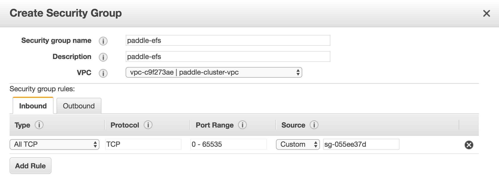
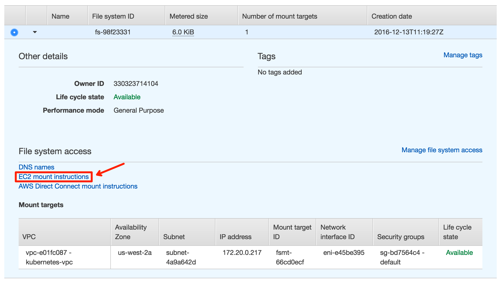
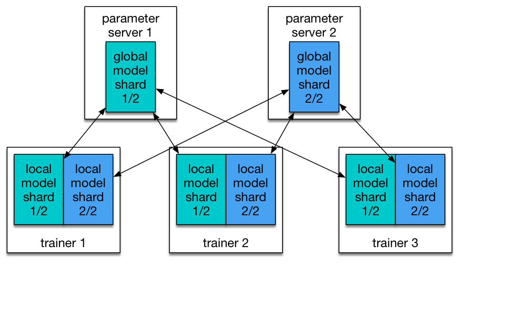

# Kubernetes on AWS

## Create AWS Account and IAM Account

Under each AWS account, we can create multiple [IAM](http://docs.aws.amazon.com/IAM/latest/UserGuide/introduction.html) users. This allows us to grant some privileges to each IAM user and to create/operate AWS clusters as an IAM user.

To sign up an AWS account, please
follow
[this guide](http://docs.aws.amazon.com/lambda/latest/dg/setting-up.html).
To create IAM users and user groups under an AWS account, please
follow
[this guide](http://docs.aws.amazon.com/IAM/latest/UserGuide/id_users_create.html).

Please be aware that this tutorial needs the following privileges for the user in IAM:

- AmazonEC2FullAccess
- AmazonS3FullAccess
- AmazonRoute53FullAccess
- AmazonRoute53DomainsFullAccess
- AmazonElasticFileSystemFullAccess
- AmazonVPCFullAccess
- IAMUserSSHKeys
- IAMFullAccess
- NetworkAdministrator
- AWSKeyManagementServicePowerUser


## PaddlePaddle on AWS

Here we will show you step by step on how to run PaddlePaddle training on AWS cluster.


### Download kube-aws and kubectl

#### kube-aws

[kube-aws](https://github.com/coreos/kube-aws) is a CLI tool to automate cluster deployment to AWS.

Import the CoreOS Application Signing Public Key:

```
gpg2 --keyserver pgp.mit.edu --recv-key FC8A365E
```

Validate the key fingerprint:

```
gpg2 --fingerprint FC8A365E
```
The correct key fingerprint is `18AD 5014 C99E F7E3 BA5F 6CE9 50BD D3E0 FC8A 365E`

We can download `kube-aws` from its [release page](https://github.com/coreos/kube-aws/releases). In this tutorial, we use version 0.9.1

Validate the tarball's GPG signature:

```
PLATFORM=linux-amd64
 # Or
PLATFORM=darwin-amd64

gpg2 --verify kube-aws-${PLATFORM}.tar.gz.sig kube-aws-${PLATFORM}.tar.gz
```

Extract the binary:

```
tar zxvf kube-aws-${PLATFORM}.tar.gz
```

Add kube-aws to your path:

```
mv ${PLATFORM}/kube-aws /usr/local/bin
```


#### kubectl

[kubectl](https://kubernetes.io/docs/user-guide/kubectl-overview/) is a command line interface for running commands against Kubernetes clusters.

Download `kubectl` from the Kubernetes release artifact site with the `curl` tool.

```
# OS X
curl -O https://storage.googleapis.com/kubernetes-release/release/"$(curl -s https://storage.googleapis.com/kubernetes-release/release/stable.txt)"/bin/darwin/amd64/kubectl

# Linux
curl -O https://storage.googleapis.com/kubernetes-release/release/"$(curl -s https://storage.googleapis.com/kubernetes-release/release/stable.txt)"/bin/linux/amd64/kubectl
```

Make the kubectl binary executable and move it to your PATH (e.g. `/usr/local/bin`):

```
chmod +x ./kubectl
sudo mv ./kubectl /usr/local/bin/kubectl
```

### Configure AWS Credentials

First check out [this](http://docs.aws.amazon.com/cli/latest/userguide/installing.html) for installing the AWS command line interface.

And then configure your AWS account information:

```
aws configure

```


Fill in the required fields:


```
AWS Access Key ID: YOUR_ACCESS_KEY_ID
AWS Secrete Access Key: YOUR_SECRETE_ACCESS_KEY
Default region name: us-west-1
Default output format: json
```

`YOUR_ACCESS_KEY_ID`, and `YOUR_SECRETE_ACCESS_KEY` is the IAM key and secret from [Create AWS Account and IAM Account](#create-aws-account-and-iam-account)

Verify that your credentials work by describing any instances you may already have running on your account:

```
aws ec2 describe-instances
```

### Define Cluster Parameters

#### EC2 key pair

The keypair that will authenticate SSH access to your EC2 instances. The public half of this key pair will be configured on each CoreOS node.

Follow [EC2 Keypair docs](http://docs.aws.amazon.com/AWSEC2/latest/UserGuide/ec2-key-pairs.html) to create a EC2 key pair

After creating a key pair, you will use the key pair name to configure the cluster.

Key pairs are only available to EC2 instances in the same region. We are using us-west-1 in our tutorial, so make sure to creat key pairs in that region (N. California).

#### KMS key

Amazon KMS keys are used to encrypt and decrypt cluster TLS assets. If you already have a KMS Key that you would like to use, you can skip creating a new key and provide the Arn string for your existing key.

You can create a KMS key in the AWS console, or with the aws command line tool:

```
aws kms --region=us-west-1 create-key --description="kube-aws assets"
{
    "KeyMetadata": {
        "CreationDate": 1458235139.724,
        "KeyState": "Enabled",
        "Arn": "arn:aws:kms:us-west-1:aaaaaaaaaaaaa:key/xxxxxxxxxxxxxxxxxxx",
        "AWSAccountId": "xxxxxxxxxxxxx",
        "Enabled": true,
        "KeyUsage": "ENCRYPT_DECRYPT",
        "KeyId": "xxxxxxxxx",
        "Description": "kube-aws assets"
    }
}
```

We will need to use the value of `Arn` later.

And then you need to add several inline policies in your user permission.

Go to IAM user page, click on `Add inline policy` button, and then select `Custom Policy`

paste into following inline policies:

```
{
    "Version": "2012-10-17",
    "Statement": [
        {
            "Sid": "Stmt1482205552000",
            "Effect": "Allow",
            "Action": [
                "kms:Decrypt",
                "kms:Encrypt"
            ],
            "Resource": [
                "arn:aws:kms:*:AWS_ACCOUNT_ID:key/*"
            ]
        },
		{
            "Sid": "Stmt1482205746000",
            "Effect": "Allow",
            "Action": [
                "cloudformation:CreateStack",
                "cloudformation:UpdateStack",
                "cloudformation:DeleteStack",
                "cloudformation:DescribeStacks",
                "cloudformation:DescribeStackResource",
                "cloudformation:GetTemplate",
                "cloudformation:DescribeStackEvents"
            ],
            "Resource": [
                "arn:aws:cloudformation:us-west-1:AWS_ACCOUNT_ID:stack/MY_CLUSTER_NAME/*"
            ]
        }
    ]
}
```

`AWS_ACCOUNT_ID`: You can get it from following command line:

```
aws sts get-caller-identity --output text --query Account
```

`MY_CLUSTER_NAME`: Pick a MY_CLUSTER_NAME that you like, you will use it later as well.

#### External DNS name

When the cluster is created, the controller will expose the TLS-secured API on a DNS name.

The A record of that DNS name needs to be point to the cluster ip address.

We will need to use DNS name later in tutorial. If you don't already own one, you can choose any DNS name (e.g., `paddle`) and modify `/etc/hosts` to associate cluster ip with that DNS name.

#### S3 bucket

You need to create an S3 bucket before startup the Kubernetes cluster.

There are some bugs in aws cli in creating S3 bucket, so let's use the [Web console](https://console.aws.amazon.com/s3/home?region=us-west-1).

Click on `Create Bucket`, fill in a unique BUCKET_NAME, and make sure region is us-west-1 (Northern California).


#### Initialize an asset directory

Create a directory on your local machine to hold the generated assets:

```
$ mkdir my-cluster
$ cd my-cluster
```

Initialize the cluster CloudFormation stack with the KMS Arn, key pair name, and DNS name from the previous step:

```
kube-aws init \
--cluster-name=MY_CLUSTER_NAME \
--external-dns-name=MY_EXTERNAL_DNS_NAME \
--region=us-west-1 \
--availability-zone=us-west-1a \
--key-name=KEY_PAIR_NAME \
--kms-key-arn="arn:aws:kms:us-west-1:xxxxxxxxxx:key/xxxxxxxxxxxxxxxxxxx"
```

`MY_CLUSTER_NAME`: the one you picked in [KMS key](#kms-key)

`MY_EXTERNAL_DNS_NAME`: see [External DNS name](#external-dns-name)

`KEY_PAIR_NAME`: see [EC2 key pair](#ec2-key-pair)

`--kms-key-arn`: the "Arn" in [KMS key](#kms-key)

Here `us-west-1a` is used for parameter `--availability-zone`, but supported availability zone varies among AWS accounts.

Please check if `us-west-1a` is supported by `aws ec2 --region us-west-1 describe-availability-zones`, if not switch to other supported availability zone. (e.g., `us-west-1a`, or `us-west-1b`)

Note: please don't use `us-west-1c`. Subnets can currently only be created in the following availability zones: us-west-1b, us-west-1a.

There will now be a cluster.yaml file in the asset directory. This is the main configuration file for your cluster.


#### Render contents of the asset directory

In the simplest case, you can have kube-aws generate both your TLS identities and certificate authority for you.

```
kube-aws render credentials --generate-ca
```

The next command generates the default set of cluster assets in your asset directory.

```
kube-aws render stack
```

Here's what the directory structure looks like:

```
$ tree
.
├── cluster.yaml
├── credentials
│   ├── admin-key.pem
│   ├── admin.pem
│   ├── apiserver-key.pem
│   ├── apiserver.pem
│   ├── ca-key.pem
│   ├── ca.pem
│   ├── worker-key.pem
│   └── worker.pem
│   ├── etcd-key.pem
│   └── etcd.pem
│   ├── etcd-client-key.pem
│   └── etcd-client.pem
├── kubeconfig
├── stack-template.json
└── userdata
    ├── cloud-config-controller
    └── cloud-config-worker
```

These assets (templates and credentials) are used to create, update and interact with your Kubernetes cluster.


### Kubernetes Cluster Start Up

#### Create the instances defined in the CloudFormation template

Now let's create your cluster (choose any PREFIX for the command below):

```
kube-aws up --s3-uri s3://BUCKET_NAME/PREFIX
```

`BUCKET_NAME`: the bucket name that you used in [S3 bucket](#s3-bucket)


#### Configure DNS

You can invoke `kube-aws status` to get the cluster API endpoint after cluster creation.

```
$ kube-aws status
Cluster Name:		paddle-cluster
Controller DNS Name:	paddle-cl-ElbAPISe-EEOI3EZPR86C-531251350.us-west-1.elb.amazonaws.com
```

Use command `dig` to check the load balancer hostname to get the ip address.

```
$ dig paddle-cl-ElbAPISe-EEOI3EZPR86C-531251350.us-west-1.elb.amazonaws.com

;; QUESTION SECTION:
;paddle-cl-ElbAPISe-EEOI3EZPR86C-531251350.us-west-1.elb.amazonaws.com. IN A

;; ANSWER SECTION:
paddle-cl-ElbAPISe-EEOI3EZPR86C-531251350.us-west-1.elb.amazonaws.com. 59 IN A 54.241.164.52
paddle-cl-ElbAPISe-EEOI3EZPR86C-531251350.us-west-1.elb.amazonaws.com. 59 IN A 54.67.102.112
```

In the above output, both ip `54.241.164.52`, `54.67.102.112` will work.

If you own a DNS name, set the A record to any of the above ip. Otherwise you can edit `/etc/hosts` to associate ip with the DNS name.

#### Access the cluster

Once the API server is running, you should see:

```
$ kubectl --kubeconfig=kubeconfig get nodes
NAME                                       STATUS                     AGE
ip-10-0-0-xxx.us-west-1.compute.internal   Ready                      5m
ip-10-0-0-xxx.us-west-1.compute.internal   Ready                      5m
ip-10-0-0-xx.us-west-1.compute.internal    Ready,SchedulingDisabled   5m
```


### Setup Elastic File System for Cluster

Training data is usually served on a distributed filesystem, we use Elastic File System (EFS) on AWS. Ceph might be a better solution, but it requires high version of Linux kernel that might not be stable enough at this moment. We haven't automated the EFS setup at this moment, so please do the following steps:


1. Make sure you added AmazonElasticFileSystemFullAccess policy in your group.

1. Create the Elastic File System in AWS console, and attach the new VPC with it.
<center></center>


1. Modify the Kubernetes security group under ec2/Security Groups, add additional inbound policy "All TCP TCP 0 - 65535 0.0.0.0/0" for Kubernetes default VPC security group. 
<center></center>


1. Follow the EC2 mount instruction to mount the disk onto all the Kubernetes nodes, we recommend to mount EFS disk onto ~/efs.
<center></center>


We will place user config and divided training data onto EFS. Training task will cache related files by copying them from EFS into container. It will also write the training results back onto EFS. We will show you how to place the data later in this article.


### Core Concepts of PaddlePaddle Training on AWS

Now we've already setup a 3 nodes distributed Kubernetes cluster, and on each node we've attached the EFS volume. In this training demo, we will create three Kubernetes pods and schedule them on three nodes. Each pod contains a PaddlePaddle container. When container gets created, it will start parameter server (pserver) and trainer process, load the training data from EFS volume and start the distributed training task.

#### Distributed Training Job

Distributed training job is represented by a [kubernetes job](https://kubernetes.io/docs/user-guide/jobs/#what-is-a-job).

Kubernetes job is described by a job config file. The file contains lots of configuration information. For example, PaddlePaddle's node number, `paddle pserver` open port number, the network card info etc. These information are passed into container for `pserver` and `trainer` to use as environment variables.

In one distributed training job, we will:

1. Upload the pre-divided training data and configuration file onto EFS volume.
1. Create and submit the Kubernetes job config to the Kubernetes cluster to start the training job.

#### Parameter Server and Trainer

There are two roles in a PaddlePaddle cluster: `parameter server` and `trainer`. Each parameter server process maintains a shard of the global model. Each trainer has its local copy of the model, and uses its local data to update the model. During the training process, trainers send model updates to parameter servers, parameter servers are responsible for aggregating these updates, so that trainers can synchronize their local copy with the global model.

<center></center>

In order to communicate with pserver, trainer needs to know the ip address of each pserver. In kubernetes it's better to use a service discovery mechanism (e.g., DNS hostname) rather than static ip address, since any pserver's pod may be killed and a new pod could be schduled onto another node of different ip address. We will improve paddlepaddle's service discovery ability. For now we will use static ip.

Parameter server and trainer are packaged into a same docker image. They will run once pod is scheduled by kubernetes job.

#### Trainer ID

Trainer id is the index of trainer within all trainers of a job. Trainer needs this information to do things like reading the correct shared of data.

#### Training

After container gets started, it starts up the distributed training by using scripts. Each node will use job pod's name to query Kubernetes apiserver for information of all pods in current job.

From pods information, script knows static ip addresses of pservers. And assign trainer it's own `trainer_id`. The workflow of the script is as follows:

1. Query the api server to get pod information, and assign the `trainer_id` by sorting the ip.
1. Copy the training data from EFS sharing volume into container.
1. Parse the `paddle pserver` and `paddle trainer` startup parameters from environment variables, and then start up the processes.
1. Trainer with `train_id` 0 will automatically write results onto EFS volume.


### Start PaddlePaddle Training Demo on AWS

Now we'll start a PaddlePaddle training demo on AWS, steps are as follows:

1. Build PaddlePaddle Docker image.
1. Divide the training data file and upload it onto the EFS sharing volume.
1. Create the training job config file, and start up the job.
1. Check the result after training.

#### Build PaddlePaddle Docker Image

PaddlePaddle docker image need to provide the runtime environment for `pserver` and `trainer`, so the container use this image should have two main function:

1. Copy the training data into container.
1. Generate the startup parameter for `pserver` and `trainer` process, and startup the training.


We need to create a new image since official `paddledev/paddle:cpu-latest` only have PaddlePaddle binary, but lack of the above functionalities.

Dockerfile for creating the new image is as follows:

```
FROM paddledev/paddle:cpu-latest

MAINTAINER zjsxzong89@gmail.com

COPY start.sh /root/
COPY start_paddle.py /root/
CMD ["bash"," -c","/root/start.sh"]
```

At this point, we will copy our `start.sh` and `start_paddle.py` file into container, and then exec `start_paddle.py` script to start up the training, all the steps like assigning trainer_id, getting other nodes' ip are implemented in `start_paddle.py`.

`start_paddle.py` will start parsing the parameters.

```
parser = argparse.ArgumentParser(prog="start_paddle.py",
                                     description='simple tool for k8s')
    args, train_args_list = parser.parse_known_args()
    train_args = refine_unknown_args(train_args_list)
    train_args_dict = dict(zip(train_args[:-1:2], train_args[1::2]))
    podlist = getPodList()
```

And then using function `getPodList()` to query all the pod information from the job name through Kubernetes api server. When all the pods are in the running status, using `getIdMap(podlist)` to get the trainer_id.

```
    podlist = getPodList()
    # need to wait until all pods are running
    while not isPodAllRunning(podlist):
        time.sleep(10)
        podlist = getPodList()
    idMap = getIdMap(podlist)
```

In function `getIdMap(podlist)`, we use podlist to get the ip address for each pod and sort them, use the index as the trainer_id.

```
def getIdMap(podlist):
    '''
    generate tainer_id by ip
    '''
    ips = []
    for pod in podlist["items"]:
        ips.append(pod["status"]["podIP"])
    ips.sort()
    idMap = {}
    for i in range(len(ips)):
        idMap[ips[i]] = i
    return idMap
```

After getting `idMap`, we use function `startPaddle(idMap, train_args_dict)` to generate `paddle pserver` and `paddle train` start up parameters and then start up the processes.

In function `startPaddle`, the most important work is to generate `paddle pserver` and `paddle train` start up parameters. For example, `paddle train` parameter parsing, we will get parameters like `PADDLE_NIC`, `PADDLE_PORT`, `PADDLE_PORTS_NUM`, and get the `trainer_id` from `idMap`.

```
    program = 'paddle train'
    args = " --nics=" + PADDLE_NIC
    args += " --port=" + str(PADDLE_PORT)
    args += " --ports_num=" + str(PADDLE_PORTS_NUM)
    args += " --comment=" + "paddle_process_by_paddle"
    ip_string = ""
    for ip in idMap.keys():
        ip_string += (ip + ",")
    ip_string = ip_string.rstrip(",")
    args += " --pservers=" + ip_string
    args_ext = ""
    for key, value in train_args_dict.items():
        args_ext += (' --' + key + '=' + value)
    localIP = socket.gethostbyname(socket.gethostname())
    trainerId = idMap[localIP]
    args += " " + args_ext + " --trainer_id=" + \
        str(trainerId) + " --save_dir=" + JOB_PATH_OUTPUT
```

Use `docker build` to build toe Docker Image:

```
docker build -t your_repo/paddle:mypaddle .
```

And then push the built image onto docker registry.

```
docker push  your_repo/paddle:mypaddle
```

#### Upload Training Data File

Here we will use PaddlePaddle's official recommendation demo as the content for this training, we put the training data file into a directory named by job name, which located in EFS sharing volume, the tree structure for the directory looks like:

```
efs
└── paddle-cluster-job
    ├── data
    │   ├── 0
    │   │
    │   ├── 1
    │   │
    │   └── 2
    ├── output
    └── recommendation
```

The `paddle-cluster-job` directory is the job name for this training, this training includes 3 PaddlePaddle node, we store the pre-divided data under `paddle-cluster-job/data` directory, directory 0, 1, 2 each represent 3 nodes' trainer_id. the training data in in recommendation directory, the training results and logs will be in the output directory.


#### Create Kubernetes Job

Kubernetes use yaml file to describe job details, and then use command line tool to create the job in Kubernetes cluster.

In yaml file, we describe the Docker image we use for this training, the node number we need to startup, the volume mounting information and all the necessary parameters we need for `paddle pserver` and `paddle train` processes.

The yaml file content is as follows:

```
apiVersion: batch/v1
kind: Job
metadata:
  name: paddle-cluster-job
spec:
  parallelism: 3
  completions: 3
  template:
    metadata:
      name: paddle-cluster-job
    spec:
      volumes:
      - name: jobpath
        hostPath:
          path: /home/admin/efs
      containers:
      - name: trainer
        image: drinkcode/paddle:k8s-job
        command: ["bin/bash",  "-c", "/root/start.sh"]
        env:
        - name: JOB_NAME
          value: paddle-cluster-job
        - name: JOB_PATH
          value: /home/jobpath
        - name: JOB_NAMESPACE
          value: default
        - name: TRAIN_CONFIG_DIR
          value: recommendation
        - name: CONF_PADDLE_NIC
          value: eth0
        - name: CONF_PADDLE_PORT
          value: "7164"
        - name: CONF_PADDLE_PORTS_NUM
          value: "2"
        - name: CONF_PADDLE_PORTS_NUM_SPARSE
          value: "2"
        - name: CONF_PADDLE_GRADIENT_NUM
          value: "3"
        volumeMounts:
        - name: jobpath
          mountPath: /home/jobpath
        ports:
        - name: jobport
          hostPort: 30001
          containerPort: 30001
      restartPolicy: Never

```

In yaml file, the metadata's name is the job's name. `parallelism, completions` means this job will simultaneously start up 3 PaddlePaddle nodes, and this job will be finished when there are 3 finished pods. For the data store volume, we declare the path jobpath, it mount the /home/admin/efs on host machine into the container with path /home/jobpath. So in container, the /home/jobpath actually stores the data onto EFS sharing volume.

`env` field represents container's environment variables, we pass the PaddlePaddle parameters into containers by using the `env` field.

`JOB_PATH` represents the sharing volume path, `JOB_NAME` represents job name, `TRAIN_CONFIG_DIR` represents the training data file directory, we can these three parameters to get the file path for this training.

`CONF_PADDLE_NIC` represents `paddle pserver` process's `--nics` parameters, the NIC name.

`CONF_PADDLE_PORT` represents `paddle pserver` process's `--port` parameters, `CONF_PADDLE_PORTS_NUM` represents `--port_num` parameter.

`CONF_PADDLE_PORTS_NUM_SPARSE` represents the sparse updated port number, `--ports_num_for_sparse` parameter.

`CONF_PADDLE_GRADIENT_NUM` represents the training node number, `--num_gradient_servers` parameter.

After we create the yaml file, we can use Kubernetes command line tool to create the job onto the cluster.

```
kubectl create -f job.yaml
```

After we execute the above command, Kubernetes will create 3 pods and then pull the PaddlePaddle image, then start up the containers for training.


#### Check Training Results

During the training, we can see the logs and models on EFS sharing volume, the output directory contains the training results. (Caution: node_0, node_1, node_2 directories represents PaddlePaddle node and train_id, not the Kubernetes node)

```
[root@paddle-kubernetes-node0 output]# tree -d
.
├── node_0
│   ├── server.log
│   └── train.log
├── node_1
│   ├── server.log
│   └── train.log
├── node_2
......
├── pass-00002
│   ├── done
│   ├── ___embedding_0__.w0
│   ├── ___embedding_1__.w0
......
```

We can always check the container training status through logs, for example:

```
[root@paddle-kubernetes-node0 node_0]# cat train.log
I1116 09:10:17.123121    50 Util.cpp:155] commandline:
 /usr/local/bin/../opt/paddle/bin/paddle_trainer
    --nics=eth0 --port=7164
    --ports_num=2 --comment=paddle_process_by_paddle
    --pservers=192.168.129.66,192.168.223.143,192.168.129.71
    --ports_num_for_sparse=2 --config=./trainer_config.py
    --trainer_count=4 --num_passes=10 --use_gpu=0 
    --log_period=50 --dot_period=10 --saving_period=1 
    --local=0 --trainer_id=0
    --save_dir=/home/jobpath/paddle-cluster-job/output
I1116 09:10:17.123440    50 Util.cpp:130] Calling runInitFunctions
I1116 09:10:17.123764    50 Util.cpp:143] Call runInitFunctions done.
[WARNING 2016-11-16 09:10:17,227 default_decorators.py:40] please use keyword arguments in paddle config.
[INFO 2016-11-16 09:10:17,239 networks.py:1282] The input order is [movie_id, title, genres, user_id, gender, age, occupation, rating]
[INFO 2016-11-16 09:10:17,239 networks.py:1289] The output order is [__regression_cost_0__]
I1116 09:10:17.392917    50 Trainer.cpp:170] trainer mode: Normal
I1116 09:10:17.613910    50 PyDataProvider2.cpp:257] loading dataprovider dataprovider::process
I1116 09:10:17.680917    50 PyDataProvider2.cpp:257] loading dataprovider dataprovider::process
I1116 09:10:17.681543    50 GradientMachine.cpp:134] Initing parameters..
I1116 09:10:18.012390    50 GradientMachine.cpp:141] Init parameters done.
I1116 09:10:18.018641    50 ParameterClient2.cpp:122] pserver 0 192.168.129.66:7164
I1116 09:10:18.018950    50 ParameterClient2.cpp:122] pserver 1 192.168.129.66:7165
I1116 09:10:18.019069    50 ParameterClient2.cpp:122] pserver 2 192.168.223.143:7164
I1116 09:10:18.019492    50 ParameterClient2.cpp:122] pserver 3 192.168.223.143:7165
I1116 09:10:18.019716    50 ParameterClient2.cpp:122] pserver 4 192.168.129.71:7164
I1116 09:10:18.019836    50 ParameterClient2.cpp:122] pserver 5 192.168.129.71:7165
```

It'll take around 8 hours to finish this PaddlePaddle recommendation training demo on three 2 core 8 GB EC2 machine (m3.large).


### Kubernetes Cluster Tear Down


If you want to tear down the whole Kubernetes cluster, make sure to *delete* the EFS volume first (otherwise, you will get stucked on following steps), and then use the following command:

```
kube-aws destroy
```
It's an async call, it might take 5 min to tear down the whole cluster.

If you created any Kubernetes Services of type LoadBalancer, you must delete these first, as the CloudFormation cannot be fully destroyed if any externally-managed resources still exist.
