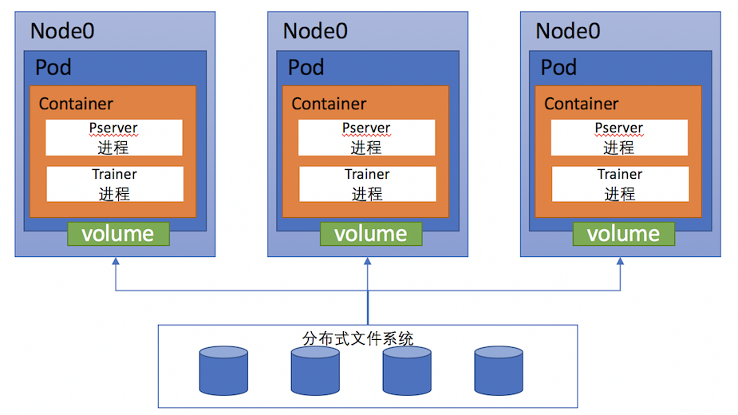

# Kubernetes分布式训练

前一篇文章介绍了如何在Kubernetes集群上启动一个单机PaddlePaddle训练作业 (Job)。在这篇文章里，我们介绍如何在Kubernetes集群上进行分布式PaddlePaddle训练作业。关于PaddlePaddle的分布式训练，文章 [Cluster Training](https://github.com/baidu/Paddle/blob/develop/doc/cluster/opensource/cluster_train.md)介绍了一种通过SSH远程分发任务，进行分布式训练的方法，与此不同的是，本文将介绍在Kubernetes容器管理平台上快速构建PaddlePaddle容器集群，进行分布式训练的方案。

## Kubernetes 基本概念

[*Kubernetes*](http://kubernetes.io/)是Google开源的容器集群管理系统，其提供应用部署、维护、 扩展机制等功能，利用Kubernetes能方便地管理跨机器运行容器化的应用。Kubernetes可以在物理机或虚拟机上运行，且支持部署到[AWS](http://kubernetes.io/docs/getting-started-guides/aws)，[Azure](http://kubernetes.io/docs/getting-started-guides/azure/)，[GCE](http://kubernetes.io/docs/getting-started-guides/gce)等多种公有云环境。介绍分布式训练之前，需要对[Kubernetes](http://kubernetes.io/)有一个基本的认识，下面先简要介绍一下本文用到的几个Kubernetes概念。

- [*Node*](http://kubernetes.io/docs/admin/node/) 表示一个Kubernetes集群中的一个工作节点，这个节点可以是物理机或者虚拟机，Kubernetes集群就是由node节点与master节点组成的。

- [*Pod*](http://kubernetes.io/docs/user-guide/pods/) 是一组(一个或多个)容器，pod是Kubernetes的最小调度单元，一个pod中的所有容器会被调度到同一个node上。Pod中的容器共享NET，PID，IPC，UTS等Linux namespace。由于容器之间共享NET namespace，所以它们使用同一个IP地址，可以通过*localhost*互相通信。不同pod之间可以通过IP地址访问。

- [*Job*](http://kubernetes.io/docs/user-guide/jobs/) 是Kubernetes上运行的作业，一次作业称为一个job，通常每个job包括一个或者多个pods。

- [*Volume*](http://kubernetes.io/docs/user-guide/volumes/) 存储卷，是pod内的容器都可以访问的共享目录，也是容器与node之间共享文件的方式，因为容器内的文件都是暂时存在的，当容器因为各种原因被销毁时，其内部的文件也会随之消失。通过volume，就可以将这些文件持久化存储。Kubernetes支持多种volume，例如hostPath(宿主机目录)，gcePersistentDisk，awsElasticBlockStore等。

- [*Namespaces*](http://kubernetes.io/docs/user-guide/volumes/) 命名空间，在kubernetes中创建的所有资源对象(例如上文的pod，job)等都属于一个命名空间，在同一个命名空间中，资源对象的名字是唯一的，不同空间的资源名可以重复，命名空间主要为了对象进行逻辑上的分组便于管理。本文只使用了默认命名空间。

## 整体方案

### 部署Kubernetes集群

首先，我们需要拥有一个Kubernetes集群，在这个集群中所有node与pod都可以互相通信。关于Kubernetes集群搭建，可以参考[官方文档](http://kubernetes.io/docs/getting-started-guides/kubeadm/)，在以后的文章中我们也会介绍AWS上搭建的方案。本文假设大家能找到几台物理机，并且可以按照官方文档在上面部署Kubernetes。在本文的环境中，Kubernetes集群中所有node都挂载了一个[MFS](http://moosefs.org/)（Moose filesystem，一种分布式文件系统）共享目录，我们通过这个目录来存放训练文件与最终输出的模型。关于MFS的安装部署，可以参考[MooseFS documentation](https://moosefs.com/documentation.html)。在训练之前，用户将配置与训练数据切分好放在MFS目录中，训练时，程序从此目录拷贝文件到容器内进行训练，将结果保存到此目录里。整体的结构图如下：



上图描述了一个3节点的分布式训练场景，Kubernetes集群的每个node上都挂载了一个MFS目录，这个目录可以通过volume的形式挂载到容器中。Kubernetes为这次训练创建了3个pod并且调度到了3个node上运行，每个pod包含一个PaddlePaddle容器。在容器创建后，会启动pserver与trainer进程，读取volume中的数据进行这次分布式训练。

### 使用 Job

我们使用Kubernetes中的job这个概念来代表一次分布式训练。Job表示一次性作业，在作业完成后，Kubernetes会销毁job产生的容器并且释放相关资源。

在Kubernetes中，可以通过编写一个YAML文件，来描述这个job，在这个文件中，主要包含了一些配置信息，例如PaddlePaddle的节点个数，`paddle pserver`开放的端口个数与端口号，使用的网卡设备等，这些信息通过环境变量的形式传递给容器内的程序使用。

在一次分布式训练中，用户确定好本次训练需要的PaddlePaddle节点个数，将切分好的训练数据与配置文件上传到MFS共享目录中。然后编写这次训练的job YAML文件，提交给Kubernetes集群创建并开始作业。

### 创建PaddlePaddle节点

当Kubernetes master收到请求，解析完YAML文件后，会创建出多个pod(个数为PaddlePaddle节点数)，Kubernetes会把这些pod调度到集群的node上运行。一个pod就代表一个PaddlePaddle节点，当pod被成功分配到一台物理/虚拟机上后，Kubernetes会启动pod内的容器，这个容器会根据YAML文件中的环境变量，启动`paddle pserver`与`paddle train`进程。

### 启动训练

在容器启动后，会通过脚本来启动这次分布式训练，我们知道`paddle train`进程启动时需要知道其他节点的IP地址以及本节点的trainer_id，由于PaddlePaddle本身不提供类似服务发现的功能，所以在本文的启动脚本中，每个节点会根据job name向Kubernetes apiserver查询这个job对应的所有pod信息(Kubernetes默认会在每个容器的环境变量中写入apiserver的地址)。

根据这些pod信息，就可以通过某种方式，为每个pod分配一个唯一的trainer_id。本文把所有pod的IP地址进行排序，将顺序作为每个PaddlePaddle节点的trainer_id。启动脚本的工作流程大致如下：

  1. 查询Kubernetes apiserver获取pod信息，根据IP分配trainer_id
  1. 从MFS共享目录中拷贝训练文件到容器内
  1. 根据环境变量，解析出`paddle pserver`与`paddle train`的启动参数，启动进程
  1. 训练时，PaddlePaddle会自动将结果保存在trainer_id为0的节点上，将输出路径设置为MFS目录，保存输出的文件


## 搭建过程

根据前文的描述，要在已有的Kubernetes集群上进行PaddlePaddle的分布式训练，主要分为以下几个步骤：

1. 制作PaddlePaddle镜像
1. 将训练文件与切分好的数据上传到共享存储
1. 编写本次训练的YAML文件，创建一个Kubernetes job
1. 训练结束后查看输出结果

下面就根据这几个步骤分别介绍。


### 制作镜像

PaddlePaddle镜像需要提供`paddle pserver`与`paddle train`进程的运行环境，用这个镜像创建的容器需要有以下两个功能：

- 拷贝训练文件到容器内

- 生成`paddle pserver`与`paddle train`进程的启动参数，并且启动训练

因为官方镜像 `paddledev/paddle:cpu-latest` 内已经包含PaddlePaddle的执行程序但是还没上述功能，所以我们可以在这个基础上，添加启动脚本，制作新镜像来完成以上的工作。镜像的*Dockerfile*如下：

```Dockerfile
FROM paddledev/paddle:cpu-latest

MAINTAINER zjsxzong89@gmail.com

COPY start.sh /root/
COPY start_paddle.py /root/
CMD ["bash"," -c","/root/start.sh"]
```

[start.sh](https://github.com/PaddlePaddle/Paddle/blob/develop/doc/howto/usage/cluster/k8s/start.sh)文件拷贝训练文件到容器内，然后执行[start_paddle.py](https://github.com/PaddlePaddle/Paddle/blob/develop/doc/howto/usage/cluster/k8s/start_paddle.py)脚本启动训练，前文提到的获取其他节点IP地址，分配`trainer_id`等都在`start_paddle.py`脚本中完成。

`start_paddle.py`脚本开始时，会先进行参数的初始化与解析。

```python
parser = argparse.ArgumentParser(prog="start_paddle.py",
                                     description='simple tool for k8s')
    args, train_args_list = parser.parse_known_args()
    train_args = refine_unknown_args(train_args_list)
    train_args_dict = dict(zip(train_args[:-1:2], train_args[1::2]))
    podlist = getPodList()
```

然后通过函数`getPodList()`访问Kubernetes的接口来查询此job对应的所有pod信息。当所有pod都处于running状态（容器运行都运行）时，再通过函数`getIdMap(podlist)`获取trainer_id。

```python
    podlist = getPodList()
    # need to wait until all pods are running
    while not isPodAllRunning(podlist):
        time.sleep(10)
        podlist = getPodList()
    idMap = getIdMap(podlist)
```

在函数`getIdMap(podlist)`内部，我们通过读取`podlist`中每个pod的IP地址，将IP排序生成的序号作为trainer_id。

```python
def getIdMap(podlist):
    '''
    generate tainer_id by ip
    '''
    ips = []
    for pod in podlist["items"]:
        ips.append(pod["status"]["podIP"])
    ips.sort()
    idMap = {}
    for i in range(len(ips)):
        idMap[ips[i]] = i
    return idMap
```

在得到`idMap`后，通过函数`startPaddle(idMap, train_args_dict)`构造`paddle pserver`与`paddle train`的启动参数并执行进程。

在函数`startPaddle`中，最主要的工作就是解析出`paddle pserver`与`paddle train`的启动参数。例如`paddle train`参数的解析，解析环境变量得到`PADDLE_NIC`，`PADDLE_PORT`，`PADDLE_PORTS_NUM`等参数，然后通过自身的IP地址在`idMap`中获取`trainerId`。

```python
    program = 'paddle train'
    args = " --nics=" + PADDLE_NIC
    args += " --port=" + str(PADDLE_PORT)
    args += " --ports_num=" + str(PADDLE_PORTS_NUM)
    args += " --comment=" + "paddle_process_by_paddle"
    ip_string = ""
    for ip in idMap.keys():
        ip_string += (ip + ",")
    ip_string = ip_string.rstrip(",")
    args += " --pservers=" + ip_string
    args_ext = ""
    for key, value in train_args_dict.items():
        args_ext += (' --' + key + '=' + value)
    localIP = socket.gethostbyname(socket.gethostname())
    trainerId = idMap[localIP]
    args += " " + args_ext + " --trainer_id=" + \
        str(trainerId) + " --save_dir=" + JOB_PATH_OUTPUT
```

使用 `docker build` 构建镜像：

```bash
docker build -t your_repo/paddle:mypaddle .
```

然后将构建成功的镜像上传到镜像仓库。

```bash
docker push  your_repo/paddle:mypaddle
```

注意上述命令中`your_repo`表示读者所使用的Docker镜像仓库地址，读者需要替换成自己使用的仓库地址。下文使用`your_repo/paddle:mypaddle`这个地址来表示此步骤所构建出的镜像。

### 上传训练文件

本文使用PaddlePaddle官方的[recommendation demo](http://www.paddlepaddle.org/doc/demo/index.html#recommendation)作为这次训练的内容，我们将训练文件与数据放在一个job name命名的目录中，上传到MFS共享存储。完成后MFS上的文件内容大致如下：

```bash
[root@paddle-kubernetes-node0 mfs]# tree -d
.
└── paddle-cluster-job
    ├── data
    │   ├── 0
    │   │
    │   ├── 1
    │   │
    │   └── 2
    ├── output
    └── recommendation
```

目录中paddle-cluster-job是本次训练对应的job name，本次训练要求有3个PaddlePaddle节点，在paddle-cluster-job/data目录中存放切分好的数据，文件夹0，1，2分别代表3个节点的trainer_id。recommendation文件夹内存放训练文件，output文件夹存放训练结果与日志。

### 创建Job

Kubernetes可以通过YAML文件来创建相关对象，然后可以使用命令行工具创建job。

Job YAML文件描述了这次训练使用的Docker镜像，需要启动的节点个数以及 `paddle pserver`与 `paddle train`进程启动的必要参数，也描述了容器需要使用的存储卷挂载的情况。YAML文件中各个字段的具体含义，可以查看[Kubernetes Job API](http://kubernetes.io/docs/api-reference/batch/v1/definitions/#_v1_job)。例如，本次训练的YAML文件可以写成：

```yaml
apiVersion: batch/v1
kind: Job
metadata:
  name: paddle-cluster-job
spec:
  parallelism: 3
  completions: 3
  template:
    metadata:
      name: paddle-cluster-job
    spec:
      volumes:
      - name: jobpath
        hostPath:
          path: /home/work/mfs
      containers:
      - name: trainer
        image: your_repo/paddle:mypaddle
        command: ["bin/bash",  "-c", "/root/start.sh"]
        env:
        - name: JOB_NAME
          value: paddle-cluster-job
        - name: JOB_PATH
          value: /home/jobpath
        - name: JOB_NAMESPACE
          value: default
        - name: TRAIN_CONFIG_DIR
          value: recommendation
        - name: CONF_PADDLE_NIC
          value: eth0
        - name: CONF_PADDLE_PORT
          value: "7164"
        - name: CONF_PADDLE_PORTS_NUM
          value: "2"
        - name: CONF_PADDLE_PORTS_NUM_SPARSE
          value: "2"
        - name: CONF_PADDLE_GRADIENT_NUM
          value: "3"
        volumeMounts:
        - name: jobpath
          mountPath: /home/jobpath
      restartPolicy: Never
```

文件中，`metadata`下的`name`表示这个job的名字。`parallelism，completions`字段表示这个job会同时开启3个PaddlePaddle节点，成功训练且退出的pod数目为3时，这个job才算成功结束。然后申明一个存储卷`jobpath`，代表宿主机目录`/home/work/mfs`，在对容器的描述`containers`字段中，将此目录挂载为容器的`/home/jobpath`目录，这样容器的`/home/jobpath`目录就成为了共享存储，放在这个目录里的文件其实是保存到了MFS上。

`env`字段表示容器的环境变量，我们将`paddle`运行的一些参数通过这种方式传递到容器内。

`JOB_PATH`表示共享存储挂载的路径，`JOB_NAME`表示job名字，`TRAIN_CONFIG_DIR`表示本次训练文件所在目录，这三个变量组合就可以找到本次训练需要的文件路径。

`CONF_PADDLE_NIC`表示`paddle pserver`进程需要的`--nics`参数，即网卡名

`CONF_PADDLE_PORT`表示`paddle pserver`的`--port`参数，`CONF_PADDLE_PORTS_NUM`则表示稠密更新的端口数量，也就是`--ports_num`参数。

`CONF_PADDLE_PORTS_NUM_SPARSE`表示稀疏更新的端口数量，也就是`--ports_num_for_sparse`参数。

`CONF_PADDLE_GRADIENT_NUM`表示训练节点数量，即`--num_gradient_servers`参数

这些参数的具体描述，读者可以查看[这里](http://www.paddlepaddle.org/doc/ui/cmd_argument/detail_introduction.html#parameter-server-and-distributed-communication)。

编写完YAML文件后，可以使用Kubernetes的命令行工具创建job。

```bash
kubectl create -f job.yaml
```

创建成功后，Kubernetes就会创建3个pod作为PaddlePaddle节点然后拉取镜像，启动容器开始训练。


### 查看输出

在训练过程中，可以在共享存储上查看输出的日志和模型，例如output目录下就存放了输出结果。注意node_0，node_1，node_2这几个目录表示PaddlePaddle节点与trainer_id，并不是Kubernetes中的node概念。

```bash
[root@paddle-kubernetes-node0 output]# tree -d
.
├── node_0
│   ├── server.log
│   └── train.log
├── node_1
│   ├── server.log
│   └── train.log
├── node_2
......
├── pass-00002
│   ├── done
│   ├── ___embedding_0__.w0
│   ├── ___embedding_1__.w0
......
```

我们可以通过日志查看容器训练的情况，例如：

```bash
[root@paddle-kubernetes-node0 node_0]# cat train.log
I1116 09:10:17.123121    50 Util.cpp:155] commandline:
 /usr/local/bin/../opt/paddle/bin/paddle_trainer
    --nics=eth0 --port=7164
    --ports_num=2 --comment=paddle_process_by_paddle
    --pservers=192.168.129.66,192.168.223.143,192.168.129.71
    --ports_num_for_sparse=2 --config=./trainer_config.py
    --trainer_count=4 --num_passes=10 --use_gpu=0 
    --log_period=50 --dot_period=10 --saving_period=1 
    --local=0 --trainer_id=0
    --save_dir=/home/jobpath/paddle-cluster-job/output
I1116 09:10:17.123440    50 Util.cpp:130] Calling runInitFunctions
I1116 09:10:17.123764    50 Util.cpp:143] Call runInitFunctions done.
[WARNING 2016-11-16 09:10:17,227 default_decorators.py:40] please use keyword arguments in paddle config.
[INFO 2016-11-16 09:10:17,239 networks.py:1282] The input order is [movie_id, title, genres, user_id, gender, age, occupation, rating]
[INFO 2016-11-16 09:10:17,239 networks.py:1289] The output order is [__regression_cost_0__]
I1116 09:10:17.392917    50 Trainer.cpp:170] trainer mode: Normal
I1116 09:10:17.613910    50 PyDataProvider2.cpp:257] loading dataprovider dataprovider::process
I1116 09:10:17.680917    50 PyDataProvider2.cpp:257] loading dataprovider dataprovider::process
I1116 09:10:17.681543    50 GradientMachine.cpp:134] Initing parameters..
I1116 09:10:18.012390    50 GradientMachine.cpp:141] Init parameters done.
I1116 09:10:18.018641    50 ParameterClient2.cpp:122] pserver 0 192.168.129.66:7164
I1116 09:10:18.018950    50 ParameterClient2.cpp:122] pserver 1 192.168.129.66:7165
I1116 09:10:18.019069    50 ParameterClient2.cpp:122] pserver 2 192.168.223.143:7164
I1116 09:10:18.019492    50 ParameterClient2.cpp:122] pserver 3 192.168.223.143:7165
I1116 09:10:18.019716    50 ParameterClient2.cpp:122] pserver 4 192.168.129.71:7164
I1116 09:10:18.019836    50 ParameterClient2.cpp:122] pserver 5 192.168.129.71:7165
```
