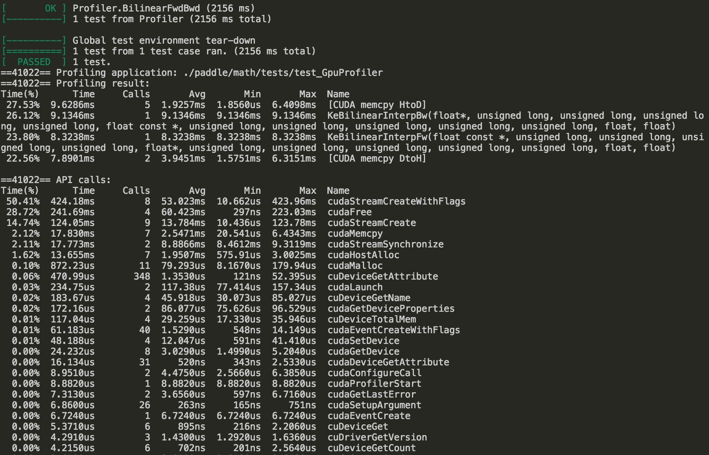

GPU Profiling
=============

This tutorial will guide you step-by-step through how to conduct profiling and performance tuning using :code:`nvprof` and :code:`nvvp`.

- What is profiling?
- Why we need profiling?
- How to do profiling?
- Profile tools
- Hands-on Tutorial

What's profiling?
=================
In software engineering, profiling is a form of dynamic program analysis that measures the space (memory) or time
complexity of a program, the usage of particular instructions, or the frequency and duration of function calls.
Most commonly, profiling information serves to aid program optimization.

Briefly, profiler is used to measure application performance. Program analysis tools are extremely important for
understanding program behavior. Simple profiling can tell you that how long does an operation take? For advanced
profiling, it can interpret why does an operation take a long time?

Why we need profiling?
======================
Since training deep neural network typically take a very long time to get over, performance is gradually becoming
the most important thing in deep learning field. The first step to improve performance is to understand what parts
are slow. No point in improving performance of a region which doesn’t take much time!

How to do profiling?
====================
To achieve maximum performance, there are five steps you can take to reach your goals.

- Profile the code
- Find the slow parts
- Work out why they’re slow
- Make them fast
- Profile the code again

Usually, processor has two key performance limits include float point throughput and
memory throughput. For GPU,  it also need more parallelism to fulfill its potential.
This is why they can be so fast.

Profiler Tools
==============
For general GPU profiling, a bunch of tools are provided from both NVIDIA and third party.

:code:`nvprof` is Nvidia profiler and :code:`nvvp` is (GUI based) Nvidia visual profiler.
In this tutorial, we will focus on nvprof and nvvp.

:code:`test_GpuProfiler` from :code:`paddle/math/tests` directory will be used to evaluate
above profilers. 

.. code-block:: c++

    TEST(Profiler, BilinearFwdBwd) {
        hl_profiler_start();
        auto numSamples = 10;
        auto channels = 16;
        auto imgSize = 64;
        testBilinearFwdBwd(numSamples, imgSize, imgSize, channels);
        hl_profiler_end();
    }

:code:`hl_profiler_start` and :code:`hl_profiler_end` can be used to profile only regions of interest
in PaddlePaddle. They are wrapper functions of :code:`cudaProfilerStart` and :code:`cudaProfilerStop`
respectively to avoid program crashes when CPU version of PaddlePaddle invokes them.

Hands-on Approach
=================

..  image:: nvvp1.png
    :align: center
    :scale: 30%