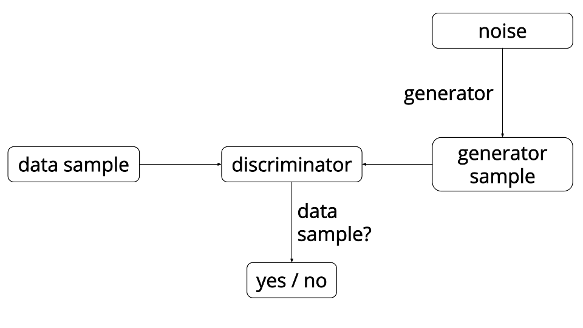

# Generative Adversarial Networks (GAN) 

This demo implements GAN training described in the original GAN paper (https://arxiv.org/abs/1406.2661) and DCGAN (https://arxiv.org/abs/1511.06434).

The high-level structure of GAN is shown in Figure. 1 below. It is composed of two major parts: a generator and a discriminator, both of which are based on neural networks. The generator takes in some kind of noise with a known distribution and transforms it into an image. The discriminator takes in an image and determines whether it is artifically generated by the generator or a real image. So the generator and the discriminator are in a competitive game in which generator is trying to generate image to look as real as possible to fool the discriminator, while the discriminator is trying to distinghuish between real and fake images. 

Figure 1. GAN-Model-Structure

If the GAN model is trained to converge to the equillibrium state, the generator will transform the given noise distribution to the distribution of real images, and the discriminator will not be able to distinguish between real and fake images at all. 

The general training procedures are implemented in gan_trainer.py. The neural network configurations are specified in gan_conf.py (for synthetic data) and gan_conf_image.py (for image data).

In order to run the model, first download the corresponding data by running the shell script in ./data.
Then you can run the command below. The flag -d specifies the training data (cifar, mnist or uniform) and flag --useGpu specifies whether to use gpu for training (0 is cpu, 1 is gpu).  

$python gan_trainer_image.py -d cifar --useGpu 1

The generated images will be stored in ./cifar_samples/
