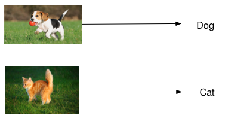
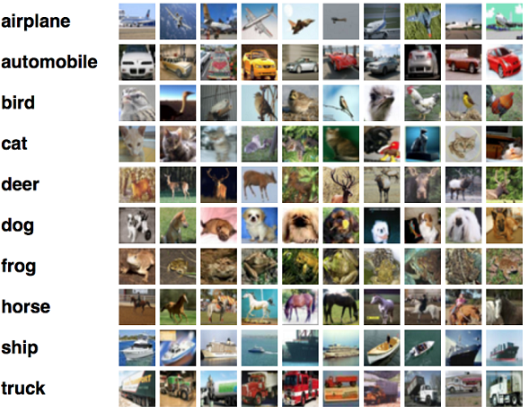
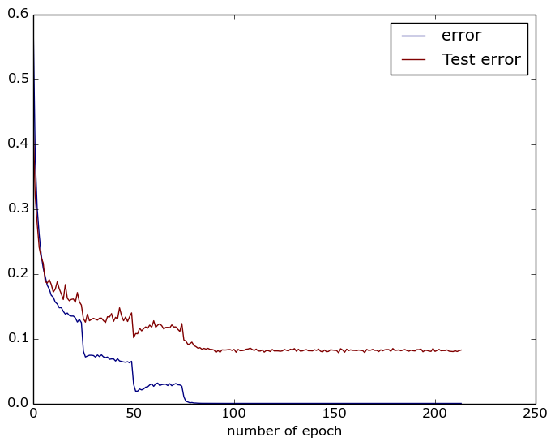

Image Classification Tutorial
==============================

This tutorial will guide you through training a convolutional neural network to classify objects using the CIFAR-10 image classification dataset.
As shown in the following figure, the convolutional neural network can recognize the main object in images, and output the classification result.

<center></center>

## Data Preparation
First, download CIFAR-10 dataset. CIFAR-10 dataset can be downloaded from its official website.

<https://www.cs.toronto.edu/~kriz/cifar.html>

We have prepared a script to download and process CIFAR-10 dataset. The script will download CIFAR-10 dataset from the official dataset.
It will convert it to jpeg images and organize them into a directory with the required structure for the tutorial. Make sure that you have installed pillow and its dependents.
Consider the following commands:

1. install pillow dependents

```bash
sudo apt-get install libjpeg-dev
pip install pillow
```

2. download data and preparation

```bash
cd demo/image_classification/data/
sh download_cifar.sh
```

The CIFAR-10 dataset consists of 60000 32x32 color images in 10 classes, with 6000 images per class. There are 50000 training images and 10000 test images.

Here are the classes in the dataset, as well as 10 random images from each:
<center></center>


After downloading and converting, we should find a directory (cifar-out) containing the dataset in the following format:

```
train
---airplane
---automobile
---bird
---cat
---deer
---dog
---frog
---horse
---ship
---truck
test
---airplane
---automobile
---bird
---cat
---deer
---dog
---frog
---horse
---ship
---truck
```

It has two directories:`train` and `test`. These two directories contain training data and testing data of CIFAR-10, respectively. Each of these two folders contains 10 sub-folders, ranging from `airplane` to `truck`. Each sub-folder contains images with the corresponding label. After the images are organized into this structure, we are ready to train an image classification model.

## Preprocess
After the data has been downloaded, it needs to be pre-processed into the Paddle format. We can run the following command for preprocessing.

```
cd demo/image_classification/
sh preprocess.sh
```

`preprocess.sh` calls `./demo/image_classification/preprocess.py` to preprocess image data.
```sh
export PYTHONPATH=$PYTHONPATH:../../
data_dir=./data/cifar-out
python preprocess.py -i $data_dir -s 32 -c 1
```

`./demo/image_classification/preprocess.py` has the following arguments

- `-i` or `--input` specifes  the input data directory.
- `-s` or `--size` specifies the processed size of images.
- `-c` or `--color` specifes whether images are color images or gray images.


## Model Training
We need to create a model config file before training the model. An example of the config file (vgg_16_cifar.py) is listed below. **Note**, it is slightly different from the `vgg_16_cifar.py` which also applies to the prediction.

```python
from paddle.trainer_config_helpers import *
data_dir='data/cifar-out/batches/'
meta_path=data_dir+'batches.meta'
args = {'meta':meta_path, 'mean_img_size': 32,
        'img_size': 32, 'num_classes': 10,
        'use_jpeg': 1, 'color': "color"}
define_py_data_sources2(train_list=data_dir+"train.list",
                        test_list=data_dir+'test.list',
                        module='image_provider',
                        obj='processData',
                        args=args)
settings(
    batch_size = 128,
    learning_rate = 0.1 / 128.0,
    learning_method = MomentumOptimizer(0.9),
    regularization = L2Regularization(0.0005 * 128))

img = data_layer(name='image', size=3*32*32)
lbl = data_layer(name="label", size=10)
# small_vgg is predined in trainer_config_helpers.network
predict = small_vgg(input_image=img, num_channels=3)
outputs(classification_cost(input=predict, label=lbl))
```

The first line imports python functions for defining networks.
```python
from paddle.trainer_config_helpers import *
```

Then define an `define_py_data_sources2` which use python data provider
interface. The arguments in `args` are used in `image_provider.py` which
yeilds image data and transform them to Paddle.
 - `meta`: the mean value of training set.
 - `mean_img_size`: the size of mean feature map.
 - `img_size`: the height and width of input image.
 - `num_classes`: the number of classes.
 - `use_jpeg`: the data storage type when preprocessing.
 - `color`: specify color image.

`settings` specifies the training algorithm. In the following example,
it specifies learning rate as 0.1, but divided by batch size, and the weight decay
is 0.0005 and multiplied by batch size.
```python
settings(
    batch_size = 128,
    learning_rate = 0.1 / 128.0,
    learning_method = MomentumOptimizer(0.9),
    regularization = L2Regularization(0.0005 * 128)
)
```

The `small_vgg` specifies the network. We use a small version of VGG convolutional network as our network
for classification. A description of VGG network can be found here [http://www.robots.ox.ac.uk/~vgg/research/very_deep/](http://www.robots.ox.ac.uk/~vgg/research/very_deep/).
```python
# small_vgg is predined in trainer_config_helpers.network
predict = small_vgg(input_image=img, num_channels=3)
```
After writing the config, we can train the model by running the script train.sh.

```bash
config=vgg_16_cifar.py
output=./cifar_vgg_model
log=train.log

paddle train \
--config=$config \
--dot_period=10 \
--log_period=100 \
--test_all_data_in_one_period=1 \
--use_gpu=1 \
--save_dir=$output \
2>&1 | tee $log

python -m paddle.utils.plotcurve -i $log > plot.png
```

- Here we use GPU mode to train. If you have no gpu environment, just set `use_gpu=0`.

- `./demo/image_classification/vgg_16_cifar.py` is the network and data configuration file. The meaning of the other flags can be found in the documentation of the command line flags.

- The script `plotcurve.py` requires the python module of `matplotlib`, so if it fails, maybe you need to install `matplotlib`.


After training finishes, the training and testing error curves will be saved to `plot.png` using `plotcurve.py` script. An example of the plot is shown below:

<center></center>


## Prediction
After we train the model, the model file as well as the model parameters are stored in path `./cifar_vgg_model/pass-%05d`. For example, the model of the 300-th pass is stored at `./cifar_vgg_model/pass-00299`.

To make a prediction for an image, one can run `predict.sh` as follows. The script will output the label of the classfiication.

```
sh predict.sh
```

predict.sh:
```
model=cifar_vgg_model/pass-00299/
image=data/cifar-out/test/airplane/seaplane_s_000978.png
use_gpu=1
python prediction.py $model $image $use_gpu
```

## Exercise
Train a image classification of birds using VGG model and CUB-200 dataset. The birds dataset can be downloaded here. It contains an image dataset with photos of 200 bird species (mostly North American).

<http://www.vision.caltech.edu/visipedia/CUB-200.html>


## Delve into Details
### Convolutional Neural Network
A Convolutional Neural Network is a feedforward neural network that uses convolution layers. It is very suitable for building neural networks that process and understand images. A standard convolutional neural network is shown below:


Convolutional Neural Network contains the following layers:

- Convolutional layer: It uses convolution operation to extract features from an image or a feature map.
- Pooling layer: It uses max-pooling to downsample feature maps.
- Fully Connected layer: It uses fully connected connections to transform features.

Convolutional Neural Network achieves amazing performance for image classification because it exploits two important characteristics of images: *local correlation* and *spatial invariance*. By iteratively applying convolution and max-pooing operations, convolutional neural network can well represent these two characteristics of images.


For more details of how to define layers and their connections, please refer to the documentation of layers.
