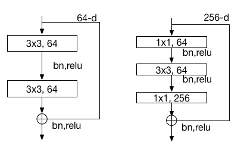

# Model Zoo - ImageNet #

[ImageNet](http://www.image-net.org/) is a popular dataset for generic object classification. This tutorial provides convolutional neural network(CNN) models for ImageNet.

## ResNet Introduction

ResNets from paper [Deep Residual Learning for Image Recognition](http://arxiv.org/abs/1512.03385) won the 1st place on the ILSVRC 2015 classification task. They present residual learning framework to ease the training of networks that are substantially deeper than those used previously. The residual connections are shown in following figure. The left building block is used in network of 34 layers and the right bottleneck building block is used in network of 50, 101, 152 layers .

<center></center>
<center>Figure 1. ResNet Block</center>

We present three ResNet models, which are converted from the models provided by the authors <https://github.com/KaimingHe/deep-residual-networks>.  The classfication errors tested in PaddlePaddle on 50,000 ILSVRC validation set with input images channel order of **BGR** by single scale with the shorter side of 256 and single crop as following table.
<center>
<table border="2" cellspacing="0" cellpadding="6" rules="all" frame="border">
<colgroup>
<col  class="left" />
<col  class="left" />
<col  class="left" />
</colgroup>
<thead>
<tr>
<th scope="col" class="left">ResNet</th>
<th scope="col" class="left">Top-1</th>
<th scope="col" class="left">Model Size</th>
</tr>
</thead>

<tbody>
<tr>
<td class="left">ResNet-50</td>
<td class="left">24.9%</td>
<td class="left">99M</td>
</tr>
<tr>
<td class="left">ResNet-101</td>
<td class="left">23.7%</td>
<td class="left">173M</td>
</tr>
<tr>
<td class="left">ResNet-152</td>
<td class="left">23.2%</td>
<td class="left">234M</td>
</tr>
</tbody>

</table></center>
<br>

## ResNet Model

See ```demo/model_zoo/resnet/resnet.py```. This config contains network of 50, 101 and 152 layers. You can specify layer number by adding argument like ```--config_args=layer_num=50``` in command line arguments.

### Network Visualization

You can get a diagram of ResNet network by running the following commands. The script generates dot file and then converts dot file to PNG file, which needs to install graphviz to convert.

```
cd demo/model_zoo/resnet
./net_diagram.sh
```

### Model Download

```
cd demo/model_zoo/resnet
./get_model.sh
```
You can run above command to download all models and mean file and save them in ```demo/model_zoo/resnet/model``` if downloading successfully.

```
mean_meta_224  resnet_101  resnet_152  resnet_50
```
   * resnet_50: model of 50 layers.
   * resnet_101: model of 101 layers.
   * resnet_152: model of 152 layers.
   * mean\_meta\_224: mean file with 3 x 224 x 224 size in **BGR** order. You also can use three mean values: 103.939, 116.779, 123.68.

### Parameter Info

* **Convolution Layer Weight**

  As batch normalization layer is connected after each convolution layer, there is no parameter of bias and only one weight in this layer.
  shape: `(Co, ky, kx, Ci)`
   * Co: channle number of output feature map.
   * ky: filter size in vertical direction.
   * kx: filter size in horizontal direction.
   * Ci: channle number of input feature map.

  2-Dim matrix: (Co * ky * kx, Ci), saved in row-major order.

* **Fully connected Layer Weight**

  2-Dim matrix: (input layer size, this layer size), saved in row-major order.

* **[Batch Normalization](<http://arxiv.org/abs/1502.03167>) Layer Weight**

There are four parameters in this layer. In fact, only .w0 and .wbias are the learned parameters. The other two are therunning mean and variance respectively. They will be loaded in testing. Following table shows parameters of a batch normzalization layer.
<center>
<table border="2" cellspacing="0" cellpadding="6" rules="all" frame="border">
<colgroup>
<col  class="left" />
<col  class="left" />
<col  class="left" />
</colgroup>
<thead>
<tr>
<th scope="col" class="left">Parameter Name</th>
<th scope="col" class="left">Number</th>
<th scope="col" class="left">Meaning</th>
</tr>
</thead>

<tbody>
<tr>
<td class="left">_res2_1_branch1_bn.w0</td>
<td class="left">256</td>
<td class="left">gamma, scale parameter</td>
</tr>
<tr>
<td class="left">_res2_1_branch1_bn.w1</td>
<td class="left">256</td>
<td class="left">mean value of feature map</td>
</tr>
<tr>
<td class="left">_res2_1_branch1_bn.w2</td>
<td class="left">256</td>
<td class="left">variance of feature map</td>
</tr>
<tr>
<td class="left">_res2_1_branch1_bn.wbias</td>
<td class="left">256</td>
<td class="left">beta, shift parameter</td>
</tr>
</tbody>

</table></center>
<br>

### Parameter Observation

Users who want to observe the parameters can use Python to read:

```
import sys
import numpy as np

def load(file_name):
    with open(file_name, 'rb') as f:
        f.read(16) # skip header for float type.
        return np.fromfile(f, dtype=np.float32)

if __name__=='__main__':
    weight = load(sys.argv[1])
```

or simply use following shell command:

```
od -j 16 -f _res2_1_branch1_bn.w0
```

## Feature Extraction

We provide both C++ and Python interfaces to extract features. The following examples use data in `demo/model_zoo/resnet/example` to show the extracting process in detail.

### C++ Interface

First, specify image data list in `define_py_data_sources2` in the config, see example `demo/model_zoo/resnet/resnet.py`.

```
    train_list = 'train.list' if not is_test else None
    # mean.meta is mean file of ImageNet dataset.
    # mean.meta size : 3 x 224 x 224.
    # If you use three mean value, set like:
    # "mean_value:103.939,116.779,123.68;"
    args={
        'mean_meta': "model/mean_meta_224/mean.meta",
        'image_size': 224, 'crop_size': 224,
        'color': True,'swap_channel:': [2, 1, 0]}
    define_py_data_sources2(train_list,
                           'example/test.list',
                           module="example.image_list_provider",
                           obj="processData",
                           args=args)
```

Second, specify layers to extract features in `Outputs()` of `resnet.py`. For example,

```
Outputs("res5_3_branch2c_conv", "res5_3_branch2c_bn")
```

Third, specify model path and output directory in `extract_fea_c++.sh`, and then run the following commands.

```
cd demo/model_zoo/resnet
./extract_fea_c++.sh
```

If successful, features are saved in `fea_output/rank-00000` as follows. And you can use `load_feature_c` interface in `load_feature.py ` to load such a file.

```
-0.115318 -0.108358 ... -0.087884;-1.27664 ... -1.11516 -2.59123;
-0.126383 -0.116248 ... -0.00534909;-1.42593 ... -1.04501 -1.40769;
```

* Each line stores features of a sample. Here, the first line stores features of `example/dog.jpg` and second line stores features of `example/cat.jpg`.
* Features of different layers are splitted by `;`, and their order is consistent with the layer order in `Outputs()`. Here, the left features are `res5_3_branch2c_conv` layer and right features are `res5_3_branch2c_bn` layer.

### Python Interface

`demo/model_zoo/resnet/classify.py` is an example to show how to use Python to extract features. Following example still uses data of `./example/test.list`. Command is as follows:

```
cd demo/model_zoo/resnet
./extract_fea_py.sh
```

extract_fea_py.sh:

```
python classify.py \
     --job=extract \
     --conf=resnet.py\
     --use_gpu=1 \
     --mean=model/mean_meta_224/mean.meta \
     --model=model/resnet_50 \
     --data=./example/test.list \
     --output_layer="res5_3_branch2c_conv,res5_3_branch2c_bn" \
     --output_dir=features

```
* \--job=extract:              specify job mode to extract feature.
* \--conf=resnet.py:           network configure.
* \--use_gpu=1:             speficy GPU mode.
* \--model=model/resnet_5:     model path.
* \--data=./example/test.list: data list.
* \--output_layer="xxx,xxx":   specify layers to extract features.
* \--output_dir=features:      output diretcoty.

If run successfully, you will see features saved in `features/batch_0`, this file is produced with cPickle. You can use `load_feature_py` interface in `load_feature.py` to open the file, and it returns a dictionary as follows:

```
{
'cat.jpg': {'res5_3_branch2c_conv': array([[-0.12638293, -0.116248  , -0.11883899, ..., -0.00895038, 0.01994277, -0.00534909]], dtype=float32), 'res5_3_branch2c_bn': array([[-1.42593431, -1.28918779, -1.32414699, ..., -1.45933616, -1.04501402, -1.40769434]], dtype=float32)},
'dog.jpg': {'res5_3_branch2c_conv': array([[-0.11531784, -0.10835785, -0.08809858, ...,0.0055237, 0.01505112, -0.08788397]], dtype=float32), 'res5_3_branch2c_bn': array([[-1.27663755, -1.18272924, -0.90937918, ..., -1.25178063, -1.11515927, -2.59122872]], dtype=float32)}
}
```

Observed carefully, these feature values are consistent with the above results extracted by C++ interface.

## Prediction

`classify.py` also can be used to predict. We provide an example script `predict.sh` to predict data in `example/test.list` using a ResNet model with 50 layers.

```
cd demo/model_zoo/resnet
./predict.sh
```

predict.sh calls the `classify.py`:

```
python classify.py \
     --job=predict \
     --conf=resnet.py\
     --multi_crop \
     --model=model/resnet_50 \
     --use_gpu=1 \
     --data=./example/test.list
```
* \--job=extract:              speficy job mode to predict.
* \--conf=resnet.py:           network configure.
* \--multi_crop:               use 10 crops and average predicting probability.
* \--use_gpu=1:             speficy GPU mode.
* \--model=model/resnet_50:    model path.
* \--data=./example/test.list: data list.

If run successfully, you will see following results, where 156 and 285 are labels of the images.

```
Label of example/dog.jpg is: 156
Label of example/cat.jpg is: 282
```
