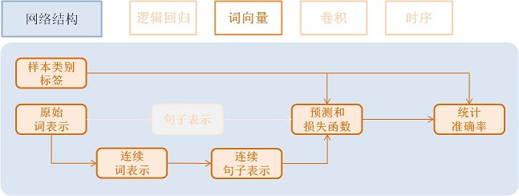
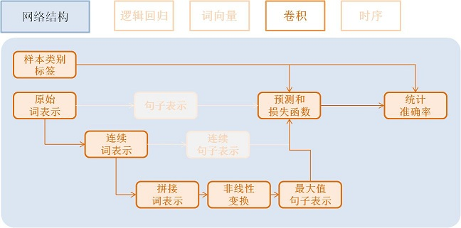
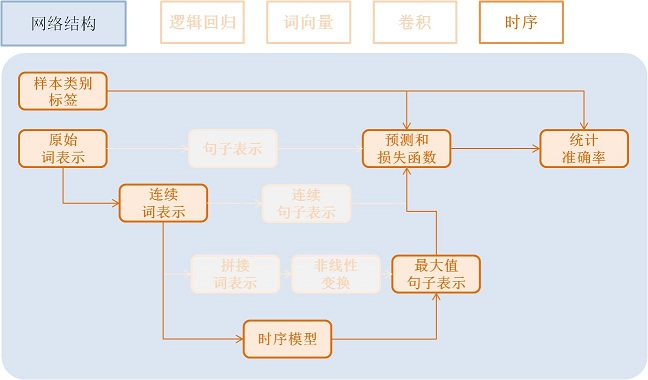

=============
快速入门教程
=============

我们将以 `文本分类问题 <https://en.wikipedia.org/wiki/Document_classification>`_ 为例,
介绍PaddlePaddle的基本使用方法。

安装
====

请参考 :ref:`install_steps` 安装PaddlePaddle。

使用概述
========

**文本分类问题**：对于给定的一条文本，我们从提前给定的类别集合中选择其所属类别。

比如, 在购物网站上，通过查看买家对某个产品的评价反馈, 评估该产品的质量。

- 这个显示器很棒！ （好评）
- 用了两个月之后这个显示器屏幕碎了。（差评）

使用PaddlePaddle, 每一个任务流程都可以被划分为如下五个步骤。

    ..  image:: src/Pipeline_cn.jpg
        :align: center
        :scale: 80%

1. 数据格式准备
    - 本例每行保存一条样本，类别Id和文本信息用 ``Tab`` 间隔，文本中的单词用空格分隔（如果不切词，则字与字之间用空格分隔），例如：``类别Id '\t' 这 个 显 示 器 很 棒 ！``
2. 向系统传送数据
    - PaddlePaddle可以执行用户的python脚本程序来读取各种格式的数据文件。
    - 本例的所有字符都将转换为连续整数表示的Id传给模型。
3. 描述网络结构和优化算法
    - 本例由易到难展示4种不同的文本分类网络配置：逻辑回归模型，词向量模型，卷积模型，时序模型。
    - 常用优化算法包括Momentum, RMSProp，AdaDelta，AdaGrad，Adam，Adamax等，本例采用Adam优化方法，加了L2正则和梯度截断。
4. 训练模型
5. 应用模型

数据格式准备
------------

接下来我们将展示如何用PaddlePaddle训练一个文本分类模型，将 `Amazon电子产品评论数据 <http://jmcauley.ucsd.edu/data/amazon/>`_ 分为好评(正样本)和差评(负样本)两种类别。
`源代码 <https://github.com/PaddlePaddle/Paddle>`_ 的 ``demo/quick_start`` 目录里提供了该数据的下载脚本和预处理脚本，你只需要在命令行输入以下命令，就能够很方便的完成数据下载和相应的预处理工作。

.. code-block:: bash

    cd demo/quick_start
    ./data/get_data.sh
    ./preprocess.sh

数据预处理完成之后，通过配置类似于 ``dataprovider_*.py`` 的数据读取脚本和类似于 ``trainer_config.*.py`` 的训练模型脚本，PaddlePaddle将以设置参数的方式来设置
相应的数据读取脚本和训练模型脚本。接下来，我们将对这两个步骤给出了详细的解释，你也可以先跳过本文的解释环节，直接进入训练模型章节, 使用 ``sh train.sh`` 开始训练模型，
查看`train.sh`内容，通过 **自底向上法** (bottom-up approach)来帮助你理解PaddlePaddle的内部运行机制。

向系统传送数据
==============

Python脚本读取数据
------------------

`DataProvider` 是PaddlePaddle负责提供数据的模块，主要职责在于将训练数据传入内存或者显存，让模型能够得到训练更新，其包括两个函数：

* initializer：PaddlePaddle会在调用读取数据的Python脚本之前，先调用initializer函数。在下面例子里，我们在initialzier函数里初始化词表，并且在随后的读取数据过程中填充词表。
* process：PaddlePaddle调用process函数来读取数据。每次读取一条数据后，process函数会用yield语句输出这条数据，从而能够被PaddlePaddle 捕获 (harvest)。

``dataprovider_bow.py`` 文件给出了完整例子：

..  literalinclude:: ../../../demo/quick_start/dataprovider_bow.py
     :language: python
     :lines: 21-70
     :linenos:
     :emphasize-lines: 8,33

详细内容请参见 :ref:`api_dataprovider` 。

配置中的数据加载定义
--------------------

在模型配置中通过 ``define_py_data_sources2`` 接口来加载数据：

..  literalinclude:: ../../../demo/quick_start/trainer_config.emb.py
     :language: python
     :lines: 19-35
     :linenos:
     :emphasize-lines: 12

以下是对上述数据加载的解释：

- data/train.list,data/test.list: 指定训练数据和测试数据
- module="dataprovider_bow": 处理数据的Python脚本文件
- obj="process": 指定生成数据的函数
- args={"dictionary": word_dict}: 额外的参数，这里指定词典

更详细数据格式和用例请参考 :ref:`api_pydataprovider2` 。

模型网络结构
============

本小节我们将介绍模型网络结构。

    ..  image:: src/PipelineNetwork_cn.jpg
        :align: center
        :scale: 80%

我们将以最基本的逻辑回归网络作为起点，并逐渐展示更加深入的功能。更详细的网络配置连接请参考 :ref:`api_trainer_config_helpers_layers` 。
所有配置都能在 `源代码 <https://github.com/PaddlePaddle/Paddle>`_ 的 ``demo/quick_start`` 目录下找到。

逻辑回归模型
------------

具体流程如下:

    ..  image:: src/NetLR_cn.jpg
        :align: center
        :scale: 80%

- 获取利用 `one-hot vector <https://en.wikipedia.org/wiki/One-hot>`_ 表示的每个单词，维度是词典大小

    .. code-block:: python

        word = data_layer(name="word",  size=word_dim)

- 获取该条样本类别Id，维度是类别个数。

    .. code-block:: python

        label = data_layer(name="label", size=label_dim)

- 利用逻辑回归模型对该向量进行分类，同时会计算分类准确率

    .. code-block:: python

        # Define a fully connected layer with logistic activation (also called softmax activation).
        output = fc_layer(input=word,
                        size=label_dim,
                        act_type=SoftmaxActivation())
        # Define cross-entropy classification loss and error.
        classification_cost(input=output, label=label)

 - input: 除去data层，每个层都有一个或多个input,多个input以list方式输入
 - size: 该层神经元个数
 - act_type: 激活函数类型

**效果总结**：我们将在后面介绍训练和预测流程的脚本。在此为方便对比不同网络结构，我们总结了各个网络的复杂度和效果。

    =====================  ===============================  =================
    网络名称                        参数数量                    错误率
    =====================  ===============================  =================
    逻辑回归                      252 KB                       8.652 %
    =====================  ===============================  =================

词向量模型
----------

embedding模型需要稍微改变提供数据的Python脚本，即 ``dataprovider_emb.py``，词向量模型、
卷积模型、时序模型均使用该脚本。其中文本输入类型定义为整数时序类型integer_value_sequence。

.. code-block:: python

    def initializer(settings, dictionary, **kwargs):
        settings.word_dict = dictionary
        settings.input_types = [
            # Define the type of the first input as sequence of integer.
            # The value of the integers range from 0 to len(dictrionary)-1
            integer_value_sequence(len(dictionary)),
            # Define the second input for label id
            integer_value(2)]

    @provider(init_hook=initializer)
    def process(settings, file_name):
        ...
        # omitted, it is same as the data provider for LR model

该模型依然使用逻辑回归分类网络的框架， 只是将句子用连续向量表示替换为用稀疏向量表示， 即对第三步进行替换。句子表示的计算更新为两步：

- 利用单词Id查找该单词对应的连续向量(维度为word_dim)， 输入N个单词，输出为N个word_dim维度向量

    .. code-block:: python

        emb = embedding_layer(input=word, size=word_dim)

- 将该句话包含的所有单词向量求平均, 得到句子的表示

    .. code-block:: python

        avg = pooling_layer(input=emb, pooling_type=AvgPooling())

其它部分和逻辑回归网络结构一致。

**效果总结：**

    =====================  ===============================  ==================
    网络名称                        参数数量                    错误率
    =====================  ===============================  ==================
    词向量模型                      15 MB                       8.484 %
    =====================  ===============================  ==================

卷积模型
-----------

卷积网络是一种特殊的从词向量表示到句子表示的方法， 也就是将词向量模型进一步演化为三个新步骤。

文本卷积分可为三个步骤:

1. 首先，从每个单词左右两端分别获取k个相邻的单词, 拼接成一个新的向量；

2. 其次，对该向量进行非线性变换(例如Sigmoid变换), 使其转变为维度为hidden_dim的新向量；

3. 最后，对整个新向量集合的每一个维度取最大值来表示最后的句子。

这三个步骤可配置为:

.. code-block:: python

    text_conv = sequence_conv_pool(input=emb,
                                context_start=k,
                                context_len=2 * k + 1)

**效果总结：**

    =====================  ===============================  ========================
    网络名称                        参数数量                    错误率
    =====================  ===============================  ========================
    卷积模型                      16 MB                       5.628 %
    =====================  ===============================  ========================

时序模型
----------

时序模型，也称为RNN模型, 包括简单的 `RNN模型 <https://en.wikipedia.org/wiki/Recurrent_neural_network>`_, `GRU模型 <https://en.wikipedia.org/wiki/Gated_recurrent_unit>`_ 和 `LSTM模型 <https://en.wikipedia.org/wiki/Long_short-term_memory>`_ 等等。

- GRU模型配置：

    .. code-block:: python

        gru = simple_gru(input=emb, size=gru_size)

- LSTM模型配置：

    .. code-block:: python

        lstm = simple_lstm(input=emb, size=lstm_size)

本次试验，我们采用单层LSTM模型，并使用了Dropout，**效果总结：**

    =====================  ===============================  =========================
    网络名称                        参数数量                    错误率
    =====================  ===============================  =========================
    时序模型                      16 MB                       4.812 %
    =====================  ===============================  =========================

优化算法
=========

`优化算法 <http://www.paddlepaddle.org/doc/ui/api/trainer_config_helpers/optimizers_index.html>`_ 包括
Momentum, RMSProp，AdaDelta，AdaGrad，ADAM，Adamax等，这里采用Adam优化方法，同时使用了L2正则(L2 Regularization)和梯度截断(Gradient Clipping)。

.. code-block:: python

    settings(batch_size=128,
            learning_rate=2e-3,
            learning_method=AdamOptimizer(),
            regularization=L2Regularization(8e-4),
            gradient_clipping_threshold=25)

训练模型
=========

在数据加载和网络配置完成之后， 我们就可以训练模型了。

..  image:: src/PipelineTrain_cn.jpg
    :align: center
    :scale: 80%

训练模型，我们只需要运行 ``train.sh`` 训练脚本：

    .. code-block:: bash

        ./train.sh

``train.sh`` 中包含了训练模型的基本命令。训练时所需设置的主要参数如下：

    .. code-block:: bash

        paddle train \
        --config=trainer_config.py \
        --log_period=20 \
        --save_dir=./output \
        --num_passes=15 \
        --use_gpu=false

这里只简单介绍了单机训练，如何进行分布式训练，请参考 :ref:`cluster_train` 。

预测
=====

当模型训练好了之后，我们就可以进行预测了。

之前配置文件中 ``test.list`` 指定的数据将会被测试，这里直接通过预测脚本 ``predict.sh`` 进行预测,
更详细的说明，请参考 :ref:`api_swig_py_paddle` 。

    .. code-block:: bash

        model="output/pass-00003"
        paddle train \
            --config=trainer_config.lstm.py \
            --use_gpu=false \
            --job=test \
            --init_model_path=$model \
            --config_args=is_predict=1 \
            --predict_output_dir=. \

        mv rank-00000 result.txt

这里以 ``output/pass-00003`` 为例进行预测，用户可以根据训练日志，选择测试结果最好的模型来预测。

预测结果以文本的形式保存在 ``result.txt`` 中，一行为一个样本，格式如下：

    .. code-block:: bash

        预测ID;ID为0的概率 ID为1的概率
        预测ID;ID为0的概率 ID为1的概率

总体效果总结
==============

在 ``/demo/quick_start`` 目录下，能够找到这里使用的所有数据, 网络配置, 训练脚本等等。
对于Amazon-Elec测试集(25k), 如下表格，展示了上述网络模型的训练效果:

    =====================  ===============================  =============  ==================================
    网络名称                       参数数量                    错误率          配置文件
    =====================  ===============================  =============  ==================================
    逻辑回归模型                      252 KB                     8.652%          trainer_config.lr.py
    词向量模型                         15 MB                      8.484%         trainer_config.emb.py
    卷积模型                        16 MB                     5.628%          trainer_config.cnn.py
    时序模型                         16 MB                     4.812%          trainer_config.lstm.py
    =====================  ===============================  =============  ==================================

附录
=====

命令行参数
----------

* \--config：网络配置
* \--save_dir：模型存储路径
* \--log_period：每隔多少batch打印一次日志
* \--num_passes：训练轮次，一个pass表示过一遍所有训练样本
* \--config_args：命令指定的参数会传入网络配置中。
* \--init_model_path：指定初始化模型路径，可用在测试或训练时指定初始化模型。

默认一个pass保存一次模型，也可以通过saving_period_by_batches设置每隔多少batch保存一次模型。
可以通过show_parameter_stats_period设置打印参数信息等。
其他参数请参考 命令行参数文档（链接待补充）。

输出日志
---------

.. code-block:: bash

    TrainerInternal.cpp:160]  Batch=20 samples=2560 AvgCost=0.628761 CurrentCost=0.628761 Eval: classification_error_evaluator=0.304297  CurrentEval: classification_error_evaluator=0.304297

模型训练会看到类似上面这样的日志信息，详细的参数解释，请参考如下表格：

    ===========================================  ==============================================================
    名称                                             解释
    ===========================================  ==============================================================
    Batch=20                                      表示过了20个batch
    samples=2560                                  表示过了2560个样本
    AvgCost                                          每个pass的第0个batch到当前batch所有样本的平均cost
    CurrentCost                                      当前log_period个batch所有样本的平均cost
    Eval: classification_error_evaluator          每个pass的第0个batch到当前batch所有样本的平均分类错误率
    CurrentEval: classification_error_evaluator      当前log_period个batch所有样本的平均分类错误率
    ===========================================  ==============================================================
