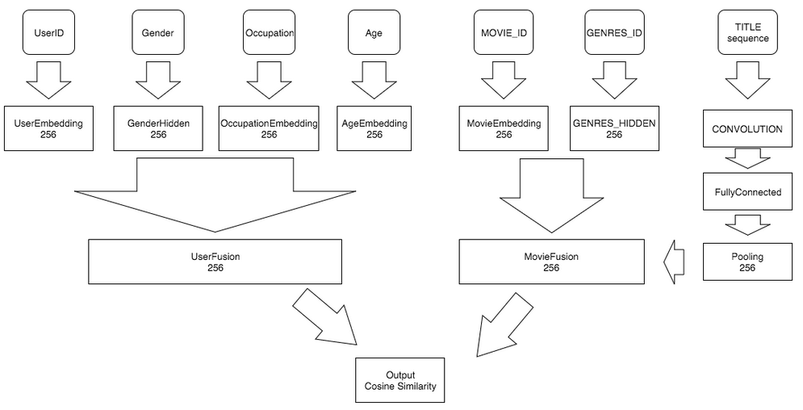

Regression MovieLens Ratting
============================

Here we demonstrate a **Cosine Similarity Regression** job in movie lens dataset.
This demo will show how paddle does (word) embedding job,
handles the similarity regression,
the character-level convolutional networks for text, and how does paddle handle
multiple types of inputs.
Note that the model structure is not fine-tuned and just a demo to show how paddle works.


YOU ARE WELCOME TO BUILD A BETTER DEMO
BY USING PADDLEPADDLE, AND LET US KNOW TO MAKE THIS DEMO BETTER.

Data Preparation
````````````````
Download and extract dataset
''''''''''''''''''''''''''''
We use :ref:`demo_ml_dataset` here. 
To download and unzip the dataset, simply run the following commands.

..  code-block:: bash

    cd demo/recommendation/data 
    ./ml_data.sh

And the directory structure of :code:`demo/recommendation/data/ml-1m` is:

..  code-block:: text

    +--ml-1m
         +--- movies.dat    # movie features
         +--- ratings.dat   # ratings
         +--- users.dat     # user features
         +--- README        # dataset description

Field config file
'''''''''''''''''
**Field config file** is used to specify the fields of the dataset and the file format,
i.e, specific **WHAT** type it is in each feature file.

The field config file of ml-1m shows in :code:`demo/recommendation/data/config.json`.
It specifics the field types and file names: 1) there are four types of field for user file\: id, gender, age and occupation;
2) the filename is "users.dat", and the delimiter of file is "::".

..  include:: ../../../demo/recommendation/data/config.json
    :code: json
    :literal:

Preprocess Data
```````````````
You need to install python 3rd party libraries.
IT IS HIGHLY RECOMMEND TO USE VIRTUALENV MAKE A CLEAN PYTHON ENVIRONMENT.

..  code-block:: bash

    pip install -r requirements.txt

The general command for preprocessing the dataset is:

..  code-block:: bash

    cd demo/recommendation
    ./preprocess.sh
    
And the detail steps are introduced as follows.

Extract Movie/User features to python object
'''''''''''''''''''''''''''''''''''''''''''''

There are many features in movie or user in movielens 1m dataset.
Each line of rating file just provides a Movie/User id to refer each movie or user.
We process the movie/user feature file first, and pickle the feature (**Meta**) object as a file.

Meta config file
................

**Meta config file** is used to specific **HOW** to parse each field in dataset.
It could be translated from field config file, or written by hand.
Its file format could be either json or yaml syntax file. Parser will automatically choose the file format by extension name.

To convert Field config file to meta config file, just run:

..  code-block:: bash

    cd demo/recommendation/data
    python config_generator.py config.json > meta_config.json

The meta config file shows below:

..  include:: ../../../demo/recommendation/data/meta_config.json
    :code: json
    :literal:

There are two kinds of features in meta\: movie and user.

* in movie file, whose name is movies.dat
   * we just split each line by "::"
   * pos 0 is id.
   * pos 1 feature:
      * name is title.
      * it uses regex to parse this feature.
      * it is a char based word embedding feature.
      * it is a sequence.
   * pos 2 feature:
      * name is genres.
      * type is one hot dense vector.
      * dictionary is auto generated by parsing, each key is split by '|'
* in user file, whose name is users.dat
   * we just split each line by "::"
   * pos 0 is id.
   * pos 1 feature:
       * name is gender
       * just simple char based embedding.
   * pos 2 feature:
       * name is age
       * just whole word embedding.
       * embedding id will be sort by word.
   * pos 3 feature:
       * name is occupation.
       * just simple whole word embedding.


Meta file
'''''''''

After having meta config file, we can generate **Meta file**, a python pickle object which stores movie/user information.
The following commands could be run to generate it.

..  code-block:: bash

    python meta_generator.py ml-1m meta.bin --config=meta_config.json

And the structure of the meta file :code:`meta.bin` is:

..  code-block:: text

    +--+ movie
    |      +--+ __meta__
    |      |       +--+ raw_meta  # each feature meta config. list
    |      |       |       +
    |      |       |       |     # ID Field, we use id as key
    |      |       |       +--+ {'count': 3883, 'max': 3952, 'is_key': True, 'type': 'id', 'min': 1}
    |      |       |       |
    |      |       |       |     # Titile field, the dictionary list of embedding.
    |      |       |       +--+ {'dict': [ ... ], 'type': 'embedding', 'name': 'title', 'seq': 'sequence'}
    |      |       |       |
    |      |       |       |     # Genres field, the genres dictionary
    |      |       |       +--+ {'dict': [ ... ], 'type': 'one_hot_dense', 'name': 'genres'}
    |      |       |
    |      |       +--+ feature_map [1, 2] # a list for raw_meta index for feature field.
    |      |                               # it means there are 2 features for each key.
    |      |                               #    * 0 offset of feature is raw_meta[1], Title.
    |      |                               #    * 1 offset of feature is raw_meta[2], Genres.
    |      |
    |      +--+ 1 # movie 1 features
    |      |    +
    |      |    +---+ [[...], [...]] # title ids, genres dense vector
    |      |
    |      +--+ 2
    |      |
    |      +--+ ...
    |
    +--- user
           +--+ __meta__
           |       +
           |       +--+ raw_meta
           |       |       +
           |       |       +--+ id field as user
           |       |       |
           |       |       +--+ {'dict': ['F', 'M'], 'type': 'embedding', 'name': 'gender', 'seq': 'no_sequence'}
           |       |       |
           |       |       +--+ {'dict': ['1', '18', '25', '35', '45', '50', '56'], 'type': 'embedding', 'name': 'age', 'seq': 'no_sequence'}
           |       |       |
           |       |       +--+ {'dict': [...], 'type': 'embedding', 'name': 'occupation', 'seq': 'no_sequence'}
           |       |
           |       +--+ feature_map [1, 2, 3]
           |
           +--+ 1 # user 1 features
           |
           +--+ 2
           +--+ ...


Split Training/Testing files
''''''''''''''''''''''''''''

We split :code:`ml-1m/ratings.dat` into a training and testing file. The way to split file is for each user, we split the
rating by two parts. So each user in testing file will have some rating information in training file.

Use :code:`separate.py` to separate the training and testing file.

..  code-block:: bash

    python split.py ml-1m/ratings.dat --delimiter="::" --test_ratio=0.1

Then two files will be generated\: :code:`ml-1m/ratings.dat.train` and :code:`ml-1m/rating.data.test`.
Move them to workspace :code:`data`, shuffle the train file, and prepare the file list for paddle train.

..  code-block:: bash

    shuf ml-1m/ratings.dat.train > ratings.dat.train
    cp ml-1m/ratings.dat.test .
    echo "./data/ratings.dat.train" > train.list
    echo "./data/ratings.dat.test" > test.list


Neural Network Configuration
````````````````````````````

Trainer Config File
'''''''''''''''''''

The network structure shows below.



The demo's neural network config file :code:`trainer_config.py` show as below.

..  literalinclude:: ../../../demo/recommendation/trainer_config.py
    :language: python
    :lines: 15-

In this :code:`trainer_config.py`, we just map each feature type to
a feature vector, following shows how to map each feature to a vector shows below.

* :code:`id`\: Just simple embedding, and then add to fully connected layer.
* :code:`embedding`\:
    - if is_sequence, get the embedding and do a text convolutional operation,
      get the average pooling result.
    - if not sequence, get the embedding and add to fully connected layer.
* :code:`one_host_dense`\:
    - just two fully connected layer.

Then we combine each features of movie into one movie feature by a
:code:`fc_layer` with multiple inputs, and do the same thing to user features,
get one user feature. Then we calculate the cosine similarity of these two
features.

In these networks, we use several APIs in :ref:`api_trainer_config` . There are

*  Data Layer, :ref:`api_trainer_config_helpers_layers_data_layer`
*  Fully Connected Layer, :ref:`api_trainer_config_helpers_layers_fc_layer`
*  Embedding Layer, :ref:`api_trainer_config_helpers_layers_embedding_layer`
*  Context Projection Layer, :ref:`api_trainer_config_helpers_layers_context_projection`
*  Pooling Layer, :ref:`api_trainer_config_helpers_layers_pooling_layer`
*  Cosine Similarity Layer, :ref:`api_trainer_config_helpers_layers_cos_sim`
*  Text Convolution Pooling Layer, :ref:`api_trainer_config_helpers_network_text_conv_pool`
*  Declare Python Data Sources :ref:`api_trainer_config_helpers_data_sources`.

Data Provider
'''''''''''''

..  literalinclude:: ../../../demo/recommendation/dataprovider.py
    :language: python
    :lines: 15-

The data provider just read the meta.bin and rating file, yield each sample for training.
In this :code:`dataprovider.py`, we should set\:

* obj.slots\: The feature types and dimension.
* use_seq\: Whether this :code:`dataprovider.py` in sequence mode or not.
* process\: Return each sample of data to :code:`paddle`.

The data provider details document see :ref:`api_pydataprovider2`.

Train
`````

After prepare data, config network, writting data provider, now we can run paddle training.

The :code:`run.sh` is shown as follow:

..  literalinclude:: ../../../demo/recommendation/run.sh
    :language: bash
    :lines: 16-

It just start a paddle training process, write the log to :code:`log.txt`,
then print it on screen.

Each command line argument in :code:`run.sh`, please refer to the :ref:`cmd_line_index` page. The short description of these arguments is shown as follow.

*  config\: Tell paddle which file is neural network configuration.
*  save_dir\: Tell paddle save model into :code:`./output`.
*  use_gpu\: Use gpu or not. Default is false.
*  trainer_count\: The compute thread in one machine.
*  test_all_data_in_one_period\: Test All Data during one test period. Otherwise,
   will test a :code:`batch_size` data in one test period.
*  log_period\: Print log after train :code:`log_period` batches.
*  dot_period\: Print a :code:`.` after train :code:`dot_period` batches.
*  num_passes\: Train at most :code:`num_passes`.

If training process starts successfully, the output likes follow:

..  code-block:: text

    I0601 08:07:22.832059 10549 TrainerInternal.cpp:157]  Batch=100 samples=160000 AvgCost=4.13494 CurrentCost=4.13494 Eval:  CurrentEval:

    I0601 08:07:50.672627 10549 TrainerInternal.cpp:157]  Batch=200 samples=320000 AvgCost=3.80957 CurrentCost=3.48421 Eval:  CurrentEval:

    I0601 08:08:18.877369 10549 TrainerInternal.cpp:157]  Batch=300 samples=480000 AvgCost=3.68145 CurrentCost=3.42519 Eval:  CurrentEval:

    I0601 08:08:46.863963 10549 TrainerInternal.cpp:157]  Batch=400 samples=640000 AvgCost=3.6007 CurrentCost=3.35847 Eval:  CurrentEval:

    I0601 08:09:15.413025 10549 TrainerInternal.cpp:157]  Batch=500 samples=800000 AvgCost=3.54811 CurrentCost=3.33773 Eval:  CurrentEval:
    I0601 08:09:36.058670 10549 TrainerInternal.cpp:181]  Pass=0 Batch=565 samples=902826 AvgCost=3.52368 Eval:
    I0601 08:09:46.215489 10549 Tester.cpp:101]  Test samples=97383 cost=3.32155 Eval:
    I0601 08:09:46.215966 10549 GradientMachine.cpp:132] Saving parameters to ./output/model/pass-00000
    I0601 08:09:46.233397 10549 ParamUtil.cpp:99] save dir ./output/model/pass-00000
    I0601 08:09:46.233438 10549 Util.cpp:209] copy trainer_config.py to ./output/model/pass-00000
    I0601 08:09:46.233541 10549 ParamUtil.cpp:147] fileName trainer_config.py

The model is saved in :code:`output/` directory. You can use :code:`Ctrl-C` to stop training whenever you want.

Evaluate and Predict
````````````````````

After training several passes, you can evaluate them and get the best pass. Just run

.. code-block:: bash

    ./evaluate.sh 

You will see messages like this:

.. code-block:: text

    Best pass is 00009,  error is 3.06949, which means predict get error as 0.875998002281
    evaluating from pass output/pass-00009

Then, you can predict what any user will rate a movie. Just run

..  code-block:: bash

    python prediction.py 'output/pass-00009/'

Predictor will read user input, and predict scores. It has a command-line user interface as follows:

..  code-block:: text

    Input movie_id: 9
    Input user_id: 4
    Prediction Score is 2.56
    Input movie_id: 8
    Input user_id: 2
    Prediction Score is 3.13
