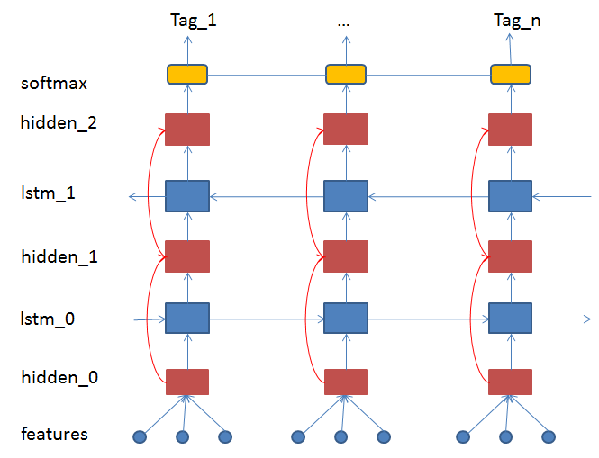
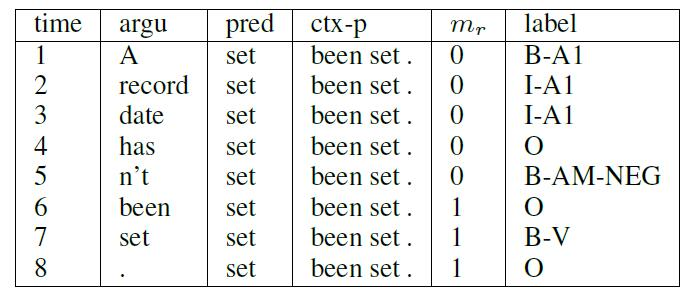
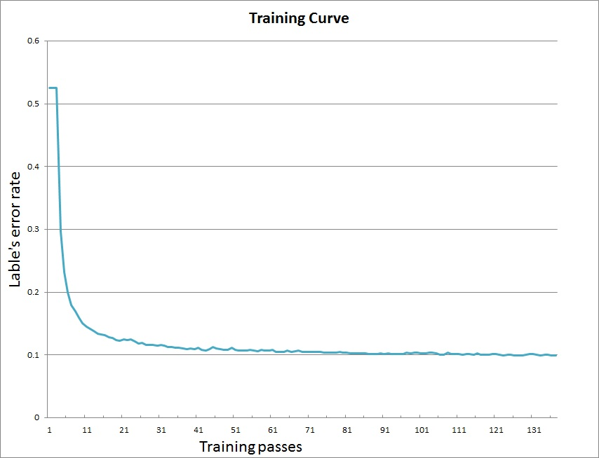

```eval_rst
..  _semantic_role_labeling:
```

# Semantic Role labeling Tutorial #

Semantic role labeling (SRL) is a form of shallow semantic parsing whose goal is to discover the predicate-argument structure of each predicate in a given input sentence. SRL is useful as an intermediate step in a wide range of natural language processing tasks, such as information extraction. automatic document categorization and question answering.  An instance is as following [1]:

 [ <sub>A0</sub> He ] [ <sub>AM-MOD</sub> would ][ <sub>AM-NEG</sub> n’t ] [ <sub>V</sub> accept] [ <sub>A1</sub> anything of value ] from [<sub>A2</sub> those he was writing about ]. 

- V: verb
- A0: acceptor
- A1: thing accepted
- A2: accepted-from
- A3: Attribute
- AM-MOD: modal 
- AM-NEG: negation

Given the verb "accept", the chunks in sentence would play certain semantic roles. Here, the label scheme is from Penn Proposition Bank. 

To this date, most of the successful SRL systems are built on top of some form of parsing results where pre-defined feature templates over the syntactic structure are used. This tutorial will present an end-to-end system using deep bidirectional long short-term memory (DB-LSTM)[2] for solving the SRL task, which largely outperforms the previous state-of-the-art systems. The system regards SRL task as the sequence labelling problem. 

## Data Description
The relevant paper[2] takes the data set in CoNLL-2005&2012 Shared Task for training and testing. Accordingto data license,  the demo adopts the test data set of CoNLL-2005, which can be reached on website.

To download and process the original data, user just need to execute the following command:

```bash
cd data
./get_data.sh
```
Several new files appear in the `data `directory as follows.
```bash
conll05st-release：the test data set of CoNll-2005 shared task 
test.wsj.words：the Wall Street Journal data sentences
test.wsj.props:  the propositional arguments
feature: the extracted features from data set
```

## Training
### DB-LSTM
Please refer to the Sentiment Analysis demo to learn more about the long short-term memory unit. 

Unlike Bidirectional-LSTM that used in Sentiment Analysis demo,  the DB-LSTM adopts another way to stack LSTM layer. First a standard LSTM processes the sequence in forward direction. The input and output of this LSTM layer are taken by the next LSTM layer as input, processed in reversed direction. These two standard LSTM layers compose a pair of LSTM. Then we stack LSTM layers pair after pair to obtain the deep LSTM model. 

The following figure shows a temporal expanded 2-layer DB-LSTM network.
<center>

</center>

### Features
Two input features play an essential role in this pipeline: predicate (pred) and argument (argu). Two other features: predicate context (ctx-p) and region mark (mr) are also adopted. Because a single predicate word can not exactly describe the predicate information, especially when the same words appear more than one times in a sentence. With the predicate context, the ambiguity can be largely eliminated. Similarly, we use region mark m<sub>r</sub> = 1 to denote the argument position if it locates in the predicate context region, or m<sub>r</sub> = 0 if does not. These four simple features are all we need for our SRL system. Features of one sample with context size set to 1 is showed as following[2]:
<center>

</center>

In this sample, the coresponding labelled sentence is:

[ <sub>A1</sub> A record date ] has [ <sub>AM-NEG</sub> n't ] been [ <sub>V</sub> set ] . 

In the demo, we adopt the feature template as above, consists of :  `argument`, `predicate`, `ctx-p (p=-1,0,1)`, `mark` and use `B/I/O` scheme to label each argument. These features and labels are stored in `feature` file, and separated by `\t`.

### Data Provider

`dataprovider.py` is the python file to wrap data. `hook()` function is to define the data slots for network. The  Six features and label are all IndexSlots.
```
def hook(settings, word_dict, label_dict, **kwargs):
    settings.word_dict = word_dict
    settings.label_dict = label_dict
    #all inputs are integral and sequential type
    settings.slots = [
        integer_value_sequence(len(word_dict)),
        integer_value_sequence(len(predicate_dict)),
        integer_value_sequence(len(word_dict)),
        integer_value_sequence(len(word_dict)),
        integer_value_sequence(len(word_dict)),
        integer_value_sequence(len(word_dict)),
        integer_value_sequence(len(word_dict)),
        integer_value_sequence(2),
        integer_value_sequence(len(label_dict))]
```
The corresponding data iterator is as following:
```
@provider(init_hook=hook, should_shuffle=True, calc_batch_size=get_batch_size,
          can_over_batch_size=False, cache=CacheType.CACHE_PASS_IN_MEM)
def process(settings, file_name):
    with open(file_name, 'r') as fdata:
        for line in fdata:
            sentence, predicate, ctx_n2, ctx_n1, ctx_0, ctx_p1, ctx_p2,  mark, label = \
                line.strip().split('\t')

            words = sentence.split()
            sen_len = len(words)
            word_slot = [settings.word_dict.get(w, UNK_IDX) for w in words]

            predicate_slot = [settings.predicate_dict.get(predicate)] * sen_len
            ctx_n2_slot = [settings.word_dict.get(ctx_n2, UNK_IDX)] * sen_len
            ctx_n1_slot = [settings.word_dict.get(ctx_n1, UNK_IDX)] * sen_len
            ctx_0_slot = [settings.word_dict.get(ctx_0, UNK_IDX)] * sen_len
            ctx_p1_slot = [settings.word_dict.get(ctx_p1, UNK_IDX)] * sen_len
            ctx_p2_slot = [settings.word_dict.get(ctx_p2, UNK_IDX)] * sen_len

            marks = mark.split()
            mark_slot = [int(w) for w in marks]

            label_list = label.split()
            label_slot = [settings.label_dict.get(w) for w in label_list]
            yield word_slot, predicate_slot, ctx_n2_slot, ctx_n1_slot, \
                  ctx_0_slot, ctx_p1_slot, ctx_p2_slot, mark_slot, label_slot
```
The `process`function yield 9 lists which are 8 features and label.
 
### Neural Network Config
`db_lstm.py` is the neural network config file to load the dictionaries and define the  data provider module and network architecture during the training procedure. 

Nine `data_layer` load instances from data provider. Eight features are transformed into embedddings respectively, and mixed by `mixed_layer` .  Deep bidirectional LSTM layers extract features for the softmax layer. The objective function is cross entropy of labels.

### Run Training 
The script for training is `train.sh`, user just need to execute:
```bash
  ./train.sh
```
The content in `train.sh`:
```
paddle train \
  --config=./db_lstm.py \
  --use_gpu=0 \
  --log_period=5000 \
  --trainer_count=1 \
  --show_parameter_stats_period=5000 \
  --save_dir=./output \
  --num_passes=10000 \
  --average_test_period=10000000 \
  --init_model_path=./data \
  --load_missing_parameter_strategy=rand \
  --test_all_data_in_one_period=1 \
2>&1 | tee 'train.log'
```

-  \--config=./db_lstm.py : network config file.
-  \--use_gpu=false: use CPU to train, set true, if you install GPU version of PaddlePaddle and want to use GPU to train, until now crf_layer do not support GPU
-  \--log_period=500: print log every 20 batches.
-  \--trainer_count=1: set thread number (or GPU count).
-  \--show_parameter_stats_period=5000: show parameter statistic every 100 batches.
-  \--save_dir=./output: output path to save models.
-  \--num_passes=10000: set pass number, one pass in PaddlePaddle means training all samples in dataset one time.
-  \--average_test_period=10000000:  do test on average parameter every average_test_period batches
-  \--init_model_path=./data: parameter initialization path 
-  \--load_missing_parameter_strategy=rand: random initialization unexisted parameters
-  \--test_all_data_in_one_period=1: test all data in one period


After training, the models  will be saved in directory `output`. Our training curve is as following:
<center>

</center>

### Run testing
The script for testing is `test.sh`, user just need to execute:
```bash
  ./test.sh
```
The main part in `tesh.sh`
```
paddle train \
  --config=./db_lstm.py \
  --model_list=$model_list \
  --job=test \
  --config_args=is_test=1 \
```

  - \--config=./db_lstm.py: network config file
  - \--model_list=$model_list.list: model list file
  - \--job=test: indicate the test job
  - \--config_args=is_test=1: flag to indicate test
  - \--test_all_data_in_one_period=1: test all data in 1 period
  

### Run prediction
The script for prediction is `predict.sh`, user just need to execute:
```bash
  ./predict.sh
  
```
In `predict.sh`, user should offer the network config file, model path, label file, word dictionary file, feature file
```
python predict.py 
     -c $config_file \
     -w $best_model_path \
     -l $label_file \
     -p $predicate_dict_file  \
     -d $dict_file \
     -i $input_file \
     -o $output_file
```

`predict.py` is the main executable python script, which includes functions: load model, load data, data prediction. The network model will output the probability distribution of labels. In the demo, we take the label with maximum probability as result. User can also implement the beam search or viterbi decoding upon the probability distribution matrix.

After prediction,  the result is saved in `predict.res`.

## Reference
[1] Martha Palmer, Dan Gildea, and Paul Kingsbury. The Proposition Bank: An Annotated Corpus of Semantic Roles , Computational Linguistics, 31(1), 2005. 

[2] Zhou, Jie, and Wei Xu. "End-to-end learning of semantic role labeling using recurrent neural networks." Proceedings of the Annual Meeting of the Association for Computational Linguistics. 2015.
