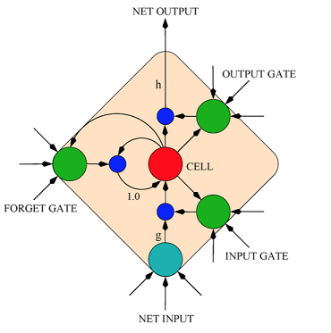
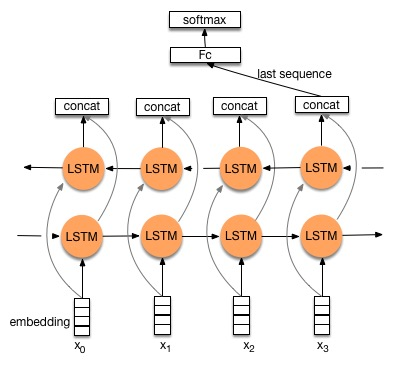
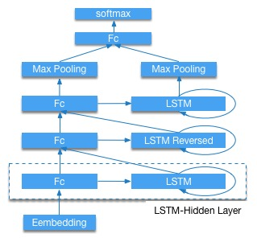

# 情感分析教程

情感分析有许多应用场景。 一个基本的应用场景是区分给定文本的褒贬两极性，给定的文本可以是一个文档、句子、或者是一个小的文本片段。 一个简单的例子如：把用户在购物网站、旅游网站、团购网站（亚马逊、天猫、淘宝等）上发表的评论分成正面评论和负面评论两类。

情感分析也常用于基于大量评论和个人博客来监控社会媒体。 例如，研究人员分析了几个关于消费者信心和政治观点的调查，结果发现它们与同时期的Twitter消息中的情绪词频率相关 [1]。 另一个例子是通过分析每日Twitter博客的文本内容来预测股票变动 [2]。

另一方面，抓取产品的用户评论并分析他们的情感，有助于理解用户对不同公司，不同产品，甚至不同竞争对手产品的偏好。

本教程将指导您完成长期短期记忆（LSTM）网络的训练过程，以分类来自[大型电影评论数据集](http://ai.stanford.edu/~amaas/data/sentiment/)（有时称为[互联网电影数据库 (IMDB)](http://ai.stanford.edu/~amaas/papers/wvSent_acl2011.pdf)）的句子的情感 。 此数据集包含电影评论及其相关联的类别标签，即正面和负面。

## 数椐准备

### IMDB 数椐介绍

训练模型之前, 我们需要预处理数椐并构建一个字典。 首先, 你可以使用下面的脚本下载 IMDB 数椐集和[Moses](http://www.statmt.org/moses/)工具, 这是一个基于统计的机器翻译系统. 我们提供了一个数据预处理脚本，它不仅能够处理IMDB数据，还能处理其他用户自定义的数据。 为了使用提前编写的脚本，需要将标记的训练和测试样本移动到另一个路径，这已经在`get_imdb.sh`中完成。

```
cd demo/sentiment/data
./get_imdb.sh
```
如果数椐获取成功，你将在目录```./demo/sentiment/data```中看到下面的文件：

```
aclImdb  get_imdb.sh  imdb  mosesdecoder-master
```

* aclImdb: 从外部网站上下载的原始数椐集。
* imdb: 仅包含训练和测试数椐集。
* mosesdecoder-master: Moses 工具。

IMDB数据集包含25,000个已标注过的高极性电影评论用于训练，25,000个用于测试。负面的评论的得分小于等于4,正面的评论的得大于等于7，总评分10分。 运行完脚本 `./get_imdb.sh`后, 我们可以看到在目录 `aclImdb`中的数椐集的结构如下：

```
imdbEr.txt  imdb.vocab  README  test  train
```
* train: 训练数椐集。
* test : 测试数椐集。
* imdb.vocab: 字典文件。
* imdbEr.txt: 字典imdb.vocab中每个切分单词的预期评级。
* README: 数椐说明文档。

测试集和训练集目录包含下面的文件:

```
labeledBow.feat  neg  pos  unsup  unsupBow.feat  urls_neg.txt  urls_pos.txt  urls_unsup.txt
```

* pos: 正面评价样本，包含12,500个txt文件，每个文件是一个电影评论。
* neg: 负面评价样本，包含12,500个txt文件，每个文件是一个电影评论。
* unsup: 未标记的评价样本，包含50,000个txt文件。
* urls_xx.txt: 每个评论的网址。
* xxBow.feat: 用于统计词频的Bow模型特征。

### IMDB 数椐准备

在这个例子中，我们只使用已经标注过的训练集和测试集，且默认在训练集上构建字典，而不使用IMDB数椐集中的imdb.vocab做为字典。训练集已经做了随机打乱排序而测试集没有。 Moses 工具中的脚本`tokenizer.perl` 用于切分单单词和标点符号。执行下面的命令就可以预处理数椐。

```
cd demo/sentiment/
./preprocess.sh
```
preprocess.sh:

```
data_dir="./data/imdb"
python preprocess.py -i data_dir
```

* data_dir: 输入数椐所在目录。
* preprocess.py: 预处理脚本。

运行成功后目录`demo/sentiment/data/pre-imdb` 结构如下:

```
dict.txt  labels.list  test.list  test_part_000  train.list  train_part_000
```
* test\_part\_000 and train\_part\_000: 所有标记的测试集和训练集， 训练集已经随机打乱。
* train.list and test.list: 训练集和测试集文件列表。
* dict.txt: 利用训练集生成的字典。
* labels.txt: neg  0, pos 1, 含义：标签0表示负面的评论，标签1表示正面的评论。

### 用户自定义数椐预处理

如果你执行其它的用情感分析来分类文本的任务，可以按如下的结构来准备数椐. 我们提供了脚本来构建字典和预处理数椐。所以你只用按下面的结构来组织数椐就行了。

```
dataset
|----train
|    |----class1
|    |    |----text_files
|    |----class2
|    |    |----text_files
|    |    ...
|----test
|    |----class1
|    |    |----text_files
|    |----class2
|    |    |----text_files
|    |    ...
```
* dataset: 一级目录。
* train, test: 二级目录。
* class1,class2,...: 三级目录。
* text_files: 文本格式的实例文件。

所有同目录下的文本实例文件都是同级别的。 每个文本文件包含一个或者多个实例，每一行表示一个实例。 为了充分的随机打乱训练集, 在预处理含有多行数椐的文本文件时参数设置稍有不同, 执行`preprocess.sh`脚本时需要加上`-m True`参数。 tokenizer.perl 默认用来切分单记和标点符号，如果你不需要这个操作，在运行`preprocess.sh`时加上`-t False`参数即可。

## 训练模型

在这步任务中,我们使用了循环神经网络（RNN）的 LSTM 架构来训练情感分析模型。 引入LSTM模型主要是为了克服消失梯度的问题。 LSTM网络类似于具有隐藏层的标准循环神经网络, 但是隐藏层中的每个普通节点被一个记忆单元替换。 每个记忆单元包含四个主要的元素: 输入门, 具有自循环连接的神经元，忘记门和输出门。 更多的细节可以在文献中找到[4]。 LSTM架构的最大优点是它可以在长时间间隔内记忆信息，而没有短时记忆的损失。在有新的单词来临的每一个时间步骤内，存储在记忆单元区块的历史信息被更新用来迭代的学习单词以合理的序列程现。

<center></center>
<center>图表 1. LSTM [3]</center>

情感分析是自然语言理解中最典型的问题之一。 它的目的是预测在一个序列中表达的情感态度。 通常, ，仅仅是一些关键词，如形容词和副词，在预测序列或段落的情感中起主要作用。然而有些评论上下文非常长，例如 IMDB的数椐集。 我们只所以使用LSTM来执行这个任务是因为其改进的设计并且具有门机制。 首先，它能够从词级到具有可变上下文长度的上下文级别来总结表示。 第二，它可以在句子级别利用可扩展的上下文, 而大多数方法只是利用n-gram级别的知识。第三，它直接学习段落表示，而不是组合上下文级别信息。

在本演示中，我们提供两个网络，即双向LSTM和三层堆叠LSTM。

#### 双向LSTM

图2是双向LSTM网络，后面连全连接层和softmax层。

<center></center>
<center>图 2. Bidirectional-LSTM </center>

#### Stacked-LSTM
图3是三层LSTM结构。图的底部是word embedding(对文档处理后形成的单词向量)。 接下来，连接三个LSTM隐藏层，并且第二个是反向LSTM。然后提取隐藏LSTM层的所有时间步长的最大词向量作为整个序列的表示。 最后，使用具有softmax激活的全连接前馈层来执行分类任务。 更多内容可查看参考文献 [5]。

<center></center>
<center>图 3. Stacked-LSTM for sentiment analysis </center>

**配置**

进入`demo/sentiment` 目录 , `trainer_config.py` 是一个配置文件的例子, 其中包含算法和网络配置。第一行从`sentiment_net.py`中导出预定义的网络。

trainer_config.py:

```python
from sentiment_net import *

data_dir  = "./data/pre-imdb"
# whether this config is used for test
is_test = get_config_arg('is_test', bool, False)
# whether this config is used for prediction
is_predict = get_config_arg('is_predict', bool, False)
dict_dim, class_dim = sentiment_data(data_dir, is_test, is_predict)

################## Algorithm Config #####################

settings(
  batch_size=128,
  learning_rate=2e-3,
  learning_method=AdamOptimizer(),
  regularization=L2Regularization(8e-4),
  gradient_clipping_threshold=25
)

#################### Network Config ######################
stacked_lstm_net(dict_dim, class_dim=class_dim,
                 stacked_num=3, is_predict=is_predict)
#bidirectional_lstm_net(dict_dim, class_dim=class_dim, is_predict=is_predict)
```

* **数椐定义**:
   * get\_config\_arg(): 获取通过 `--config_args=xx` 设置的命令行参数。
   * 定义训练数椐和测试数椐提供者, 这里使用了PaddlePaddle的Python接口来加载数椐。想了解更多细节可以参考PyDataProvider部分的文档

* **算法配置**:
   * 使用随机梯度下降（sgd）算法。
   * 使用 adam 优化。
   * 设置batch size大小为128。
   * 设置平均sgd窗口。
   * 设置全局学习率。
* **网络配置**:
   * dict_dim: 获取字典维度。
   * class_dim: 设置类别数，IMDB有两个标签，即正面评价标签和负面评价标签。
   * `stacked_lstm_net`: 预定义网络如图3所示，默认情况下使用此网络
   * `bidirectional_lstm_net`: 预定义网络，如图2所示。

**训练**

首先安装PaddlePaddle。 然后使用下面的脚本 `train.sh` 来开启本地的训练。

```
cd demo/sentiment/
./train.sh
```

train.sh:

```
config=trainer_config.py
output=./model_output
paddle train --config=$config \
             --save_dir=$output \
             --job=train \
             --use_gpu=false \
             --trainer_count=4 \
             --num_passes=10 \
             --log_period=20 \
             --dot_period=20 \
             --show_parameter_stats_period=100 \
             --test_all_data_in_one_period=1 \
             2>&1 | tee 'train.log'
```

* \--config=$config: 设置网络配置。
* \--save\_dir=$output: 设置输出路径以保存训练完成的模型。
* \--job=train: 设置工作模式为训练。
* \--use\_gpu=false: 使用CPU训练，如果你安装GPU版本的PaddlePaddle，并想使用GPU来训练设置为true。
* \--trainer\_count=4:设置线程数（或GPU个数）。
* \--num\_passes=15: 设置pass，PaddlePaddle中的一个pass意味着对数据集中的所有样本进行一次训练。
* \--log\_period=20: 每20个batch打印一次日志。
* \--show\_parameter\_stats\_period=100: 每100个batch打印一次统计信息。
* \--test\_all_data\_in\_one\_period=1: 每次测试都测试所有数据。

如果运行成功，输出日志保存在路径 `demo/sentiment/train.log`中，模型保存在目录`demo/sentiment/model_output/`中。  输出日志说明如下：

```
Batch=20 samples=2560 AvgCost=0.681644 CurrentCost=0.681644 Eval: classification_error_evaluator=0.36875  CurrentEval: classification_error_evaluator=0.36875
...
Pass=0 Batch=196 samples=25000 AvgCost=0.418964 Eval: classification_error_evaluator=0.1922
Test samples=24999 cost=0.39297 Eval: classification_error_evaluator=0.149406
```
- Batch=xx: 表示训练了xx个Batch。
- samples=xx: 表示训练了xx个样本。。
- AvgCost=xx: 从第0个batch到当前batch的平均损失。
- CurrentCost=xx: 最新log_period个batch处理的当前损失。
- Eval: classification\_error\_evaluator=xx: 表示第0个batch到当前batch的分类错误。
- CurrentEval: classification\_error\_evaluator: 最新log_period个batch的分类错误。
- Pass=0: 通过所有训练集一次称为一遍。 0表示第一次经过训练集。

默认情况下，我们使用`stacked_lstm_net`网络，当传递相同的样本数时，它的收敛速度比`bidirectional_lstm_net`快。如果要使用双向LSTM，只需删除最后一行中的注释并把“stacked_lstm_net”注释掉。

## 测试模型

测试模型是指使用训练出的模型评估已标记的验证集。

```
cd demo/sentiment
./test.sh
```

test.sh:

```bash
function get_best_pass() {
  cat $1  | grep -Pzo 'Test .*\n.*pass-.*' | \
  sed  -r 'N;s/Test.* error=([0-9]+\.[0-9]+).*\n.*pass-([0-9]+)/\1 \2/g' | \
  sort | head -n 1
}

log=train.log
LOG=`get_best_pass $log`
LOG=(${LOG})
evaluate_pass="model_output/pass-${LOG[1]}"

echo 'evaluating from pass '$evaluate_pass

model_list=./model.list
touch $model_list | echo $evaluate_pass > $model_list
net_conf=trainer_config.py
paddle train --config=$net_conf \
             --model_list=$model_list \
             --job=test \
             --use_gpu=false \
             --trainer_count=4 \
             --config_args=is_test=1 \
             2>&1 | tee 'test.log'
```

函数`get_best_pass`依据分类错误率获得最佳模型进行测试。 在本示例中，我们默认使用IMDB的测试数据集作为验证。 与训练不同，它需要在这里指定`--job = test`和模型路径，即`--model_list = $model_list`。如果运行成功，日志将保存在“demo / sentiment / test.log”的路径中。例如，在我们的测试中，最好的模型是`model_output / pass-00002`，分类误差是0.115645，如下：

```
Pass=0 samples=24999 AvgCost=0.280471 Eval: classification_error_evaluator=0.115645
```

## 预测

`predict.py`脚本提供了一个预测接口。在使用它之前请安装PaddlePaddle的python api。 预测IMDB的未标记评论的一个实例如下：

```
cd demo/sentiment
./predict.sh
```
predict.sh:

```
#Note the default model is pass-00002, you shold make sure the model path
#exists or change the mode path.
model=model_output/pass-00002/
config=trainer_config.py
label=data/pre-imdb/labels.list
cat ./data/aclImdb/test/pos/10007_10.txt | python predict.py \
     --tconf=$config\
     --model=$model \
     --label=$label \
     --dict=./data/pre-imdb/dict.txt \
     --batch_size=1
```

* `cat ./data/aclImdb/test/pos/10007_10.txt` : 输入预测样本。
* `predict.py` : 预测接口脚本。
* `--tconf=$config` : 设置网络配置。
* `--model=$model` : 设置模型路径。
* `--label=$label` : 设置标签类别字典，这个字典是整数标签和字符串标签的一个对应。
* `--dict=data/pre-imdb/dict.txt` : 设置字典文件。
* `--batch_size=1` : 设置batch size。

注意应该确保默认模型路径`model_output / pass-00002`存在或更改为其它模型路径。

本示例的预测结果：

```
Loading parameters from model_output/pass-00002/
./data/aclImdb/test/pos/10014_7.txt: predicting label is pos
```
我们真诚地感谢您的关注，并欢迎您来参与贡献。

## 参考文档
[1] Brendan O'Connor, Ramnath Balasubramanyan, Bryan R. Routledge, and Noah A. Smith. 2010. [From Tweets to Polls: Linking Text Sentiment to Public Opinion Time Series](http://homes.cs.washington.edu/~nasmith/papers/oconnor+balasubramanyan+routledge+smith.icwsm10.pdf). In ICWSM-2010. <br>
[2] Johan Bollen, Huina Mao, Xiaojun Zeng. 2011. [Twitter mood predicts the stock market](http://arxiv.org/abs/1010.3003), Journal of Computational Science.<br>
[3] Alex Graves, Marcus Liwicki, Santiago Fernan- dez, Roman Bertolami, Horst Bunke, and Ju ̈rgen Schmidhuber. 2009. [A novel connectionist system for unconstrained handwriting recognition. IEEE Transactions on Pattern Analysis and Machine In- telligence](http://www.cs.toronto.edu/~graves/tpami_2009.pdf), 31(5):855–868.<br>
[4] Zachary C. Lipton, [A Critical Review of Recurrent Neural Networks for Sequence Learning](http://arxiv.org/abs/1506.00019v1), arXiv:1506.00019. <br>
[5] Jie Zhou and Wei Xu; [End-to-end Learning of Semantic Role Labeling Using Recurrent Neural Networks](http://www.aclweb.org/anthology/P/P15/P15-1109.pdf); ACL-IJCNLP 2015. <br>
