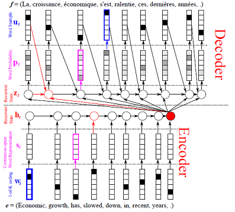

# 文本生成教程 #

在语言生成领域中，“序列到序列”（sequence to sequence）的方法已被证明是一种强大的模型。它可以被应用于进行机器翻译（machine translation）、query改写（query rewriting）、图像描述（image captioning）等等。

本篇教程将会指导你通过训练一个“序列到序列”的神经网络机器翻译（NMT）模型来将法语翻译成英语。

我们遵循 [Neural Machine Translation by Jointly Learning to Align and Translate](http://arxiv.org/abs/1409.0473) 这篇文章，其中详细说明了模型架构，以及在WMT-14数据集上得到良好表现的训练过程。本篇教程在PaddlePaddle中重现了这一良好的训练结果。

我们感谢@caoying的pull request，其中定义了模型架构和solver配置。

## 数据准备 ##
### 下载与解压缩 ###
从该链接 [http://www-lium.univ-lemans.fr/~schwenk/cslm\_joint\_paper/](http://www-lium.univ-lemans.fr/~schwenk/cslm_joint_paper/) 下载WMT-14数据集，然后解压，并将Develop和Test数据分别放入不同的文件夹。

- **Train data**: [bitexts (选择过后的)](http://www-lium.univ-lemans.fr/~schwenk/cslm_joint_paper/data/bitexts.tgz)
- **Develop and Test data**: [dev 与 test 数据](http://www-lium.univ-lemans.fr/~schwenk/cslm_joint_paper/data/dev+test.tgz)

在Linux下，只需要简单地运行以下命令。否则你需要自己下载、解压、拆分到不同文件夹、并且分别重命名文件后缀。

```bash
cd demo/seqToseq/data
./wmt14_data.sh
```

我们会发现数据集 `wmt14` 中包含如下表所示的3个文件夹。
<table border="2" cellspacing="0" cellpadding="6" rules="all" frame="border">
<colgroup>
<col  class="left" />
<col  class="left" />
<col  class="left" />
<col  class="left" />
</colgroup>

<thead>
<tr>
<th scope="col" class="left">folder name</th>
<th scope="col" class="left">French-English parallel corpora file</th>
<th scope="col" class="left">number of total file</th>
<th scope="col" class="left">size</th>
</tr>
</thead>

<tbody>
<tr>
<td class="left">train_data</td>
<td class="left">ccb2_pc30.src, ccb2_pc30.trg, etc</td>
<td class="left">12</td>
<td class="left">3.55G</td>
</tr>

<tr>
<td class="left">test_data</td>
<td class="left">ntst1213.src, ntst1213.trg</td>
<td class="left">2</td>
<td class="left">1636k</td>
</tr>

<tr>
<td class="left">gen_data</td>
<td class="left">ntst14.src, ntst14.trg</td>
<td class="left">2</td>
<td class="left">864k</td>
</tr>
</tbody>
</table>
<br/>

- 每个文件夹都包含法语到英语的平行语料库
- **XXX.src** 是原始法语文件；**XXX.trg** 是目标英语文件
- **XXX.src** 和 **XXX.trg** 的行数应该一致
- 每行都是一个法语或者英语的句子
- **XXX.src** 和 **XXX.trg** 中任意第i行的句子之间都有着一一对应的关系

### 用户自定义数据集 ###

如果你想进行诸如语义转述（Paraphrasing）等其他“序列到序列”的任务，你只需要按照如下方式组织数据，并将它们放在`demo/seqToseq/data`目录下：

    dataset
      train
        file1.src file1.trg
        file2.src file2.trg
        ......
      test
        file1.src file1.trg
        file2.src file2.trg
        ......
      gen
        file1.src file1.trg
        file2.src file2.trg
        ......
  
- 一级目录：数据集文件夹名称
- 二级目录：train、test和gen这三个文件夹是固定的
- 三级目录：源语言到目标语言的平行语料库文件
  - **XXX.src** 是源语言的文件，**XXX.trg** 时目标语言的文件
  - 文件中的每行都必须是一个句子
  - **XXX.src** 和 **XXX.trg** 中任意第i行的句子之间都必须有着一一对应的关系

## 数据预处理 ##
### 预处理工作流程 ###
- 将每个源语言到目标语言的平行语料库文件合并为一个文件：
  - 合并每个 **XXX.src** 和 **XXX.trg** 文件为 **XXX**
  - **XXX** 中的第i行 = **XXX.src** 中的第i行 + '\t' + **XXX.trg**中的第i行
- 创建训练数据的“源字典”和“目标字典”，每个字典都有DICTSIZE个单词，包括：
  - 词频最高的（DICTSIZE - 3）个单词
  - 3个特殊符号
  - `<s>`：序列的开始
  - `<e>`：序列的结束
  - `<unk>`：未包含在字典中的单词

### 预处理命令和结果
对数据集进行预处理的基本命令是：

```python
cd demo/seqToseq/
python preprocess.py -i INPUT [-d DICTSIZE] [-m]
```

- `-i INPUT`：输入的原始数据集路径
- `-d DICTSIZE`：指定的字典单词数，如果没有设置，字典会包含输入数据集中的所有单词
- `-m --mergeDict`：合并 “源字典”和“目标字典”，使得两个字典有相同的上下文

你将会看到如下消息：

    concat parallel corpora for dataset
    build source dictionary for train data
    build target dictionary for train data
    dictionary size is XXX

然后你只需要运行以下命令：

```python
python preprocess.py -i data/wmt14 -d 30000
```

这将花费数分钟的时间，并且将预处理好的数据集存放在`demo/seqToseq/data/pre-wmt14`目录下。目录结构如下：

    train test gen train.list test.list gen.list src.dict trg.dict# Text generation Tutorial #

- **train, test, gen**：分别包含了法语到英语的平行语料库的训练数据、测试数据和生成数据。文件夹中的每个文件的每一行包含两部分，首先是法语序列，然后是对应的英语序列。
- **train.list, test.list, gen.list**：分别为train，test，gen文件夹中的文件列表
- **src.dict, trg.dict**：源（法语）/目标（英语）字典，每个字典包含总共30000个单词：29997个最高频单词和3个特殊符号

## 模型训练 ##
### 简介###

神经网络机器翻译（NMT）旨在建立一个可以被协同调至最优翻译效果的单神经元网络。近期提出的NMT模型通常都属于编解码模型（encoder–decoder models）的一种。编解码模型将一个源语句编码为一个定长的向量，然后解码器通过这个向量生成一个目标语句。

在这个任务中，我们使用了一个编解码模型的扩展，它同时学习排列(align)与翻译。每当模型在翻译过程中生成了一个单词，它就会在源语句中搜索出最相关信息的位置的集合。解码器根据上下文向量预测出一个目标单词，这个向量与源中搜索出的位置和所有之前生成的目标单词有关。如想了解更多详细的解释，可以参考 [Neural Machine Translation by Jointly Learning to Align and Translate](http://arxiv.org/abs/1409.0473)。

这个模型对于编解码模型来说，最不同的特色是它并没有将输入语句编码为一个单独的定长向量。相反，它将输入语句编码为向量的序列，其中每个向量对应输入语句中的一个元素。然后在解码被翻译的语句时，会自适应地从这些向量中选择一个子集出来。这使得NMT模型得以解放出来，不必再将任意长度源语句中的所有信息压缩至一个定长的向量中。该模型在长语句翻译的场景下效果提升更加明显，在任意长度语句翻译的场景下都可以观察到其效果的提升。
<center></center>
<center>Figure 1. Encoder-Decoder-Attention-Model</center>

### 使用PaddlePaddle训练模型 ###
我们在训练之前需要常见一个模型配置文件，这里是一个例子`demo/seqToseq/translation/train.conf`。前三行import了定义network，job_mode和attention_mode的python函数。

```python
from seqToseq_net import *
is_generating = False

### Data Definiation
train_conf = seq_to_seq_data(data_dir = "./data/pre-wmt14",
                             is_generating = is_generating)

### Algorithm Configuration
settings(
    learning_method = AdamOptimizer(),
    batch_size = 50,
    learning_rate = 5e-4)

### Network Architecture
gru_encoder_decoder(train_conf, is_generating)
```

1. **Data Definiation**：在示例中我们定义了一个序列到序列的训练和测试数据。它返回train_conf作为配置，其输入参数如下：
  - data_dir：训练数据和测试数据的目录
  - is_generating：这个配置是否用来生成，这里设置为False
2. **Algorithm Configuration**：在示例中我们使用SGD训练算法（默认），和ADAM学习方法，指定batch_size为50，learning_rate为5e-4
3. **Network Architecture**：在示例中我们使用attention版本的GRU编解码网络。它包括了一个双向的GRU作为编码器和解码器，它模拟了解码翻译过程中在源语句中的搜索。

### 训练模型的命令与结果###
写完模型配置之后，我们可以通过以下命令来训练模型：

```bash
cd demo/seqToseq/translation
./train.sh
```

`train.sh` 的内容如下所示：

```bash
paddle train \
--config='translation/train.conf' \
--save_dir='translation/model' \
--use_gpu=false \
--num_passes=16 \
--show_parameter_stats_period=100 \
--trainer_count=4 \
--log_period=10 \
--dot_period=5 \
2>&1 | tee 'translation/train.log'
```
- config: 设置神经网络的配置文件
- save_dir: 设置保存模型的输出路径
- use_gpu: 是否使用GPU训练，这里设置为使用CPU
- num_passes: 设置passes的数量。paddle中的一条pass表示训练数据集中所有的样本一次
- show_parameter_stats_period: 这里每隔100个batch显示一次参数统计信息
- trainer_count: 设置CPU线程数或者GPU设备数
- log_period: 这里每隔10个batch打印一次日志
- dot_period: 这里每个5个batch打印一个点"."

训练的损失函数默认每隔10个batch打印一次，你将会看到如下消息：

    I0719 19:16:45.952062 15563 TrainerInternal.cpp:160]  Batch=10 samples=500 AvgCost=198.475 CurrentCost=198.475 Eval: classification_error_evaluator=0.737155  CurrentEval: classification_error_evaluator=0.737155
    I0719 19:17:56.707319 15563 TrainerInternal.cpp:160]  Batch=20 samples=1000 AvgCost=157.479 CurrentCost=116.483 Eval: classification_error_evaluator=0.698392  CurrentEval: classification_error_evaluator=0.659065
    .....
- AvgCost：从第0个batch到当前batch的平均cost
- CurrentCost:：当前batch的cost
- classification\_error\_evaluator(Eval)：从第0个评估到当前评估中，每个单词的预测错误率
- classification\_error\_evaluator(CurrentEval)：当前评估中，每个单词的预测错误率

当classification\_error\_evaluator的值低于0.35时，模型就训练成功了。

## 文本生成 ##
### 简介###

一般而言，NMT模型受制于源语句的编码，并且通过给出当前目标单词来预测下一个目标单词。在训练过程中，当前单词在相比之下总是被当作真值（ground truth）。在生成过程中，当前单词是解码器最后一步的输出，这来自于PaddlePaddle的内存中。

而且，我们使用集束搜索（Beam Search）来生成序列。集束搜索使用广度优先搜索来构建搜索树。对于树的每一层，生成当前层的所有后继状态，并将它们按照启发代价（heuristic cost）升序排列。但是这种方法在每层只保存预设数量的最优状态（这个数量称为beam size）。

### 预训练的模型 ###
我们在拥有50个节点的集群中训练模型，每个节点有两个6核CPU。我们在5天里训练了16个pass，其中每条pass花费了7个小时。model_dir中有16个子目录，每个里面都包含202MB的全部的模型参数。然后我们发现pass-00012的模型有着最高的BLEU值27.77（参考文献[BLEU: a Method for Automatic Evaluation of Machine Translation](http://www.aclweb.org/anthology/P02-1040.pdf)）。要下载解压这个模型，只需在linux下运行如下命令：

```bash
cd demo/seqToseq/data
./wmt14_model.sh
```

### 使用PaddlePaddle生成模型 ###
在翻译法语句子之前，我们需要创建模型配置文件。这里是一个例子`demo/seqToseq/translation/gen.conf`。前三行import了定义network，job_mode和attention_mode的python函数。

```python
from seqToseq_net import *
is_generating = True

################## Data Definiation #####################
gen_conf = seq_to_seq_data(data_dir = "./data/pre-wmt14",
                           is_generating = is_generating,
                           gen_result = "./translation/gen_result")

############## Algorithm Configuration ##################
settings(
  learning_method = AdamOptimizer(),
  batch_size = 1,
  learning_rate = 0)

################# Network configure #####################
gru_encoder_decoder(gen_conf, is_generating)
```

1. **Data Definiation**：在示例中我们定义了一个序列到序列的生成数据。它返回gen_conf作为配置，其输入参数如下：
  - data_dir：生成数据的目录
  - is_generating：这个配置是否用来生成，这里设置为True
  - gen_result：保存生成结果的文件
2. **Algorithm Configuration**：在生成过程中我们使用SGD训练算法，并指定batch_size为1（每次生成1个序列），learning_rate为0
3. **Network Architecture**：本质上与训练模型一样

### 生成模型的命令与结果 ###
写完模型配置之后，我们可以通过以下命令来进行从法语到英语的文本翻译：

```bash
cd demo/seqToseq/translation
./gen.sh
```

 `gen.sh` 的内容如下所示。与训练模型不同的是，这里有一些不同的参数需要指定：

```bash
paddle train \
--job=test \
--config='translation/gen.conf' \
--save_dir='data/wmt14_model' \
--use_gpu=true \
--num_passes=13 \
--test_pass=12 \
--trainer_count=1 \
2>&1 | tee 'translation/gen.log'
```
- job：设置任务的模式为测试
- save_dir：存储模型的路径
- num_passes and test_pass：从test_pass到（num_passes - 1）加载模型参数，这里只加载 `data/wmt14_model/pass-00012`

你将会看到这样的消息：

    I0706 14:48:31.178915 31441 GradientMachine.cpp:143] Loading parameters from data/wmt14_model/pass-00012
    I0706 14:48:40.012039 31441 Tester.cpp:125]  Batch=100 samples=100 AvgCost=0
    I0706 14:48:48.898632 31441 Tester.cpp:125]  Batch=200 samples=200 AvgCost=0
    ...

然后在`demo/seqToseq/translation/gen_result`中的生成结果如下所示：

    0
    0       -11.1314         The <unk> <unk> about the width of the seats while large controls are at stake <e>
    1       -11.1519         The <unk> <unk> on the width of the seats while large controls are at stake <e>
    2       -11.5988         The <unk> <unk> about the width of the seats while large controls are at stake . <e>

    1
    0       -24.4149         The dispute is between the major aircraft manufacturers about the width of the tourist seats on the <unk> flights , paving the way for a <unk> confrontation during the month of the Dubai <unk> . <e>
    1       -26.9524         The dispute is between the major aircraft manufacturers about the width of the tourist seats on the <unk> flights , paving the way for a <unk> confrontation during the month of Dubai &apos; s <unk> . <e>
    2       -27.9574         The dispute is between the major aircraft manufacturers about the width of the tourist seats on the <unk> flights , paving the way for a <unk> confrontation during the month of Dubai &apos; s Dubai <unk> . <e>
    ...

- 这是集束搜索的结果，其中beam size是3
- 第一行的“0”和第6行的“1”表示生成数据的序列id
- 其他六行列出了集束搜索的结果
  - 第二列是集束搜索的得分（从大到小）
  - 第三列是生成的英语序列
- 有两个特殊标识：
  - `<e>`：序列的结尾
  - `<unk>`：不包含在字典中的单词

### BLEU评估 ###
对机器翻译的人工评估工作很广泛但也很昂贵。一篇论文 [BLEU: a Method for Automatic Evaluation of Machine Translation](http://www.aclweb.org/anthology/P02-1040.pdf) 展示了一种方法，当需要快速或者频繁的评估时，使用自动的替补来替代经验丰富的人工评判。[Moses](http://www.statmt.org/moses/) 是一个统计学的机器翻译系统，我们使用其中的 [multi-bleu.perl](https://github.com/moses-smt/mosesdecoder/blob/master/scripts/generic/multi-bleu.perl) 来做BLEU评估。运行以下命令来下载这个脚本：

```bash
cd demo/seqToseq/translation
./moses_bleu.sh
```

由于标准的翻译结果已经下载到这里`data/wmt14/gen/ntst14.trg`，我们可以运行以下命令来做BLEU评估。

```bash
cd demo/seqToseq/translation
./eval_bleu.sh FILE BEAMSIZE
```

- FILE：生成的结果文件
- BEAMSIZE：集束搜索中的扩展广度
