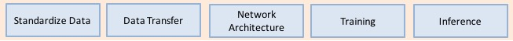
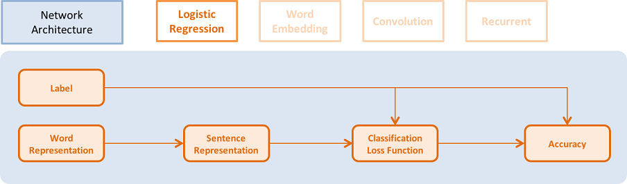
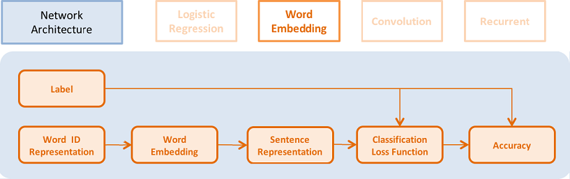
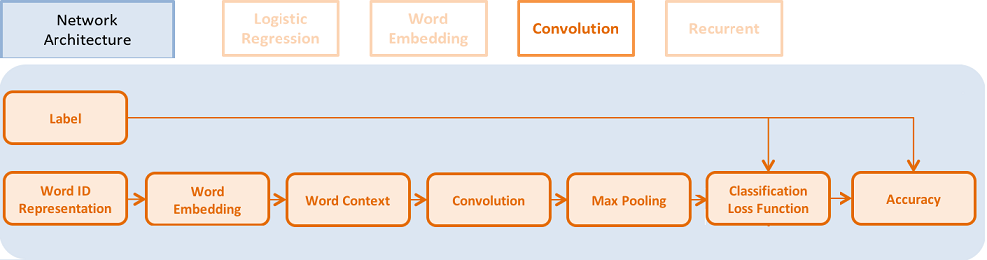
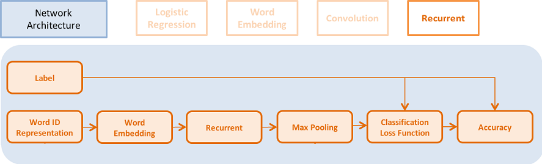

# Quick Start

This tutorial will teach the basics of deep learning (DL), including how to implement many different models in PaddlePaddle. You will learn how to:
  - Prepare data into the standardized format that PaddlePaddle accepts.
  - Write data providers that read data into PaddlePaddle.
  - Configure neural networks in PaddlePaddle layer by layer.
  - Train models.
  - Perform inference with trained models.


## Install

To get started, please install PaddlePaddle on your computer. Throughout this tutorial, you will learn by implementing different DL models for text classification.

To install PaddlePaddle, please follow the instructions here: <a href = "../../getstarted/build_and_install/index_en.html" >Build and Install</a>.

## Overview
For the first step, you will use PaddlePaddle to build a **text classification** system. For example, suppose you run an e-commence  website, and you want to analyze the sentiment of user reviews to evaluate product quality.

For example, given the input

```
This monitor is fantastic.
```

Your classifier should output “positive”, since this text snippet shows that the user is satisfied with the product. Given this input:

```
The monitor breaks down two months after purchase.
```

the classifier should output “negative“.

To build your text classification system, your code will need to perform five steps:
<center>  </center>

  - Preprocess data into a standardized format.
  - Provide data to the learning model.
  - Specify the neural network structure.
  - Train the model.
  - Inference (make prediction on test examples).


1. Preprocess data into standardized format
    - In the text classification example, you will start with a text file with one training example per line. Each line contains category id (in machine learning, often denoted the target y), followed by the input text (often denoted x); these two elements are separated by a Tab. For example: ```positive [tab] This monitor is fantastic```. You will preprocess this raw data into a format that Paddle can use.

2. Provide data to the learning model.
    - You can write data providers in Python. For any required data preprocessing step, you can add the preprocessing code to the PyDataProvider Python file.
    - In our text classification example, every word or character will be converted into an integer id, specified in a dictionary file. It perform a dictionary lookup in PyDataProvider to get the id.
3. Specify neural network structure.  (From easy to hard, we provide 4 kinds of network configurations)
    - A logistic regression model.
    - A word embedding model.
    - A convolutional neural network model.
    - A sequential recurrent neural network model.
    - You will also learn different learning algorithms.
4. Training model.
5. Inference.

## Preprocess data into standardized format
In this example, you are going to use [Amazon electronic product review dataset](http://jmcauley.ucsd.edu/data/amazon/) to build a bunch of deep neural network models for text classification. Each text in this dataset is a product review. This dataset has two categories: “positive” and “negative”. Positive means the reviewer likes the product, while negative means the reviewer does not like the product.

`demo/quick_start` in the [source code](https://github.com/PaddlePaddle/Paddle) provides script for downloading the preprocessed data as shown below. (If you want to process the raw data, you can use the script `demo/quick_start/data/proc_from_raw_data/get_data.sh`).

```bash
cd demo/quick_start
./data/get_data.sh
```

## Transfer Data to Model
### Write Data Provider with Python
The following `dataprovider_bow.py` gives a complete example of writing data provider with Python. It includes the following parts:

* initalizer： define the additional meta-data of the data provider and the types of the input data.
* process： Each `yield` returns a data sample. In this case, it return the text representation and category id. The order of features in the returned result needs to be consistent with the definition of the input types in `initalizer`.

```python
from paddle.trainer.PyDataProvider2 import *

# id of the word not in dictionary
UNK_IDX = 0

# initializer is called by the framework during initialization.
# It allows the user to describe the data types and setup the
# necessary data structure for later use.
# `settings` is an object. initializer need to properly fill settings.input_types.
# initializer can also store other data structures needed to be used at process().
# In this example, dictionary is stored in settings.
# `dictionay` and `kwargs` are arguments passed from trainer_config.lr.py
def initializer(settings, dictionary, **kwargs):
    # Put the word dictionary into settings
    settings.word_dict = dictionary

    # setting.input_types specifies what the data types the data provider
    # generates.
    settings.input_types = [
        # The first input is a sparse_binary_vector,
        # which means each dimension of the vector is either 0 or 1. It is the
        # bag-of-words (BOW) representation of the texts.
        sparse_binary_vector(len(dictionary)),
        # The second input is an integer. It represents the category id of the
        # sample. 2 means there are two labels in the dataset.
        # (1 for positive and 0 for negative)
        integer_value(2)]

# Delaring a data provider. It has an initializer 'data_initialzer'.
# It will cache the generated data of the first pass in memory, so that
# during later pass, no on-the-fly data generation will be needed.
# `setting` is the same object used by initializer()
# `file_name` is the name of a file listed train_list or test_list file given
# to define_py_data_sources2(). See trainer_config.lr.py.
@provider(init_hook=initializer, cache=CacheType.CACHE_PASS_IN_MEM)
def process(settings, file_name):
    # Open the input data file.
    with open(file_name, 'r') as f:
        # Read each line.
        for line in f:
            # Each line contains the label and text of the comment, separated by \t.
            label, comment = line.strip().split('\t')

            # Split the words into a list.
            words = comment.split()

            # convert the words into a list of ids by looking them up in word_dict.
            word_vector = [settings.word_dict.get(w, UNK_IDX) for w in words]

            # Return the features for the current comment. The first is a list
            # of ids representing a 0-1 binary sparse vector of the text,
            # the second is the integer id of the label.
            yield word_vector, int(label)
```

### Define Python Data Provider in Configuration files.
You need to add a data provider definition `define_py_data_sources2` in our network configuration. This definition specifies:

- The path of the training and testing data (`data/train.list`, `data/test.list`).
- The location of the data provider file (`dataprovider_bow`).
- The function to call to get data. (`process`).
- Additional arguments or data. Here it passes the path of word dictionary.

```python
from paddle.trainer_config_helpers import *

file = "data/dict.txt"
word_dict = dict()
with open(dict_file, 'r') as f:
    for i, line in enumerate(f):
        w = line.strip().split()[0]
        word_dict[w] = i
# define the data sources for the model.
# We need to use different process for training and prediction.
# For training, the input data includes both word IDs and labels.
# For prediction, the input data only includs word Ids.
define_py_data_sources2(train_list='data/train.list',
                        test_list='data/test.list',
                        module="dataprovider_bow",
                        obj="process",
                        args={"dictionary": word_dict})
```
You can refer to the following link for more detailed examples and data formats: <a href = "../../api/v1/data_provider/pydataprovider2_en.html">PyDataProvider2</a>.

## Network Architecture
We will describe four kinds of network architectures in this section.
<center>  </center>

First, you will build a logistic regression model. Later, you will also get chance to build other more powerful network architectures.
For more detailed documentation, you could refer to: <a href = "../../api/v1/trainer_config_helpers/layers.html">layer documentation</a>. All configuration files are in `demo/quick_start` directory.

### Logistic Regression
The architecture is illustrated in the following picture:
<center>  </center>

- You need define the data for text features. The size of the data layer is the number of words in the dictionary.

```python
word = data_layer(name="word",  size=voc_dim)
```

- You also need to define the category id for each example. The size of the data layer is the number of labels.

```python
label = data_layer(name="label", size=label_dim)
```

- It uses logistic regression model to classify the vector, and it will output the classification error during training.
    - Each layer has an *input* argument that specifies its input layer. Some layers can have multiple input layers. You can use a list of the input layers as input in that case.
    - *size* for each layer means the number of neurons of the layer.
    - *act_type* means activation function applied to the output of each neuron independently.
    - Some layers can have additional special inputs. For example, `classification_cost` needs ground truth label as input to compute classification loss and error.
```python
# Define a fully connected layer with logistic activation (also called softmax activation).
output = fc_layer(input=word,
                  size=label_dim,
                  act_type=SoftmaxActivation())
# Define cross-entropy classification loss and error.
classification_cost(input=output, label=label)
```

Performance summary: You can refer to the training and testing scripts later. In order to compare different network architectures, the model complexity and test classification error are listed in the following table:

<html>
<center>
<table border="2" cellspacing="0" cellpadding="6" rules="all" frame="border">

<thead>
<th scope="col" class="left">Network name</th>
<th scope="col" class="left">Number of parameters</th>
<th scope="col" class="left">Test error</th>
</tr>
</thead>

<tbody>
<tr>
<td class="left">Logistic regression</td>
<td class="left">252 KB</td>
<td class="left">8.652%</td>
</tr>

</tbody>
</table></center>
</html>
<br>

### Word Embedding Model
In order to use the word embedding model, you need to change the data provider a little bit to make the input words as a sequence of word IDs. The revised data provider `dataprovider_emb.py` is listed below. You only need to change initializer() for the type of the first input. It is changed from sparse_binary_vector to sequence of intergers.  process() remains the same. This data provider can also be used for later sequence models.

```python
def initializer(settings, dictionary, **kwargs):
    # Put the word dictionary into settings
    settings.word_dict = dictionary
    settings.input_types = [
        # Define the type of the first input as a sequence of integers.
        integer_value_sequence(len(dictionary)),
        # Define the second input for label id
        integer_value(2)]

@provider(init_hook=initializer)
def process(settings, file_name):
    ...
    # omitted, it is same as the data provider for LR model
```

This model is very similar to the framework of logistic regression, but it uses word embedding vectors instead of a sparse vectors to represent words.
<center>  </center>

- It can look up the dense word embedding vector in the dictionary  (its words embedding vector is `word_dim`). The input is a sequence of N words, the output is N word_dim dimensional vectors.

```python
emb = embedding_layer(input=word, dim=word_dim)
```

- It averages all the word embedding in a sentence to get its sentence representation.

```python
avg = pooling_layer(input=emb, pooling_type=AvgPooling())
```

The other parts of the model are the same as logistic regression network.

The performance is summarized in the following table:

<html>
<center>
<table border="2" cellspacing="0" cellpadding="6" rules="all" frame="border">

<thead>
<th scope="col" class="left">Network name</th>
<th scope="col" class="left">Number of parameters</th>
<th scope="col" class="left">Test error</th>
</tr>
</thead>

<tbody>
<tr>
<td class="left">Word embedding model</td>
<td class="left">15 MB</td>
<td class="left">8.484%</td>
</tr>

</tbody>
</table>
</html></center>
<br>

### Convolutional Neural Network Model
Convolutional neural network converts a sequence of word embeddings into a sentence representation using temporal convolutions. You will transform the fully connected layer of the word embedding model to 3 new sub-steps.
<center>  </center>


Text convolution has 3 steps:
1. Get K nearest neighbor context of each word in a sentence, stack them into a 2D vector representation.
2. Apply temporal convolution to this representation to produce a new hidden_dim dimensional vector.
3. Apply max-pooling to the new vectors at all the time steps in a sentence to get a sentence representation.

```python
# context_len means convolution kernel size.
# context_start means the start of the convolution. It can be negative. In that case, zero padding is applied.
text_conv = sequence_conv_pool(input=emb,
                               context_start=k,
                               context_len=2 * k + 1)
```

The performance is summarized in the following table：

<html>
<center>
<table border="2" cellspacing="0" cellpadding="6" rules="all" frame="border">

<thead>
<th scope="col" class="left">Network name</th>
<th scope="col" class="left">Number of parameters</th>
<th scope="col" class="left">Test error</th>
</tr>
</thead>

<tbody>
<tr>
<td class="left">Convolutional model</td>
<td class="left">16 MB</td>
<td class="left">5.628%</td>
</tr>

</tbody>
</table></center>
<br>

### Recurrent Model
<center>  </center>

You can use Recurrent neural network as our time sequence model, including simple RNN model, GRU model, and LSTM model。

- GRU model can be specified via：

```python
gru = simple_gru(input=emb, size=gru_size)
```

- LSTM model can be specified via：

```python
lstm = simple_lstm(input=emb, size=lstm_size)
```

You can use single layer LSTM model with Dropout for our text classification problem. The performance is summarized in the following table:

<html>
<center>
<table border="2" cellspacing="0" cellpadding="6" rules="all" frame="border">

<thead>
<th scope="col" class="left">Network name</th>
<th scope="col" class="left">Number of parameters</th>
<th scope="col" class="left">Test error</th>
</tr>
</thead>

<tbody>
<tr>
<td class="left">Recurrent model</td>
<td class="left">16 MB</td>
<td class="left">4.812%</td>
</tr>

</tbody>
</table></center>
</html>
<br>

## Optimization Algorithm
<a href = "../../api/v1/trainer_config_helpers/optimizers.html">Optimization algorithms</a> include Momentum, RMSProp, AdaDelta, AdaGrad, Adam, and Adamax. You can use Adam optimization method here, with L2 regularization and gradient clipping, because Adam has been proved to work very well for training recurrent neural network.

```python
settings(batch_size=128,
         learning_rate=2e-3,
         learning_method=AdamOptimizer(),
         regularization=L2Regularization(8e-4),
         gradient_clipping_threshold=25)
```

## Training Model
After completing data preparation and network architecture specification, you will run the training script.
<center>  </center>

Training script: our training script is in `train.sh` file. The training arguments are listed below:

```bash
paddle train \
--config=trainer_config.py \
--log_period=20 \
--save_dir=./output \
--num_passes=15 \
--use_gpu=false
```

We do not provide examples on how to train on clusters here. If you want to train on clusters, please follow the <a href = "../../howto/usage/cluster/cluster_train_en.html">distributed training</a> documentation or other demos for more details.

## Inference
You can use the trained model to perform prediction on the dataset with no labels. You can also evaluate the model on dataset with labels to obtain its test accuracy.
<center>  </center>

The test script is listed below. PaddlePaddle can evaluate a model on the data with labels specified in `test.list`.

```bash
paddle train \
--config=trainer_config.lstm.py \
--use_gpu=false \
--job=test \
--init_model_path=./output/pass-0000x
```

We will give an example of performing prediction using Recurrent model on a dataset with no labels. You can refer to <a href = "../../api/v1/predict/swig_py_paddle_en.html">Python Prediction API</a> tutorial，or other <a href = "../../tutorials/index_en.html">demo</a> for the prediction process using Python. You can also use the following script for inference or evaluation.

inference script (predict.sh)：

```bash
model="output/pass-00003"
paddle train \
    --config=trainer_config.lstm.py \
    --use_gpu=false \
    --job=test \
    --init_model_path=$model \
    --config_args=is_predict=1 \
    --predict_output_dir=. \

mv rank-00000 result.txt
```
User can choose the best model base on the training log instead of model `output/pass-00003`. There are several differences between training and inference network configurations.
- You do not need labels during inference.
- Outputs need to be specified to the classification probability layer (the output of softmax layer), or the id of maximum probability (`max_id` layer). An example to output the id and probability is given in the code snippet.
- batch_size = 1.
- You need to specify the location of `test_list` in the test data.

The results in `result.txt` is as follows, each line is one sample.

```
predicted_label_id;probability_of_label_0 probability_of_label_1  # the first sample
predicted_label_id;probability_of_label_0 probability_of_label_1  # the second sample
```


```python
is_predict = get_config_arg('is_predict', bool, False)
trn = 'data/train.list' if not is_predict else None
tst = 'data/test.list' if not is_predict else 'data/pred.list'
obj = 'process' if not is_predict else 'process_pre'
batch_size = 128 if not is_predict else 1
if is_predict:
    maxid = maxid_layer(output)
    outputs([maxid,output])
else:
    label = data_layer(name="label", size=2)
    cls = classification_cost(input=output, label=label) outputs(cls)
```

## Summary
The scripts of data downloading, network configurations, and training scrips are in `/demo/quick_start`. The following table summarizes the performance of our network architecture on Amazon-Elec dataset(25k):

<center>
<table border="2" cellspacing="0" cellpadding="6" rules="all" frame="border">

<thead>
<th scope="col" class="left">Network name</th>
<th scope="col" class="left">Number of parameters</th>
<th scope="col" class="left">Error rate</th>
<th scope="col" class="left">Configuration file name</th>
</tr>
</thead>

<tbody>
<tr>
<td class="left">Logistic regression model(BOW)</td>
<td class="left"> 252KB </td>
<td class="left">8.652%</td>
<td class="left">trainer_config.lr.py</td>
</tr>

<tr>
<td class="left">Word embedding</td>
<td class="left"> 15MB </td>
<td class="left"> 8.484%</td>
<td class="left">trainer_config.emb.py</td>
</tr>

<tr>
<td class="left">Convolution model</td>
<td class="left"> 16MB </td>
<td class="left"> 5.628%</td>
<td class="left">trainer_config.cnn.py</td>
</tr>

<tr>
<td class="left">Time sequence model</td>
<td class="left"> 16MB </td>
<td class="left"> 4.812%</td>
<td class="left">trainer_config.lstm.py</td>
</tr>

</tbody>
</table>
</center>
<br>

## Appendix
### Command Line Argument

* \--config：network architecture path.
* \--save_dir：model save directory.
* \--log_period：the logging period per batch.
* \--num_passes：number of training passes. One pass means the training would go over the whole training dataset once.
* \--config_args：Other configuration arguments.
* \--init_model_path：The path of the initial model parameter.

By default, the trainer will save model every pass. You can also specify `saving_period_by_batches` to set the frequency of batch saving. You can use `show_parameter_stats_period` to print the statistics of the parameters, which are very useful for tuning parameters. Other command line arguments can be found in <a href = "../../howto/usage/cmd_parameter/index_en.html">command line argument documentation</a>。

### Log

```
TrainerInternal.cpp:160]  Batch=20 samples=2560 AvgCost=0.628761 CurrentCost=0.628761 Eval: classification_error_evaluator=0.304297  CurrentEval: classification_error_evaluator=0.304297
```
During model training, you will see the log like the examples above:
<center>
<table border="2" cellspacing="0" cellpadding="6" rules="all" frame="border">

<thead>
<th scope="col" class="left">Name</th>
<th scope="col" class="left">Explanation</th>
</tr>
</thead>

<tr>
<td class="left">Batch=20</td>
<td class="left"> You have trained 20 batches. </td>
</tr>

<tr>
<td class="left">samples=2560</td>
<td class="left"> You have trained 2560 examples. </td>
</tr>

<tr>
<td class="left">AvgCost</td>
<td class="left"> The average cost from the first batch to the current batch. </td>
</tr>

<tr>
<td class="left">CurrentCost</td>
<td class="left"> the average cost of the last log_period batches </td>
</tr>

<tr>
<td class="left">Eval: classification_error_evaluator</td>
<td class="left"> The average classification error from the first batch to the current batch.</td>
</tr>

<tr>
<td class="left">CurrentEval: classification_error_evaluator</td>
<td class="left"> The average error rate of the last log_period batches </td>
</tr>

</tbody>
</table>
</center>
<br>
