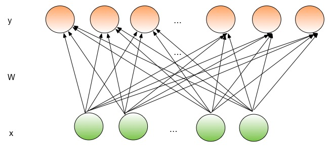

==================
如何实现新的网络层
==================

这份教程展示了如何在PaddlePaddle中实现一个自定义的网络层。在这里我们使用全连接层作为例子来展示实现新网络层所需要的四个步骤。

1. 推导该层前向和后向传递的方程。
2. 实现该层的C++类。
3. 增加梯度检测的单元测试，以保证梯度的正确计算。
4. 封装该层的Python接口。

推导方程
================

首先我们需要推导该网络层的*前向传播*和*后向传播*的方程。前向传播给定输入，计算输出。后向传播给定输出的梯度，计算输入和参数的梯度。

下图是一个全连接层的示意图。在全连接层中，每个输出节点都连接到所有的输入节点上。

一个网络层的前向传播部分把输入转化为相应的输出。
全连接层以一个维度为 :math:`D_i` 的稠密向量作为输入，使用一个尺度为 :math:`D_i \times D_o` 的变换矩阵 :math:`W` 把 :math:`x` 映射到一个维度为 :math:`D_o` 的向量，并在乘积结果上再加上维度为 :math:`D_o` 的偏置向量 :math:`b` 。

.. math::

   y = f(W^T x + b)

其中 :math:`f(.)` 是一个非线性的*激活方程*，例如sigmoid， tanh，以及Relu。

变换矩阵 :math:`W` 和偏置向量 :math:`b`  是该网络层的*参数*。一个网络层的参数是在*反向传播*时被训练的。反向传播根据输出的梯度，分别计算每个参数的梯度，以及输入的梯度。优化器则用链式法则来对每个参数计算损失函数的梯度。

假设损失函数是 :math:`c(y)` ，那么

.. math::

   \frac{\partial c(y)}{\partial x} = \frac{\partial c(y)}{\partial y} \frac{\partial y}{\partial x}

假设 :math:`z = W^T x + b` ，那么

.. math::

   \frac{\partial y}{\partial z} = \frac{\partial f(z)}{\partial z}

PaddlePaddle的base layer类可以自动计算上面的导数。

因此，对全连接层来说，我们需要计算：

.. math::

   \frac{\partial z}{\partial x} = W, \frac{\partial z_j}{\partial W_{ij}} = x_i, \frac{\partial z}{\partial b} = \mathbf 1

其中 :math:`\mathbf 1` 是一个全1的向量， :math:`W_{ij}` 是矩阵 :math:`W` 第i行第j列的数值， :math:`z_j` 是向量 :math:`z` 的第j个值， :math:`x_i` 是向量 :math:`x` 的第i个值。

最后我们使用链式法则计算 :math:`\frac{\partial z}{\partial x}` 以及 :math:`\frac{\partial z}{\partial W}` 。计算的细节将在下面的小节给出。

实现C++类
===================

一个网络层的C++类需要实现初始化，前向和后向。全连接层的实现位于:code:`paddle/gserver/layers/FullyConnectedLayer.h`及:code:`paddle/gserver/layers/FullyConnectedLayer.cpp`。这里我们展示一份简化过的代码。

这个类需要继承 :code:`paddle::Layer` 这个基类，并且需要重写基类中的以下几个虚函数：

- 类的构造函数和析构函数。
- :code:`init` 函数。用于初始化参数和设置。
- :code:`forward` 。实现网络层的前向传播。
- :code:`backward` 。实现网络层的后向传播。
- :code:`prefetch` 。用来从参数服务器预取参数矩阵相应的行。如果网络层不需要远程稀疏更新，则不需要重写该函数。（大多数网络层不需要支持远程稀疏更新）

头文件如下：

.. code-block:: c++

    namespace paddle {
    /**
     * 全连接层的每个输出都连接到上一层的所有的神经元上。
     * 它的输入与经过学习的参数做内积并加上偏置（可选）。
     *
     * 配置文件接口是fc_layer。
     */

    class FullyConnectedLayer : public Layer {
    protected:
      WeightList weights_;
      std::unique_ptr<Weight> biases_;

    public:
      explicit FullyConnectedLayer(const LayerConfig& config)
          : Layer(config) {}
      ~FullyConnectedLayer() {}

      bool init(const LayerMap& layerMap, const ParameterMap& parameterMap);

      Weight& getWeight(int idx) { return *weights_[idx]; }

      void prefetch();
      void forward(PassType passType);
      void backward(const UpdateCallback& callback = nullptr);
    };
    }  // namespace paddle

头文件中把参数定义为类的成员变量。我们使用 :code:`Weight` 类作为参数的抽象，它支持多线程更新。该类的实现细节在“实现细节”中详细介绍。

- :code:`weights_` 是存有一系列变换矩阵的权重。在当前的实现方式下，网络层可以有多个输入。因此，它可能有不止一个权重。每个权重对应一个输入。
- :code:`biases_` 是存有偏置向量的权重。

全连接层没有网络层配置的超参数。如果一个网络层需要配置的话，通常的做法是将配置存于 :code:`LayerConfig& config` 中，并在类构建函数中把它放入一个类成员变量里。

下面的代码片段实现了 :code:`init` 函数。

- 首先，所有的 :code:`init` 函数必须先调用基类中的函数 :code:`Layer::init(layerMap, parameterMap);` 。该语句会为每个层初始化其所需要的变量和连接。
- 之后初始化所有的权重矩阵 :math:`W` 。当前的实现方式下，网络层可以有多个输入。因此，它可能有不止一个权重。
- 最后，初始化偏置向量。

.. code-block:: c++

    bool FullyConnectedLayer::init(const LayerMap& layerMap,
                                   const ParameterMap& parameterMap) {
      /* 初始化父类 */
      Layer::init(layerMap, parameterMap);

      /* 初始化权重表 */
      CHECK(inputLayers_.size() == parameters_.size());
      for (size_t i = 0; i < inputLayers_.size(); i++) {
        // 获得参数尺寸
        size_t height = inputLayers_[i]->getSize();
        size_t width = getSize();

        // 新建一个权重
        if (parameters_[i]->isSparse()) {
          CHECK_LE(parameters_[i]->getSize(), width * height);
        } else {
          CHECK_EQ(parameters_[i]->getSize(), width * height);
        }
        Weight* w = new Weight(height, width, parameters_[i]);

        // 将新建的权重加入权重表
        weights_.emplace_back(w);
      }

      /* 初始化biases_ */
      if (biasParameter_.get() != NULL) {
        biases_ = std::unique_ptr<Weight>(new Weight(1, getSize(), biasParameter_));
      }

      return true;
    }

实现前向传播的部分有下面几个步骤。

- 每个层在其 :code:`forward` 函数的开头必须调用 :code:`Layer::forward(passType);` 。
- 之后使用 :code:`reserveOutput(batchSize, size);` 为输出分配内存。由于我们支持训练数据有不同的批次大小，所以这一步是必要的。 :code:`reserveOutput`  会相应地改变输出的尺寸。为了保证效率，如果需要扩大矩阵，我们会重新分配内存；如果需要缩减矩阵，我们会继续使用现有的内存块。
- 之后使用矩阵运算函数来计算 :math:`\sum_i W_i x + b`。:code:`getInput(i).value` 返回第i个输入矩阵。每个输入都是一个 :math:`batchSize \times dim` 的矩阵，每行表示一个批次中的单个输入。对于我们支持的全部矩阵操作，请参考 :code:`paddle/math/Matrix.h`和:code:`paddle/math/BaseMatrix.h` 。
- 最终，使用 :code:`forwardActivation();` 进行激活操作。这会自动进行网络配置中声明的激活操作。

.. code-block:: c++

    void FullyConnectedLayer::forward(PassType passType) {
      Layer::forward(passType);

      /* 若有必要，为output_申请内存 */
      int batchSize = getInput(0).getBatchSize();
      int size = getSize();

      {
        // 设置输出的尺寸
        reserveOutput(batchSize, size);
      }

      MatrixPtr outV = getOutputValue();

      // 对每个输入乘上变换矩阵
      for (size_t i = 0; i != inputLayers_.size(); ++i) {
        auto input = getInput(i);
        CHECK(input.value) << "The input of 'fc' layer must be matrix";
        i == 0 ? outV->mul(input.value, weights_[i]->getW(), 1, 0)
               : outV->mul(input.value, weights_[i]->getW(), 1, 1);
      }

      /* 加上偏置向量 */
      if (biases_.get() != NULL) {
        outV->addBias(*(biases_->getW()), 1);
      }

      /* 激活 */ {
        forwardActivation();
      }
    }

实现后向传播的部分有下面几个步骤。

- :code:`backwardActivation()` 计算激活函数的梯度。通过 :code:`getOutputGrad()` 来获得输出的梯度，调用该函数后，梯度会就地（不使用额外空间）乘上输出的梯度。
- 计算偏置的梯度。注意，我们使用 :code:`biases_->getWGrad()` 来得到某个特定参数的梯度矩阵。在一个参数的梯度被更新后，**必须**要调用 :code:`getParameterPtr()->incUpdate(callback);` 。这用于在多线程和多机上更新参数。
- 最后，计算转换矩阵和输入的梯度，并对相应的参数调用 :code:`incUpdate` 。PaddlePaddle可以通过该机制判断是否已经收集齐所有的梯度，从而可以做一些与计算重叠的工作（例如，网络通信）。

.. code-block:: c++

    void FullyConnectedLayer::backward(const UpdateCallback& callback) {
      /* 对激活求导 */ {
        backwardActivation();
      }

      if (biases_ && biases_->getWGrad()) {
        biases_->getWGrad()->collectBias(*getOutputGrad(), 1);

        biases_->getParameterPtr()->incUpdate(callback);
      }

      bool syncFlag = hl_get_sync_flag();

      for (size_t i = 0; i != inputLayers_.size(); ++i) {
        /* 计算当前层权重的梯度 */
        if (weights_[i]->getWGrad()) {
          MatrixPtr input_T = getInputValue(i)->getTranspose();
          MatrixPtr oGrad = getOutputGrad();
          {
            weights_[i]->getWGrad()->mul(input_T, oGrad, 1, 1);
          }
        }

        /* 计算输入层的偏差 */
        MatrixPtr preGrad = getInputGrad(i);
        if (NULL != preGrad) {
          MatrixPtr weights_T = weights_[i]->getW()->getTranspose();
          preGrad->mul(getOutputGrad(), weights_T, 1, 1);
        }

        {
          weights_[i]->getParameterPtr()->incUpdate(callback);
        }
      }
    }

 :code:`prefetch` 函数指出了在训练时需要从参数服务器取出的行。仅在远程稀疏训练时有效。使用远程稀疏方式训练时，完整的参数矩阵被分布在不同的参数服务器上。当网络层用一个批次做训练时，该批次的输入中仅有一个子集是非零的。因此，该层仅需要这些非零样本位置所对应的变换矩阵的那些行。 :code:`prefetch` 表明了这些行的标号。

大多数层不需要远程稀疏训练函数。这种情况下不需要重写该函数。

.. code-block:: c++

    void FullyConnectedLayer::prefetch() {
      for (size_t i = 0; i != inputLayers_.size(); ++i) {
        auto* sparseParam =
            dynamic_cast<SparsePrefetchRowCpuMatrix*>(weights_[i]->getW().get());
        if (sparseParam) {
          MatrixPtr input = getInputValue(i);
          sparseParam->addRows(input);
        }
      }
    }

最后，使用 :code:`REGISTER_LAYER(fc, FullyConnectedLayer);` 来注册该层。 :code:`fc` 是该层的标识符， :code:`FullyConnectedLayer` 是该层的类名。

.. code-block:: c++

    namespace paddle {
    REGISTER_LAYER(fc, FullyConnectedLayer);
    }

若 :code:`cpp` 被放在 :code:`paddle/gserver/layers` 目录下，其会自动被加入编译列表。

写梯度检查单元测试
===============================

写梯度检查单元测试是一个验证新实现的层是否正确的相对简单的办法。梯度检查单元测试通过有限差分法来验证一个层的梯度。首先对输入做一个小的扰动 :math:`\Delta x` ，然后观察到输出的变化为 :math:`\Delta y` ，那么，梯度就可以通过这个方程计算得到 :math:`\frac{\Delta y}{\Delta x }` 。之后，再用这个梯度去和 :code:`backward` 函数得到的梯度去对比，以保证梯度计算的正确性。需要注意的是梯度检查仅仅验证了梯度的计算，并不保证 :code:`forward` 和 :code:`backward` 函数的实现是正确的。你需要一些更复杂的单元测试来保证你实现的网络层是正确的。

所有网络层的梯度检查单测都位于 :code:`paddle/gserver/tests/test_LayerGrad.cpp` 。我们建议你在写新网络层时把测试代码放入新的文件中。下面列出了全连接层的梯度检查单元测试。它包含以下几步：

+ 生成网络层配置。网络层配置包含以下几项：
   - 偏置参数的大小。（例子中是4096）
   - 层的类型。（例子中是fc）
   - 层的大小。（例子中是4096）
   - 激活的类型。（例子中是softmax）
   - dropout的比例。（例子中是0.1）
+ 配置网络层的输入。在这个例子里，我们仅有一个输入。
   - 输入的类型（ :code:`INPUT_DATA` ），可以是以下几种：
       - :code:`INPUT_DATA` ：稠密向量。
       - :code:`INPUT_LABEL` ：整数。
       - :code:`INPUT_DATA_TARGET` ：稠密向量，但不用于计算梯度。
       - :code:`INPUT_SEQUENCE_DATA` ：含有序列信息的稠密向量。
       - :code:`INPUT_HASSUB_SEQUENCE_DATA` ：含有序列信息和子序列信息的稠密向量。
       - :code:`INPUT_SEQUENCE_LABEL` ：含有序列信息的整数。
       - :code:`INPUT_SPARSE_NON_VALUE_DATA` ：0-1稀疏数据。
       - :code:`INPUT_SPARSE_FLOAT_VALUE_DATA` ：浮点稀疏数据。
   - 输入的名字。（例子中是 :code:`layer_0` ）
   - 输入的大小。（例子中是8192）
   - 非零数字的个数，仅对稀疏数据有效。
   - 稀疏数据的格式，仅对稀疏数据有效。
+ 对每个输入，都需要调用一次 :code:`config.layerConfig.add_inputs();` 。
+ 调用 :code:`testLayerGrad` 来做梯度检查。它包含以下参数。
   - 层和输入的配置。（例子中是 :code:`config` ）
   - 网络层的类型。（例子中是 :code:`fc` ）
   - 梯度检查的输入数据的批次大小。（例子中是100）
   - 输入是否是转置的。大多数层需要设置为 :code:`false` 。（例子中是 :code:`false` ）
   - 是否使用权重。有些层或者激活需要做归一化以保证它们的输出的和是一个常数。例如，softmax激活的输出的和总是1。在这种情况下，我们不能通过常规的梯度检查的方式来计算梯度。因此我们采用输出的加权和（非常数）来计算梯度。（例子中是 :code:`true` ，因为全连接层的激活可以是softmax）

.. code-block:: c++

    void testFcLayer(string format, size_t nnz) {
      // Create layer configuration.
      TestConfig config;
      config.biasSize = 4096;
      config.layerConfig.set_type("fc");
      config.layerConfig.set_size(4096);
      config.layerConfig.set_active_type("softmax");
      config.layerConfig.set_drop_rate(0.1);
      // Setup inputs.
      config.inputDefs.push_back(
          {INPUT_DATA, "layer_0", 8192, nnz, ParaSparse(format)});
        config.layerConfig.add_inputs();
      LOG(INFO) << config.inputDefs[0].sparse.sparse << " "
                << config.inputDefs[0].sparse.format;
      for (auto useGpu : {false, true}) {
        testLayerGrad(config, "fc", 100, /* trans */ false, useGpu,
                      /* weight */ true);
      }
    }

如果你要为了测试而增加新的文件，例如 :code:`paddle/gserver/tests/testFCGrad.cpp` ，你需要把该文件加入 :code:`paddle/gserver/tests/CMakeLists.txt` 中。下面给出了一个例子。当你执行命令 :code:`make tests` 时，所有的单测都会被执行一次。注意，有些层可能需要高精度来保证梯度检查单测正确执行。你需要在配置cmake时将 :code:`WITH_DOUBLE` 设置为 `ON` 。

.. code-block:: bash

    add_unittest_without_exec(test_FCGrad
        test_FCGrad.cpp
        LayerGradUtil.cpp
        TestUtil.cpp)

    add_test(NAME test_FCGrad
        COMMAND test_FCGrad)

实现python封装
========================

python封装的实现使得我们可以在配置文件中使用新实现的网络层。所有的python封装都在 :code:`python/paddle/trainer/config_parser.py` 中。全连接层python封装的例子中包含下面几步：

- 所有的Python封装都使用 :code:`@config_layer('fc')` 这样的装饰器。网络层的标识符为 :code:`fc` 。
- 实现构造函数 :code:`__init__` 。
	- 它首先调用基构造函数 :code:`super(FCLayer, self).__init__(name, 'fc', size, inputs=inputs, **xargs)` 。 :code:`FCLayer` 是Python封装的类名。 :code:`fc` 是网络层的标识符。为了封装能够正确工作，这些名字必须要写对。
	- 之后，计算变换矩阵的大小和格式（是否稀疏）。

.. code-block:: python

    @config_layer('fc')
    class FCLayer(LayerBase):
        def __init__(
                self,
                name,
                size,
                inputs,
                bias=True,
                **xargs):
            super(FCLayer, self).__init__(name, 'fc', size, inputs=inputs, **xargs)
            for input_index in xrange(len(self.inputs)):
                input_layer = self.get_input_layer(input_index)
                psize = self.config.size * input_layer.size
                dims = [input_layer.size, self.config.size]
                format = self.inputs[input_index].format
                sparse = format == "csr" or format == "csc"
                if sparse:
                    psize = self.inputs[input_index].nnz
                self.create_input_parameter(input_index, psize, dims, sparse, format)
            self.create_bias_parameter(bias, self.config.size)

在网络配置中，网络层的细节可以通过下面这些代码片段来指定。这个类的参数包括：

- :code:`name` 是网络层实例的名字标识符。
- :code:`type` 是网络层的类型，通过网络层的标识符来指定。
- :code:`size` 是网络层输出的大小。
- :code:`bias` 表明这个层的一个实例是否需要偏置。
- :code:`inputs` 说明这个层的输入，输入是由一个list中的网络层实例的名字组成的。

.. code-block:: python

    Layer(
        name = "fc1",
        type = "fc",
        size = 64,
        bias = True,
        inputs = [Input("pool3")]
    )

我们建议你为你的Python封装实现一个“助手”，使得搭模型时更方便。具体可以参考 :code:`python/paddle/trainer_config_helpers/layers.py` 。
