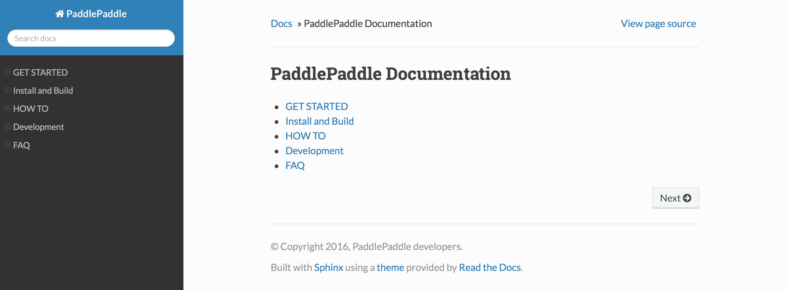

#############
如何贡献文档
#############

PaddlePaddle的文档包括中英文两个部分。文档都是通过 ``cmake`` 驱动 ``sphinx`` 编译生成的，PaddlePaddle.org工具可以帮助我们实现这一编译过程，并提供更好的预览效果。

如何构建文档
============

PaddlePaddle的文档构建有两种方式，分别为使用paddlepaddle.org工具和不使用paddlepaddle.org工具，两种方式都有各自的优点，前者方便预览，后者方便开发者进行调试。这两种方式中又分别有使用docker和不使用docker的两种构建方法。

我们建议使用PaddlePaddle.org工具来构建文档。

使用PaddlePaddle.org工具
------------------------
这个是目前推荐的使用方法。除了可以自动编译文档，还可以直接在网页中预览文档，需要注意的是，采用后续说明的其它方式虽然也可以预览文档，但是文档的样式与官网文档是不一致的，使用PaddlePaddle.org工具进行编译才能产生与官网文档样式一致的预览效果。

PaddlePaddle.org工具可以配合Docker使用，需要在系统里先安装好Docker工具包。Docker安装请参考 `Docker的官网 <https://docs.docker.com/>`_ 。安装好Docker之后即可用以下命令启动工具

..  code-block:: bash

    mkdir paddlepaddle # Create paddlepaddle working directory
    cd paddlepaddle

    # Clone the content repositories
    git clone https://github.com/PaddlePaddle/Paddle.git
    git clone https://github.com/PaddlePaddle/book.git
    git clone https://github.com/PaddlePaddle/models.git
    git clone https://github.com/PaddlePaddle/Mobile.git

    # Please specify the working directory through -v
    docker run -it -p 8000:8000 -v `pwd`:/var/content paddlepaddle/paddlepaddle.org:latest

注意: PaddlePaddle.org 会在 -v (volume) 指定的内容存储库运行命令
之后再用网页连到 http://localhost:8000 就可以在网页上生成需要的文档
编译后的文件将被存储在工作目录 <paddlepaddle working directory>/.ppo_workspace/content。

如果不想使用Docker，你还可以通过运行Django框架直接激活工具的服务器。使用下面的命令来运行它。

..  code-block:: bash

    mkdir paddlepaddle # Create paddlepaddle working directory
    cd paddlepaddle

    # Clone the content repositories and PaddlePaddle.org
    git clone https://github.com/PaddlePaddle/Paddle.git
    git clone https://github.com/PaddlePaddle/book.git
    git clone https://github.com/PaddlePaddle/models.git
    git clone https://github.com/PaddlePaddle/Mobile.git
    git clone https://github.com/PaddlePaddle/PaddlePaddle.org.git

    # Please specify the PaddlePaddle working directory. In the current setting, it should be pwd
    export CONTENT_DIR=<path_to_paddlepaddle_working_directory>
    export ENV=''
    cd PaddlePaddle.org/portal/
    pip install -r requirements.txt
    python manage.py runserver

工具服务器将读取环境变量 CONTENT_DIR 搜索代码库。请指定的PaddlePaddle工作目录给环境变量 CONTENT_DIR。
之后再用网页连到 http://localhost:8000 就可以在网页上生成需要的文档。
编译后的文件将被存储在工作目录 <paddlepaddle working directory>/.ppo_workspace/content。

想了解更多PaddlePaddle.org工具的详细信息，可以 `点击这里 <https://github.com/PaddlePaddle/PaddlePaddle.org/blob/develop/README.cn.md>`_ 。

不使用PaddlePaddle.org工具
--------------------------

使用Docker构建PaddlePaddle的文档，需要在系统里先安装好Docker工具包。Docker安装请参考 `Docker的官网 <https://docs.docker.com/>`_ 。该方法与 `从源码编译PaddlePaddle <http://paddlepaddle.org/docs/develop/documentation/zh/build_and_install/build_from_source_cn.html>`_ 相似，通过从源码中构建可用于编译PaddlePaddle文档的Docker镜像并运行，在进入Docker容器后使用源码中的脚本构建PaddlePaddle文档，具体步骤如下：

.. code-block:: bash

   git clone https://github.com/PaddlePaddle/Paddle.git
   cd Paddle

   # 从源码中构建可用于编译PaddlePaddle文档的Docker镜像
   docker build -t paddle:dev .
   docker run -it -v $PWD:/paddle -e "WITH_GPU=OFF" -e "WITH_TESTING=OFF" -e "WITH_DOC=ON" paddle:dev /bin/bash

   # 进入Docker容器后使用build.sh脚本构建PaddlePaddle文档
   bash -x /paddle/paddle/scripts/docker/build.sh

注：上述命令把当前目录（源码根目录）映射为 container 里的 :code:`/paddle` 目录。

编译完成后，会产生 ``doc/v2`` 和 ``doc/fluid`` 两个目录，在这两个目录下分别都生成 ``cn/html/`` 、 ``en/html`` 、 ``api/en/html`` 共三个子目录，分别进入这些目录下，执行以下命令：

.. code-block:: bash

   python -m SimpleHTTPServer 8088

在浏览器中输入 http://localhost:8088 就可以看到编译生成的 ``v2`` 和 ``fluid`` 两种版本的中/英文的文档页面和英文的API页面。

如果不想使用Docker，也可以使用以下命令直接构建PaddlePaddle文档，即

.. code-block:: bash

   git clone https://github.com/PaddlePaddle/Paddle.git
   cd Paddle
   mkdir -p build
   cd build
   cmake .. -DCMAKE_BUILD_TYPE=Release -DWITH_GPU=OFF -DWITH_MKL=OFF -DWITH_DOC=ON

   # 如果只需要构建使用文档，则执行以下命令
   make -j $processors paddle_docs

   # 如果只需要构建API，则执行以下命令
   make -j $processors paddle_apis

其中$processors代表启动和CPU核一样多的进程来并行编译，可以根据本机的CPU核数设置相应的值。

编译完成后，同样会产生 ``doc/v2`` 和 ``doc/fluid`` 两个目录，如果选择构建文档则会在这两个目录下分别都生成 ``cn/html/`` 、 ``en/html`` 两个子目录，选择构建API则会在这两个目录下分别生成 ``api/en/html`` 目录，分别进入这些子目录下，执行以下命令：

.. code-block:: bash

   python -m SimpleHTTPServer 8088

在浏览器中输入 http://localhost:8088 就可以看到编译生成的 ``v2`` 和 ``fluid`` 两种版本的中/英文的文档页面和英文的API页面。下图为生成的 ``v2`` 英文文档首页示例。注意，示例中由于使用了sphinx的原始主题，所以页面的风格与官网并不一致，但这并不影响开发者进行调试。

如何书写文档
============

PaddlePaddle文档使用 `sphinx`_ 自动生成，用户可以参考sphinx教程进行书写。

如何更新www.paddlepaddle.org
============================

更新的文档以PR的形式提交到github中，提交方式参见 `如何贡献文档 <http://www.paddlepaddle.org/docs/develop/documentation/zh/dev/write_docs_cn.html>`_ 。
目前PaddlePaddle的develop分支的文档是自动触发更新的，用户可以分别查看最新的 `中文文档 <http://www.paddlepaddle.org/docs/develop/documentation/zh/getstarted/index_cn.html>`_ 和
`英文文档 <http://www.paddlepaddle.org/docs/develop/documentation/en/getstarted/index_en.html>`_ 。

..  _cmake: https://cmake.org/
..  _sphinx: http://www.sphinx-doc.org/en/1.4.8/
